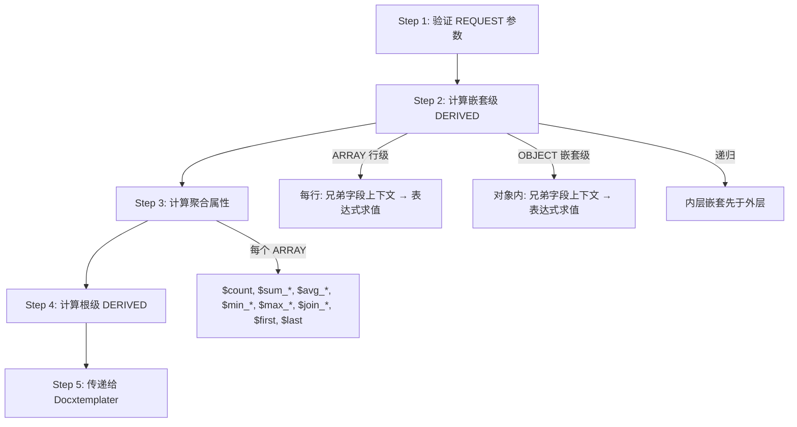
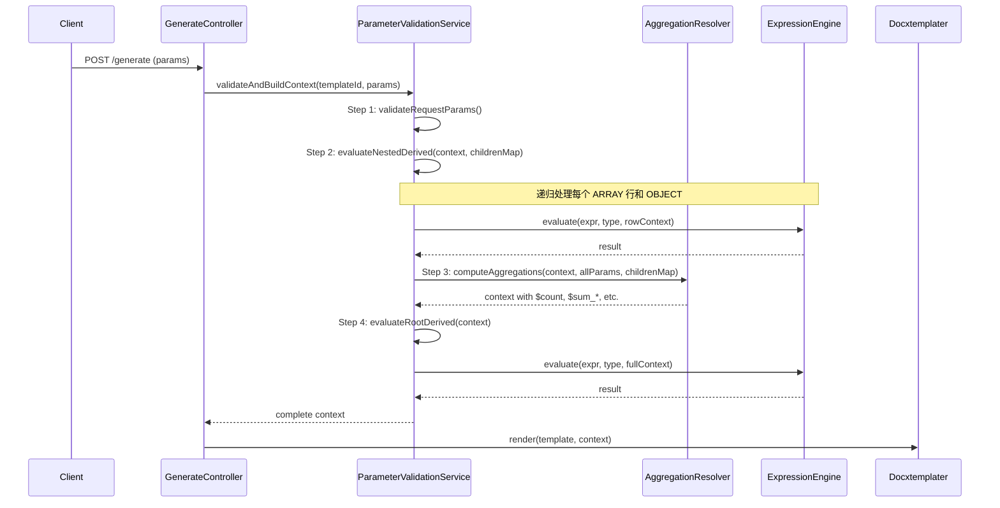

# Design Document: Array Aggregation & Row-Level Derived Parameters

## Overview

本设计为参数系统新增两个核心能力：

1. **数组内置聚合属性**：`AggregationResolver` 服务在文档生成时自动为每个 ARRAY 参数计算聚合值（`$count`、`$sum_field`、`$avg_field`、`$min_field`、`$max_field`、`$join_field`、`$first`、`$last`），注入数据上下文供 Docxtemplater 渲染。
2. **行级/嵌套级 DERIVED 参数**：扩展 `ParameterValidationService`，在 ARRAY 每行和 OBJECT 内部执行 DERIVED 表达式计算，表达式上下文限定为同级兄弟字段。

设计原则：
- 最小侵入：不修改 `ParameterDefinition` entity 和数据库 schema，复用现有 `parameterType=DERIVED` + `parentId` 机制
- 计算管道严格有序：REQUEST 验证 → 嵌套 DERIVED → 聚合属性 → 根级 DERIVED → Docxtemplater
- 命名空间隔离：聚合属性以 `$` 前缀命名，现有 `NAME_PATTERN` 已阻止用户创建 `$` 开头的参数名

## Architecture

### 计算管道（5 步流水线）



### 系统组件交互



## Components and Interfaces

### 1. AggregationResolver（新建服务）

**路径**: `backend/src/main/java/com/docgen/service/AggregationResolver.java`

**职责**: 扫描参数树中的 ARRAY 参数，根据子字段定义计算聚合属性并注入数据上下文。

```java
@Service
public class AggregationResolver {

    /**
     * 为数据上下文中的所有 ARRAY 参数计算并注入聚合属性。
     * 递归处理嵌套 ARRAY（内层先于外层）。
     *
     * @param context       当前数据上下文（已完成 Step 1 + Step 2）
     * @param rootParams    根级参数定义列表
     * @param childrenMap   parentId → 子参数列表映射
     */
    public void computeAggregations(Map<String, Object> context,
                                     List<ParameterDefinition> rootParams,
                                     Map<Long, List<ParameterDefinition>> childrenMap);

    /**
     * 获取指定模板所有 ARRAY 参数的聚合属性 schema（供 API 和前端使用）。
     *
     * @param templateId 模板 ID
     * @return 聚合属性 schema 列表
     */
    public List<AggregationSchemaDTO> getAggregationSchema(Long templateId);
}
```

核心计算逻辑（内部方法）：
- `computeForArray(String arrayName, List<Object> arrayData, List<ParameterDefinition> children, Map<String, Object> parentContext, Map<Long, List<ParameterDefinition>> childrenMap)` — 计算单个 ARRAY 的聚合属性
- `computeNumericAggregations(String fieldName, List<Object> values)` — 计算 `$sum_`、`$avg_`、`$min_`、`$max_`
- `computeStringJoin(String fieldName, List<Object> values)` — 计算 `$join_`
- 递归调用自身处理嵌套 ARRAY

### 2. AggregationSchemaDTO（新建 DTO）

**路径**: `backend/src/main/java/com/docgen/dto/AggregationSchemaDTO.java`

```java
public record AggregationSchemaDTO(
    String arrayName,           // ARRAY 参数名
    String arrayPath,           // ARRAY 参数完整路径
    List<AggregationPropertyDTO> properties  // 可用聚合属性列表
) {}

public record AggregationPropertyDTO(
    String name,                // 属性名，如 "$count", "$sum_price"
    String placeholderPath,     // 占位符路径，如 "items.$sum_price"
    String resultDataType,      // 结果数据类型: "NUMBER" | "STRING" | "OBJECT"
    String description          // 中文描述
) {}
```

### 3. ParameterValidationService 扩展

**修改文件**: `backend/src/main/java/com/docgen/service/ParameterValidationService.java`

**变更点**:

a) `validateAndBuildContext` 方法重构为 5 步管道：
```java
// Step 1: 验证 REQUEST 参数（现有逻辑不变）
// Step 2: 计算嵌套级 DERIVED（新增）
evaluateNestedDerivedParameters(context, rootParams, childrenByParentId);
// Step 3: 计算聚合属性（新增，委托 AggregationResolver）
aggregationResolver.computeAggregations(context, rootParams, childrenByParentId);
// Step 4: 计算根级 DERIVED（现有 evaluateDerivedParameters 逻辑）
evaluateDerivedParameters(templateId, context, rootParams, childrenByParentId);
// Step 5: 返回完整上下文
```

b) 新增 `evaluateNestedDerivedParameters` 方法：
```java
/**
 * 递归计算所有嵌套级 DERIVED 参数（行级 + 对象级）。
 * 内层嵌套先于外层处理。
 */
void evaluateNestedDerivedParameters(Map<String, Object> context,
                                      List<ParameterDefinition> rootParams,
                                      Map<Long, List<ParameterDefinition>> childrenByParentId);
```

c) `validateNestedObject` 和 `validateNestedArray` 保持现有跳过逻辑不变（`if (!"REQUEST".equals(child.getParameterType())) { continue; }`），DERIVED 子参数的输入验证仍然被跳过（因为它们不需要从请求中传入）。DERIVED 子参数的计算在 Step 2 的 `evaluateNestedDerivedParameters` 中独立处理，该方法在验证完成后遍历数据上下文中的 ARRAY/OBJECT 结构，找到 DERIVED 子参数定义并执行表达式。

### 4. ParameterService 扩展

**修改文件**: `backend/src/main/java/com/docgen/service/ParameterService.java`

**变更点**:

a) `createParameter` / `updateParameter` 中新增表达式作用域验证：
```java
// 当 DERIVED 参数的 parentId 不为 null 时，验证表达式只引用兄弟字段
if ("DERIVED".equals(parameterType) && parentId != null) {
    validateExpressionScope(templateId, parentId, expressionText, paramName);
}
```

b) 新增 `validateExpressionScope` 方法：
```java
/**
 * 验证非根级 DERIVED 参数的表达式只引用同级兄弟字段。
 * 如果引用了非兄弟参数，抛出 PARAMETER_EXPRESSION_INVALID_SCOPE 错误。
 */
void validateExpressionScope(Long templateId, Long parentId,
                              String expressionText, String selfName);
```

c) `detectCircularDependency` 扩展：对非根级 DERIVED 参数，在同一 parent 下的 DERIVED 参数之间检测循环依赖。

### 5. ParameterController 扩展

**修改文件**: `backend/src/main/java/com/docgen/controller/ParameterController.java`

新增端点：
```java
@GetMapping("/templates/{templateId}/aggregation-schema")
@Operation(summary = "获取聚合属性 Schema")
public ResponseEntity<List<AggregationSchemaDTO>> getAggregationSchema(
        @PathVariable Long templateId);
```

### 6. TemplateScanService 扩展

**修改文件**: `backend/src/main/java/com/docgen/service/TemplateScanService.java`

**变更点**:
- `PLACEHOLDER_PATTERN` 正则扩展以匹配 `$` 前缀的占位符段：更新为 `\\{([#/^]?)([a-zA-Z_$][a-zA-Z0-9_$]*(?:\\.[a-zA-Z_$][a-zA-Z0-9_$]*)*)(?:\\s+([a-zA-Z_][a-zA-Z0-9_.]*))?\\}`
- `buildSimplePlaceholder` 方法增加判断：如果路径段包含 `$` 前缀，将 `type` 设为 `"AGGREGATION"`

### 7. ParameterService.scanPlaceholders 扩展

**变更点**:
- 扫描结果匹配时，对 `AGGREGATION` 类型占位符，调用 `AggregationResolver.getAggregationSchema` 获取有效聚合属性列表进行匹配
- 有效聚合属性 → matched；无效聚合属性 → unmatchedPlaceholders（附原因说明）

### 8. Node.js 渲染服务扩展

**修改文件**: `docxtemplater-service/src/routes/render.js`

**变更点**:
- 在 `doc.render(renderData)` 调用前，添加 `injectAggregationProperties(renderData)` 预处理
- 该函数将 Java 后端注入的 `"arrayName.$propName"` 扁平 key 转换为 JavaScript 数组属性
- 递归处理嵌套数组元素中的聚合属性

### 9. 前端组件变更

#### 9.1 ParameterSidebar.vue 扩展

新增"聚合属性"折叠面板：
- 从 store 的 `parameters` 树中提取所有 ARRAY 参数
- 根据 ARRAY 子字段的 `dataType` 在客户端生成聚合属性 tag 列表
- 使用紫色 tag 样式区分聚合属性
- 点击 tag 触发 `emit('insert-variable', placeholderPath)`
- 搜索框过滤同时作用于聚合属性 tag

#### 9.2 DerivedExpressionEditor.vue 扩展

- 接收新 prop `scopeLevel: 'root' | 'row' | 'object'`
- 根据 `scopeLevel` 过滤 `availableParameters`：
  - `root`: 所有根级 REQUEST + 已定义根级 DERIVED + 聚合属性
  - `row` / `object`: 仅同级兄弟字段（排除自身）
- 显示作用域提示标签："行级表达式 — 仅可引用当前行字段" / "对象级表达式 — 仅可引用同级字段"

#### 9.3 VisualExpressionBuilder.vue 扩展

- `availableParameters` prop 已由父组件过滤，无需额外修改
- 下拉列表自动反映过滤后的参数

#### 9.4 前端类型扩展

`frontend/src/types/parameter.ts`:
```typescript
// 新增聚合 schema 类型
export interface AggregationPropertyDTO {
  name: string
  placeholderPath: string
  resultDataType: DataType | 'OBJECT'
  description: string
}

export interface AggregationSchemaDTO {
  arrayName: string
  arrayPath: string
  properties: AggregationPropertyDTO[]
}

// PlaceholderType 新增 AGGREGATION
export type PlaceholderType = 'SIMPLE' | 'OBJECT_PATH' | 'LOOP' | 'CONDITION' | 'AGGREGATION'
```

`frontend/src/api/parameters.ts`:
```typescript
export function getAggregationSchema(templateId: number) {
  return request.get<any, AggregationSchemaDTO[]>(
    `/templates/${templateId}/aggregation-schema`
  )
}
```


## Data Models

### 数据库变更

**无数据库 schema 变更**。本功能完全复用现有 `template_parameters` 表结构：
- 行级/嵌套级 DERIVED 参数通过 `parent_id` 指向 ARRAY/OBJECT 父参数，`parameter_type = 'DERIVED'`
- 聚合属性为运行时计算的虚拟属性，不持久化

### ErrorCode 新增常量

```java
// ParameterService 表达式作用域验证
public static final String PARAMETER_EXPRESSION_INVALID_SCOPE = "PARAMETER_EXPRESSION_INVALID_SCOPE";
```

### 聚合属性命名规则

| 聚合类型 | 命名模式 | 适用子字段类型 | 结果类型 | 示例 |
|---------|---------|-------------|---------|------|
| 计数 | `$count` | 无条件 | NUMBER | `items.$count` |
| 求和 | `$sum_{fieldName}` | NUMBER | NUMBER | `items.$sum_price` |
| 平均 | `$avg_{fieldName}` | NUMBER | NUMBER | `items.$avg_price` |
| 最小 | `$min_{fieldName}` | NUMBER | NUMBER | `items.$min_price` |
| 最大 | `$max_{fieldName}` | NUMBER | NUMBER | `items.$max_price` |
| 拼接 | `$join_{fieldName}` | STRING | STRING | `items.$join_name` |
| 首元素 | `$first` | 无条件 | OBJECT | `items.$first` |
| 末元素 | `$last` | 无条件 | OBJECT | `items.$last` |

### 聚合属性注入位置

聚合属性注入到 ARRAY 参数的**同级上下文 Map** 中，使用 `arrayName.$propName` 作为 key。

**Docxtemplater 兼容性设计**：Docxtemplater 默认将 `{items.$sum_price}` 解析为 `items` → `$sum_price` 的嵌套路径。由于 `items` 是数组，无法直接在其上查找 `$sum_price`。解决方案：

在 Node.js 渲染服务的 `/render` 端点中，添加数据预处理步骤：将 Java 后端注入的 `"items.$sum_price": 150` 等扁平 key 转换为 Docxtemplater 可解析的嵌套结构。具体做法是为每个包含 `.$` 的 key，在对应的数组对象上设置属性（JavaScript 数组是对象，支持任意属性）：

```javascript
// 在 doc.render(renderData) 之前添加预处理
function injectAggregationProperties(data) {
  for (const key of Object.keys(data)) {
    const dotIdx = key.indexOf('.$');
    if (dotIdx > 0) {
      const arrayName = key.substring(0, dotIdx);
      const propName = key.substring(dotIdx + 1); // "$sum_price"
      const arrayVal = data[arrayName];
      if (Array.isArray(arrayVal)) {
        arrayVal[propName] = data[key]; // JS 数组支持任意属性
      }
      delete data[key]; // 清理扁平 key
    }
  }
  // 递归处理嵌套数组元素中的聚合属性
  for (const val of Object.values(data)) {
    if (Array.isArray(val)) {
      for (const elem of val) {
        if (elem && typeof elem === 'object') {
          injectAggregationProperties(elem);
        }
      }
    }
  }
}
```

这样 `{items.$sum_price}` 在 Docxtemplater 中解析为 `items["$sum_price"]`，可正确获取值。

示例 — Java 后端注入的数据上下文：
```json
{
  "items": [
    {"name": "A", "price": 100, "quantity": 2, "subtotal": 200},
    {"name": "B", "price": 50, "quantity": 3, "subtotal": 150}
  ],
  "items.$count": 2,
  "items.$sum_price": 150,
  "items.$sum_quantity": 5,
  "items.$sum_subtotal": 350,
  "items.$avg_price": 75.00,
  "items.$join_name": "A, B",
  "items.$first": {"name": "A", "price": 100, "quantity": 2, "subtotal": 200},
  "items.$last": {"name": "B", "price": 50, "quantity": 3, "subtotal": 150},
  "items.$min_price": 50,
  "items.$max_price": 100
}
```

示例 — Node.js 预处理后（传给 Docxtemplater）：
```javascript
{
  items: [
    {name: "A", price: 100, quantity: 2, subtotal: 200},
    {name: "B", price: 50, quantity: 3, subtotal: 150}
  ]
  // items.$count = 2 (作为数组属性)
  // items.$sum_price = 150 (作为数组属性)
  // ... 其他聚合属性同理
}
```

对于嵌套 ARRAY（如 `orders[i].items`），聚合属性注入到每个 order 元素的 map 中：
```json
{
  "orders": [
    {
      "orderId": "001",
      "items": [{"price": 100}, {"price": 200}],
      "items.$count": 2,
      "items.$sum_price": 300
    }
  ],
  "orders.$count": 1
}
```
Node.js 预处理会递归处理每个数组元素内的嵌套聚合属性。

### 表达式上下文作用域

| 参数层级 | 表达式上下文内容 | 示例 |
|---------|---------------|------|
| Root DERIVED | 所有根级 REQUEST + 已计算的根级 DERIVED + 所有聚合属性 | `items.$sum_price * taxRate` |
| Row-Level DERIVED (ARRAY 子) | 当前行的兄弟 REQUEST 字段 + 同级已计算的 DERIVED（按 sort_order） | `price * quantity` |
| Nested DERIVED (OBJECT 子) | 同一 OBJECT 下的兄弟 REQUEST 字段 + 同级已计算的 DERIVED | `province + city` |

### $avg 计算规则

- 除数 = 非 null 值的数量（非数组总长度）
- 精度 = 2 位小数
- 舍入模式 = `RoundingMode.HALF_UP`
- 全部为 null 时 → `$avg_field = 0`


## Correctness Properties

*A property is a characteristic or behavior that should hold true across all valid executions of a system — essentially, a formal statement about what the system should do. Properties serve as the bridge between human-readable specifications and machine-verifiable correctness guarantees.*

### Property 1: 聚合计算数学正确性

*For any* ARRAY parameter with any number of elements (including elements with null NUMBER fields), the AggregationResolver SHALL produce:
- `$count` equal to the array length
- `$sum_{field}` equal to the sum of all non-null values of that NUMBER field
- `$avg_{field}` equal to `$sum_{field}` divided by the count of non-null values, rounded to 2 decimal places using HALF_UP (or 0 when all values are null)
- `$min_{field}` and `$max_{field}` equal to the minimum and maximum of non-null values respectively (or null when all values are null)
- `$join_{field}` equal to all STRING field values concatenated with ", " separator
- `$first` equal to the first element and `$last` equal to the last element (or null for empty arrays)

**Validates: Requirements 1.1, 1.2, 1.3, 1.4, 1.6, 1.7, 1.10**

### Property 2: 嵌套 ARRAY 聚合独立性

*For any* nested ARRAY structure (e.g., orders containing items), the AggregationResolver SHALL compute aggregation properties at each ARRAY level independently, such that modifying elements in one inner array does not affect the aggregation results of sibling inner arrays or the outer array's own aggregations.

**Validates: Requirements 1.9**

### Property 3: 聚合 Schema 完整性

*For any* ARRAY parameter definition with child parameters, the aggregation schema SHALL include: `$count`, `$first`, `$last` unconditionally; `$sum_{field}`, `$avg_{field}`, `$min_{field}`, `$max_{field}` for each NUMBER child (including Row_Level_Derived NUMBER children); `$join_{field}` for each STRING child (including Row_Level_Derived STRING children); and each property's placeholder path SHALL use the full parameter path prefix.

**Validates: Requirements 2.2, 2.3, 2.5, 2.6, 5.5**

### Property 4: 表达式作用域验证

*For any* non-root DERIVED parameter (Row_Level_Derived or Nested_Derived), if its expression text references any parameter name that is not a sibling field under the same parent, the Parameter_API SHALL reject the request with error code PARAMETER_EXPRESSION_INVALID_SCOPE.

**Validates: Requirements 3.3, 3.4**

### Property 5: 同级循环依赖检测

*For any* set of DERIVED parameters under the same parent, if there exists a circular dependency among them (based on expression references), the Parameter_API SHALL detect and reject it with error code PARAMETER_CIRCULAR_DEPENDENCY; if no cycle exists, the operation SHALL succeed.

**Validates: Requirements 3.5**

### Property 6: DERIVED 作用域隔离

*For any* ARRAY with Row_Level_Derived parameters, modifying the field values of row j (j ≠ i) SHALL NOT change the DERIVED computation result of row i. Similarly, *for any* OBJECT with Nested_Derived parameters, the expression context SHALL contain only sibling field values within that OBJECT.

**Validates: Requirements 4.2, 4.3**

### Property 7: Sort-Order 求值依赖

*For any* set of DERIVED parameters under the same parent, they SHALL be evaluated in sort_order sequence, and each DERIVED parameter's expression context SHALL include the computed values of all previously evaluated DERIVED parameters (those with lower sort_order) under the same parent.

**Validates: Requirements 4.4**

### Property 8: 递归嵌套 DERIVED 求值

*For any* nested ARRAY structure containing Row_Level_Derived parameters at multiple nesting levels, the inner-level DERIVED parameters SHALL be fully evaluated before outer-level DERIVED parameters, ensuring that outer-level expressions can reference inner-level computed values.

**Validates: Requirements 4.10**

### Property 9: 聚合占位符扫描正确性

*For any* template placeholder containing a `$` prefix segment, the TemplateScanService SHALL classify it as type AGGREGATION; if the placeholder references a valid ARRAY parameter with a valid aggregation function, it SHALL be matched; if it references a non-existent ARRAY or invalid aggregation function, it SHALL be classified as unmatched.

**Validates: Requirements 8.1, 8.2, 8.3**

### Property 10: 命名空间隔离

*For any* string starting with `$`, the NAME_PATTERN regex (`^[a-zA-Z_][a-zA-Z0-9_-]*$`) SHALL reject it, ensuring aggregation property names can never conflict with user-defined parameter names.

**Validates: Requirements 9.5**

### Property 11: 作用域感知变量列表

*For any* non-root DERIVED parameter (under ARRAY or OBJECT parent), the expression editor's available variable list SHALL contain only sibling child parameters under the same parent (excluding the parameter being edited); *for any* root-level DERIVED parameter, the list SHALL contain all root-level REQUEST parameters, previously defined root-level DERIVED parameters, and all available aggregation properties.

**Validates: Requirements 6.1, 6.2, 6.3**

## Error Handling

### 后端错误处理

| 错误场景 | ErrorCode | HTTP Status | 错误消息模板 |
|---------|-----------|-------------|-------------|
| 非根级 DERIVED 表达式引用非兄弟字段 | `PARAMETER_EXPRESSION_INVALID_SCOPE` | 400 | "表达式引用了作用域外的参数: {invalidRefs}, 仅可引用同级字段: {siblingNames}" |
| 同级 DERIVED 循环依赖 | `PARAMETER_CIRCULAR_DEPENDENCY` | 400 | "衍生参数存在循环依赖: {cyclePath}" |
| 行级 DERIVED 表达式执行失败 | `PARAMETER_EXPRESSION_EVALUATION_FAILED` | 400 | "行级衍生参数计算失败: {arrayPath}[{rowIndex}].{paramName} — {errorDetail}" |
| 嵌套级 DERIVED 表达式执行失败 | `PARAMETER_EXPRESSION_EVALUATION_FAILED` | 400 | "嵌套衍生参数计算失败: {objectPath}.{paramName} — {errorDetail}" |
| 计算管道步骤失败 | `PARAMETER_EXPRESSION_EVALUATION_FAILED` | 400 | "参数计算管道 Step {stepNumber} 失败: {paramName} — {errorDetail}" |

### 前端错误处理

- 表达式编辑器：当用户在非根级 DERIVED 的高级模式中输入非兄弟字段名时，显示红色下划线提示
- 聚合 Schema API 调用失败：在侧边栏聚合属性区域显示 warning banner，不阻塞其他功能
- 参数保存时作用域验证失败：显示 ElMessage.error 并高亮无效引用

## Testing Strategy

### 后端测试

#### Property-Based Tests (jqwik)

每个 Correctness Property 对应一个 PBT 测试，最少 100 次迭代：

| Property | 测试类 | 生成器 |
|----------|-------|--------|
| P1: 聚合数学正确性 | `AggregationResolverPropertyTest` | 随机 ARRAY 数据（0-50 元素，NUMBER 字段含 null，STRING 字段） |
| P2: 嵌套聚合独立性 | `AggregationResolverPropertyTest` | 随机嵌套 ARRAY 结构（2 层） |
| P3: Schema 完整性 | `AggregationSchemaPropertyTest` | 随机 ParameterDefinition 树（ARRAY + 各类型子字段） |
| P4: 表达式作用域验证 | `ExpressionScopePropertyTest` | 随机表达式文本 + 随机兄弟/非兄弟参数名集合 |
| P5: 循环依赖检测 | `CircularDependencyPropertyTest` | 随机有向图（含/不含环） |
| P6: DERIVED 隔离性 | `RowDerivedIsolationPropertyTest` | 随机 ARRAY 数据（多行，行级 DERIVED 表达式） |
| P7: Sort-Order 求值 | `SortOrderEvaluationPropertyTest` | 随机 DERIVED 参数集（有依赖链） |
| P8: 递归嵌套求值 | `NestedDerivedPropertyTest` | 随机嵌套 ARRAY 结构 + 行级 DERIVED |
| P9: 占位符扫描 | `AggregationScanPropertyTest` | 随机占位符字符串（含/不含 $ 前缀） |
| P10: 命名空间隔离 | `NamePatternPropertyTest` | 随机 $ 开头字符串 |
| P11: 变量列表过滤 | `ScopeAwareVariableListPropertyTest` | 随机参数树 + 不同层级的 DERIVED 参数 |

Tag 格式: `// Feature: array-aggregation-and-row-derived, Property {N}: {title}`

#### Unit Tests (JUnit 5)

- `AggregationResolverTest`: 空数组、单元素、全 null 值、混合类型等边界用例
- `ParameterServiceScopeTest`: 创建/更新非根级 DERIVED 的作用域验证
- `ParameterValidationServicePipelineTest`: 5 步管道集成测试

#### Integration Tests

- `ParameterControllerIntegrationTest`: 聚合 Schema API 端点测试
- `DocumentGenerationIntegrationTest`: 端到端文档生成（含行级 DERIVED + 聚合属性 + 根级 DERIVED 引用聚合值）

### 前端测试

#### Unit Tests (Vitest)

- `aggregationUtils.test.ts`: 客户端聚合属性生成逻辑
- `ParameterSidebar.test.ts`: 聚合属性分组渲染、搜索过滤、点击事件

#### Property-Based Tests (fast-check)

| Property | 测试文件 | 生成器 |
|----------|---------|--------|
| P3: Schema 完整性（前端） | `aggregationSchema.property.test.ts` | 随机 ParameterDTO 树 |
| P11: 变量列表过滤（前端） | `scopeAwareVariables.property.test.ts` | 随机参数树 + 不同层级 DERIVED |

Tag 格式: `// Feature: array-aggregation-and-row-derived, Property {N}: {title}`

