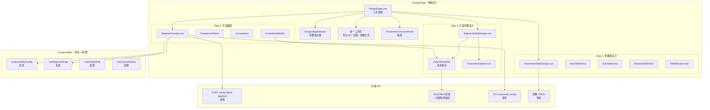
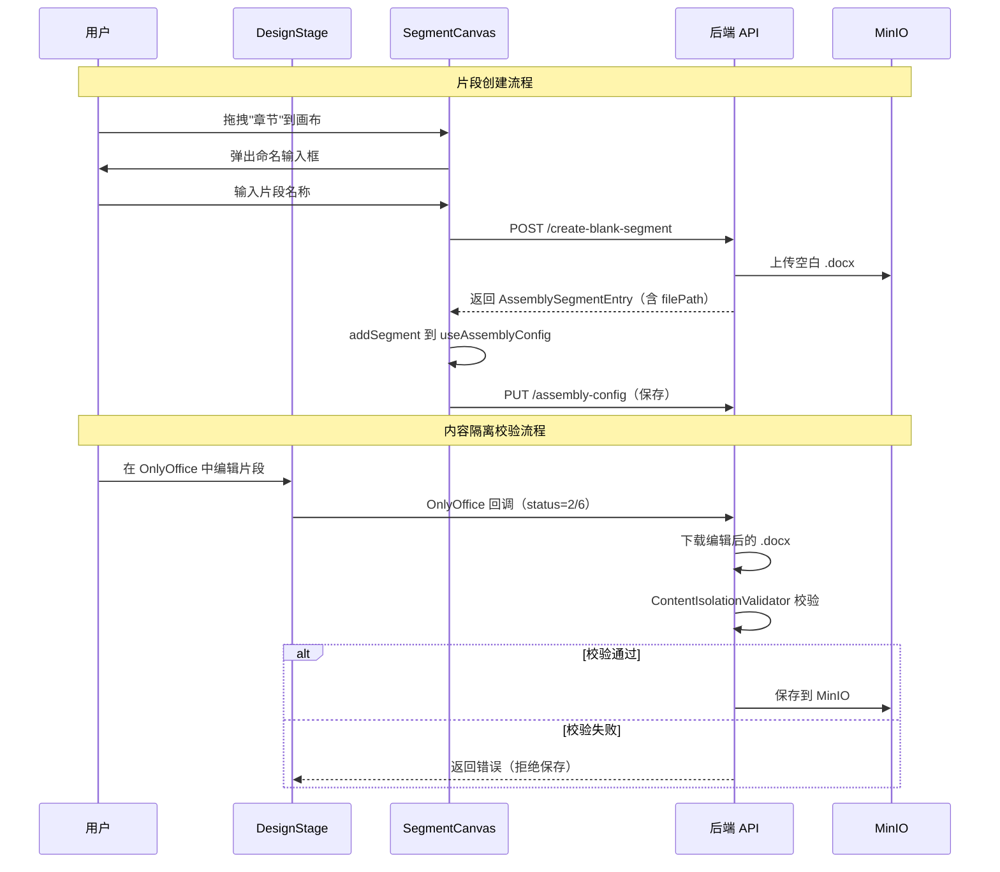

# 设计文档：设计阶段版面与交互重设计

## 概述

将模板工作区"设计阶段"从当前的单一视图（编辑器 + ParameterDrawer + SegmentPopover + SettingsPopover）重构为三步子流程架构：**参数表设计 → 片段编排 → 片段详细设计**。

核心设计原则：
- **渐进式披露**：每步只展示当前任务所需的信息，避免信息过载
- **复用优先**：最大化复用现有 composable（`useAssemblyConfig`、`useSegmentDrag`）、组件（`OnlyOfficeEditor`、`SettingsPopover`）和 API
- **前后端一致**：前端类型扩展与后端 JSONB 结构变更同步，通过 Flyway 迁移保证数据兼容

### 设计决策记录

| 决策 | 选择 | 理由 |
|------|------|------|
| 参数插入方式 | 点击插入 | 跨 iframe 拖拽技术复杂度高，OnlyOffice iframe 不支持原生 drag-drop |
| 控制节点数据模型 | 扩展 AssemblySegmentEntry | 避免新建模型，控制节点属性（页眉/页脚路径、页码格式）直接附加到受影响的内容片段上 |
| 页眉/页脚编辑 | 迷你 OnlyOffice 编辑器 | 复用现有 OnlyOffice 集成，页眉/页脚作为独立 .docx 片段存储在 MinIO |
| 内容隔离策略 | 软预防（前端提示条 + 预配置模板）+ 硬保障（后端校验） | 平衡用户体验与安全性 |
| 片段创建方式 | 系统自动创建空白 .docx | 简化用户操作，上传为进阶功能后续迭代 |
| 拖拽库 | sortablejs | 项目已安装，保持统一性 |

## 架构

### 系统架构图



### 数据流



## 组件与接口

### 前端组件清单

#### 新增组件

| 组件 | 路径 | 职责 |
|------|------|------|
| `DesignStepIndicator.vue` | `views/template-workspace/components/` | 三步指示器，显示步骤状态和切换 |
| `ParameterTableDesign.vue` | `views/template-workspace/components/` | 参数表设计主视图，管理面包屑导航和表视图切换 |
| `ParameterTableView.vue` | `views/template-workspace/components/` | 通用表视图（主表/子表/关联表共用），渲染字段行 |
| `SegmentCanvas.vue` | `views/template-workspace/components/` | 片段编排画布，左侧组件面板 + 右侧画布 |
| `ComponentPanel.vue` | `views/template-workspace/components/` | 组件面板，展示可拖拽的片段类型和控制节点 |
| `CanvasArea.vue` | `views/template-workspace/components/` | 画布区域，渲染片段卡片和控制节点卡片 |
| `ControlNodeEditor.vue` | `views/template-workspace/components/` | 迷你 OnlyOffice 编辑器，编辑页眉/页脚 .docx |
| `SegmentDetailDesign.vue` | `views/template-workspace/components/` | 片段详细设计主视图，编辑器 + 参数侧边栏 |
| `ParameterSidebar.vue` | `views/template-workspace/components/` | 参数侧边栏，三区域（参数/循环/条件）+ 搜索过滤 |
| `ParameterOverviewPanel.vue` | `views/template-workspace/components/` | 参数总览抽屉，树形/JSON Schema 双视图 |

#### 修改组件

| 组件 | 变更 |
|------|------|
| `DesignStage.vue` | 完全重写：移除当前布局，改为三步容器 + 统一工具栏 |
| `OnlyOfficeEditor.vue` | 无需修改，通过 `insertVariable`/`insertLoop`/`insertCondition` expose 方法复用 |
| `SettingsPopover.vue` | 无需修改，直接复用 |

### 组件接口定义

#### DesignStage.vue（重写）

```typescript
// Props
interface DesignStageProps {
  readonly: boolean
}

// 内部状态管理
// currentStep: 'parameter-table' | 'segment-canvas' | 'segment-detail'
// 通过 useDesignStep composable 管理
```

#### DesignStepIndicator.vue

```typescript
interface DesignStepIndicatorProps {
  currentStep: DesignStepName
  stepStatuses: Record<DesignStepName, StepStatus>
}

interface DesignStepIndicatorEmits {
  (e: 'update:currentStep', step: DesignStepName): void
}

type DesignStepName = 'parameter-table' | 'segment-canvas' | 'segment-detail'
type StepStatus = 'not_started' | 'in_progress' | 'completed'
```

#### ParameterTableDesign.vue

```typescript
interface ParameterTableDesignProps {
  readonly: boolean
}

// 内部状态：
// breadcrumbPath: ParameterBreadcrumbItem[] — 面包屑路径
// currentParentId: number | null — 当前表的父参数 ID
```

#### ParameterTableView.vue

```typescript
interface ParameterTableViewProps {
  parameters: ParameterDTO[]     // 当前层级的参数列表
  parentId: number | null        // 当前表的父参数 ID
  readonly: boolean
}

interface ParameterTableViewEmits {
  (e: 'navigate', param: ParameterDTO): void  // 钻入子表/关联表
  (e: 'refresh'): void                         // 数据变更后刷新
}
```

#### SegmentCanvas.vue

```typescript
interface SegmentCanvasProps {
  readonly: boolean
}

// 内部使用 useAssemblyConfig + useSegmentDrag + useCanvasNodes
```

#### SegmentDetailDesign.vue

```typescript
interface SegmentDetailDesignProps {
  readonly: boolean
}

// 内部状态：
// selectedSegmentIndex: number — 当前编辑的片段索引
```

#### ParameterSidebar.vue

```typescript
interface ParameterSidebarProps {
  collapsed: boolean
  readonly: boolean
}

interface ParameterSidebarEmits {
  (e: 'update:collapsed', value: boolean): void
  (e: 'insert-variable', paramPath: string): void
  (e: 'insert-loop', arrayName: string): void
  (e: 'insert-condition', expr: string): void
}
```

#### ParameterOverviewPanel.vue

```typescript
interface ParameterOverviewPanelProps {
  visible: boolean
}

interface ParameterOverviewPanelEmits {
  (e: 'update:visible', value: boolean): void
  (e: 'navigate-to-param', paramId: number): void  // 点击参数名导航
}
```

#### ControlNodeEditor.vue

```typescript
interface ControlNodeEditorProps {
  visible: boolean
  nodeType: 'header' | 'footer'
  filePath: string              // 页眉/页脚 .docx 在 MinIO 的路径
  templateId: number
  readonly: boolean
}

interface ControlNodeEditorEmits {
  (e: 'update:visible', value: boolean): void
  (e: 'saved'): void
}
```

### 新增 Composables

#### useDesignStep

```typescript
// composables/useDesignStep.ts
export function useDesignStep() {
  const currentStep = ref<DesignStepName>('parameter-table')

  // 各步骤的编辑状态缓存（CP-4 要求）
  const stepStates = reactive({
    'parameter-table': { breadcrumbPath: [] as ParameterBreadcrumbItem[] },
    'segment-canvas': { /* useAssemblyConfig 自身管理 */ },
    'segment-detail': { selectedSegmentIndex: 0 },
  })

  // 步骤完成状态计算
  const stepStatuses = computed<Record<DesignStepName, StepStatus>>(() => ({
    'parameter-table': parameters.length > 0 ? 'completed' : 'not_started',
    'segment-canvas': segments.length > 0 ? 'completed' : 'not_started',
    'segment-detail': allEnabledSegmentsEdited ? 'completed' : 'not_started',
  }))

  function goToStep(step: DesignStepName) { currentStep.value = step }
  function goNext() { /* 按顺序切换 */ }
  function goPrev() { /* 按顺序切换 */ }

  return { currentStep, stepStates, stepStatuses, goToStep, goNext, goPrev }
}
```

#### useCanvasNodes

```typescript
// composables/useCanvasNodes.ts
// 管理画布中控制节点与内容片段的混合列表

export interface CanvasNode {
  id: string                    // 唯一标识（UUID）
  type: 'content' | 'page-break' | 'header' | 'footer' | 'page-number'
  segmentIndex?: number         // 仅 content 类型，对应 segments 数组索引
  // 控制节点属性
  headerFilePath?: string
  footerFilePath?: string
  pageNumberFormat?: PageNumberFormat
  pageNumberStart?: number
}

type PageNumberFormat = 'ARABIC' | 'ROMAN' | 'ALPHA'

export function useCanvasNodes(assemblyConfig: ReturnType<typeof useAssemblyConfig>) {
  const nodes = ref<CanvasNode[]>([])

  // 从 AssemblyConfig 反序列化为 CanvasNode 列表
  function fromSegments(segments: AssemblySegmentEntry[]): CanvasNode[] { ... }

  // 将 CanvasNode 列表序列化回 AssemblySegmentEntry[]
  // 控制节点的属性写入其后方相邻内容片段的扩展字段
  function toSegments(nodes: CanvasNode[]): AssemblySegmentEntry[] { ... }

  // 计算控制节点影响范围
  function getAffectedRange(nodeIndex: number): { start: number; end: number } { ... }

  return { nodes, fromSegments, toSegments, getAffectedRange }
}
```

### 后端 API 设计

#### 新增 API

##### 1. 创建空白片段

```
POST /api/composite-templates/{id}/create-blank-segment
```

请求体：
```json
{
  "name": "封面",
  "segmentType": "COVER"
}
```

响应（201 Created）：
```json
{
  "filePath": "segments/42/uuid_封面.docx",
  "name": "封面",
  "segmentType": "COVER",
  "position": null,
  "enabled": true,
  "pageBreakBefore": false,
  "conditionExpression": null,
  "dataScope": null,
  "headerFilePath": null,
  "footerFilePath": null,
  "pageNumberFormat": null,
  "pageNumberStart": null
}
```

实现要点：
- 在 `CompositeTemplateController` 中新增端点
- 使用预置的空白 .docx 模板文件（`src/main/resources/templates/blank-body.docx`）作为 classpath 资源，复制后上传到 MinIO（避免引入 Apache POI 依赖，项目当前无此依赖）
- 上传到 MinIO 路径 `segments/{templateId}/{uuid}_{name}.docx`
- 验证模板存在且为 COMPOSITE 类型

##### 2. 创建空白页眉/页脚片段

```
POST /api/composite-templates/{id}/create-blank-header-footer
```

请求体：
```json
{
  "type": "header"
}
```

响应（201 Created）：
```json
{
  "filePath": "segments/42/headers/uuid_header.docx"
}
```

实现要点：
- 使用预置的 .docx 模板文件：`src/main/resources/templates/blank-header.docx`（仅含 header 区域）和 `src/main/resources/templates/blank-footer.docx`（仅含 footer 区域）
- 上传到 MinIO 路径 `segments/{templateId}/headers/{uuid}_header.docx` 或 `segments/{templateId}/footers/{uuid}_footer.docx`

##### 3. 片段级 OnlyOffice 回调（扩展现有）

```
POST /api/composite-templates/{id}/segments/{segmentIndex}/onlyoffice-callback
```

请求体：OnlyOffice Document Server 标准回调格式（与现有 `/api/templates/{id}/onlyoffice-callback` 相同）

查询参数：
- `contentType`（可选）：`body`（默认）| `header` | `footer` — 用于内容隔离校验

实现要点：
- 扩展 `OnlyOfficeController`（或在 `CompositeTemplateController` 中新增），新增片段级回调端点
- 根据 `segmentIndex` 从 assemblyConfig 中获取 filePath，确定保存路径
- 在 `SecurityConfig` 中将此 URL 加入 permitAll 白名单
- 回调处理流程中集成 `ContentIsolationValidator`（根据 `contentType` 参数决定校验规则）

##### 4. 片段级 OnlyOffice URL

```
GET /api/composite-templates/{id}/segments/{segmentIndex}/onlyoffice-url
```

响应：
```json
{
  "url": "https://minio:9000/docgen/segments/42/uuid_封面.docx?X-Amz-..."
}
```

实现要点：
- 根据 segmentIndex 从 assemblyConfig 中获取 filePath
- 生成 MinIO presigned URL

#### 修改 API

##### OnlyOffice 回调增强

在 `OnlyOfficeService.handleCallback` 中增加内容隔离校验步骤：

```java
// 伪代码
public void handleSegmentCallback(Long templateId, String segmentPath, 
                                   String contentType, Map<String, Object> body) {
    // 1. 下载编辑后的 .docx
    byte[] content = downloadFromOnlyOffice(body);
    
    // 2. 内容隔离校验
    ContentIsolationValidator.validate(content, contentType); // "body" | "header" | "footer"
    
    // 3. 保存到 MinIO
    saveToMinIO(segmentPath, content);
}
```

### 后端新增服务

#### ContentIsolationValidator

```java
@Service
public class ContentIsolationValidator {
    
    /**
     * 校验 .docx 文件内容是否符合隔离要求。
     * 
     * @param docxBytes .docx 文件字节数组
     * @param expectedContentType 期望的内容类型: "body", "header", "footer"
     * @throws BusinessException 如果内容越界
     */
    public void validate(byte[] docxBytes, String expectedContentType) {
        // 解压 .docx (ZIP 格式)
        // 根据 expectedContentType 检查:
        // - "body": header*.xml 和 footer*.xml 必须为空
        // - "header": document.xml body 和 footer*.xml 必须为空
        // - "footer": document.xml body 和 header*.xml 必须为空
    }
    
    private boolean hasNonEmptyContent(ZipEntry entry) {
        // 解析 XML，检查是否包含非空文本节点
    }
}
```

### 前端 API 层扩展

```typescript
// api/composite-templates.ts 新增

export function createBlankSegment(templateId: number, name: string, segmentType?: string) {
  return request.post<any, AssemblySegmentEntry>(
    `/composite-templates/${templateId}/create-blank-segment`,
    { name, segmentType },
  )
}

export function createBlankHeaderFooter(templateId: number, type: 'header' | 'footer') {
  return request.post<any, { filePath: string }>(
    `/composite-templates/${templateId}/create-blank-header-footer`,
    { type },
  )
}

export function getSegmentOnlyOfficeUrl(templateId: number, segmentIndex: number) {
  return request.get<any, { url: string }>(
    `/composite-templates/${templateId}/segments/${segmentIndex}/onlyoffice-url`,
  )
}
```

## 数据模型

### 前端类型扩展

#### segment.ts 扩展

```typescript
// 新增页码格式类型
export type PageNumberFormat = 'ARABIC' | 'ROMAN' | 'ALPHA'

// 扩展 AssemblySegmentEntry
export interface AssemblySegmentEntry {
  // 现有字段
  filePath: string
  name: string
  segmentType: SegmentType | string | null
  position: number
  enabled: boolean
  pageBreakBefore: boolean
  conditionExpression: string | null
  dataScope: Record<string, string> | null
  // 新增字段（控制节点数据）
  headerFilePath: string | null       // 页眉 .docx 路径
  footerFilePath: string | null       // 页脚 .docx 路径
  pageNumberFormat: PageNumberFormat | null  // 页码格式
  pageNumberStart: number | null      // 页码起始值
}
```

#### workspace.ts 扩展

```typescript
// 新增设计步骤类型
export type DesignStepName = 'parameter-table' | 'segment-canvas' | 'segment-detail'

export interface ParameterBreadcrumbItem {
  id: number | null       // null 表示根级（主表）
  name: string            // 显示名称
  tableType: 'main' | 'sub' | 'related'  // 表类型
}
```

### 后端数据模型扩展

#### AssemblySegmentEntry DTO 扩展

```java
public class AssemblySegmentEntry {
    // 现有字段不变
    private String filePath;
    private String name;
    private String segmentType;
    private Integer position;
    private boolean enabled = true;
    private boolean pageBreakBefore = false;
    private String conditionExpression;
    private Map<String, String> dataScope;
    
    // 新增字段
    private String headerFilePath;      // 页眉 .docx MinIO 路径
    private String footerFilePath;      // 页脚 .docx MinIO 路径
    private String pageNumberFormat;    // ARABIC / ROMAN / ALPHA
    private Integer pageNumberStart;    // 页码起始值
    
    // getter/setter...
}
```

#### JSONB 结构变更

`templates.assembly_config` JSONB 字段中的 segments 数组元素新增四个可选字段。由于 JSONB 是 schema-less 的，**不需要 Flyway 迁移**。旧数据中缺少这些字段时，Jackson 反序列化会自动设为 null，完全向后兼容。

示例 JSONB 结构：
```json
{
  "segments": [
    {
      "filePath": "segments/42/uuid_cover.docx",
      "name": "封面",
      "segmentType": "COVER",
      "position": 0,
      "enabled": true,
      "pageBreakBefore": false,
      "conditionExpression": null,
      "dataScope": null,
      "headerFilePath": "segments/42/headers/uuid_h1.docx",
      "footerFilePath": null,
      "pageNumberFormat": "ARABIC",
      "pageNumberStart": 1
    }
  ]
}
```

### Flyway 迁移

由于控制节点数据存储在 JSONB 字段中，**不需要数据库 schema 迁移**。JSONB 的 schema-less 特性使得新增字段完全向后兼容。

### i18n Key 设计

按照 `workspace.design.step.{stepName}` 命名规范，新增以下 key：

```json
{
  "workspace": {
    "design": {
      "step": {
        "parameterTable": "参数表设计",
        "segmentCanvas": "片段编排",
        "segmentDetail": "片段详细设计"
      },
      "parameterOverview": "参数总览",
      "prev": "上一步",
      "next": "下一步",
      "table": {
        "main": "主表",
        "sub": "子表",
        "related": "关联表",
        "addField": "添加字段",
        "fieldName": "字段名",
        "fieldType": "类型",
        "required": "必填",
        "defaultValue": "默认值",
        "deleteWarning": "删除此参数将同时删除其所有子参数，确定继续？"
      },
      "canvas": {
        "contentSegments": "内容片段",
        "controlNodes": "控制节点",
        "pageBreak": "分页符",
        "header": "页眉",
        "footer": "页脚",
        "pageNumber": "页码规则",
        "emptyHint": "从左侧拖拽组件到此处开始编排文档结构",
        "segmentNameRequired": "片段名称不能为空",
        "segmentNameDuplicate": "片段名称已存在",
        "pageNumberFormat": {
          "arabic": "1, 2, 3",
          "roman": "i, ii, iii",
          "alpha": "A-1, A-2"
        },
        "restartPageNumber": "重新从 1 开始",
        "editHeaderFooter": "编辑"
      },
      "sidebar": {
        "parameterList": "参数列表",
        "loopBlock": "循环块",
        "conditionBlock": "条件块",
        "addCondition": "添加条件",
        "conditionExpr": "条件表达式",
        "inlineCreate": "+ 新增参数",
        "search": "搜索参数...",
        "noMatch": "无匹配参数",
        "filterByType": "按类型筛选"
      },
      "overview": {
        "treeView": "树形视图",
        "jsonSchemaView": "JSON Schema 视图"
      },
      "isolation": {
        "bodyHint": "此编辑器仅用于编辑正文内容，请勿在此处添加页眉或页脚",
        "headerHint": "此编辑器仅用于编辑页眉内容",
        "footerHint": "此编辑器仅用于编辑页脚内容",
        "violationError": "内容隔离校验失败：检测到越界内容"
      },
      "segmentType": {
        "COVER": "封面",
        "TOC": "目录",
        "CHAPTER": "章节",
        "TABLE": "表格",
        "SIGNATURE": "签名",
        "LEGAL": "法律条款",
        "APPENDIX": "附录"
      }
    }
  }
}
```

en-US 和 zh-TW 按相同结构提供对应翻译。

## 正确性属性

*正确性属性是一种在系统所有有效执行中都应成立的特征或行为——本质上是关于系统应该做什么的形式化陈述。属性是人类可读规范与机器可验证正确性保证之间的桥梁。*

### Property 1: 步骤完成状态计算正确性

*For any* 参数数量 (0..N)、片段数量 (0..M)、已编辑片段标志组合，`useDesignStep` 计算的步骤完成状态必须满足：参数表设计完成 ⟺ 参数数量 ≥ 1；片段编排完成 ⟺ 片段数量 ≥ 1；片段详细设计完成 ⟺ 所有已启用片段的 filePath 非空。

**Validates: Requirements 1.3**

### Property 2: 参数类型到视图类型的映射同构

*For any* ParameterDTO 树结构，`ParameterTableView` 的分类函数必须将每个参数正确映射：STRING/NUMBER/DATE/BOOLEAN → 字段行，ARRAY → 子表链接行，OBJECT → 关联表链接行。递归地，每个子表/关联表内部的参数遵循相同映射规则。

**Validates: Requirements 2.1**

### Property 3: 面包屑深度等于参数树深度

*For any* 参数树和任意导航路径，面包屑项数量必须等于当前查看参数在树中的深度（根级 = 1，第一层子参数 = 2，以此类推），且每个面包屑项的名称和类型与祖先链一致。

**Validates: Requirements 2.4**

### Property 4: 拖拽排序后索引连续性

*For any* 同级元素列表（参数或片段）和任意合法的 reorder 操作（fromIndex, toIndex），排序后所有元素的 position/sortOrder 值必须是从 0 开始的连续整数序列，序列长度等于元素数量，且被移动元素位于目标位置。

**Validates: Requirements 2.9, 4.10**

### Property 5: 控制节点属性传播正确性

*For any* 画布状态（内容片段 + 控制节点混合列表），当插入一个分页符控制节点时，其后方最近的内容片段的 `pageBreakBefore` 必须为 true；当删除该分页符时，该片段的 `pageBreakBefore` 必须恢复为 false。同理，页眉/页脚控制节点的插入/删除必须正确更新受影响片段的 `headerFilePath`/`footerFilePath`。

**Validates: Requirements 4.5, 4.15**

### Property 6: 控制节点影响范围计算

*For any* 画布中包含同类控制节点（如多个页眉节点），每个控制节点的影响范围必须从该节点位置开始，到下一个同类控制节点位置结束（不含）。最后一个同类控制节点的影响范围延伸到画布末尾。

**Validates: Requirements 4.16**

### Property 7: 参数标签插入文本正确性

*For any* 参数 P，从参数列表点击插入的文本必须严格等于 `{P.parameterPath}`；*For any* ARRAY 类型参数 A，从循环块点击插入的文本必须严格等于 `{#A.name}\n\n{/A.name}`；*For any* 条件表达式 expr，从条件块点击插入的文本必须严格等于 `{#if expr}\n\n{/if}`。

**Validates: Requirements 5.5, 5.7, 5.9**

### Property 8: 循环块区域仅包含 ARRAY 类型参数

*For any* 参数集合，`Loop_Block_Section` 中显示的参数必须全部为 ARRAY 类型，且所有 ARRAY 类型参数都出现在该区域中（完备性）。

**Validates: Requirements 5.6**

### Property 9: 内容隔离校验完备性

*For any* .docx 文件和期望内容类型（body/header/footer），`ContentIsolationValidator` 的校验结果必须满足：当且仅当非期望区域的 XML 文件均为空或不存在时通过校验。具体地：body 类型 → header*.xml 和 footer*.xml 为空；header 类型 → document.xml body 和 footer*.xml 为空；footer 类型 → document.xml body 和 header*.xml 为空。校验为幂等操作。

**Validates: Requirements 6.4, 6.5, 6.6**

### Property 10: 参数搜索与过滤正确性

*For any* 参数列表、搜索文本 S 和类型过滤器 T，过滤后的结果必须恰好包含所有满足以下条件的参数：名称包含 S（不区分大小写）且（若 T 非空）数据类型等于 T。

**Validates: Requirements 9.2, 9.3**

## 错误处理

### 前端错误处理

| 场景 | 处理方式 |
|------|----------|
| 创建空白片段 API 失败 | ElMessage.error 显示错误信息，画布不添加新卡片 |
| 保存 AssemblyConfig 失败 | ElMessage.error，保留本地未保存状态，用户可重试 |
| OnlyOffice 编辑器加载失败 | 显示 el-empty + 刷新按钮（复用现有逻辑） |
| 内容隔离校验失败 | ElMessage.warning 显示隔离提示，编辑器保持当前状态 |
| 参数 CRUD 失败 | ElMessage.error，由 Axios 拦截器统一处理 |
| 参数名重复 | 后端返回 PARAMETER_DUPLICATE_NAME，前端显示错误提示 |
| 片段名称为空/重复 | 命名输入框内联校验，阻止提交 |
| 拖拽到无效位置 | 忽略操作，不改变状态 |

### 后端错误处理

| 场景 | ErrorCode | HTTP 状态码 |
|------|-----------|-------------|
| 模板不存在 | TEMPLATE_NOT_FOUND | 404 |
| 模板非 COMPOSITE 类型 | TEMPLATE_NOT_FOUND | 400 |
| 片段名称为空 | VALIDATION_FAILED | 400 |
| 空白 .docx 生成失败 | INTERNAL_ERROR | 500 |
| MinIO 上传失败 | INTERNAL_ERROR | 500 |
| 内容隔离校验失败 | ONLYOFFICE_CONTENT_ISOLATION_VIOLATION（新增） | 422 |
| OnlyOffice 回调下载失败 | ONLYOFFICE_CALLBACK_FAILED | 500 |

新增 ErrorCode（放在 ONLYOFFICE 模块下）：
```java
public static final String ONLYOFFICE_CONTENT_ISOLATION_VIOLATION = "ONLYOFFICE_CONTENT_ISOLATION_VIOLATION";
```

### SecurityConfig 变更

在 `SecurityConfig.java` 中新增 permitAll URL，允许 OnlyOffice Document Server 回调片段级端点：

```java
.requestMatchers("/api/composite-templates/*/segments/*/onlyoffice-callback").permitAll()
```

同时需要更新 `OpenApiConfig.java`，为新增的片段级 API 添加 tag（可选，因为端点在现有 `CompositeTemplateController` 中）。

### 统一工具栏设计（需求 7）

DesignStage.vue 的统一工具栏位于 DesignStepIndicator 上方，包含以下元素：

```typescript
// DesignStage.vue 工具栏区域
// 左侧：导入 ZIP 按钮（仅 DRAFT 状态可见）
// 右侧：参数总览按钮（三步均可见）+ 片段选择器（仅第三步可见）+ 齿轮设置按钮

interface ToolbarConfig {
  showImportZip: boolean      // readonly === false 时显示
  showParameterOverview: boolean  // 始终显示
  showSegmentSelector: boolean    // currentStep === 'segment-detail' 时显示
  showSettings: boolean           // 始终显示
}
```

工具栏布局：
- 左侧：`el-button`（导入 ZIP，复用现有 `importCompositeFromZip` API 和 `<input type="file" accept=".zip">` 逻辑）
- 右侧：`el-button`（参数总览，点击打开 `ParameterOverviewPanel`）+ `el-select`（片段选择器，v-if="currentStep === 'segment-detail'"）+ `el-button circle`（齿轮图标，点击打开 `SettingsPopover`）

### 拖拽交互统一视觉规范（需求 8）

所有拖拽操作使用统一的 CSS 类和视觉反馈：

```css
/* 全局拖拽样式 — 在 DesignStage.vue 中定义 */
.drag-source-active {
  opacity: 0.5;
  transition: opacity 0.15s ease;
}

.drop-indicator {
  position: relative;
}
.drop-indicator::before {
  content: '';
  position: absolute;
  left: 0;
  right: 0;
  height: 2px;
  background: var(--el-color-primary);
  border-radius: 1px;
  z-index: 10;
}
.drop-indicator--top::before { top: -1px; }
.drop-indicator--bottom::before { bottom: -1px; }

.drop-forbidden {
  cursor: not-allowed;
}
```

应用场景：
- `ParameterTableView`：字段行拖拽排序 → `.drag-source-active` + `.drop-indicator`
- `CanvasArea`：片段卡片和控制节点拖拽排序 → `.drag-source-active` + `.drop-indicator`
- `ComponentPanel` → `CanvasArea`：跨区域拖拽 → `.drop-indicator` + 无效区域 `.drop-forbidden`
- `ParameterSidebar`：点击插入后编辑器光标位置短暂高亮（通过 OnlyOffice connector API 实现，非 CSS）

sortablejs 配置统一参数：
```typescript
const sortableOptions = {
  animation: 150,
  ghostClass: 'drag-source-active',
  chosenClass: 'drag-source-chosen',
  dragClass: 'drag-source-dragging',
  handle: '.drag-handle',  // 可选，限制拖拽触发区域
}
```

### 废弃组件

以下组件在重构后不再使用，可安全删除：
- `SegmentPopover.vue` — 被 `SegmentCanvas.vue` 替代
- `SegmentArrangementTab.vue` — 被 `SegmentCanvas.vue` + `CanvasArea.vue` 替代
- `ParameterDrawer.vue` 中的插入逻辑 — 被 `ParameterSidebar.vue` 替代（`ParameterDrawer.vue` 文件本身保留，因为可能被其他地方引用，但实际检查后仅在 `DesignStage.vue` 中使用，可安全删除）

## 测试策略

### 属性测试（Property-Based Testing）

本功能适合 PBT 的场景：
- 纯函数逻辑：参数分类映射、面包屑计算、排序索引连续性、标签插入文本生成、搜索过滤
- 后端校验逻辑：内容隔离校验器（输入为 .docx 字节数组，输出为通过/拒绝）
- 控制节点属性传播和影响范围计算

#### 前端属性测试（Vitest + fast-check）

| Property | 测试文件 | 最小迭代次数 |
|----------|----------|-------------|
| Property 1: 步骤完成状态 | `__tests__/composables/useDesignStep.property.test.ts` | 100 |
| Property 2: 参数类型映射 | `__tests__/components/ParameterTableView.property.test.ts` | 100 |
| Property 3: 面包屑深度 | `__tests__/composables/useDesignStep.property.test.ts` | 100 |
| Property 4: 排序索引连续性 | `__tests__/composables/useSegmentDrag.property.test.ts` | 100 |
| Property 5: 控制节点传播 | `__tests__/composables/useCanvasNodes.property.test.ts` | 100 |
| Property 6: 影响范围计算 | `__tests__/composables/useCanvasNodes.property.test.ts` | 100 |
| Property 7: 标签插入文本 | `__tests__/components/ParameterSidebar.property.test.ts` | 100 |
| Property 8: 循环块过滤 | `__tests__/components/ParameterSidebar.property.test.ts` | 100 |
| Property 10: 搜索过滤 | `__tests__/components/ParameterSidebar.property.test.ts` | 100 |

每个属性测试必须包含注释标签：
```typescript
// Feature: design-stage-layout, Property 4: 拖拽排序后索引连续性
```

#### 后端属性测试（JUnit 5 + jqwik）

| Property | 测试文件 | 最小迭代次数 |
|----------|----------|-------------|
| Property 9: 内容隔离校验 | `ContentIsolationValidatorPropertyTest.java` | 100 |

```java
// Feature: design-stage-layout, Property 9: 内容隔离校验完备性
@Property(tries = 100)
void contentIsolationValidation(@ForAll("docxWithControlledContent") ...) { ... }
```

### 单元测试

| 组件/模块 | 测试重点 |
|-----------|----------|
| `useDesignStep` | 步骤切换、状态保持（CP-4）、边界条件 |
| `useCanvasNodes` | fromSegments/toSegments 序列化往返、空列表 |
| `ParameterTableView` | 内联编辑、删除确认、只读模式 |
| `SegmentCanvas` | 拖拽创建、命名校验、保存流程 |
| `ParameterSidebar` | 折叠/展开、内联创建参数 |
| `ContentIsolationValidator` | 各种 .docx 结构的边界情况 |

### 集成测试

| 场景 | 测试重点 |
|------|----------|
| 创建空白片段 E2E | API 调用 → MinIO 存储 → AssemblyConfig 更新 |
| OnlyOffice 回调 + 隔离校验 | 回调触发 → 校验 → 保存/拒绝 |
| 参数 CRUD → 侧边栏刷新 | 创建参数 → 侧边栏列表更新 |

### 现有测试迁移

| 测试文件 | 变更 |
|----------|------|
| `TemplateWorkspaceIndex.test.ts` | 更新 `DesignStage.vue` mock（props 接口不变，仅更新 mock 名称） |
| `SegmentArrangementTab.test.ts` | 删除或重写为 `SegmentCanvas.test.ts`（旧组件被替代） |
