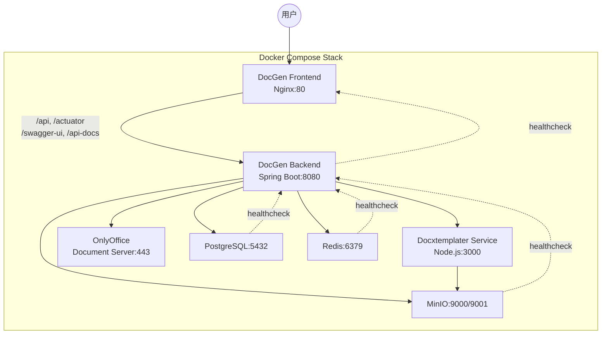
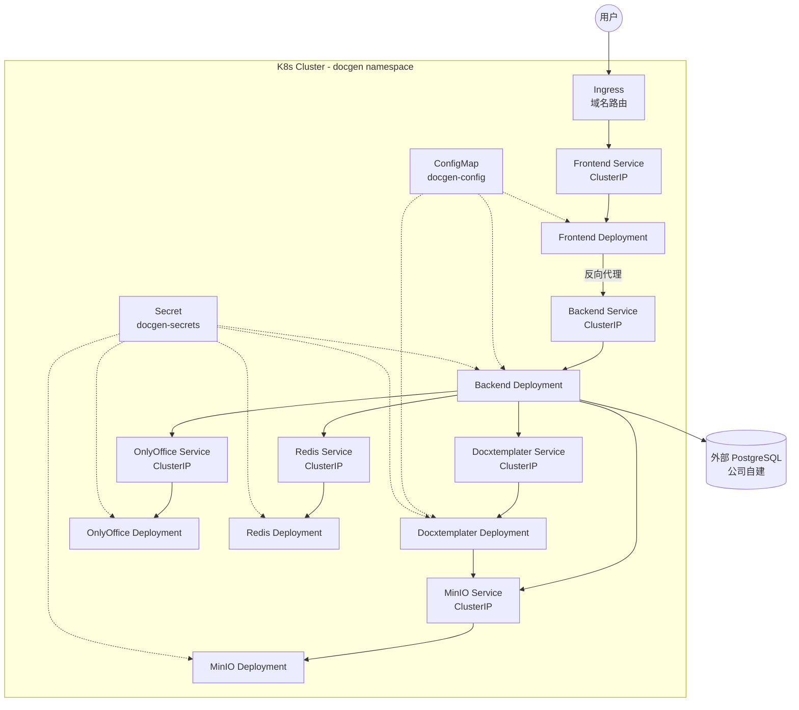

# 设计文档：Docker 与 Kubernetes 部署

## 概述

本设计为 DocGen 低代码文档生成系统提供两种部署模式：

1. **Docker Compose 本地部署**：一键启动所有服务（含 PostgreSQL），适用于开发和测试环境
2. **Kubernetes 集群部署**：使用外部 PostgreSQL，适用于公司生产环境

核心设计原则：
- 环境变量与 `application.yml` 保持一致，消除命名混乱
- 所有服务配置健康检查，确保依赖链正确启动
- K8s 清单使用 ConfigMap/Secret 集中管理配置，敏感信息与非敏感信息分离
- 前端使用 Nginx 提供静态文件服务并反向代理 API 请求

## 架构

### Docker Compose 部署架构



### Kubernetes 部署架构



## 组件与接口

### 1. DocGen Frontend（新增 Dockerfile + Nginx 配置）

**构建方式**：多阶段 Docker 构建
- 阶段 1（build）：`node:18-alpine` → `npm ci` + `npm run build`
  - 需要通过 `ARG VITE_ONLYOFFICE_URL` 传入构建时环境变量，因为前端代码 `OnlyOfficeEditor.vue` 使用 `import.meta.env.VITE_ONLYOFFICE_URL` 连接 OnlyOffice 服务，Vite 的 `VITE_` 前缀变量在构建时注入，运行时不可变
  - Docker Compose 中默认值为 `http://localhost:8443`，K8s 中需要根据 Ingress 域名配置
- 阶段 2（runtime）：`nginx:1.25-alpine` → 复制构建产物 + Nginx 配置模板

**Nginx 路由规则**：

| 路径 | 目标 | 说明 |
|------|------|------|
| `/api/` | `BACKEND_URL` 变量指向的后端 | 后端 API 反向代理 |
| `/actuator/` | 同上 | Spring Boot Actuator |
| `/swagger-ui.html`, `/api-docs/` | 同上 | API 文档 |
| `/*`（其他） | `/usr/share/nginx/html/index.html` | Vue Router history 模式 |

**环境变量动态注入（envsubst）**：
- 使用 Nginx 官方镜像内置的 `/etc/nginx/templates/` 机制，`.template` 文件在容器启动时自动被 `envsubst` 处理
- **关键**：Nginx 官方镜像的 entrypoint 默认只替换 `NGINX_ENVSUBST_TEMPLATE_SUFFIX` 指定后缀的模板文件中的环境变量。必须通过 `NGINX_ENVSUBST_FILTER` 环境变量限定只替换 `BACKEND_URL`，避免破坏 Nginx 内置变量（`$host`、`$remote_addr`、`$proxy_add_x_forwarded_for`、`$scheme`、`$uri` 等）
- 实现方式：在 Dockerfile 中设置 `ENV NGINX_ENVSUBST_FILTER=BACKEND_URL`，这样 envsubst 只会替换模板中的 `${BACKEND_URL}`，其他 `$` 变量保持原样
- `BACKEND_URL` 默认值为 `http://app:8080`（Docker Compose）或 `http://docgen-backend:8080`（K8s）

**Nginx 配置中不使用 upstream 块**：
- `upstream server` 指令只接受 `host:port` 格式，不支持 `http://` 协议前缀
- 直接在 `proxy_pass` 中使用完整 URL 变量 `${BACKEND_URL}`
- 使用 Docker 内置 DNS resolver（`resolver 127.0.0.11 valid=30s`）确保服务名能正确解析

**代理超时配置**：
- `proxy_connect_timeout`: 60s
- `proxy_read_timeout`: 300s（支持大文档生成长请求）
- `proxy_send_timeout`: 60s

### 2. DocGen Backend（Dockerfile 增强）

在现有 `eclipse-temurin:17-jre-alpine` 运行阶段添加 `curl` 安装：

```dockerfile
RUN apk add --no-cache curl
```

这是因为 Alpine 镜像默认不含 curl，而 Docker Compose 健康检查需要它。

### 3. Docker Compose 环境变量映射

当前 docker-compose.yml 使用 Spring 原生变量名（如 `SPRING_DATASOURCE_URL`），但 `application.yml` 已通过 `${DB_HOST}` 等自定义变量名进行配置。修正后的映射：

| 当前变量（错误） | 修正后变量（正确） | 值（Docker Compose） |
|---|---|---|
| `SPRING_DATASOURCE_URL` | `DB_HOST`, `DB_PORT`, `DB_NAME` | `postgres`, `5432`, `docgen` |
| `SPRING_DATASOURCE_USERNAME` | `DB_USERNAME` | `docgen` |
| `SPRING_DATASOURCE_PASSWORD` | `DB_PASSWORD` | `${DB_PASSWORD}` |
| `SPRING_DATA_REDIS_HOST` | `REDIS_HOST` | `redis` |
| `SPRING_DATA_REDIS_PORT` | `REDIS_PORT` | `6379` |
| `SPRING_REDIS_PASSWORD` | `REDIS_PASSWORD` | `${REDIS_PASSWORD}` |
| `SPRING_MAIL_HOST` | `MAIL_HOST` | `${MAIL_HOST}` |
| `SPRING_MAIL_PORT` | `MAIL_PORT` | `${MAIL_PORT}` |
| `SPRING_MAIL_USERNAME` | `MAIL_USERNAME` | `${MAIL_USERNAME}` |
| `SPRING_MAIL_PASSWORD` | `MAIL_PASSWORD` | `${MAIL_PASSWORD}` |

### 4. 健康检查设计

#### Docker Compose 健康检查

| 服务 | 命令 | 间隔 | 超时 | 重试 | 启动等待 |
|------|------|------|------|------|----------|
| PostgreSQL | `pg_isready -U docgen -d docgen` | 10s | 5s | 5 | - |
| Redis | `redis-cli --no-auth-warning -a $$REDIS_PASSWORD ping` | 10s | 5s | 5 | - |
| MinIO | `mc ready local` | 10s | 5s | 5 | - |
| Docxtemplater | `curl -f http://localhost:3000/health` | 15s | 5s | 3 | - |
| Backend | `curl -f http://localhost:8080/actuator/health` | 30s | 10s | 5 | 60s |
| Frontend | 无（依赖 Backend healthy） | - | - | - | - |

> 健康检查说明：
> - Redis：使用 `--no-auth-warning` 抑制密码在命令行中的安全警告，`$$` 是 docker-compose.yml 中对 `$` 的转义
> - MinIO：官方 `minio/minio` 镜像内置 `mc`（MinIO Client），`mc ready local` 检查本地 MinIO 实例是否就绪
> - Docxtemplater 和 Backend 需要 `curl`，Docxtemplater 基于 `node:18-slim`（含 curl），Backend 基于 Alpine（需手动安装 curl）

#### K8s 探针配置

| 服务 | 探针类型 | 方式 | 初始延迟 | 间隔 | 超时 | 失败阈值 |
|------|----------|------|----------|------|------|----------|
| Backend | liveness | HTTP GET `/actuator/health` | 60s | 30s | 5s | 3 |
| Backend | readiness | HTTP GET `/actuator/health` | 30s | 10s | 5s | 3 |
| Frontend | liveness | HTTP GET `/` | 0 | 30s | - | - |
| Frontend | readiness | HTTP GET `/` | 5s | 10s | - | - |
| Docxtemplater | liveness | HTTP GET `/health` | 30s | 30s | - | - |
| Docxtemplater | readiness | HTTP GET `/health` | 15s | 10s | - | - |
| Redis | liveness | exec `redis-cli ping` | 0 | 15s | - | - |
| MinIO | liveness | HTTP GET `/minio/health/live` | 0 | 15s | - | - |

### 5. 部署脚本

#### `deploy.sh`（本地 Docker 部署）

流程：
1. 检查 `docker` 和 `docker compose` 是否可用
2. 检查 `.env` 文件是否存在，不存在则从 `.env.example` 复制并提示修改
3. `docker compose build` 构建镜像
4. `docker compose up -d` 启动服务
5. 轮询等待各服务健康检查通过
6. 输出访问地址（前端 http://localhost:80，后端 http://localhost:8080）
7. 失败时输出对应服务日志

#### `k8s/k8s-deploy.sh`（K8s 部署）

流程：
1. 检查 `kubectl` 是否可用并能连接集群
2. 按顺序应用资源：namespace → configmap/secret → pvc → deployments/services → ingress
3. 等待各 Deployment rollout 完成
4. 失败时输出 Pod 日志

## 数据模型

### 文件目录结构

```
项目根目录/
├── frontend/
│   ├── Dockerfile                    # 新增：多阶段构建（含 VITE_ONLYOFFICE_URL ARG）
│   ├── .dockerignore                 # 新增：排除不必要文件
│   └── nginx/
│       └── default.conf.template     # 新增：Nginx 配置模板（envsubst）
├── backend/
│   └── Dockerfile                    # 修改：添加 curl 安装
├── docker-compose.yml                # 修改：环境变量统一 + 健康检查 + 前端服务
├── .env.example                      # 修改：补充完整变量 + 中文注释
├── deploy.sh                         # 新增：本地部署脚本
└── k8s/                              # 新增：K8s 部署清单目录
    ├── namespace.yaml
    ├── configmap.yaml
    ├── secret.yaml
    ├── backend-deployment.yaml
    ├── backend-service.yaml
    ├── frontend-deployment.yaml
    ├── frontend-service.yaml
    ├── docxtemplater-deployment.yaml
    ├── docxtemplater-service.yaml
    ├── onlyoffice-deployment.yaml
    ├── onlyoffice-service.yaml
    ├── onlyoffice-pvc.yaml
    ├── redis-deployment.yaml
    ├── redis-service.yaml
    ├── redis-pvc.yaml
    ├── minio-deployment.yaml
    ├── minio-service.yaml
    ├── minio-pvc.yaml
    ├── ingress.yaml
    ├── kustomization.yaml
    └── k8s-deploy.sh
```

### ConfigMap 数据结构（`docgen-config`）

```yaml
data:
  # 外部 PostgreSQL 连接信息（K8s 使用公司自建数据库）
  DB_HOST: "external-postgres.company.internal"
  DB_PORT: "5432"
  DB_NAME: "docgen"
  # Redis 集群内部地址
  REDIS_HOST: "docgen-redis"
  REDIS_PORT: "6379"
  # MinIO 集群内部地址
  MINIO_ENDPOINT: "http://docgen-minio:9000"
  # Docxtemplater 集群内部地址
  DOCXTEMPLATER_SERVICE_URL: "http://docgen-docxtemplater:3000"
  # OnlyOffice 集群内部地址
  ONLYOFFICE_URL: "http://docgen-onlyoffice"
  # 邮件配置（非敏感部分）
  MAIL_HOST: "smtp.company.internal"
  MAIL_PORT: "587"
```

### Secret 数据结构（`docgen-secrets`）

```yaml
data:
  # 外部 PostgreSQL 凭证
  DB_USERNAME: <base64>
  DB_PASSWORD: <base64>
  # Redis 密码
  REDIS_PASSWORD: <base64>
  # MinIO 凭证
  MINIO_ACCESS_KEY: <base64>
  MINIO_SECRET_KEY: <base64>
  # JWT 密钥
  JWT_SECRET: <base64>
  # AES-256 加密密钥
  ENCRYPTION_KEY: <base64>
  # OnlyOffice JWT 密钥
  ONLYOFFICE_JWT_SECRET: <base64>
  # 邮件凭证
  MAIL_USERNAME: <base64>
  MAIL_PASSWORD: <base64>
```

### Nginx 配置模板关键设计

```nginx
# /etc/nginx/templates/default.conf.template
# Nginx 官方镜像 entrypoint 会自动用 envsubst 处理此文件
# 通过 NGINX_ENVSUBST_FILTER=BACKEND_URL 限定只替换 BACKEND_URL 变量

server {
    listen 80;
    server_name _;
    root /usr/share/nginx/html;
    index index.html;

    # Docker 内置 DNS resolver（确保服务名能解析）
    resolver 127.0.0.11 valid=30s;

    # 代理超时配置（支持大文档生成长请求）
    proxy_connect_timeout 60s;
    proxy_read_timeout 300s;
    proxy_send_timeout 60s;

    # 通用代理头
    proxy_set_header Host $host;
    proxy_set_header X-Real-IP $remote_addr;
    proxy_set_header X-Forwarded-For $proxy_add_x_forwarded_for;
    proxy_set_header X-Forwarded-Proto $scheme;

    # API 反向代理（使用变量实现动态解析）
    location /api/ {
        set $backend ${BACKEND_URL};
        proxy_pass $backend;
    }

    # Actuator 端点
    location /actuator/ {
        set $backend ${BACKEND_URL};
        proxy_pass $backend;
    }

    # Swagger / API 文档
    location /swagger-ui.html {
        set $backend ${BACKEND_URL};
        proxy_pass $backend;
    }
    location /api-docs/ {
        set $backend ${BACKEND_URL};
        proxy_pass $backend;
    }

    # Vue Router history 模式
    location / {
        try_files $uri $uri/ /index.html;
    }

    # 静态资源缓存（Vite 构建产物带 hash，可长期缓存）
    location ~* \.(js|css|png|jpg|jpeg|gif|ico|svg|woff2?)$ {
        expires 1y;
        add_header Cache-Control "public, immutable";
    }
}
```

> 设计决策说明：
> 1. **不使用 upstream 块**：`upstream server` 指令只接受 `host:port`，不支持 `http://` 前缀。我们需要完整 URL（含协议），所以直接在 `proxy_pass` 中使用变量
> 2. **使用 `set $backend` + `proxy_pass $backend`**：当 `proxy_pass` 使用变量时，Nginx 不会在启动时解析域名，而是在每次请求时通过 `resolver` 动态解析，这在容器环境中更可靠（服务可能重启导致 IP 变化）
> 3. **`resolver 127.0.0.11`**：Docker 内置 DNS 服务器地址，确保容器服务名能正确解析
> 4. **`NGINX_ENVSUBST_FILTER=BACKEND_URL`**：限定 envsubst 只替换 `${BACKEND_URL}`，保护 Nginx 内置变量 `$host`、`$remote_addr`、`$uri` 等不被误替换

## 错误处理

### Docker Compose 部署错误处理

| 场景 | 处理方式 |
|------|----------|
| Docker/Docker Compose 未安装 | 输出安装指引链接并退出（exit 1） |
| `.env` 文件缺失 | 自动从 `.env.example` 复制，提示用户修改敏感值后重新运行 |
| 镜像构建失败 | 输出构建日志，提示检查 Dockerfile 和依赖 |
| 服务启动失败 | 通过 `docker compose logs <service>` 输出失败服务日志 |
| 健康检查超时 | 输出未通过健康检查的服务列表及其日志 |

### K8s 部署错误处理

| 场景 | 处理方式 |
|------|----------|
| `kubectl` 未安装或无法连接集群 | 输出错误信息并退出 |
| 资源应用失败 | 输出 `kubectl apply` 错误信息 |
| Pod 启动失败 | 通过 `kubectl logs` 和 `kubectl describe pod` 输出诊断信息 |
| Rollout 超时 | 输出未就绪 Pod 的状态和事件 |

### 运行时错误处理

| 场景 | 处理方式 |
|------|----------|
| 后端无法连接 PostgreSQL | Spring Boot 启动失败，健康检查不通过，K8s 自动重启 Pod |
| 后端无法连接 Redis | 健康检查降级，actuator/health 报告 Redis DOWN |
| 前端无法代理到后端 | Nginx 返回 502 Bad Gateway，用户看到错误页面 |
| MinIO 不可用 | 文件上传/下载失败，后端返回 500 错误 |

## 测试策略

### PBT 适用性评估

本功能属于基础设施部署配置（Dockerfiles、docker-compose.yml、K8s YAML 清单、Shell 脚本），不涉及可测试的纯函数或业务逻辑。因此 **不适用属性基测试（PBT）**。

### 测试方法

#### 1. 配置验证测试

- 使用 `docker compose config` 验证 docker-compose.yml 语法正确性
- 使用 `kubectl --dry-run=client` 验证 K8s 清单语法

#### 2. 构建测试

- 验证 `docker compose build` 能成功构建所有镜像
- 验证前端 Dockerfile 多阶段构建产物正确（dist 目录包含 index.html）
- 验证后端 Dockerfile 包含 curl 工具

#### 3. 集成测试（需要 Docker 环境）

- `docker compose up -d` 启动全栈，验证所有服务健康检查通过
- 验证前端 Nginx 能正确代理 `/api` 请求到后端
- 验证环境变量正确传递（后端能连接 PostgreSQL、Redis、MinIO）

#### 4. K8s 清单验证

- `kubectl apply --dry-run=client -k k8s/` 验证所有资源定义有效
- 验证 ConfigMap 和 Secret 包含所有必需的环境变量
