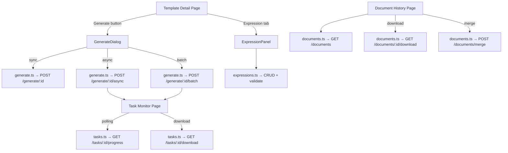

# Design Document: Document Generation Frontend

## Overview

This design covers the document-generation frontend gap-fill. The backend already exposes GenerateController, TaskController, DocumentController, and ExpressionController; the frontend adds API modules, TypeScript models, Vue pages, one composable, routes, and i18n.

Work is mostly frontend-only, plus one backend addition: **GET /api/tasks** on TaskController for paging async tasks. The UI follows existing conventions (Vue 3 Composition API, Element Plus, Pinia, vue-i18n) and reuses the shared Axios client and patterns.

### Deliverables

1. Four API modules: `generate.ts`, `tasks.ts`, `documents.ts`, `expressions.ts`
2. Two routes: Task monitor (`/tasks`), Document history (`/documents`)
3. Expression panel (new tab on template detail)
4. GenerateDialog (opened from template detail)
5. Composable `useTaskPolling` for async polling
6. Router + sidebar entries + locale strings (en-US, zh-CN, zh-TW)

## Architecture

### Frontend file layout

```
frontend/src/
├── api/
│   ├── generate.ts          # GenerateController
│   ├── tasks.ts             # TaskController
│   ├── documents.ts         # DocumentController
│   └── expressions.ts       # ExpressionController
├── types/
│   └── document.ts          # Generation-related types
├── composables/
│   └── useTaskPolling.ts    # Async task polling
├── views/
│   ├── tasks/
│   │   └── Index.vue        # Task monitor
│   ├── documents/
│   │   └── Index.vue        # Generated documents history
│   │   └── components/
│   │       └── MergeDialog.vue  # Merge selected documents
│   └── templates/
│       └── components/
│           ├── GenerateDialog.vue      # Generate flow
│           ├── ExpressionPanel.vue     # Expressions list
│           └── ExpressionFormDialog.vue # Create/edit expression
├── router/index.ts          # /tasks, /documents
├── layouts/MainLayout.vue   # Nav items
└── i18n/
    ├── en-US.json           # document.*, task.*, expression.*
    ├── zh-CN.json
    └── zh-TW.json
```

### Data flow



## Components and Interfaces

### API layer

All modules import the shared client from `@/api/request` and use typed `request.get<any, ResponseType>(url, config)` (and POST/PUT/DELETE variants) like existing API files.

#### generate.ts

```typescript
import request from './request'
import type { AsyncTaskDTO, GenerateDocumentRequest, GenerateDocumentResponse, BatchGenerateRequest } from '@/types/document'

export function generateDocument(templateId: number, data?: GenerateDocumentRequest, version?: number) {
  return request.post<any, GenerateDocumentResponse>(`/generate/${templateId}`, data ?? {}, {
    params: version != null ? { version } : undefined,
  })
}

export function generateDocumentAsync(templateId: number, data?: GenerateDocumentRequest) {
  return request.post<any, AsyncTaskDTO>(`/generate/${templateId}/async`, data ?? {})
}

export function generateDocumentBatch(templateId: number, data: BatchGenerateRequest) {
  return request.post<any, AsyncTaskDTO>(`/generate/${templateId}/batch`, data)
}
```

#### tasks.ts

```typescript
import request from './request'
import type { PageResult } from '@/types'
import type { AsyncTaskDTO, TaskProgress, TaskQuery } from '@/types/document'

export function getTasks(query: TaskQuery) {
  return request.get<any, PageResult<AsyncTaskDTO>>('/tasks', {
    params: {
      status: query.status || undefined,
      templateId: query.templateId || undefined,
      page: (query.page || 1) - 1,
      size: query.size,
    },
  })
}

export function getTaskStatus(taskId: string) {
  return request.get<any, AsyncTaskDTO>(`/tasks/${taskId}`)
}

export function getTaskProgress(taskId: string) {
  return request.get<any, TaskProgress>(`/tasks/${taskId}/progress`)
}

export function downloadTaskResult(taskId: string) {
  return request.get(`/tasks/${taskId}/download`, { responseType: 'blob' })
}
```

#### documents.ts

```typescript
import request from './request'
import type { PageResult } from '@/types'
import type { GeneratedDocumentDTO, DocumentQuery, MergeDocumentsRequest } from '@/types/document'

export function getDocuments(query: DocumentQuery) {
  return request.get<any, PageResult<GeneratedDocumentDTO>>('/documents', {
    params: {
      templateId: query.templateId || undefined,
      status: query.status || undefined,
      startTime: query.startTime || undefined,
      endTime: query.endTime || undefined,
      page: (query.page || 1) - 1,
      size: query.size,
    },
  })
}

export function getDocument(id: number) {
  return request.get<any, GeneratedDocumentDTO>(`/documents/${id}`)
}

export function downloadDocument(id: number) {
  return request.get(`/documents/${id}/download`, { responseType: 'blob' })
}

export function mergeDocuments(data: MergeDocumentsRequest) {
  return request.post<any, GeneratedDocumentDTO>('/documents/merge', data)
}
```

#### expressions.ts

```typescript
import request from './request'
import type { ExpressionDTO, CreateExpressionRequest, UpdateExpressionRequest, ValidateExpressionRequest, ExpressionValidationResult } from '@/types/document'

export function createExpression(templateId: number, data: CreateExpressionRequest) {
  return request.post<any, ExpressionDTO>(`/templates/${templateId}/expressions`, data)
}

export function getExpressions(templateId: number) {
  return request.get<any, ExpressionDTO[]>(`/templates/${templateId}/expressions`)
}

export function updateExpression(id: number, data: UpdateExpressionRequest) {
  return request.put<any, ExpressionDTO>(`/expressions/${id}`, data)
}

export function deleteExpression(id: number) {
  return request.delete(`/expressions/${id}`)
}

export function validateExpression(data: ValidateExpressionRequest) {
  return request.post<any, ExpressionValidationResult>('/expressions/validate', data)
}
```

### Composable: useTaskPolling

```typescript
// composables/useTaskPolling.ts
export function useTaskPolling(taskId: Ref<string | null>, intervalMs = 3000) {
  const task = ref<AsyncTaskDTO | null>(null)
  const progress = ref<TaskProgress | null>(null)
  const isPolling = ref(false)
  const error = ref<string | null>(null)

  // Start/stop polling when taskId changes
  // Stop when task.status is no longer PENDING/RUNNING
  // Clear interval in onBeforeUnmount

  return { task, progress, isPolling, error, start, stop }
}
```

### Vue components

- **GenerateDialog** — template detail header; modes sync/async/batch; batch fields for data sets and failure policy.
- **ExpressionPanel** — new tab on `Detail.vue`; list + `ExpressionFormDialog` for create/edit.
- **Task monitor** — filters + table; `useTaskPolling` for RUNNING rows; `<el-progress>` / `<el-tag>`.
- **Document history** — filters, selection, **MergeDialog** for merge options.

### Router

Add under main layout `children` in `router/index.ts`:

```typescript
{
  path: 'tasks',
  name: 'Tasks',
  component: () => import('@/views/tasks/Index.vue'),
  meta: { title: 'Tasks', requiresAuth: true },
},
{
  path: 'documents',
  name: 'Documents',
  component: () => import('@/views/documents/Index.vue'),
  meta: { title: 'Documents', requiresAuth: true },
},
```

### Navigation

After the Templates item in `MainLayout.vue` `<el-menu>`:

```vue
<el-menu-item index="/documents">
  <el-icon><Files /></el-icon>
  <template #title>{{ $t('nav.documents') }}</template>
</el-menu-item>
<el-menu-item index="/tasks">
  <el-icon><Clock /></el-icon>
  <template #title>{{ $t('nav.tasks') }}</template>
</el-menu-item>
```

Update `navTitleMap` for `/tasks` and `/documents`.

## Data models

### `types/document.ts`

Types mirror backend DTO field names (camelCase). Timestamps are `string` (ISO 8601).

```typescript
// ── Generate Types ──

export interface GenerateDocumentRequest {
  parameters?: Record<string, unknown>
  outputFormat?: string       // 'WORD' | 'PDF' | 'BOTH'
  storageStrategy?: string    // 'TEMP' | 'PERSISTENT'
}

export interface SegmentRenderStat {
  segmentId: number
  segmentName: string
  renderTimeMs: number
  success: boolean
  errorMessage: string | null
}

export interface GenerateDocumentResponse {
  documentId: number
  templateId: number
  format: string
  storageStrategy: string
  downloadUrl: string
  fileSize: number
  generatedAt: string
  content: string | null
  secondaryDocument: GenerateDocumentResponse | null
  segmentRenderStats: SegmentRenderStat[] | null
  totalRenderTimeMs: number | null
}

export interface BatchGenerateRequest {
  dataSets: Array<Record<string, unknown>>
  outputFormat?: string
  storageStrategy?: string
  failureStrategy?: string    // 'CONTINUE' | 'THRESHOLD'
  failureThreshold?: number
}

// ── Async Task Types ──

export type TaskStatus = 'PENDING' | 'RUNNING' | 'COMPLETED' | 'FAILED'

export interface AsyncTaskDTO {
  taskId: string
  taskType: string
  templateId: number
  status: TaskStatus | string
  progress: number
  totalCount: number
  completedCount: number
  successCount: number
  failCount: number
  documentId: number | null
  errorMessage: string | null
  downloadUrl: string | null
  createdAt: string
  completedAt: string | null
}

export interface TaskProgress {
  taskId: string
  status: string
  progress: number
  totalCount: number
  completedCount: number
  successCount: number
  failCount: number
}

export interface TaskQuery {
  status?: string
  templateId?: number
  page: number
  size: number
}

// ── Document Types ──

export interface GeneratedDocumentDTO {
  id: number
  templateId: number
  filePath: string
  format: string
  status: string
  storageStrategy: string
  fileSize: number
  pageCount: number | null
  downloadUrl: string
  generatedAt: string
  expiresAt: string | null
}

export interface DocumentQuery {
  templateId?: number
  status?: string
  startTime?: string
  endTime?: string
  page: number
  size: number
}

export interface MergeDocumentsRequest {
  documentIds: number[]
  insertPageBreaks: boolean
  generateToc: boolean
  outputFormat: string        // 'DOCX' | 'PDF'
}

// ── Expression Types ──

export type ExpressionType = 'JAVASCRIPT' | 'EXCEL'

export interface ExpressionDTO {
  id: number
  templateId: number
  name: string
  expressionType: string
  expressionText: string
  description: string | null
  executionOrder: number
  createdAt: string
}

export interface CreateExpressionRequest {
  name: string
  expressionType: string
  expressionText: string
  description?: string
  executionOrder?: number
}

export interface UpdateExpressionRequest {
  name?: string
  expressionType?: string
  expressionText?: string
  description?: string
  executionOrder?: number
}

export interface ValidateExpressionRequest {
  expression: string
  expressionType: string
}

export interface ExpressionValidationResult {
  valid: boolean
  errorMessage?: string
  errorPosition?: number
}
```

### i18n keys

Use `{module}.{page}.{element}`. Full translations live in `en-US.json`, `zh-CN.json`, and `zh-TW.json` (examples below are English defaults).

```
nav.tasks
nav.documents

document.generate         → "Generate Document"
document.generateAsync    → "Generate Asynchronously"
document.generateBatch    → "Batch Generate"
document.generateMode     → "Generation Mode"
document.modeSync         → "Synchronous"
document.modeAsync        → "Asynchronous"
document.modeBatch        → "Batch"
document.parameters       → "Parameters"
document.parametersHint   → "JSON format runtime parameters"
document.dataSets         → "Data Sets"
document.dataSetsHint     → "One JSON object per line, max 1000"
document.failureStrategy  → "Failure Strategy"
document.strategyContinue → "Continue"
document.strategyThreshold→ "Threshold"
document.failureThreshold → "Failure Threshold"
document.history          → "Document History"
document.merge            → "Merge Documents"
document.mergeOrder       → "Merge Order"
document.insertPageBreak  → "Insert Page Break"
document.generateToc      → "Generate Table of Contents"
document.outputFormat     → "Output Format"
document.formatWord       → "Word (.docx)"
document.formatPdf        → "PDF"
document.formatBoth       → "Both"
document.storageMode      → "Storage Mode"
document.storageTemporary → "Temporary"
document.storagePersistent→ "Persistent"
document.generateSuccess  → "Document generated successfully"
document.batchProgress    → "Progress: {completed}/{total}"
document.batchComplete    → "Batch generation complete"
document.downloadZip      → "Download ZIP"
document.expiresAt        → "Expires At"
document.generatedAt      → "Generated At"
document.fileSize         → "File Size"

task.title           → "Tasks"
task.taskId          → "Task ID"
task.status          → "Status"
task.statusPending   → "Pending"
task.statusRunning   → "Running"
task.statusCompleted → "Completed"
task.statusFailed    → "Failed"
task.progress        → "Progress"
task.createdAt       → "Created At"
task.completedAt     → "Completed At"
task.errorMessage    → "Error Message"
task.downloadResult  → "Download Result"
task.viewProgress    → "View Progress"
task.pollingActive   → "Auto-refreshing..."

expression.title            → "Expressions"
expression.create           → "Create Expression"
expression.edit             → "Edit Expression"
expression.name             → "Expression Name"
expression.type             → "Expression Type"
expression.typeJavaScript   → "JavaScript"
expression.typeExcel        → "Excel Formula"
expression.content          → "Expression Content"
expression.validate         → "Validate"
expression.validationSuccess→ "Expression is valid"
expression.validationFailed → "Expression validation failed"
expression.result           → "Result"
expression.testExpression   → "Test Expression"
expression.executionOrder   → "Execution Order"
expression.description      → "Description"
expression.confirmDelete    → "Are you sure you want to delete expression \"{name}\"?"
expression.errorPosition    → "Error at position {pos}"
```

## Correctness Properties

*A property is a characteristic or behavior that should hold true across all valid executions of a system — essentially, a formal statement about what the system should do. Properties serve as the bridge between human-readable specifications and machine-verifiable correctness guarantees.*

This feature is mostly UI and thin API facades; many acceptance checks are example UI tests or smoke checks. The following properties are suitable for PBT:

### Property 1: Document query parameter mapping preserves all filter fields

*For any* valid `DocumentQuery` object with arbitrary combinations of optional fields (templateId, status, startTime, endTime, page, size), calling `getDocuments(query)` SHALL pass exactly the non-empty fields as URL query parameters to the Axios GET request, with `page` converted to zero-based index.

**Validates: Requirements 3.2**

### Property 2: Document history filter-to-API mapping

*For any* combination of filter form values (templateId present or absent, status selected or empty, date range set or unset), applying filters on the Document History page SHALL invoke `getDocuments` with query parameters that exactly match the active filter values, omitting undefined optional fields.

**Validates: Requirements 7.4**

### Property 3: Expression validation result rendering

*For any* `ExpressionValidationResult` object (valid=true with no error, or valid=false with errorMessage and optional errorPosition), the Expression Panel SHALL render a success indicator when `valid` is true, or render the error message text and error position (when present) when `valid` is false.

**Validates: Requirements 8.7**

## Error handling

### API layer

- `request.ts` interceptors handle errors (401 refresh, 403/429/5xx → `ElMessage`)
- Components wrap calls in `try/catch`; avoid duplicate toasts in `catch` when the interceptor already notified
- Use `finally` for loading flags and other cleanup

### Component-level

| Scenario | Handling |
|----------|----------|
| Sync generate fails | `ElMessage.error` with server message |
| Polling fails | Stop polling, show error, optional manual retry |
| Batch submit fails | `ElMessage.error`; keep form values |
| Expression validate fails | Show `errorMessage` / `errorPosition` in dialog |
| Document download fails | `ElMessage.error` |
| Blob download wrong type | Inspect `content-type`; if JSON, parse error body |

### Polling resilience

`useTaskPolling`:
- Do not stop on first failure; after 3 consecutive failures, stop and surface error
- `onBeforeUnmount` clears interval
- Stop when status is COMPLETED or FAILED

## Testing strategy

### Tooling

- Unit: Vitest + `@vue/test-utils`
- PBT: fast-check with Vitest
- HTTP: vitest mocks or MSW

### Example-based unit tests

| Target | Focus |
|--------|--------|
| API helpers | Correct method, URL, payload |
| useTaskPolling | start/stop, terminal states, unmount cleanup |
| GenerateDialog | Mode switches, submit wiring, errors |
| ExpressionPanel | CRUD + validation UX |
| Task monitor | Table, progress, conditional download |
| Document history | Filters, pagination, merge flow |

### Property-based (fast-check)

Run at least 100 iterations: `fc.assert(fc.property(...), { numRuns: 100 })`.

| Property | Approach |
|----------|----------|
| Property 1: Document query mapping | Random `DocumentQuery`; mock client; assert query params |
| Property 2: History filters → API | Random filter combos; mount; assert `getDocuments` args |
| Property 3: Expression validation UI | Random `ExpressionValidationResult`; assert rendered state |

Comment tags (ASCII):
- `// Feature: document-generation-frontend, Property 1: Document query parameter mapping preserves all filter fields`
- `// Feature: document-generation-frontend, Property 2: Document history filter-to-API mapping`
- `// Feature: document-generation-frontend, Property 3: Expression validation result rendering`
