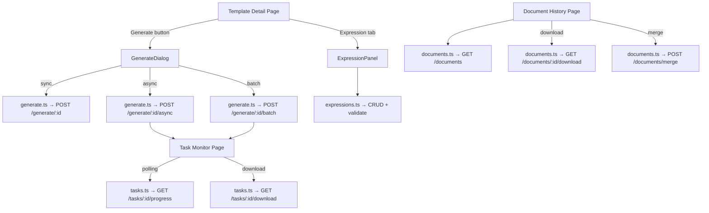

# Design Document: Document Generation Frontend

## Overview

本设计文档描述文档生成系统前端补全功能的技术方案。后端已提供完整的 REST API（GenerateController、TaskController、DocumentController、ExpressionController），前端需要补全对应的 API 调用层、TypeScript 类型定义、Vue 页面组件、composable 函数、路由配置和 i18n 翻译。

本功能以前端实现为主，仅需在后端 TaskController 中新增一个任务列表查询端点（`GET /api/tasks`）。设计遵循项目现有的前端架构规范（Vue 3 Composition API + Element Plus + Pinia + vue-i18n），并复用已有的 Axios 封装、类型体系和组件模式。

### 核心交付物

1. 4 个 API 文件：`generate.ts`、`tasks.ts`、`documents.ts`、`expressions.ts`
2. 2 个新页面：Task Monitor (`/tasks`)、Document History (`/documents`)
3. 1 个集成面板：Expression Panel（嵌入模板详情页 tab）
4. 1 个生成对话框：GenerateDialog（从模板详情页触发）
5. 1 个 composable：`useTaskPolling`（异步任务轮询）
6. 路由注册 + 导航菜单扩展 + 三语 i18n 翻译

## Architecture

### 前端文件结构

```
frontend/src/
├── api/
│   ├── generate.ts          # GenerateController 端点
│   ├── tasks.ts             # TaskController 端点
│   ├── documents.ts         # DocumentController 端点
│   └── expressions.ts       # ExpressionController 端点
├── types/
│   └── document.ts          # 文档生成相关类型定义
├── composables/
│   └── useTaskPolling.ts    # 异步任务轮询 composable
├── views/
│   ├── tasks/
│   │   └── Index.vue        # 异步任务监控页
│   ├── documents/
│   │   └── Index.vue        # 生成文档历史页
│   │   └── components/
│   │       └── MergeDialog.vue  # 文档合并对话框
│   └── templates/
│       └── components/
│           ├── GenerateDialog.vue      # 文档生成对话框
│           ├── ExpressionPanel.vue     # 表达式管理面板
│           └── ExpressionFormDialog.vue # 表达式创建/编辑对话框
├── router/index.ts          # 新增 /tasks、/documents 路由
├── layouts/MainLayout.vue   # 新增导航菜单项
└── i18n/
    ├── en-US.json           # 新增 document.*, task.*, expression.* 翻译
    ├── zh-CN.json
    └── zh-TW.json
```

### 数据流架构



## Components and Interfaces

### API Layer Design

所有 API 文件遵循现有模式：从 `@/api/request` 导入共享 Axios 实例，函数签名使用泛型 `request.get<any, ResponseType>(url, config)`。

#### generate.ts

```typescript
import request from './request'
import type { AsyncTaskDTO, GenerateDocumentRequest, GenerateDocumentResponse, BatchGenerateRequest } from '@/types/document'

export function generateDocument(templateId: number, data?: GenerateDocumentRequest, version?: number) {
  return request.post<any, GenerateDocumentResponse>(`/generate/${templateId}`, data ?? {}, {
    params: version != null ? { version } : undefined,
  })
}

export function generateDocumentAsync(templateId: number, data?: GenerateDocumentRequest) {
  return request.post<any, AsyncTaskDTO>(`/generate/${templateId}/async`, data ?? {})
}

export function generateDocumentBatch(templateId: number, data: BatchGenerateRequest) {
  return request.post<any, AsyncTaskDTO>(`/generate/${templateId}/batch`, data)
}
```

#### tasks.ts

```typescript
import request from './request'
import type { PageResult } from '@/types'
import type { AsyncTaskDTO, TaskProgress, TaskQuery } from '@/types/document'

export function getTasks(query: TaskQuery) {
  return request.get<any, PageResult<AsyncTaskDTO>>('/tasks', {
    params: {
      status: query.status || undefined,
      templateId: query.templateId || undefined,
      page: (query.page || 1) - 1,
      size: query.size,
    },
  })
}

export function getTaskStatus(taskId: string) {
  return request.get<any, AsyncTaskDTO>(`/tasks/${taskId}`)
}

export function getTaskProgress(taskId: string) {
  return request.get<any, TaskProgress>(`/tasks/${taskId}/progress`)
}

export function downloadTaskResult(taskId: string) {
  return request.get(`/tasks/${taskId}/download`, { responseType: 'blob' })
}
```

#### documents.ts

```typescript
import request from './request'
import type { PageResult } from '@/types'
import type { GeneratedDocumentDTO, DocumentQuery, MergeDocumentsRequest } from '@/types/document'

export function getDocuments(query: DocumentQuery) {
  return request.get<any, PageResult<GeneratedDocumentDTO>>('/documents', {
    params: {
      templateId: query.templateId || undefined,
      status: query.status || undefined,
      startTime: query.startTime || undefined,
      endTime: query.endTime || undefined,
      page: (query.page || 1) - 1,
      size: query.size,
    },
  })
}

export function getDocument(id: number) {
  return request.get<any, GeneratedDocumentDTO>(`/documents/${id}`)
}

export function downloadDocument(id: number) {
  return request.get(`/documents/${id}/download`, { responseType: 'blob' })
}

export function mergeDocuments(data: MergeDocumentsRequest) {
  return request.post<any, GeneratedDocumentDTO>('/documents/merge', data)
}
```

#### expressions.ts

```typescript
import request from './request'
import type { ExpressionDTO, CreateExpressionRequest, UpdateExpressionRequest, ValidateExpressionRequest, ExpressionValidationResult } from '@/types/document'

export function createExpression(templateId: number, data: CreateExpressionRequest) {
  return request.post<any, ExpressionDTO>(`/templates/${templateId}/expressions`, data)
}

export function getExpressions(templateId: number) {
  return request.get<any, ExpressionDTO[]>(`/templates/${templateId}/expressions`)
}

export function updateExpression(id: number, data: UpdateExpressionRequest) {
  return request.put<any, ExpressionDTO>(`/expressions/${id}`, data)
}

export function deleteExpression(id: number) {
  return request.delete(`/expressions/${id}`)
}

export function validateExpression(data: ValidateExpressionRequest) {
  return request.post<any, ExpressionValidationResult>('/expressions/validate', data)
}
```

### Composable: useTaskPolling

```typescript
// composables/useTaskPolling.ts
export function useTaskPolling(taskId: Ref<string | null>, intervalMs = 3000) {
  const task = ref<AsyncTaskDTO | null>(null)
  const progress = ref<TaskProgress | null>(null)
  const isPolling = ref(false)
  const error = ref<string | null>(null)

  // 当 taskId 变化时自动开始/停止轮询
  // 当 task.status 不再是 PENDING/RUNNING 时自动停止
  // 组件卸载时通过 onBeforeUnmount 自动清理 interval

  return { task, progress, isPolling, error, start, stop }
}
```

### Vue Component Architecture

#### GenerateDialog

- 触发方式：模板详情页 header 区域新增 "Generate" 按钮
- Props: `visible: boolean`, `templateId: number`
- Emits: `update:visible`, `generated`
- 内部状态：generation mode (sync/async/batch), parameters JSON, outputFormat, storageStrategy
- Batch 模式额外字段：dataSets JSON array, failureStrategy, failureThreshold

#### ExpressionPanel

- 集成位置：`Detail.vue` 的 `<el-tabs>` 中新增一个 `<el-tab-pane>`
- Props: `templateId: number`
- 内部管理表达式列表的加载、CRUD 操作
- 子组件 `ExpressionFormDialog`：创建/编辑表达式的对话框

#### Task Monitor Page (views/tasks/Index.vue)

- 遵循标准列表页模式（page-header + filter-card + table + pagination）
- 筛选区域：status dropdown、templateId input
- 页面加载时调用 `getTasks` 获取任务列表
- 使用 `useTaskPolling` composable 实现 RUNNING 任务的实时进度更新
- 进度列使用 `<el-progress>` 组件
- Status 列使用 `<el-tag>` 颜色映射

#### Document History Page (views/documents/Index.vue)

- 遵循标准列表页模式
- 筛选区域：templateId input、status dropdown、date range picker
- 支持多选 + Merge 操作，通过 MergeDialog 子组件配置合并选项

### Router Configuration Changes

在 `router/index.ts` 的 main layout children 中新增：

```typescript
{
  path: 'tasks',
  name: 'Tasks',
  component: () => import('@/views/tasks/Index.vue'),
  meta: { title: 'Tasks', requiresAuth: true },
},
{
  path: 'documents',
  name: 'Documents',
  component: () => import('@/views/documents/Index.vue'),
  meta: { title: 'Documents', requiresAuth: true },
},
```

### Navigation Menu Changes

在 `MainLayout.vue` 的 `<el-menu>` 中，在 Templates 菜单项之后新增：

```vue
<el-menu-item index="/documents">
  <el-icon><Files /></el-icon>
  <template #title>{{ $t('nav.documents') }}</template>
</el-menu-item>
<el-menu-item index="/tasks">
  <el-icon><Clock /></el-icon>
  <template #title>{{ $t('nav.tasks') }}</template>
</el-menu-item>
```

同时更新 `navTitleMap` 添加 `/tasks` 和 `/documents` 映射。

## Data Models

### TypeScript 类型定义 (types/document.ts)

所有类型与后端 DTO 字段名一一对应（camelCase），时间字段使用 `string`（ISO 8601 格式）。

```typescript
// ── Generate Types ──

export interface GenerateDocumentRequest {
  parameters?: Record<string, unknown>
  outputFormat?: string       // 'WORD' | 'PDF' | 'BOTH'
  storageStrategy?: string    // 'TEMP' | 'PERSISTENT'
}

export interface SegmentRenderStat {
  segmentId: number
  segmentName: string
  renderTimeMs: number
  success: boolean
  errorMessage: string | null
}

export interface GenerateDocumentResponse {
  documentId: number
  templateId: number
  format: string
  storageStrategy: string
  downloadUrl: string
  fileSize: number
  generatedAt: string
  content: string | null
  secondaryDocument: GenerateDocumentResponse | null
  segmentRenderStats: SegmentRenderStat[] | null
  totalRenderTimeMs: number | null
}

export interface BatchGenerateRequest {
  dataSets: Array<Record<string, unknown>>
  outputFormat?: string
  storageStrategy?: string
  failureStrategy?: string    // 'CONTINUE' | 'THRESHOLD'
  failureThreshold?: number
}

// ── Async Task Types ──

export type TaskStatus = 'PENDING' | 'RUNNING' | 'COMPLETED' | 'FAILED'

export interface AsyncTaskDTO {
  taskId: string
  taskType: string
  templateId: number
  status: TaskStatus | string
  progress: number
  totalCount: number
  completedCount: number
  successCount: number
  failCount: number
  documentId: number | null
  errorMessage: string | null
  downloadUrl: string | null
  createdAt: string
  completedAt: string | null
}

export interface TaskProgress {
  taskId: string
  status: string
  progress: number
  totalCount: number
  completedCount: number
  successCount: number
  failCount: number
}

export interface TaskQuery {
  status?: string
  templateId?: number
  page: number
  size: number
}

// ── Document Types ──

export interface GeneratedDocumentDTO {
  id: number
  templateId: number
  filePath: string
  format: string
  status: string
  storageStrategy: string
  fileSize: number
  pageCount: number | null
  downloadUrl: string
  generatedAt: string
  expiresAt: string | null
}

export interface DocumentQuery {
  templateId?: number
  status?: string
  startTime?: string
  endTime?: string
  page: number
  size: number
}

export interface MergeDocumentsRequest {
  documentIds: number[]
  insertPageBreaks: boolean
  generateToc: boolean
  outputFormat: string        // 'DOCX' | 'PDF'
}

// ── Expression Types ──

export type ExpressionType = 'JAVASCRIPT' | 'EXCEL'

export interface ExpressionDTO {
  id: number
  templateId: number
  name: string
  expressionType: string
  expressionText: string
  description: string | null
  executionOrder: number
  createdAt: string
}

export interface CreateExpressionRequest {
  name: string
  expressionType: string
  expressionText: string
  description?: string
  executionOrder?: number
}

export interface UpdateExpressionRequest {
  name?: string
  expressionType?: string
  expressionText?: string
  description?: string
  executionOrder?: number
}

export interface ValidateExpressionRequest {
  expression: string
  expressionType: string
}

export interface ExpressionValidationResult {
  valid: boolean
  errorMessage?: string
  errorPosition?: number
}
```

### i18n Key Structure

新增 key 遵循 `{module}.{page}.{element}` 命名规范：

```
nav.tasks          → "Tasks" / "任务" / "任務"
nav.documents      → "Documents" / "文档" / "文件"

document.generate         → "Generate Document"
document.generateAsync    → "Generate Asynchronously"
document.generateBatch    → "Batch Generate"
document.generateMode     → "Generation Mode"
document.modeSync         → "Synchronous"
document.modeAsync        → "Asynchronous"
document.modeBatch        → "Batch"
document.parameters       → "Parameters"
document.parametersHint   → "JSON format runtime parameters"
document.dataSets         → "Data Sets"
document.dataSetsHint     → "One JSON object per line, max 1000"
document.failureStrategy  → "Failure Strategy"
document.strategyContinue → "Continue"
document.strategyThreshold→ "Threshold"
document.failureThreshold → "Failure Threshold"
document.history          → "Document History"
document.merge            → "Merge Documents"
document.mergeOrder       → "Merge Order"
document.insertPageBreak  → "Insert Page Break"
document.generateToc      → "Generate Table of Contents"
document.outputFormat     → "Output Format"
document.formatWord       → "Word (.docx)"
document.formatPdf        → "PDF"
document.formatBoth       → "Both"
document.storageMode      → "Storage Mode"
document.storageTemporary → "Temporary"
document.storagePersistent→ "Persistent"
document.generateSuccess  → "Document generated successfully"
document.batchProgress    → "Progress: {completed}/{total}"
document.batchComplete    → "Batch generation complete"
document.downloadZip      → "Download ZIP"
document.expiresAt        → "Expires At"
document.generatedAt      → "Generated At"
document.fileSize         → "File Size"

task.title           → "Tasks"
task.taskId          → "Task ID"
task.status          → "Status"
task.statusPending   → "Pending"
task.statusRunning   → "Running"
task.statusCompleted → "Completed"
task.statusFailed    → "Failed"
task.progress        → "Progress"
task.createdAt       → "Created At"
task.completedAt     → "Completed At"
task.errorMessage    → "Error Message"
task.downloadResult  → "Download Result"
task.viewProgress    → "View Progress"
task.pollingActive   → "Auto-refreshing..."

expression.title            → "Expressions"
expression.create           → "Create Expression"
expression.edit             → "Edit Expression"
expression.name             → "Expression Name"
expression.type             → "Expression Type"
expression.typeJavaScript   → "JavaScript"
expression.typeExcel        → "Excel Formula"
expression.content          → "Expression Content"
expression.validate         → "Validate"
expression.validationSuccess→ "Expression is valid"
expression.validationFailed → "Expression validation failed"
expression.result           → "Result"
expression.testExpression   → "Test Expression"
expression.executionOrder   → "Execution Order"
expression.description      → "Description"
expression.confirmDelete    → "Are you sure you want to delete expression \"{name}\"?"
expression.errorPosition    → "Error at position {pos}"
```

## Correctness Properties

*A property is a characteristic or behavior that should hold true across all valid executions of a system — essentially, a formal statement about what the system should do. Properties serve as the bridge between human-readable specifications and machine-verifiable correctness guarantees.*

本功能以前端 UI 和 API 调用层为主，大部分验收标准属于 UI 交互测试（EXAMPLE）或配置检查（SMOKE）。经过 prework 分析，识别出以下可用 property-based testing 验证的属性：

### Property 1: Document query parameter mapping preserves all filter fields

*For any* valid `DocumentQuery` object with arbitrary combinations of optional fields (templateId, status, startTime, endTime, page, size), calling `getDocuments(query)` SHALL pass exactly the non-empty fields as URL query parameters to the Axios GET request, with `page` converted to zero-based index.

**Validates: Requirements 3.2**

### Property 2: Document history filter-to-API mapping

*For any* combination of filter form values (templateId present or absent, status selected or empty, date range set or unset), applying filters on the Document History page SHALL invoke `getDocuments` with query parameters that exactly match the active filter values, omitting undefined optional fields.

**Validates: Requirements 7.4**

### Property 3: Expression validation result rendering

*For any* `ExpressionValidationResult` object (valid=true with no error, or valid=false with errorMessage and optional errorPosition), the Expression Panel SHALL render a success indicator when `valid` is true, or render the error message text and error position (when present) when `valid` is false.

**Validates: Requirements 8.7**

## Error Handling

### API Layer Error Handling

- 所有 API 调用的错误由 `request.ts` 的响应拦截器统一处理（401 自动刷新 token、403/429/5xx 显示 ElMessage）
- 各组件内部使用 `try/catch` 包裹 API 调用，`catch` 块中不重复显示错误（拦截器已处理）
- 仅在需要特殊处理时（如重置 loading 状态）在 `finally` 块中执行清理

### 组件级错误处理

| 场景 | 处理方式 |
|------|----------|
| 同步生成失败 | ElMessage.error 显示后端错误消息 |
| 异步任务轮询失败 | 停止轮询，显示错误提示，提供手动重试按钮 |
| 批量生成提交失败 | ElMessage.error，保留表单数据不清空 |
| 表达式验证失败 | 在对话框内显示 errorMessage 和 errorPosition |
| 文档下载失败 | ElMessage.error 提示下载失败 |
| Blob 下载异常 | 检查 response content-type，非 blob 时解析 JSON 错误消息 |

### 轮询容错

`useTaskPolling` composable 实现以下容错逻辑：
- 单次轮询请求失败时不立即停止，允许最多 3 次连续失败后停止轮询并显示错误
- 组件卸载时通过 `onBeforeUnmount` 自动清理 `setInterval`
- 任务状态变为 COMPLETED 或 FAILED 时自动停止轮询

## Testing Strategy

### 测试框架

- 前端单元测试：Vitest + @vue/test-utils
- Property-based testing：fast-check（与 Vitest 集成）
- Mock HTTP：vitest mock 或 msw

### 单元测试（Example-based）

| 测试目标 | 测试内容 |
|----------|----------|
| API 函数 | 验证各 API 函数发送正确的 HTTP method、URL、payload |
| useTaskPolling | 验证轮询启动/停止逻辑、状态变更时自动停止、组件卸载清理 |
| GenerateDialog | 验证三种模式切换、表单提交调用正确 API、错误显示 |
| ExpressionPanel | 验证 CRUD 操作流程、验证结果显示 |
| Task Monitor | 验证表格渲染、进度条更新、下载按钮条件显示 |
| Document History | 验证筛选、分页、多选合并流程 |

### Property-Based Tests (fast-check)

每个 property test 运行最少 100 次迭代，使用 `fc.assert(fc.property(...), { numRuns: 100 })` 配置。

| Property | 测试策略 |
|----------|----------|
| Property 1: Document query parameter mapping | 生成随机 DocumentQuery（optional 字段随机 present/absent），mock Axios，验证传递的 params 与输入一致 |
| Property 2: Document history filter-to-API mapping | 生成随机筛选组合，mount 组件，触发搜索，验证 API 调用参数 |
| Property 3: Expression validation result rendering | 生成随机 ExpressionValidationResult，mount ExpressionPanel，验证 UI 渲染 |

Tag 格式：
- `// Feature: document-generation-frontend, Property 1: Document query parameter mapping preserves all filter fields`
- `// Feature: document-generation-frontend, Property 2: Document history filter-to-API mapping`
- `// Feature: document-generation-frontend, Property 3: Expression validation result rendering`
