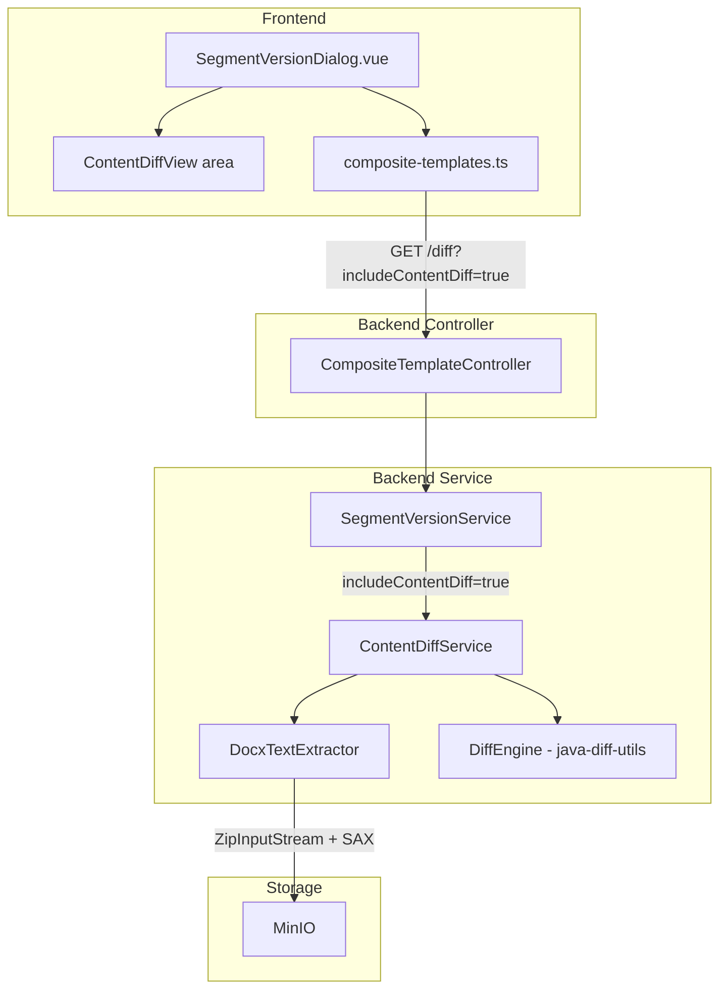

# Design Document: docx-content-diff

## Overview

This feature adds real `.docx` text diff to the existing segment version compare flow. Today the system only compares metadata (`segmentType`, `configSnapshot`, `comment`) and file path changes, not document body text.

Core design:

1. Backend `DocxTextExtractor`: JDK `ZipInputStream` + `SAXParser` for plain text (no Apache POI).
2. Backend `ContentDiffService`: `java-diff-utils` (v4.15) for line diff.
3. Extend `SegmentVersionDiffResult` with `contentDiffs`, `contentChanged`, `truncated`.
4. Extend compare API with optional `includeContentDiff`.
5. Frontend `SegmentVersionDialog.vue`: unified red/green diff for content.

Rationale:

- SAX over DOM for streaming and lower memory on large `.docx`.
- `java-diff-utils` for a maintained Myers-style diff.
- Optional `includeContentDiff` avoids performance impact for callers that do not need body diff.
- This is **template text diff** (not WYSIWYG); the UI must state that clearly.

## Architecture



Data flow:

1. User clicks Compare in `SegmentVersionDialog`.
2. Frontend calls `compareSegmentVersions()` with `includeContentDiff=true`.
3. Controller passes the flag to `SegmentVersionService.compareSegmentVersions()`.
4. Service calls `ContentDiffService.computeContentDiff()` for body diff when requested.
5. `ContentDiffService` uses `DocxTextExtractor` to read both `.docx` files from MinIO and extract text.
6. `ContentDiffService` runs `java-diff-utils` line diff.
7. `SegmentVersionDiffResult` returns to the client.
8. Frontend renders the unified diff.

## Components and Interfaces

### 1. DocxTextExtractor (new backend component)

Location: `com.docgen.service.DocxTextExtractor`

Responsibility: extract plain text from a `.docx` `InputStream`.

```java
@Component
public class DocxTextExtractor {

    /**
     * Extract plain text from a .docx stream.
     * Unzip with ZipInputStream, SAX-parse word/document.xml (and headers/footers),
     * collect {@code <w:t>} nodes under {@code <w:p>} as lines.
     *
     * @param docxStream .docx input stream
     * @param maxBytes   max bytes to extract (truncate beyond); default 512000 (500KB)
     * @return extracted plain text
     * @throws BusinessException if not a valid .docx or parse fails
     */
    public ExtractedText extractText(InputStream docxStream, int maxBytes);

    /**
     * Read .docx from MinIO and extract plain text.
     *
     * @param filePath object path in MinIO
     * @return extracted plain text
     * @throws BusinessException if missing or extraction fails
     */
    public ExtractedText extractTextFromMinio(String filePath);
}

/**
 * Extraction outcome: text body and whether it was truncated.
 */
public record ExtractedText(String text, boolean truncated) {}
```

SAX strategy:

- `SAXParserFactory.newInstance()` — **no** namespace awareness (default), match `qName` for tags
- `startElement(qName="w:p")` — start paragraph buffer
- `characters()` inside `w:t` — append to current paragraph
- `endElement(qName="w:p")` — if buffer non-empty, append line + newline
- `startElement` / `endElement` for `w:t` — toggle text collection
- Process `word/document.xml`, `word/header*.xml`, `word/footer*.xml`

Difference from `TemplateScanService.extractXmlFromDocx()`:

- `TemplateScanService` returns raw XML strings for placeholder regex
- `DocxTextExtractor` SAX-parses human-readable text and drops markup

### 2. ContentDiffService (new backend service)

Location: `com.docgen.service.ContentDiffService`

Responsibility: orchestrate extraction and diff.

```java
@Service
public class ContentDiffService {

    private static final int MAX_TEXT_BYTES = 512_000;  // 500KB
    private static final int MAX_DIFF_LINES = 2000;

    /**
     * Compute text diff between two .docx objects in MinIO.
     *
     * @param oldFilePath old version path
     * @param newFilePath new version path
     * @return structured diff result
     */
    public ContentDiffResult computeContentDiff(String oldFilePath, String newFilePath);
}

public record ContentDiffResult(
    List<ContentDiffLine> lines,
    boolean contentChanged,
    boolean truncated
) {}
```

### 3. DiffEngine (internal helper)

Wraps `java-diff-utils` inside `ContentDiffService` (method or small utility class).

```java
/**
 * Line diff two strings via java-diff-utils.
 * Uses DiffUtils.diff(), walks AbstractDelta to build ContentDiffLine rows.
 */
List<ContentDiffLine> computeLineDiff(String oldText, String newText);
```

Usage:

1. Split on `\n` → `List<String>`
2. `DiffUtils.diff(oldLines, newLines)` → `Patch<String>`
3. For each `AbstractDelta`, map `DeltaType` (CHANGE/DELETE/INSERT/EQUAL)
4. Map CHANGE → MODIFIED on `ContentDiffLine` list

### 4. SegmentVersionDiffResult extensions

```java
// New fields
private List<ContentDiffLine> contentDiffs;
private boolean contentChanged;
private boolean truncated;
```

### 5. ContentDiffLine DTO (new)

Location: `com.docgen.dto.ContentDiffLine`

```java
public class ContentDiffLine {
    public enum DiffType { EQUAL, ADDED, REMOVED, MODIFIED }

    private DiffType type;
    private Integer oldLineNumber;  // null for ADDED
    private Integer newLineNumber;  // null for REMOVED
    private String oldText;           // null for ADDED
    private String newText;           // null for REMOVED
}
```

### 6. SegmentVersionService behavior

`compareSegmentVersions(..., includeContentDiff)`:

- **Always** extract both bodies and set `contentChanged` (R3.4 “always computed”).
- **`includeContentDiff=true`**: also compute line diff and fill `contentDiffs`.
- **`includeContentDiff=false`**: return empty `contentDiffs`, skip line diff to save work.

Performance note: `contentChanged` still needs both files read and extracted unless a future optimization caches hashes on `SegmentVersion`. SAX keeps memory bounded.

### 7. Controller

`CompositeTemplateController.compareSegmentVersions()` adds `includeContentDiff`:

```java
@GetMapping("/{id}/segments/{segmentName}/versions/diff")
public ResponseEntity<SegmentVersionDiffResult> compareSegmentVersions(
        @PathVariable Long id,
        @PathVariable String segmentName,
        @RequestParam int versionA,
        @RequestParam int versionB,
        @RequestParam(defaultValue = "false") boolean includeContentDiff) {
    return ResponseEntity.ok(
            segmentVersionService.compareSegmentVersions(
                id, segmentName, versionA, versionB, includeContentDiff));
}
```

### 8. Frontend TypeScript

```typescript
// composite-templates.ts — add
export interface ContentDiffLine {
  type: 'EQUAL' | 'ADDED' | 'REMOVED' | 'MODIFIED'
  oldLineNumber: number | null
  newLineNumber: number | null
  oldText: string | null
  newText: string | null
}

// SegmentVersionDiffResult — extend
export interface SegmentVersionDiffResult {
  // ... existing fields ...
  contentDiffs: ContentDiffLine[]
  contentChanged: boolean
  truncated: boolean
}

// compareSegmentVersions — add includeContentDiff
export function compareSegmentVersions(
  templateId: number,
  segmentName: string,
  versionA: number,
  versionB: number,
  includeContentDiff = false,
) {
  return request.get<any, SegmentVersionDiffResult>(
    `/composite-templates/${templateId}/segments/${encodeURIComponent(segmentName)}/versions/diff`,
    { params: { versionA, versionB, includeContentDiff } },
  )
}
```

### 9. Frontend content-diff area

Implement inside `SegmentVersionDialog.vue` (no separate component required):

- Unified diff rows: old/new line numbers, prefix (+/-/space), text
- REMOVED: red, "-"
- ADDED: green, "+"
- MODIFIED: old red, new green, stacked
- EQUAL: light gray, space prefix
- Collapse >5 consecutive EQUAL lines to “... N unchanged lines ...”; expand on click
- Max height 500px, scroll, monospace
- Truncation warning
- i18n label for “template text diff (not WYSIWYG)”

## Data Models

### ContentDiffLine

| Field | Type | Description |
|------|------|-------------|
| type | DiffType enum | EQUAL / ADDED / REMOVED / MODIFIED |
| oldLineNumber | Integer (nullable) | Old line #; null for ADDED |
| newLineNumber | Integer (nullable) | New line #; null for REMOVED |
| oldText | String (nullable) | Old text; null for ADDED |
| newText | String (nullable) | New text; null for REMOVED |

### ExtractedText

| Field | Type | Description |
|------|------|-------------|
| text | String | Extracted plain text |
| truncated | boolean | True if truncated past 500KB cap |

### ContentDiffResult

| Field | Type | Description |
|------|------|-------------|
| lines | List\<ContentDiffLine\> | Diff rows |
| contentChanged | boolean | Whether bodies differ |
| truncated | boolean | Text or row cap truncation |

### SegmentVersionDiffResult — new fields

| Field | Type | Description |
|------|------|-------------|
| contentDiffs | List\<ContentDiffLine\> | Default empty |
| contentChanged | boolean | Default false |
| truncated | boolean | Default false |

### ErrorCode

| Constant | Value | Description |
|------|-----|-------------|
| CONTENT_DIFF_EXTRACTION_FAILED | `"CONTENT_DIFF_EXTRACTION_FAILED"` | `.docx` text extraction failed |

### Maven dependency

```xml
<dependency>
    <groupId>io.github.java-diff-utils</groupId>
    <artifactId>java-diff-utils</artifactId>
    <version>4.15</version>
</dependency>
```

### i18n keys

Namespace: `workspace.segment.contentDiff`

| Key | en-US (reference) | Notes |
|-----|-------------------|--------|
| title | Content Diff | Localized strings also in `zh-CN.json` / `zh-TW.json` |
| noChanges | No content changes | |
| truncatedWarning | Diff truncated, showing first {max} lines | |
| textDiffNote | Template text diff (not WYSIWYG) | |
| collapsedLines | ... {count} unchanged lines ... | |
| expandLines | Expand | |
| lineOld | Old | |
| lineNew | New | |

## Correctness Properties

*A property is a characteristic that should hold for all valid executions — a bridge from readable spec to machine-checkable guarantees.*

### Property 1: SAX extraction preserves paragraph text

*For any* valid OpenXML with `<w:p>` and `<w:t>` (including runs split across `<w:r>`), `DocxTextExtractor` SHALL output all original `w:t` text, same-paragraph runs on one line, paragraphs separated by newline, empty paragraphs omitted.

**Validates: Requirements 1.2, 1.3**

### Property 2: Diff round-trip

*For any* two texts, rebuilding new from EQUAL+ADDED+MODIFIED `newText` fields in order (skipping REMOVED) SHALL match `newText` split by newlines; same for old side.

**Validates: Requirements 2.1, 2.2, 2.4, 2.6**

### Property 3: Self-diff identity

*For any* non-empty text, diff against self SHALL yield only EQUAL rows; count equals line count.

**Validates: Requirements 2.3**

### Property 4: contentChanged consistency

*For any* two extracted strings, `contentChanged` SHALL be true iff the strings are not equal.

**Validates: Requirements 3.4**

### Property 5: EQUAL-run collapse

*For any* diff with more than five consecutive EQUAL lines, the UI SHALL collapse to a count indicator; expanding SHALL restore those lines.

**Validates: Requirements 5.4**

### Property 6: Extraction truncation

*For any* `.docx` whose extracted text exceeds 500KB, result SHALL have `truncated=true` and bounded length (including marker).

**Validates: Requirements 6.1**

### Property 7: Diff row truncation

*For any* pair producing more than 2000 `ContentDiffLine` rows, service SHALL set `truncated=true` and cap rows at 2000.

**Validates: Requirements 6.2**

## Error Handling

### Backend

| Case | Behavior | ErrorCode |
|------|----------|-----------|
| Missing MinIO object | `BusinessException` | SEGMENT_FILE_NOT_FOUND |
| Not a valid `.docx` ZIP | `BusinessException` | CONTENT_DIFF_EXTRACTION_FAILED |
| No `word/document.xml` | `BusinessException` | CONTENT_DIFF_EXTRACTION_FAILED |
| SAX failure | `BusinessException` | CONTENT_DIFF_EXTRACTION_FAILED |
| Unexpected error in content diff | warn log; empty `contentDiffs`, `contentChanged=false` | — (degrade) |
| Text > 500KB | Truncate; `truncated=true` | — |
| Diff rows > 2000 | Truncate; `truncated=true` | — |

Content diff failure must not fail the whole compare. `SegmentVersionService.compareSegmentVersions()` wraps `ContentDiffService` in try/catch, logs, and degrades so metadata diff still works.

### Frontend

| Case | Behavior |
|------|----------|
| Empty `contentDiffs` | Omit body diff; keep metadata diff |
| `truncated=true` | Warning above diff |
| API error | `ElMessage.error`; keep existing UI |

## Testing Strategy

### Backend

**JUnit 5 unit tests:**

- `DocxTextExtractorTest`: fixture `.docx` files — happy path, multi-paragraph/multi-run, empty, invalid file, truncation
- `ContentDiffServiceTest`: mocks — normal diff, MinIO degrade, row cap
- `DiffEngine` / `computeLineDiff`: identical → all EQUAL; empty inputs; basic insert/delete/change

**jqwik property tests:**

PBT fits because extraction and diff are effectively pure; input space is large; properties are clear (round-trip, identity, truncation).

Library: `net.jqwik:jqwik` (already on classpath)

- At least 100 iterations per property
- Tag like `Feature: docx-content-diff, Property N: ...`

Mapping:

- Property 1 → random OpenXML slices
- Property 2 → random text pairs, round-trip
- Property 3 → random self-diff
- Property 4 → `contentChanged` vs equality
- Property 5 → frontend Vitest + fast-check (collapse)
- Property 6 → oversized text
- Property 7 → many diff rows

### Frontend

**Vitest:**

- `SegmentVersionDialog`: passes `includeContentDiff=true`, renders diff when `contentChanged`, no-change state, truncation alert, collapse/expand

**fast-check:**

- Property 5 — consecutive EQUAL collapse

### Integration

- Upload two different `.docx` → two versions → call compare → non-empty structured `contentDiffs`
