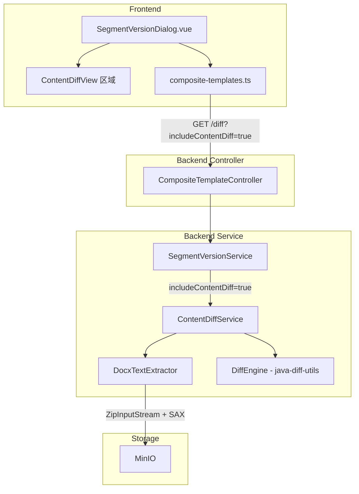

# Design Document: docx-content-diff

## Overview

本功能为现有的片段版本比较系统增加 .docx 文件的实际文本内容差异对比能力。当前系统仅能比较元数据字段（segmentType、configSnapshot、comment）和文件路径变更，无法展示文档的真实内容变化。

核心设计思路：
1. 后端新增 `DocxTextExtractor` 组件，使用 JDK 内置 `ZipInputStream` + `SAXParser` 从 .docx 文件提取纯文本（不引入 Apache POI）
2. 后端新增 `ContentDiffService` 组件，使用 `java-diff-utils` 库（v4.15）执行逐行文本差异比较
3. 扩展现有 `SegmentVersionDiffResult` DTO，增加 `contentDiffs`、`contentChanged`、`truncated` 字段
4. 扩展现有比较 API，增加 `includeContentDiff` 可选参数
5. 前端在 `SegmentVersionDialog.vue` 中新增统一 diff 视图，以红绿对比样式展示内容差异

设计决策说明：
- 选择 SAX Parser 而非 DOM Parser，因为 SAX 是流式解析，内存占用更低，适合处理大型 .docx 文件
- 选择 `java-diff-utils` 而非自行实现 diff 算法，因为该库成熟稳定，支持 Myers diff 算法
- 使用 `includeContentDiff` 可选参数而非默认返回内容 diff，避免对现有调用方产生性能影响
- 这是"模板文本 diff"（非所见即所得），UI 需明确标注此限制

## Architecture



数据流：
1. 用户在 `SegmentVersionDialog` 点击"比较"
2. 前端调用 `compareSegmentVersions()` 并附加 `includeContentDiff=true` 参数
3. Controller 将参数传递给 `SegmentVersionService.compareSegmentVersions()`
4. Service 调用 `ContentDiffService.computeContentDiff()` 获取内容差异
5. `ContentDiffService` 通过 `DocxTextExtractor` 从 MinIO 读取两个版本的 .docx 文件并提取纯文本
6. `ContentDiffService` 使用 `java-diff-utils` 计算逐行差异
7. 结果通过 `SegmentVersionDiffResult` 返回前端
8. 前端渲染统一 diff 视图

## Components and Interfaces

### 1. DocxTextExtractor（后端新增组件）

位置：`com.docgen.service.DocxTextExtractor`

职责：从 .docx 文件的 InputStream 中提取纯文本内容。

```java
@Component
public class DocxTextExtractor {

    /**
     * 从 .docx 文件流中提取纯文本。
     * 使用 ZipInputStream 解压，SAXParser 解析 word/document.xml 等 XML 文件，
     * 提取所有 <w:t> 文本节点，按 <w:p> 段落分行。
     *
     * @param docxStream .docx 文件的输入流
     * @param maxBytes   最大提取字节数（超过则截断），默认 512000 (500KB)
     * @return 提取的纯文本内容
     * @throws BusinessException 如果文件不是有效的 .docx 或解析失败
     */
    public ExtractedText extractText(InputStream docxStream, int maxBytes);

    /**
     * 从 MinIO 读取 .docx 文件并提取纯文本。
     *
     * @param filePath MinIO 中的文件路径
     * @return 提取的纯文本内容
     * @throws BusinessException 如果文件不存在或提取失败
     */
    public ExtractedText extractTextFromMinio(String filePath);
}

/**
 * 提取结果，包含文本内容和是否被截断的标志。
 */
public record ExtractedText(String text, boolean truncated) {}
```

SAX 解析策略：
- 使用 `SAXParserFactory.newInstance()` 创建 parser，**不启用命名空间感知**（默认行为），通过 `qName` 匹配标签
- 监听 `startElement(qName="w:p")` → 开始新段落缓冲
- 监听 `characters()` 在 `<w:t>` 元素内 → 追加到当前段落缓冲
- 监听 `endElement(qName="w:p")` → 如果段落缓冲非空，追加到结果并加换行符
- 监听 `startElement(qName="w:t")` / `endElement(qName="w:t")` → 控制文本收集开关
- 处理 `word/document.xml`、`word/header*.xml`、`word/footer*.xml`

与现有 `TemplateScanService.extractXmlFromDocx()` 的区别：
- `TemplateScanService` 提取原始 XML 字符串用于正则匹配占位符
- `DocxTextExtractor` 使用 SAX 解析提取可读纯文本，去除 XML 标签和格式信息

### 2. ContentDiffService（后端新增服务）

位置：`com.docgen.service.ContentDiffService`

职责：协调文本提取和差异计算。

```java
@Service
public class ContentDiffService {

    private static final int MAX_TEXT_BYTES = 512_000;  // 500KB
    private static final int MAX_DIFF_LINES = 2000;

    /**
     * 计算两个 .docx 文件的文本内容差异。
     *
     * @param oldFilePath 旧版本文件在 MinIO 中的路径
     * @param newFilePath 新版本文件在 MinIO 中的路径
     * @return 内容差异结果
     */
    public ContentDiffResult computeContentDiff(String oldFilePath, String newFilePath);
}

public record ContentDiffResult(
    List<ContentDiffLine> lines,
    boolean contentChanged,
    boolean truncated
) {}
```

### 3. DiffEngine（内部工具方法）

封装 `java-diff-utils` 的调用逻辑，作为 `ContentDiffService` 的内部方法或独立工具类。

```java
/**
 * 使用 java-diff-utils 计算两段文本的逐行差异。
 * 内部使用 DiffUtils.diff() 计算 Patch，然后遍历 AbstractDelta 生成 ContentDiffLine 列表。
 */
List<ContentDiffLine> computeLineDiff(String oldText, String newText);
```

java-diff-utils 使用方式：
1. 将文本按 `\n` 分割为 `List<String>`
2. 调用 `DiffUtils.diff(oldLines, newLines)` 获取 `Patch<String>`
3. 遍历 `Patch.getDeltas()`，每个 `AbstractDelta` 包含 `DeltaType`（CHANGE/DELETE/INSERT/EQUAL）
4. 将 delta 转换为 `ContentDiffLine` 列表，CHANGE 类型映射为 MODIFIED

### 4. SegmentVersionDiffResult DTO 扩展

在现有 DTO 中新增三个字段：

```java
// 新增字段
private List<ContentDiffLine> contentDiffs;  // 内容差异行列表
private boolean contentChanged;               // 内容是否有变更
private boolean truncated;                    // 差异结果是否被截断
```

### 5. ContentDiffLine DTO（新增）

位置：`com.docgen.dto.ContentDiffLine`

```java
public class ContentDiffLine {
    public enum DiffType { EQUAL, ADDED, REMOVED, MODIFIED }

    private DiffType type;
    private Integer oldLineNumber;  // null for ADDED
    private Integer newLineNumber;  // null for REMOVED
    private String oldText;         // null for ADDED
    private String newText;         // null for REMOVED
}
```

### 6. SegmentVersionService 变更

`compareSegmentVersions()` 方法签名增加 `includeContentDiff` 参数。行为逻辑：

- **始终**：提取两个版本的文本内容，比较是否相同，设置 `contentChanged` 标志（满足 R3.4 "always computed" 要求）
- **`includeContentDiff=true`**：额外执行逐行 diff 计算，填充 `contentDiffs` 列表
- **`includeContentDiff=false`**：`contentDiffs` 返回空列表，跳过 diff 计算以节省时间

性能说明：由于 R3.4 要求 `contentChanged` 始终计算，即使 `includeContentDiff=false` 也需要从 MinIO 读取并提取两个 .docx 文件的文本。文本提取使用 SAX 流式解析，内存开销可控。如果未来发现性能问题，可考虑在 SegmentVersion 表中缓存文本内容的 hash 值。

### 7. Controller 层变更

`CompositeTemplateController.compareSegmentVersions()` 增加 `includeContentDiff` 参数：

```java
@GetMapping("/{id}/segments/{segmentName}/versions/diff")
public ResponseEntity<SegmentVersionDiffResult> compareSegmentVersions(
        @PathVariable Long id,
        @PathVariable String segmentName,
        @RequestParam int versionA,
        @RequestParam int versionB,
        @RequestParam(defaultValue = "false") boolean includeContentDiff) {
    return ResponseEntity.ok(
            segmentVersionService.compareSegmentVersions(
                id, segmentName, versionA, versionB, includeContentDiff));
}
```

### 8. 前端 TypeScript 接口扩展

```typescript
// composite-templates.ts 新增
export interface ContentDiffLine {
  type: 'EQUAL' | 'ADDED' | 'REMOVED' | 'MODIFIED'
  oldLineNumber: number | null
  newLineNumber: number | null
  oldText: string | null
  newText: string | null
}

// SegmentVersionDiffResult 扩展
export interface SegmentVersionDiffResult {
  // ... 现有字段 ...
  contentDiffs: ContentDiffLine[]
  contentChanged: boolean
  truncated: boolean
}

// compareSegmentVersions 增加 includeContentDiff 参数
export function compareSegmentVersions(
  templateId: number,
  segmentName: string,
  versionA: number,
  versionB: number,
  includeContentDiff = false,
) {
  return request.get<any, SegmentVersionDiffResult>(
    `/composite-templates/${templateId}/segments/${encodeURIComponent(segmentName)}/versions/diff`,
    { params: { versionA, versionB, includeContentDiff } },
  )
}
```

### 9. 前端 ContentDiffView 区域

在 `SegmentVersionDialog.vue` 中新增内容差异展示区域（不抽取为独立组件，直接在现有组件中添加）：

功能：
- 统一 diff 视图，每行显示旧行号、新行号、变更类型前缀（+/-/空格）、文本内容
- REMOVED 行：红色背景 + "-" 前缀
- ADDED 行：绿色背景 + "+" 前缀
- MODIFIED 行：旧文本红色背景 + 新文本绿色背景，上下堆叠
- EQUAL 行：浅灰背景 + 空格前缀
- 连续 EQUAL 行超过 5 行时折叠，显示"... N 行无变更 ..."，点击展开
- 最大高度 500px，超出滚动
- 等宽字体
- 截断警告提示
- "模板文本对比（非所见即所得）" 提示标签

## Data Models

### ContentDiffLine（新增 DTO）

| 字段 | 类型 | 说明 |
|------|------|------|
| type | DiffType (enum) | EQUAL / ADDED / REMOVED / MODIFIED |
| oldLineNumber | Integer (nullable) | 旧版本行号，ADDED 时为 null |
| newLineNumber | Integer (nullable) | 新版本行号，REMOVED 时为 null |
| oldText | String (nullable) | 旧版本文本，ADDED 时为 null |
| newText | String (nullable) | 新版本文本，REMOVED 时为 null |

### ExtractedText（新增 Record）

| 字段 | 类型 | 说明 |
|------|------|------|
| text | String | 提取的纯文本内容 |
| truncated | boolean | 是否因超过 500KB 限制而被截断 |

### ContentDiffResult（新增 Record）

| 字段 | 类型 | 说明 |
|------|------|------|
| lines | List\<ContentDiffLine\> | 差异行列表 |
| contentChanged | boolean | 内容是否有变更 |
| truncated | boolean | 差异结果是否被截断（文本截断或行数截断） |

### SegmentVersionDiffResult 扩展字段

| 新增字段 | 类型 | 说明 |
|----------|------|------|
| contentDiffs | List\<ContentDiffLine\> | 内容差异行列表，默认空列表 |
| contentChanged | boolean | 内容是否有变更，默认 false |
| truncated | boolean | 差异结果是否被截断，默认 false |

### ErrorCode 新增常量

| 常量 | 值 | 说明 |
|------|-----|------|
| CONTENT_DIFF_EXTRACTION_FAILED | "CONTENT_DIFF_EXTRACTION_FAILED" | .docx 文本提取失败 |

### Maven 依赖新增

```xml
<dependency>
    <groupId>io.github.java-diff-utils</groupId>
    <artifactId>java-diff-utils</artifactId>
    <version>4.15</version>
</dependency>
```

### i18n 新增 Key

命名空间：`workspace.segment.contentDiff`

| Key | zh-CN | zh-TW | en-US |
|-----|-------|-------|-------|
| title | 内容对比 | 內容對比 | Content Diff |
| noChanges | 内容无差异 | 內容無差異 | No content changes |
| truncatedWarning | 差异结果已截断，仅显示前 {max} 行 | 差異結果已截斷，僅顯示前 {max} 行 | Diff result truncated, showing first {max} lines |
| textDiffNote | 模板文本对比（非所见即所得） | 範本文字對比（非所見即所得） | Template text diff (not WYSIWYG) |
| collapsedLines | ... {count} 行无变更 ... | ... {count} 行無變更 ... | ... {count} unchanged lines ... |
| expandLines | 展开 | 展開 | Expand |
| lineOld | 旧 | 舊 | Old |
| lineNew | 新 | 新 | New |


## Correctness Properties

*A property is a characteristic or behavior that should hold true across all valid executions of a system — essentially, a formal statement about what the system should do. Properties serve as the bridge between human-readable specifications and machine-verifiable correctness guarantees.*

### Property 1: SAX 文本提取保留所有段落文本内容

*For any* valid OpenXML content containing `<w:p>` paragraphs with `<w:t>` text runs (including runs split across multiple `<w:r>` elements), the `DocxTextExtractor` SHALL produce output that contains all original `<w:t>` text content, with text runs within the same paragraph concatenated into a single line, paragraphs separated by newline characters, and empty paragraphs (containing no `<w:t>` content) stripped from the output.

**Validates: Requirements 1.2, 1.3**

### Property 2: Diff 往返重建

*For any* two non-null text strings (oldText, newText), applying the diff result produced by the `DiffEngine` to oldText SHALL reconstruct newText. Specifically: collecting all `newText` fields from EQUAL, ADDED, and MODIFIED entries (in order, skipping REMOVED entries) SHALL produce a sequence equal to splitting newText by newlines; and collecting all `oldText` fields from EQUAL, REMOVED, and MODIFIED entries (in order, skipping ADDED entries) SHALL produce a sequence equal to splitting oldText by newlines.

**Validates: Requirements 2.1, 2.2, 2.4, 2.6**

### Property 3: 自身 Diff 恒等性

*For any* non-empty text string, computing the diff of the text against itself SHALL produce a result where every `ContentDiffLine` entry has type `EQUAL`, and the total number of entries equals the number of lines in the original text.

**Validates: Requirements 2.3**

### Property 4: contentChanged 标志一致性

*For any* two extracted text strings, the `contentChanged` flag in the diff result SHALL be `true` if and only if the two text strings are not equal.

**Validates: Requirements 3.4**

### Property 5: 连续 EQUAL 行折叠逻辑

*For any* diff result containing a sequence of more than 5 consecutive EQUAL lines, the frontend collapsing function SHALL replace that sequence with a collapsed indicator showing the correct count, and expanding the indicator SHALL restore the original EQUAL lines.

**Validates: Requirements 5.4**

### Property 6: 文本提取截断边界

*For any* .docx file whose extracted text content exceeds 500KB, the `DocxTextExtractor` SHALL return a result where `truncated` is `true` and the text length does not exceed 500KB plus the length of the truncation indicator string.

**Validates: Requirements 6.1**

### Property 7: Diff 行数截断边界

*For any* two text strings whose diff produces more than 2000 `ContentDiffLine` entries, the `ContentDiffService` SHALL return a result where `truncated` is `true` and the number of `contentDiffs` entries does not exceed 2000.

**Validates: Requirements 6.2**

## Error Handling

### 后端错误处理

| 场景 | 处理方式 | ErrorCode |
|------|----------|-----------|
| MinIO 文件不存在 | 抛出 BusinessException (404) | SEGMENT_FILE_NOT_FOUND |
| 文件不是有效 .docx (ZIP) | 抛出 BusinessException (500) | CONTENT_DIFF_EXTRACTION_FAILED |
| .docx 中无 word/document.xml | 抛出 BusinessException (500) | CONTENT_DIFF_EXTRACTION_FAILED |
| SAX 解析 XML 失败 | 抛出 BusinessException (500) | CONTENT_DIFF_EXTRACTION_FAILED |
| 内容 diff 计算中任何异常 | 记录 warn 日志，返回空 contentDiffs + contentChanged=false | — (优雅降级) |
| 文本超过 500KB | 截断文本，设置 truncated=true | — |
| Diff 行数超过 2000 | 截断结果，设置 truncated=true | — |

关键设计决策：内容 diff 失败不应导致整个版本比较 API 失败。`SegmentVersionService.compareSegmentVersions()` 在调用 `ContentDiffService` 时使用 try-catch，捕获所有异常后记录日志并返回降级结果（空 contentDiffs、contentChanged=false）。这确保了现有的元数据比较功能不受影响。

### 前端错误处理

| 场景 | 处理方式 |
|------|----------|
| API 返回 contentDiffs 为空 | 不显示内容 diff 区域，仅显示元数据 diff |
| API 返回 truncated=true | 在 diff 视图顶部显示截断警告 |
| API 调用失败 | 显示 ElMessage.error，不影响已有 UI |

## Testing Strategy

### 后端测试

**单元测试（JUnit 5）：**
- `DocxTextExtractorTest`：使用预制的 .docx 测试文件验证文本提取
  - 正常 .docx 文件提取
  - 包含多段落、多 run 的复杂文档
  - 空文档处理
  - 非 .docx 文件异常
  - 超大文件截断
- `ContentDiffServiceTest`：使用 mock 验证服务协调逻辑
  - 正常 diff 计算
  - MinIO 读取失败的优雅降级
  - 行数截断
- `DiffEngine` 方法测试：
  - 相同文本 → 全 EQUAL
  - 空文本对比
  - 基本增删改场景

**属性测试（jqwik）：**

PBT 适用于本功能，因为：
- 文本提取和 diff 计算是纯函数（或可 mock 为纯函数）
- 输入空间大（任意文本内容、任意 XML 结构）
- 存在明确的通用属性（往返重建、恒等性、截断边界）

PBT 库：`net.jqwik:jqwik`（项目已有依赖）

每个属性测试配置最少 100 次迭代。

每个属性测试需标注对应的设计属性：
- Tag 格式：`Feature: docx-content-diff, Property {number}: {property_text}`

属性测试实现：
- Property 1 → 生成随机 OpenXML 片段，验证提取结果保留所有文本内容
- Property 2 → 生成随机文本对，验证 diff 往返重建
- Property 3 → 生成随机文本，验证自身 diff 全为 EQUAL
- Property 4 → 生成随机文本对，验证 contentChanged 标志一致性
- Property 5 → 生成随机 diff 结果，验证折叠逻辑（前端 Vitest + fast-check）
- Property 6 → 生成超大文本，验证截断行为
- Property 7 → 生成产生大量 diff 行的文本对，验证行数截断

### 前端测试

**单元测试（Vitest）：**
- `SegmentVersionDialog` 组件测试：
  - 比较时传递 `includeContentDiff=true` 参数
  - contentChanged=true 时渲染 diff 视图
  - contentChanged=false 时显示"无差异"提示
  - truncated=true 时显示截断警告
  - EQUAL 行折叠和展开

**属性测试（fast-check）：**
- Property 5 → 连续 EQUAL 行折叠逻辑的属性测试

### 集成测试

- 端到端测试：上传两个不同的 .docx 文件 → 发布两个版本 → 调用比较 API → 验证返回的 contentDiffs 非空且结构正确
