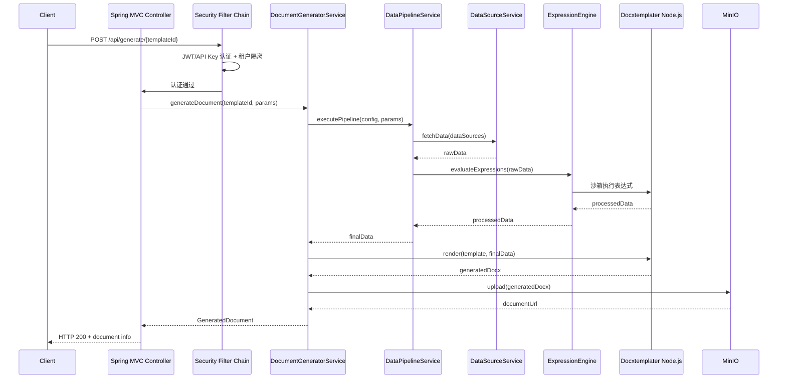
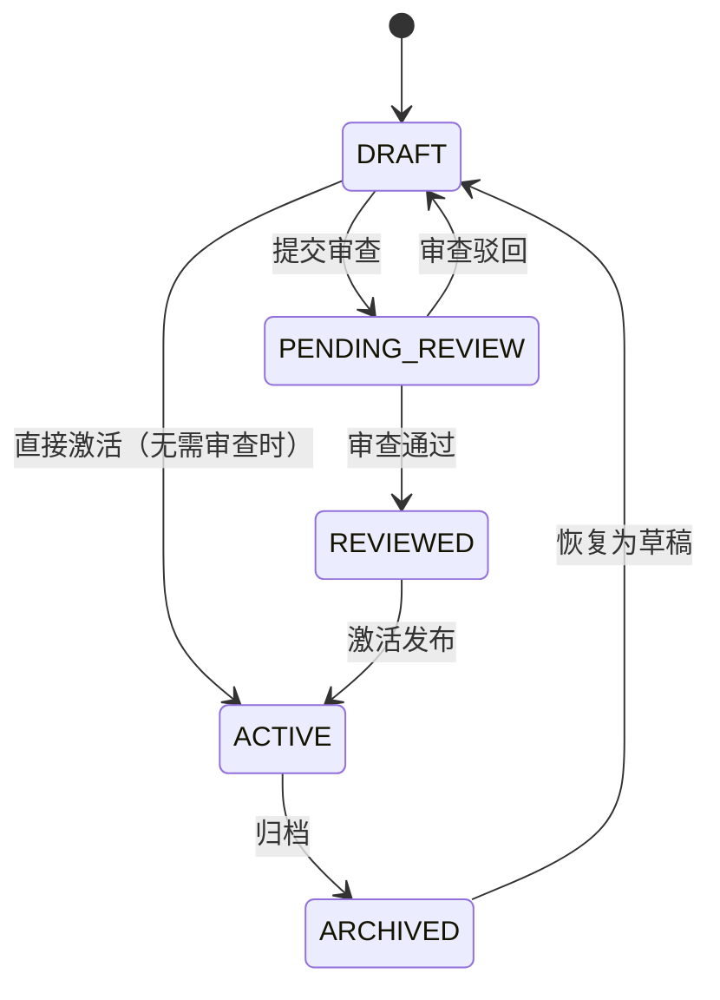
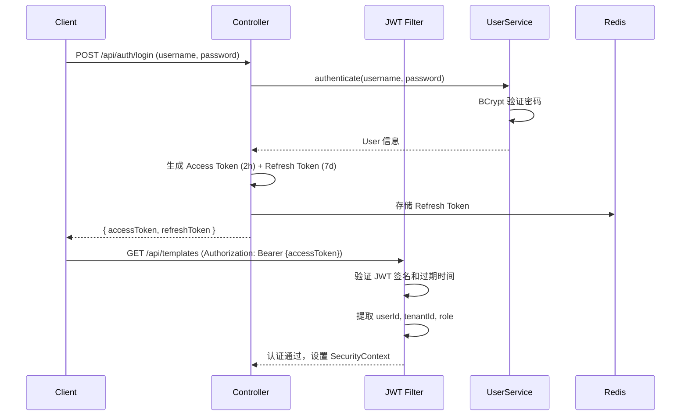
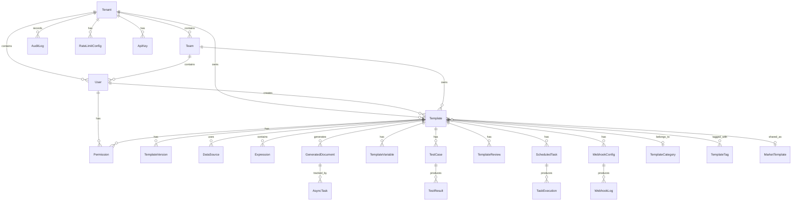

# 设计文档 - 低代码文档生成系统

## Overview

低代码文档生成系统是一个基于 Spring Boot 的单体应用，旨在为技术开发者和业务人员提供可视化的文档模板设计能力，并自动生成可供外部调用的 RESTful API。系统采用前后端分离架构，前端使用 Vue 3 + TypeScript，后端使用 Java 17 + Spring Boot 3.2。

### 核心目标

- 提供所见即所得的模板设计体验（基于 OnlyOffice Document Editor）
- 支持多种数据源集成（HTTP API、数据库、内部系统）
- 自动生成文档 API，无需编写代码
- 支持复杂的数据处理逻辑（表达式计算、条件渲染、循环遍历）
- 生成 Word 和 PDF 格式的文档
- 提供多租户隔离、团队协作和权限管理能力
- 支持模板审查工作流、版本管理和模板市场
- 提供完善的审计日志、限流配额和运维仪表板

### 技术选型

**后端技术栈**:
- Java 17
- Spring Boot 3.2
- Spring Security 6（认证授权）
- PostgreSQL 16.5（主数据库）
- Redis 7.2（缓存、限流计数器和任务队列）
- MinIO（对象存储）
- Docxtemplater（文档生成引擎，通过 Node.js 服务调用）
- LibreOffice Headless（Word 转 PDF，集成到 Node.js 服务容器中）
- Spring Batch（批量任务处理）
- HikariCP（数据库连接池）
- SpringDoc OpenAPI（API 文档自动生成）
- Spring Boot Starter Mail（邮件发送，用于密码重置等场景）

**前端技术栈**:
- Vue 3 + TypeScript
- Element Plus（UI 组件库）
- OnlyOffice Document Editor（在线文档编辑器）
- Monaco Editor（代码编辑器）
- ECharts（图表和仪表板可视化）

**表达式引擎**:
- Docxtemplater 内置 JavaScript 表达式（在安全沙箱中执行）
- Formula.js（Excel 公式库）


## Architecture

### 系统架构图

```mermaid
graph TB
    subgraph "前端层 Frontend Layer"
        A[Vue 3 应用]
        A1[OnlyOffice Editor<br/>模板设计]
        A2[Monaco Editor<br/>代码编辑]
        A3[模板管理界面]
        A4[数据源配置界面]
        A5[运维仪表板]
        A --> A1
        A --> A2
        A --> A3
        A --> A4
        A --> A5
    end
    
    subgraph "Spring Boot 单体应用"
        subgraph "请求入口层 Request Entry"
            B1[Spring Security Filter Chain<br/>JWT 认证 / API Key 认证<br/>多租户数据隔离过滤器]
            B2[Spring MVC Controllers<br/>REST API 端点]
            B3[Rate Limit Filter<br/>限流过滤器]
            B1 --> B3
            B3 --> B2
        end
        
        subgraph "应用服务层 Application Layer"
            C[模板管理服务<br/>TemplateService]
            D[文档生成服务<br/>DocumentGeneratorService]
            E[数据源服务<br/>DataSourceService]
            F[表达式引擎<br/>ExpressionEngine]
            G[权限管理服务<br/>PermissionService]
            H1[用户管理服务<br/>UserService]
            H2[租户管理服务<br/>TenantService]
            H3[审计日志服务<br/>AuditLogService]
            H4[限流服务<br/>RateLimitService]
            H5[仪表板服务<br/>DashboardService]
        end
        
        subgraph "模板生命周期层 Template Lifecycle"
            I1[模板状态机<br/>TemplateStateMachineService]
            I2[模板审查服务<br/>TemplateReviewService]
            I3[版本对比服务<br/>VersionDiffService]
            I4[覆盖率检查服务<br/>CoverageCheckService]
            I5[模板测试服务<br/>TemplateTestService]
            I6[模板变量管理<br/>TemplateVariableService]
            I7[模板导入导出<br/>TemplateImportExportService]
            I8[分类标签服务<br/>CategoryService / TagService]
            I9[模板市场服务<br/>TemplateMarketService]
        end
        
        subgraph "数据处理层 Data Processing"
            J1[数据管道服务<br/>DataPipelineService]
            J2[响应转换器<br/>ResponseTransformerService]
            J3[Webhook 服务<br/>WebhookService]
            J4[定时任务服务<br/>ScheduledTaskService]
            J5[文档合并服务<br/>DocumentMergeService]
            J6[文档水印服务<br/>WatermarkService]
        end
        
        subgraph "批量处理 Batch Processing"
            K[Spring Batch<br/>批量文档生成]
        end
        
        B2 --> C
        B2 --> D
        B2 --> E
        B2 --> G
        B2 --> H1
        B2 --> H2
        B2 --> H3
        B2 --> H5
        B2 --> I1
        B2 --> I2
        B2 --> I8
        B2 --> I9
        B2 --> J3
        B2 --> J4
        B2 --> J5
    end
    
    subgraph "外部服务 External Services"
        L1[Docxtemplater Service<br/>Node.js + 安全沙箱<br/>+ LibreOffice]
        L2[OnlyOffice Document Server]
    end
    
    subgraph "数据存储层 Data Layer"
        M1[(PostgreSQL 16.5<br/>主数据库)]
        M2[(Redis 7.2<br/>缓存/限流/队列)]
        M3[MinIO<br/>对象存储]
    end
    
    A -->|HTTPS| B1
    
    C --> M1
    C --> M3
    C --> I1
    C --> I6
    C --> I4
    
    D --> E
    D --> F
    D --> L1
    D --> J1
    D --> J6
    D --> K
    D --> M2
    
    E --> M1
    E --> M2
    E --> J2
    E -->|HTTP| External[外部 API / 内部系统]
    
    F --> L1
    
    K --> D
    K --> M2
    
    G --> M1
    H1 --> M1
    H2 --> M1
    H3 --> M1
    H4 --> M2
    H5 --> M1
    H5 --> M2
    
    L1 --> M3
    A1 --> L2
```



### 架构模式

系统采用分层架构模式，从上到下分为：

1. **前端层（Frontend Layer）**: 基于 Vue 3 的单页应用，提供用户交互界面
2. **请求入口层（Request Entry）**: Spring Security Filter Chain 处理认证（JWT / API Key）、授权、多租户隔离和限流；Spring MVC Controller 作为 REST API 统一入口
3. **应用服务层（Application Layer）**: 核心业务逻辑，包括用户管理、租户管理、模板管理、文档生成、数据源集成、审计日志、限流配额、仪表板等
4. **模板生命周期层（Template Lifecycle）**: 模板状态机、审查工作流、版本对比、覆盖率检查、测试套件、变量管理、导入导出、分类标签、模板市场
5. **数据处理层（Data Processing）**: 数据管道、响应转换、Webhook 通知、定时任务、文档合并、文档水印
6. **外部服务（External Services）**: Docxtemplater Node.js 服务（含安全沙箱和 LibreOffice）、OnlyOffice Document Server
7. **数据存储层（Data Layer）**: PostgreSQL（持久化）、Redis（缓存/限流/队列）、MinIO（对象存储）

### 关键设计决策

**决策 1: 单体应用 vs 微服务**
- 选择：单体应用（Spring Boot）
- 理由：系统规模适中，单体应用更易于开发、部署和维护；避免微服务带来的分布式复杂性

**决策 2: Docxtemplater 集成方式**
- 选择：独立的 Node.js 服务
- 理由：Docxtemplater 是 Node.js 库，通过独立服务调用比 GraalVM 集成更稳定可靠；同时将 LibreOffice 集成到该容器中，减少服务数量

**决策 3: 文档编辑器选择**
- 选择：OnlyOffice Document Editor
- 理由：开源、功能完整、类似 Microsoft Office 的用户体验、支持协同编辑

**决策 4: 对象存储选择**
- 选择：MinIO
- 理由：开源、S3 兼容、易于部署、适合私有化部署场景

**决策 5: 安全沙箱实现**
- 选择：在 Node.js 服务中使用 isolated-vm 库
- 理由：isolated-vm 基于 V8 Isolate，提供真正的内存和 CPU 隔离，比 vm2 更安全

**决策 6: 认证方案**
- 选择：JWT（用户认证）+ API Key（API 调用认证）
- 理由：JWT 适合前端用户会话管理，API Key 适合外部系统集成调用


## Components and Interfaces

### 核心组件

#### 1. 模板管理服务（Template Service）

负责模板的 CRUD 操作、版本管理和权限控制。

```java
public interface TemplateService {
    TemplateDTO createTemplate(CreateTemplateRequest request);
    TemplateDTO updateTemplate(Long templateId, UpdateTemplateRequest request);
    void deleteTemplate(Long templateId);
    Page<TemplateDTO> listTemplates(TemplateQueryRequest request, Pageable pageable);
    TemplateDTO getTemplate(Long templateId);
    List<TemplateVersionDTO> getTemplateVersions(Long templateId);
    TemplateDTO rollbackToVersion(Long templateId, Long versionId);
    PreviewResult previewTemplate(Long templateId, Map<String, Object> testData);
    TemplateDTO cloneTemplate(Long templateId);
}
```

#### 2. 文档生成服务（Document Generator Service）

核心服务，负责协调整个文档生成流程。

```java
public interface DocumentGeneratorService {
    GeneratedDocument generateDocument(Long templateId, Map<String, Object> parameters);
    AsyncTaskDTO generateDocumentAsync(Long templateId, Map<String, Object> parameters);
    AsyncTaskDTO generateDocumentsBatch(Long templateId, List<Map<String, Object>> dataList);
    AsyncTaskDTO getTaskStatus(String taskId);
    byte[] downloadDocument(String documentId);
}
```

**文档生成流程**:


#### 3. 数据源服务（Data Source Service）

负责从各种数据源获取数据。

```java
public interface DataSourceService {
    Map<String, Object> fetchData(DataSourceConfig config, Map<String, Object> parameters);
    TestResult testConnection(DataSourceConfig config);
    Map<String, Object> aggregateData(List<DataSourceConfig> configs, Map<String, Object> parameters);
    void clearCache(Long dataSourceId);
}
```

**支持的数据源类型**:
- **HTTP API**: 通过 RestTemplate/WebClient 调用外部 REST API
- **数据库**: 通过 JDBC 执行 SQL 查询（PostgreSQL、MySQL、SQL Server、Oracle）
- **内部系统**: 通过服务名称调用内部接口

#### 4. 表达式引擎（Expression Engine）

负责计算表达式和数据转换。

```java
public interface ExpressionEngine {
    Object evaluate(String expression, ExpressionType type, Map<String, Object> context);
    Map<String, Object> evaluateAll(List<ExpressionConfig> expressions, Map<String, Object> context);
    ValidationResult validateExpression(String expression, ExpressionType type);
}
```

**支持的表达式类型**:
- **JavaScript**: 通过 Docxtemplater Node.js 服务中的安全沙箱执行
- **Excel 公式**: 通过 Formula.js 库执行

#### 5. Docxtemplater 服务（Node.js）

独立的 Node.js 服务，负责文档渲染、表达式沙箱执行和 PDF 转换。

**REST API**:
```
POST /render        - 渲染文档
POST /evaluate      - 沙箱执行表达式
POST /convert-pdf   - Word 转 PDF（调用 LibreOffice）
GET  /health        - 健康检查
```

**集成的模块**:
- `docxtemplater-image-module`: 图片插入
- `docxtemplater-chart-module`: 图表生成
- `docxtemplater-table-module`: 动态表格
- `isolated-vm`: 安全沙箱（表达式执行）
- LibreOffice Headless: PDF 转换

#### 6. PDF 转换服务（LibreOffice Service）

集成在 Docxtemplater Node.js 服务容器中，使用 LibreOffice Headless 模式。

```java
public interface PdfConverterService {
    byte[] convertToPdf(byte[] docxContent);
    List<byte[]> convertBatch(List<byte[]> docxContents);
}
```

#### 7. 批量处理器（Batch Processor）

基于 Spring Batch 实现的批量文档生成处理器。

- **ItemReader**: 从请求中读取数据集
- **ItemProcessor**: 调用 DocumentGeneratorService 生成文档
- **ItemWriter**: 将生成的文档打包为 ZIP

#### 8. 权限管理服务（Permission Service）

```java
public interface PermissionService {
    boolean hasPermission(Long userId, Long templateId, PermissionType type);
    void grantPermission(Long templateId, Long userId, PermissionType type);
    void revokePermission(Long templateId, Long userId, PermissionType type);
    List<PermissionDTO> getUserPermissions(Long userId);
}
```

**权限类型**: `VIEW`、`EDIT`、`DELETE`、`CALL_API`


### 新增组件（需求 30-52）

#### 加密服务（需求 50）

负责数据源敏感信息（API Key、OAuth Token、数据库密码等）的加密存储和脱敏显示。使用 AES-256-GCM 算法，密钥从环境变量 `ENCRYPTION_KEY` 读取，支持密钥轮换。

```java
public interface EncryptionService {
    String encrypt(String plainText);
    String decrypt(String cipherText);
    void rotateKey();
    String mask(String sensitiveValue); // 脱敏显示
}
```

#### 9. 模板导入导出服务（需求 30）

```java
public interface TemplateImportExportService {
    TemplateDTO importFromDocx(MultipartFile file);
    byte[] exportToDocx(Long templateId);
    byte[] exportConfig(Long templateId); // JSON 配置导出
    TemplateDTO importConfig(MultipartFile configFile);
}
```

#### 10. 分类标签服务（需求 31）

```java
public interface CategoryService {
    CategoryDTO createCategory(CreateCategoryRequest request);
    List<CategoryDTO> getCategoryTree();
    void deleteCategory(Long categoryId);
}

public interface TagService {
    TagDTO createTag(String name);
    List<TagDTO> listTags();
    void addTagToTemplate(Long templateId, Long tagId);
    void removeTagFromTemplate(Long templateId, Long tagId);
}
```

#### 11. 模板市场服务（需求 32）

```java
public interface TemplateMarketService {
    Page<MarketTemplateDTO> searchMarketTemplates(String keyword, Pageable pageable);
    TemplateDTO copyFromMarket(Long marketTemplateId);
    void shareToMarket(Long templateId, ShareScope scope);
}
```

`ShareScope` 枚举: `TENANT_INTERNAL`（租户内部）、`GLOBAL`（全局公开）

#### 12. 数据管道服务（需求 34）

```java
public interface DataPipelineService {
    Map<String, Object> executePipeline(PipelineConfig config, Map<String, Object> params);
    PipelineValidationResult validatePipeline(PipelineConfig config);
}
```

管道包含四个阶段：获取（Fetch）→ 转换（Transform）→ 计算（Compute）→ 验证（Validate）。支持数据源之间的依赖关系配置，无依赖关系的数据源并行执行。

#### 13. Webhook 服务（需求 35）

```java
public interface WebhookService {
    void sendNotification(WebhookConfig config, WebhookPayload payload);
    List<WebhookLogDTO> getWebhookLogs(Long webhookConfigId);
}
```

Webhook 请求包含 HMAC-SHA256 签名头，失败时按指数退避策略重试（最多 3 次）。

#### 14. 限流服务（需求 36）

```java
public interface RateLimitService {
    boolean isAllowed(String apiKey, String endpoint);
    ApiUsageDTO getUsageStats(String apiKey, DateRange range);
    TenantQuotaDTO getTenantQuota(Long tenantId);
}
```

使用 Redis 存储限流计数器（滑动窗口算法），支持每秒/每分钟/每小时频率限制和月度配额。

#### 15. 审计日志服务（需求 37）

```java
public interface AuditLogService {
    void log(AuditEvent event);
    Page<AuditLogDTO> queryLogs(AuditLogQuery query, Pageable pageable);
    byte[] exportLogs(AuditLogQuery query, ExportFormat format); // CSV 或 JSON
}
```

审计日志存储在独立表中，业务操作不可修改或删除审计记录。支持配置保留期限（默认 365 天）。

#### 16. 模板测试服务（需求 38）

```java
public interface TemplateTestService {
    TestResultDTO runTestCase(Long testCaseId);
    TestReportDTO runAllTests(Long templateId);
    TestCaseDTO createTestCase(CreateTestCaseRequest request);
    List<TestCaseDTO> listTestCases(Long templateId);
    void deleteTestCase(Long testCaseId);
}
```

支持三种比对方式：变量值比对、文本内容比对、文件快照比对。

#### 17. 文档水印服务（需求 39）

```java
public interface WatermarkService {
    byte[] applyTextWatermark(byte[] document, TextWatermarkConfig config);
    byte[] applyImageWatermark(byte[] document, ImageWatermarkConfig config);
}
```

`TextWatermarkConfig`: 水印文本、字体大小、颜色、透明度、旋转角度。支持动态水印内容（模板变量）。

#### 18. 文档合并服务（需求 40）

```java
public interface DocumentMergeService {
    GeneratedDocument mergeDocuments(List<Long> documentIds, MergeOptions options);
}
```

`MergeOptions`: 是否插入分页符、是否生成目录、输出格式（DOCX/PDF）。

#### 19. 定时任务服务（需求 41）

```java
public interface ScheduledTaskService {
    ScheduledTaskDTO createTask(CreateScheduledTaskRequest request);
    ScheduledTaskDTO updateTask(Long taskId, UpdateScheduledTaskRequest request);
    void enableTask(Long taskId);
    void disableTask(Long taskId);
    void deleteTask(Long taskId);
    Page<TaskExecutionDTO> getExecutionHistory(Long taskId, Pageable pageable);
}
```

使用 Cron 表达式配置调度规则，支持最大重试次数配置。

#### 20. 响应转换器服务（需求 42）

```java
public interface ResponseTransformerService {
    Map<String, Object> transform(Object rawResponse, List<TransformRule> rules);
}
```

支持 JSONPath 提取、XPath 提取、数据扁平化、数组分组和排序。

#### 21. 模板变量管理服务（需求 43）

```java
public interface TemplateVariableService {
    List<VariableDTO> scanVariables(Long templateId);
    void bindVariable(Long variableId, VariableBinding binding);
    CoverageReport getCoverageReport(Long templateId);
}
```

自动扫描模板中的 Docxtemplater 变量，标注未绑定变量。

#### 22. 仪表板服务（需求 44）

```java
public interface DashboardService {
    SystemOverviewDTO getSystemOverview();
    List<ApiCallMetric> getApiCallMetrics(DateRange range);
    List<DataSourceHealthDTO> getDataSourceHealth();
    SystemResourceDTO getSystemResources();
}
```

#### 23. 模板审查服务（需求 45）

```java
public interface TemplateReviewService {
    ReviewDTO submitForReview(Long templateId, List<Long> reviewerIds);
    ReviewDTO approveReview(Long reviewId, String comment);
    ReviewDTO conditionalApprove(Long reviewId, String comment, List<String> suggestions);
    ReviewDTO rejectReview(Long reviewId, String reason);
    Page<ReviewDTO> listReviews(ReviewQuery query, Pageable pageable);
}
```

支持多级审查流程（初审 → 终审）和"条件通过"状态。

#### 24. 版本对比服务（需求 46）

```java
public interface VersionDiffService {
    VersionDiffResult compareVersions(Long templateId, int versionA, int versionB);
}
```

`VersionDiffResult` 包含：文本内容差异、模板变量差异、数据源配置差异、表达式配置差异、变更数量统计。

#### 25. 覆盖率检查服务（需求 47）

```java
public interface CoverageCheckService {
    CoverageReport checkCoverage(Long templateId);
    CoverageReport checkReverseCoverage(Long templateId); // 反向覆盖率：未使用的数据源字段
}
```

#### 26. 用户管理服务（需求 48）

```java
public interface UserService {
    UserDTO register(RegisterRequest request);
    TokenPair login(LoginRequest request);
    TokenPair refreshToken(String refreshToken);
    void resetPassword(String email);
    UserDTO updateProfile(Long userId, UpdateProfileRequest request);
}
```

`TokenPair`: Access Token（2 小时）+ Refresh Token（7 天）。密码使用 BCrypt 哈希存储，连续 5 次登录失败锁定 30 分钟。

#### 27. 租户管理服务（需求 49）

```java
public interface TenantService {
    TenantDTO createTenant(CreateTenantRequest request);
    TenantDTO updateTenant(Long tenantId, UpdateTenantRequest request);
    void enableTenant(Long tenantId);
    void disableTenant(Long tenantId);
    TenantUsageDTO getTenantUsage(Long tenantId);
    Page<TenantDTO> listTenants(TenantQuery query, Pageable pageable);
}
```

#### 28. 安全沙箱服务（需求 51）

在 Docxtemplater Node.js 服务中实现，使用 `isolated-vm` 库。

```javascript
// Node.js 安全沙箱配置
const ivm = require('isolated-vm');

class ExpressionSandbox {
    constructor(options = {}) {
        this.timeout = options.timeout || 5000;       // 默认 5 秒
        this.memoryLimit = options.memoryLimit || 64;  // 默认 64MB
    }
    
    async evaluate(expression, context) {
        const isolate = new ivm.Isolate({ memoryLimit: this.memoryLimit });
        const vmContext = await isolate.createContext();
        // 注入白名单安全函数和数据上下文
        await vmContext.global.set('data', new ivm.ExternalCopy(context).copyInto());
        const script = await isolate.compileScript(expression);
        const result = await script.run(vmContext, { timeout: this.timeout });
        isolate.dispose();
        return result;
    }
}
```

禁止访问：`fs`、`path`、`http`、`https`、`net`、`child_process`、`process`、`eval`、`Function` 构造函数。

#### 29. 模板状态机服务（需求 52）

```java
public interface TemplateStateMachineService {
    Template transition(Long templateId, TemplateState targetState);
    List<TemplateState> getAvailableTransitions(Long templateId);
}
```

**状态转换图**:



### 前端组件

#### 前端项目结构

```
frontend/
├── src/
│   ├── api/          # API 调用层
│   ├── assets/       # 静态资源
│   ├── components/   # 通用组件
│   ├── composables/  # 组合式函数
│   ├── i18n/         # 国际化（en-US, zh-CN, zh-TW）
│   ├── layouts/      # 布局组件
│   ├── router/       # 路由配置
│   ├── stores/       # Pinia 状态管理
│   ├── types/        # TypeScript 类型定义
│   └── views/        # 页面视图
│       ├── auth/         # 登录/注册
│       ├── dashboard/    # 仪表板
│       ├── templates/    # 模板管理
│       ├── data-sources/ # 数据源配置
│       ├── market/       # 模板市场
│       ├── admin/        # 系统管理（租户、用户、权限）
│       └── audit/        # 审计日志
├── public/
├── index.html
├── vite.config.ts
├── tsconfig.json
└── package.json
```

#### 1. OnlyOffice 编辑器集成

通过自定义插件支持插入 Docxtemplater 模板变量：
- 变量插入插件：快速插入 `{variable}`
- 循环插入插件：插入 `{#items}...{/items}`
- 条件插入插件：插入 `{#if condition}...{/if}`

#### 2. Monaco 编辑器集成

用于高级用户直接编辑模板语法，提供 Docxtemplater 语法高亮和自动补全。

### REST API 端点设计

#### 认证模块

| 方法 | 路径 | 说明 |
|------|------|------|
| POST | `/api/auth/register` | 用户注册 |
| POST | `/api/auth/login` | 用户登录 |
| POST | `/api/auth/refresh` | 刷新令牌 |
| POST | `/api/auth/reset-password` | 密码重置 |

#### 租户模块

| 方法 | 路径 | 说明 |
|------|------|------|
| POST | `/api/tenants` | 创建租户 |
| GET | `/api/tenants` | 查询租户列表 |
| GET | `/api/tenants/{id}` | 获取租户详情 |
| PUT | `/api/tenants/{id}` | 更新租户信息 |
| PUT | `/api/tenants/{id}/enable` | 启用租户 |
| PUT | `/api/tenants/{id}/disable` | 禁用租户 |
| GET | `/api/tenants/{id}/usage` | 查询租户资源使用情况 |

#### 用户模块

| 方法 | 路径 | 说明 |
|------|------|------|
| GET | `/api/users` | 查询用户列表 |
| GET | `/api/users/{id}` | 获取用户详情 |
| PUT | `/api/users/{id}` | 更新用户资料 |
| DELETE | `/api/users/{id}` | 删除用户 |

#### 模板模块

| 方法 | 路径 | 说明 |
|------|------|------|
| POST | `/api/templates` | 创建模板 |
| GET | `/api/templates` | 查询模板列表 |
| GET | `/api/templates/{id}` | 获取模板详情 |
| PUT | `/api/templates/{id}` | 更新模板 |
| DELETE | `/api/templates/{id}` | 删除模板 |
| POST | `/api/templates/{id}/clone` | 复制模板 |
| POST | `/api/templates/{id}/activate` | 激活模板 |
| POST | `/api/templates/{id}/archive` | 归档模板 |
| POST | `/api/templates/{id}/preview` | 预览模板（使用测试数据） |

#### 模板版本

| 方法 | 路径 | 说明 |
|------|------|------|
| GET | `/api/templates/{id}/versions` | 获取版本历史 |
| POST | `/api/templates/{id}/rollback/{versionId}` | 回滚到指定版本 |
| GET | `/api/templates/{id}/versions/diff` | 版本对比（query: versionA, versionB） |

#### 模板审查

| 方法 | 路径 | 说明 |
|------|------|------|
| POST | `/api/templates/{id}/reviews` | 提交审查请求 |
| GET | `/api/templates/{id}/reviews` | 查询审查记录 |
| PUT | `/api/reviews/{id}/approve` | 审查通过 |
| PUT | `/api/reviews/{id}/conditional-approve` | 条件通过 |
| PUT | `/api/reviews/{id}/reject` | 审查驳回 |

#### 模板测试

| 方法 | 路径 | 说明 |
|------|------|------|
| POST | `/api/templates/{id}/test-cases` | 创建测试用例 |
| GET | `/api/templates/{id}/test-cases` | 查询测试用例列表 |
| PUT | `/api/test-cases/{id}` | 更新测试用例 |
| DELETE | `/api/test-cases/{id}` | 删除测试用例 |
| POST | `/api/test-cases/{id}/run` | 运行单个测试用例 |
| POST | `/api/templates/{id}/test-cases/run-all` | 运行所有测试用例 |

#### 模板变量

| 方法 | 路径 | 说明 |
|------|------|------|
| GET | `/api/templates/{id}/variables` | 获取模板变量列表 |
| PUT | `/api/templates/{id}/variables/{varId}/bind` | 绑定变量 |

#### 模板覆盖率

| 方法 | 路径 | 说明 |
|------|------|------|
| GET | `/api/templates/{id}/coverage` | 获取覆盖率报告 |

#### 数据源模块

| 方法 | 路径 | 说明 |
|------|------|------|
| POST | `/api/templates/{id}/data-sources` | 创建数据源 |
| GET | `/api/templates/{id}/data-sources` | 查询数据源列表 |
| PUT | `/api/data-sources/{id}` | 更新数据源 |
| DELETE | `/api/data-sources/{id}` | 删除数据源 |
| POST | `/api/data-sources/{id}/test` | 测试数据源连接 |

#### 表达式模块

| 方法 | 路径 | 说明 |
|------|------|------|
| POST | `/api/templates/{id}/expressions` | 创建表达式 |
| GET | `/api/templates/{id}/expressions` | 查询表达式列表 |
| PUT | `/api/expressions/{id}` | 更新表达式 |
| DELETE | `/api/expressions/{id}` | 删除表达式 |
| POST | `/api/expressions/validate` | 验证表达式语法 |

#### 文档生成

| 方法 | 路径 | 说明 |
|------|------|------|
| POST | `/api/generate/{templateId}` | 同步生成文档 |
| POST | `/api/generate/{templateId}/async` | 异步生成文档 |
| POST | `/api/generate/{templateId}/batch` | 批量生成文档 |

#### 文档管理

| 方法 | 路径 | 说明 |
|------|------|------|
| GET | `/api/documents` | 查询文档列表 |
| GET | `/api/documents/{id}/download` | 下载文档 |
| POST | `/api/documents/merge` | 合并文档 |

#### 异步任务

| 方法 | 路径 | 说明 |
|------|------|------|
| GET | `/api/tasks/{taskId}` | 查询任务状态 |
| GET | `/api/tasks/{taskId}/progress` | 查询任务进度 |

#### 分类标签

| 方法 | 路径 | 说明 |
|------|------|------|
| POST | `/api/categories` | 创建分类 |
| GET | `/api/categories` | 获取分类树 |
| PUT | `/api/categories/{id}` | 更新分类 |
| DELETE | `/api/categories/{id}` | 删除分类 |
| POST | `/api/tags` | 创建标签 |
| GET | `/api/tags` | 获取标签列表 |
| PUT | `/api/tags/{id}` | 更新标签 |
| DELETE | `/api/tags/{id}` | 删除标签 |

#### 模板市场

| 方法 | 路径 | 说明 |
|------|------|------|
| GET | `/api/market/templates` | 搜索市场模板 |
| POST | `/api/market/templates/{id}/copy` | 从市场复制模板 |
| POST | `/api/templates/{id}/share` | 分享模板到市场 |

#### 定时任务

| 方法 | 路径 | 说明 |
|------|------|------|
| POST | `/api/templates/{id}/scheduled-tasks` | 创建定时任务 |
| GET | `/api/templates/{id}/scheduled-tasks` | 查询定时任务列表 |
| PUT | `/api/scheduled-tasks/{id}` | 更新定时任务 |
| DELETE | `/api/scheduled-tasks/{id}` | 删除定时任务 |
| PUT | `/api/scheduled-tasks/{id}/enable` | 启用定时任务 |
| PUT | `/api/scheduled-tasks/{id}/disable` | 禁用定时任务 |
| GET | `/api/scheduled-tasks/{id}/executions` | 查询执行历史 |

#### Webhook

| 方法 | 路径 | 说明 |
|------|------|------|
| POST | `/api/templates/{id}/webhooks` | 创建 Webhook 配置 |
| GET | `/api/templates/{id}/webhooks` | 查询 Webhook 列表 |
| PUT | `/api/webhooks/{id}` | 更新 Webhook 配置 |
| DELETE | `/api/webhooks/{id}` | 删除 Webhook 配置 |
| GET | `/api/webhooks/{id}/logs` | 查询 Webhook 日志 |

#### 权限管理

| 方法 | 路径 | 说明 |
|------|------|------|
| GET | `/api/templates/{id}/permissions` | 查询模板权限 |
| POST | `/api/templates/{id}/permissions` | 分配权限 |
| DELETE | `/api/templates/{id}/permissions/{permId}` | 撤销权限 |

#### 审计日志

| 方法 | 路径 | 说明 |
|------|------|------|
| GET | `/api/audit-logs` | 查询审计日志 |
| GET | `/api/audit-logs/export` | 导出审计日志（CSV/JSON） |

#### 仪表板

| 方法 | 路径 | 说明 |
|------|------|------|
| GET | `/api/dashboard/overview` | 系统概览 |
| GET | `/api/dashboard/api-metrics` | API 调用指标 |
| GET | `/api/dashboard/data-source-health` | 数据源健康状态 |
| GET | `/api/dashboard/system-resources` | 系统资源使用 |

#### 限流配额

| 方法 | 路径 | 说明 |
|------|------|------|
| GET | `/api/rate-limits` | 查询限流配置 |
| GET | `/api/usage-stats` | 查询使用量统计 |

#### API Key 管理

| 方法 | 路径 | 说明 |
|------|------|------|
| POST | `/api/api-keys` | 创建 API Key |
| GET | `/api/api-keys` | 查询 API Key 列表 |
| DELETE | `/api/api-keys/{id}` | 删除 API Key |
| PUT | `/api/api-keys/{id}/enable` | 启用 API Key |
| PUT | `/api/api-keys/{id}/disable` | 禁用 API Key |

#### 导入导出

| 方法 | 路径 | 说明 |
|------|------|------|
| POST | `/api/templates/import` | 导入 .docx 模板 |
| GET | `/api/templates/{id}/export` | 导出 .docx 模板 |
| GET | `/api/templates/{id}/export-config` | 导出模板配置（JSON） |
| POST | `/api/templates/import-config` | 导入模板配置（JSON） |

#### 系统

| 方法 | 路径 | 说明 |
|------|------|------|
| GET | `/actuator/health` | 健康检查 |


### 安全设计

#### Spring Security 配置

```java
@Configuration
@EnableWebSecurity
public class SecurityConfig {

    @Bean
    public SecurityFilterChain securityFilterChain(HttpSecurity http) throws Exception {
        http
            .csrf(csrf -> csrf.disable())
            .cors(cors -> cors.configurationSource(corsConfigurationSource()))
            .sessionManagement(session -> session.sessionCreationPolicy(SessionCreationPolicy.STATELESS))
            .addFilterBefore(tenantIsolationFilter, UsernamePasswordAuthenticationFilter.class)
            .addFilterBefore(jwtAuthenticationFilter, TenantIsolationFilter.class)
            .addFilterBefore(apiKeyAuthenticationFilter, JwtAuthenticationFilter.class)
            .addFilterBefore(rateLimitFilter, ApiKeyAuthenticationFilter.class)
            .authorizeHttpRequests(auth -> auth
                .requestMatchers("/api/auth/**").permitAll()
                .requestMatchers("/actuator/health").permitAll()
                .requestMatchers("/api/tenants/**").hasRole("SUPER_ADMIN")
                .requestMatchers("/api/generate/**").authenticated()
                .anyRequest().authenticated()
            );
        return http.build();
    }
}
```

**过滤器链顺序**:
1. `RateLimitFilter` — 限流检查（基于 API Key 或用户 IP）
2. `ApiKeyAuthenticationFilter` — API Key 认证（用于外部 API 调用）
3. `JwtAuthenticationFilter` — JWT 认证（用于前端用户会话）
4. `TenantIsolationFilter` — 多租户数据隔离（从认证信息中提取 tenant_id，设置到 ThreadLocal）

#### JWT 认证流程



#### CORS 配置

```java
@Bean
public CorsConfigurationSource corsConfigurationSource() {
    CorsConfiguration config = new CorsConfiguration();
    config.setAllowedOriginPatterns(List.of("*"));
    config.setAllowedMethods(List.of("GET", "POST", "PUT", "DELETE", "OPTIONS"));
    config.setAllowedHeaders(List.of("*"));
    config.setAllowCredentials(true);
    config.setMaxAge(3600L);
    UrlBasedCorsConfigurationSource source = new UrlBasedCorsConfigurationSource();
    source.registerCorsConfiguration("/**", config);
    return source;
}
```

#### 多租户数据隔离

```java
public class TenantIsolationFilter extends OncePerRequestFilter {
    @Override
    protected void doFilterInternal(HttpServletRequest request, 
                                     HttpServletResponse response, 
                                     FilterChain chain) {
        Authentication auth = SecurityContextHolder.getContext().getAuthentication();
        if (auth != null && auth.getPrincipal() instanceof UserPrincipal principal) {
            TenantContext.setCurrentTenantId(principal.getTenantId());
        }
        try {
            chain.doFilter(request, response);
        } finally {
            TenantContext.clear();
        }
    }
}

// Hibernate 过滤器自动添加 tenant_id 条件
@FilterDef(name = "tenantFilter", parameters = @ParamDef(name = "tenantId", type = Long.class))
@Filter(name = "tenantFilter", condition = "tenant_id = :tenantId")
```

#### API Key 认证

```java
public class ApiKeyAuthenticationFilter extends OncePerRequestFilter {
    @Override
    protected void doFilterInternal(HttpServletRequest request,
                                     HttpServletResponse response,
                                     FilterChain chain) {
        String apiKey = request.getHeader("X-API-Key");
        if (apiKey != null) {
            // 查询 api_keys 表，验证 key_hash、enabled、expires_at
            // 设置 SecurityContext
        }
        chain.doFilter(request, response);
    }
}
```


## Data Models

### 核心实体关系图



### 数据库表设计

#### 1. tenants（租户表）

```sql
CREATE TABLE tenants (
    id BIGSERIAL PRIMARY KEY,
    name VARCHAR(100) NOT NULL UNIQUE,
    contact_name VARCHAR(100),
    contact_email VARCHAR(200),
    status VARCHAR(20) NOT NULL DEFAULT 'ACTIVE', -- ACTIVE, DISABLED
    max_templates INT NOT NULL DEFAULT 100,
    max_api_calls_monthly BIGINT NOT NULL DEFAULT 100000,
    max_storage_bytes BIGINT NOT NULL DEFAULT 10737418240, -- 10GB
    created_at TIMESTAMP NOT NULL DEFAULT CURRENT_TIMESTAMP,
    updated_at TIMESTAMP NOT NULL DEFAULT CURRENT_TIMESTAMP
);
```

#### 2. users（用户表）

```sql
CREATE TABLE users (
    id BIGSERIAL PRIMARY KEY,
    tenant_id BIGINT NOT NULL REFERENCES tenants(id),
    username VARCHAR(50) NOT NULL UNIQUE,
    email VARCHAR(100) NOT NULL UNIQUE,
    password_hash VARCHAR(255) NOT NULL,
    role VARCHAR(20) NOT NULL DEFAULT 'USER', -- SUPER_ADMIN, TENANT_ADMIN, TEAM_ADMIN, USER
    team_id BIGINT REFERENCES teams(id),
    language_preference VARCHAR(10) DEFAULT 'en-US', -- en-US, zh-CN, zh-TW
    login_fail_count INT NOT NULL DEFAULT 0,
    locked_until TIMESTAMP,
    created_at TIMESTAMP NOT NULL DEFAULT CURRENT_TIMESTAMP,
    updated_at TIMESTAMP NOT NULL DEFAULT CURRENT_TIMESTAMP
);

CREATE INDEX idx_users_tenant_id ON users(tenant_id);
CREATE INDEX idx_users_team_id ON users(team_id);
CREATE INDEX idx_users_email ON users(email);
```

#### 3. teams（团队表）

```sql
CREATE TABLE teams (
    id BIGSERIAL PRIMARY KEY,
    tenant_id BIGINT NOT NULL REFERENCES tenants(id),
    name VARCHAR(100) NOT NULL,
    description TEXT,
    created_at TIMESTAMP NOT NULL DEFAULT CURRENT_TIMESTAMP,
    UNIQUE(tenant_id, name)
);

CREATE INDEX idx_teams_tenant_id ON teams(tenant_id);
```

#### 4. templates（模板表）

```sql
CREATE TABLE templates (
    id BIGSERIAL PRIMARY KEY,
    tenant_id BIGINT NOT NULL REFERENCES tenants(id),
    name VARCHAR(200) NOT NULL,
    description TEXT,
    template_file_path VARCHAR(500) NOT NULL,
    output_format VARCHAR(20) NOT NULL DEFAULT 'WORD', -- WORD, PDF, BOTH
    storage_strategy VARCHAR(20) NOT NULL DEFAULT 'TEMP', -- TEMP, PERSISTENT
    is_async BOOLEAN NOT NULL DEFAULT FALSE,
    team_id BIGINT REFERENCES teams(id),
    created_by BIGINT NOT NULL REFERENCES users(id),
    category_id BIGINT REFERENCES template_categories(id),
    review_required BOOLEAN NOT NULL DEFAULT FALSE,
    status VARCHAR(20) NOT NULL DEFAULT 'DRAFT', -- DRAFT, PENDING_REVIEW, REVIEWED, ACTIVE, ARCHIVED
    created_at TIMESTAMP NOT NULL DEFAULT CURRENT_TIMESTAMP,
    updated_at TIMESTAMP NOT NULL DEFAULT CURRENT_TIMESTAMP
);

CREATE INDEX idx_templates_tenant_id ON templates(tenant_id);
CREATE INDEX idx_templates_team_id ON templates(team_id);
CREATE INDEX idx_templates_created_by ON templates(created_by);
CREATE INDEX idx_templates_status ON templates(status);
CREATE INDEX idx_templates_category_id ON templates(category_id);
```

#### 5. template_versions（模板版本表）

```sql
CREATE TABLE template_versions (
    id BIGSERIAL PRIMARY KEY,
    template_id BIGINT NOT NULL REFERENCES templates(id) ON DELETE CASCADE,
    version_number INT NOT NULL,
    template_file_path VARCHAR(500) NOT NULL,
    config_json JSONB NOT NULL,
    created_by BIGINT NOT NULL REFERENCES users(id),
    created_at TIMESTAMP NOT NULL DEFAULT CURRENT_TIMESTAMP,
    UNIQUE(template_id, version_number)
);

CREATE INDEX idx_template_versions_template_id ON template_versions(template_id);
```

#### 6. data_sources（数据源表）

```sql
CREATE TABLE data_sources (
    id BIGSERIAL PRIMARY KEY,
    template_id BIGINT NOT NULL REFERENCES templates(id) ON DELETE CASCADE,
    name VARCHAR(100) NOT NULL,
    type VARCHAR(20) NOT NULL, -- HTTP_API, DATABASE, INTERNAL
    config_json JSONB NOT NULL,
    cache_enabled BOOLEAN NOT NULL DEFAULT FALSE,
    cache_ttl INT DEFAULT 300,
    priority INT NOT NULL DEFAULT 0,
    created_at TIMESTAMP NOT NULL DEFAULT CURRENT_TIMESTAMP,
    updated_at TIMESTAMP NOT NULL DEFAULT CURRENT_TIMESTAMP
);

CREATE INDEX idx_data_sources_template_id ON data_sources(template_id);
```

#### 7. expressions（表达式表）

```sql
CREATE TABLE expressions (
    id BIGSERIAL PRIMARY KEY,
    template_id BIGINT NOT NULL REFERENCES templates(id) ON DELETE CASCADE,
    name VARCHAR(100) NOT NULL,
    expression_type VARCHAR(20) NOT NULL, -- JAVASCRIPT, EXCEL
    expression_text TEXT NOT NULL,
    description TEXT,
    execution_order INT NOT NULL DEFAULT 0,
    created_at TIMESTAMP NOT NULL DEFAULT CURRENT_TIMESTAMP
);

CREATE INDEX idx_expressions_template_id ON expressions(template_id);
```

#### 8. generated_documents（生成文档表）

```sql
CREATE TABLE generated_documents (
    id BIGSERIAL PRIMARY KEY,
    template_id BIGINT NOT NULL REFERENCES templates(id),
    file_path VARCHAR(500) NOT NULL,
    format VARCHAR(10) NOT NULL, -- DOCX, PDF
    status VARCHAR(20) NOT NULL, -- GENERATING, COMPLETED, FAILED
    file_size BIGINT,
    page_count INT,
    metadata JSONB,
    generated_at TIMESTAMP NOT NULL DEFAULT CURRENT_TIMESTAMP,
    expires_at TIMESTAMP
);

CREATE INDEX idx_generated_documents_template_id ON generated_documents(template_id);
CREATE INDEX idx_generated_documents_expires_at ON generated_documents(expires_at);
```

#### 9. async_tasks（异步任务表）

```sql
CREATE TABLE async_tasks (
    id BIGSERIAL PRIMARY KEY,
    task_id VARCHAR(50) NOT NULL UNIQUE,
    task_type VARCHAR(20) NOT NULL, -- SINGLE_GENERATE, BATCH_GENERATE
    template_id BIGINT NOT NULL REFERENCES templates(id),
    status VARCHAR(20) NOT NULL DEFAULT 'PENDING', -- PENDING, RUNNING, COMPLETED, FAILED
    progress INT NOT NULL DEFAULT 0,
    error_message TEXT,
    result_data JSONB,
    created_at TIMESTAMP NOT NULL DEFAULT CURRENT_TIMESTAMP,
    updated_at TIMESTAMP NOT NULL DEFAULT CURRENT_TIMESTAMP,
    completed_at TIMESTAMP
);

CREATE INDEX idx_async_tasks_task_id ON async_tasks(task_id);
CREATE INDEX idx_async_tasks_status ON async_tasks(status);
```

#### 10. permissions（权限表）

```sql
CREATE TABLE permissions (
    id BIGSERIAL PRIMARY KEY,
    template_id BIGINT NOT NULL REFERENCES templates(id) ON DELETE CASCADE,
    user_id BIGINT REFERENCES users(id),
    team_id BIGINT REFERENCES teams(id),
    permission_type VARCHAR(20) NOT NULL, -- VIEW, EDIT, DELETE, CALL_API
    granted_at TIMESTAMP NOT NULL DEFAULT CURRENT_TIMESTAMP,
    granted_by BIGINT NOT NULL REFERENCES users(id),
    CHECK (user_id IS NOT NULL OR team_id IS NOT NULL)
);

CREATE INDEX idx_permissions_template_id ON permissions(template_id);
CREATE INDEX idx_permissions_user_id ON permissions(user_id);
CREATE INDEX idx_permissions_team_id ON permissions(team_id);
```


#### 11. template_categories（模板分类表）

```sql
CREATE TABLE template_categories (
    id BIGSERIAL PRIMARY KEY,
    tenant_id BIGINT NOT NULL REFERENCES tenants(id),
    parent_id BIGINT REFERENCES template_categories(id),
    name VARCHAR(100) NOT NULL,
    sort_order INT NOT NULL DEFAULT 0,
    created_at TIMESTAMP NOT NULL DEFAULT CURRENT_TIMESTAMP
);

CREATE INDEX idx_template_categories_tenant_id ON template_categories(tenant_id);
CREATE INDEX idx_template_categories_parent_id ON template_categories(parent_id);
```

#### 12. template_tags（标签表）

```sql
CREATE TABLE template_tags (
    id BIGSERIAL PRIMARY KEY,
    tenant_id BIGINT NOT NULL REFERENCES tenants(id),
    name VARCHAR(50) NOT NULL,
    created_at TIMESTAMP NOT NULL DEFAULT CURRENT_TIMESTAMP,
    UNIQUE(tenant_id, name)
);

CREATE INDEX idx_template_tags_tenant_id ON template_tags(tenant_id);
```

#### 13. template_tag_mappings（模板-标签关联表）

```sql
CREATE TABLE template_tag_mappings (
    template_id BIGINT NOT NULL REFERENCES templates(id) ON DELETE CASCADE,
    tag_id BIGINT NOT NULL REFERENCES template_tags(id) ON DELETE CASCADE,
    PRIMARY KEY (template_id, tag_id)
);
```

#### 14. template_reviews（模板审查表）

```sql
CREATE TABLE template_reviews (
    id BIGSERIAL PRIMARY KEY,
    template_id BIGINT NOT NULL REFERENCES templates(id) ON DELETE CASCADE,
    reviewer_id BIGINT NOT NULL REFERENCES users(id),
    review_level INT NOT NULL DEFAULT 1, -- 1=初审, 2=终审
    status VARCHAR(20) NOT NULL DEFAULT 'PENDING', -- PENDING, APPROVED, CONDITIONAL, REJECTED
    comment TEXT,
    suggestions_json JSONB, -- 条件通过时的建议修改项列表
    created_at TIMESTAMP NOT NULL DEFAULT CURRENT_TIMESTAMP,
    completed_at TIMESTAMP
);

CREATE INDEX idx_template_reviews_template_id ON template_reviews(template_id);
CREATE INDEX idx_template_reviews_reviewer_id ON template_reviews(reviewer_id);
CREATE INDEX idx_template_reviews_status ON template_reviews(status);
```

#### 15. scheduled_tasks（定时任务表）

```sql
CREATE TABLE scheduled_tasks (
    id BIGSERIAL PRIMARY KEY,
    template_id BIGINT NOT NULL REFERENCES templates(id) ON DELETE CASCADE,
    cron_expression VARCHAR(100) NOT NULL,
    enabled BOOLEAN NOT NULL DEFAULT FALSE,
    params_json JSONB, -- 定时任务参数
    max_retries INT NOT NULL DEFAULT 3,
    last_execution_at TIMESTAMP,
    created_at TIMESTAMP NOT NULL DEFAULT CURRENT_TIMESTAMP,
    updated_at TIMESTAMP NOT NULL DEFAULT CURRENT_TIMESTAMP
);

CREATE INDEX idx_scheduled_tasks_template_id ON scheduled_tasks(template_id);
CREATE INDEX idx_scheduled_tasks_enabled ON scheduled_tasks(enabled);
```

#### 16. task_executions（任务执行历史表）

```sql
CREATE TABLE task_executions (
    id BIGSERIAL PRIMARY KEY,
    scheduled_task_id BIGINT NOT NULL REFERENCES scheduled_tasks(id) ON DELETE CASCADE,
    status VARCHAR(20) NOT NULL, -- SUCCESS, FAILED
    document_id BIGINT REFERENCES generated_documents(id),
    error_message TEXT,
    executed_at TIMESTAMP NOT NULL DEFAULT CURRENT_TIMESTAMP
);

CREATE INDEX idx_task_executions_scheduled_task_id ON task_executions(scheduled_task_id);
```

#### 17. webhook_configs（Webhook 配置表）

```sql
CREATE TABLE webhook_configs (
    id BIGSERIAL PRIMARY KEY,
    template_id BIGINT NOT NULL REFERENCES templates(id) ON DELETE CASCADE,
    url VARCHAR(500) NOT NULL,
    secret VARCHAR(255) NOT NULL, -- HMAC-SHA256 签名密钥
    payload_template TEXT, -- 自定义 payload 模板
    enabled BOOLEAN NOT NULL DEFAULT TRUE,
    created_at TIMESTAMP NOT NULL DEFAULT CURRENT_TIMESTAMP,
    updated_at TIMESTAMP NOT NULL DEFAULT CURRENT_TIMESTAMP
);

CREATE INDEX idx_webhook_configs_template_id ON webhook_configs(template_id);
```

#### 18. webhook_logs（Webhook 日志表）

```sql
CREATE TABLE webhook_logs (
    id BIGSERIAL PRIMARY KEY,
    webhook_config_id BIGINT NOT NULL REFERENCES webhook_configs(id) ON DELETE CASCADE,
    event_type VARCHAR(50) NOT NULL, -- DOCUMENT_GENERATED, DOCUMENT_FAILED, BATCH_COMPLETED
    payload JSONB NOT NULL,
    response_status INT,
    response_body TEXT,
    sent_at TIMESTAMP NOT NULL DEFAULT CURRENT_TIMESTAMP
);

CREATE INDEX idx_webhook_logs_webhook_config_id ON webhook_logs(webhook_config_id);
CREATE INDEX idx_webhook_logs_sent_at ON webhook_logs(sent_at);
```

#### 19. audit_logs（审计日志表）

```sql
CREATE TABLE audit_logs (
    id BIGSERIAL PRIMARY KEY,
    tenant_id BIGINT NOT NULL REFERENCES tenants(id),
    user_id BIGINT REFERENCES users(id),
    action VARCHAR(50) NOT NULL, -- CREATE_TEMPLATE, UPDATE_TEMPLATE, DELETE_TEMPLATE, LOGIN, LOGOUT, GRANT_PERMISSION, API_CALL, etc.
    resource_type VARCHAR(50), -- TEMPLATE, USER, PERMISSION, DATA_SOURCE, etc.
    resource_id BIGINT,
    details_json JSONB, -- 操作详情
    ip_address VARCHAR(45),
    created_at TIMESTAMP NOT NULL DEFAULT CURRENT_TIMESTAMP
);

CREATE INDEX idx_audit_logs_tenant_id ON audit_logs(tenant_id);
CREATE INDEX idx_audit_logs_user_id ON audit_logs(user_id);
CREATE INDEX idx_audit_logs_action ON audit_logs(action);
CREATE INDEX idx_audit_logs_created_at ON audit_logs(created_at);
```

#### 20. test_cases（测试用例表）

```sql
CREATE TABLE test_cases (
    id BIGSERIAL PRIMARY KEY,
    template_id BIGINT NOT NULL REFERENCES templates(id) ON DELETE CASCADE,
    name VARCHAR(200) NOT NULL,
    test_data_json JSONB NOT NULL, -- 测试数据
    expected_result_json JSONB, -- 预期结果
    comparison_type VARCHAR(20) NOT NULL DEFAULT 'VARIABLE_VALUE', -- VARIABLE_VALUE, TEXT_CONTENT, FILE_SNAPSHOT
    created_at TIMESTAMP NOT NULL DEFAULT CURRENT_TIMESTAMP,
    updated_at TIMESTAMP NOT NULL DEFAULT CURRENT_TIMESTAMP
);

CREATE INDEX idx_test_cases_template_id ON test_cases(template_id);
```

#### 21. test_results（测试结果表）

```sql
CREATE TABLE test_results (
    id BIGSERIAL PRIMARY KEY,
    test_case_id BIGINT NOT NULL REFERENCES test_cases(id) ON DELETE CASCADE,
    status VARCHAR(20) NOT NULL, -- PASSED, FAILED
    actual_result_json JSONB,
    diff_details TEXT, -- 差异详情
    executed_at TIMESTAMP NOT NULL DEFAULT CURRENT_TIMESTAMP
);

CREATE INDEX idx_test_results_test_case_id ON test_results(test_case_id);
```

#### 22. api_keys（API Key 表）

```sql
CREATE TABLE api_keys (
    id BIGSERIAL PRIMARY KEY,
    tenant_id BIGINT NOT NULL REFERENCES tenants(id),
    user_id BIGINT NOT NULL REFERENCES users(id),
    key_hash VARCHAR(255) NOT NULL UNIQUE, -- SHA-256 哈希
    name VARCHAR(100) NOT NULL,
    rate_limit_per_second INT DEFAULT 10,
    rate_limit_per_minute INT DEFAULT 100,
    rate_limit_per_hour INT DEFAULT 1000,
    enabled BOOLEAN NOT NULL DEFAULT TRUE,
    created_at TIMESTAMP NOT NULL DEFAULT CURRENT_TIMESTAMP,
    expires_at TIMESTAMP
);

CREATE INDEX idx_api_keys_tenant_id ON api_keys(tenant_id);
CREATE INDEX idx_api_keys_key_hash ON api_keys(key_hash);
```

#### 23. rate_limit_configs（限流配置表）

```sql
CREATE TABLE rate_limit_configs (
    id BIGSERIAL PRIMARY KEY,
    tenant_id BIGINT NOT NULL REFERENCES tenants(id) UNIQUE,
    monthly_quota BIGINT NOT NULL DEFAULT 100000,
    current_month_usage BIGINT NOT NULL DEFAULT 0,
    reset_at TIMESTAMP NOT NULL -- 每月重置时间
);

CREATE INDEX idx_rate_limit_configs_tenant_id ON rate_limit_configs(tenant_id);
```

#### 24. market_templates（模板市场表）

```sql
CREATE TABLE market_templates (
    id BIGSERIAL PRIMARY KEY,
    template_id BIGINT NOT NULL REFERENCES templates(id),
    shared_by BIGINT NOT NULL REFERENCES users(id),
    share_scope VARCHAR(20) NOT NULL, -- TENANT_INTERNAL, GLOBAL
    usage_count INT NOT NULL DEFAULT 0,
    rating DECIMAL(3,2) DEFAULT 0.00,
    created_at TIMESTAMP NOT NULL DEFAULT CURRENT_TIMESTAMP
);

CREATE INDEX idx_market_templates_template_id ON market_templates(template_id);
CREATE INDEX idx_market_templates_share_scope ON market_templates(share_scope);
```

#### 25. template_variables（模板变量表）

```sql
CREATE TABLE template_variables (
    id BIGSERIAL PRIMARY KEY,
    template_id BIGINT NOT NULL REFERENCES templates(id) ON DELETE CASCADE,
    name VARCHAR(100) NOT NULL,
    variable_type VARCHAR(20) NOT NULL DEFAULT 'STRING', -- STRING, NUMBER, DATE, BOOLEAN, ARRAY, OBJECT
    default_value TEXT,
    description TEXT,
    binding_source VARCHAR(20), -- DATA_SOURCE, EXPRESSION, PARAMETER
    binding_field VARCHAR(200), -- 绑定的数据源字段或表达式名称
    is_bound BOOLEAN NOT NULL DEFAULT FALSE,
    created_at TIMESTAMP NOT NULL DEFAULT CURRENT_TIMESTAMP
);

CREATE INDEX idx_template_variables_template_id ON template_variables(template_id);
```

### 缓存策略

使用 Redis 进行缓存：

**缓存键设计**:
- 模板缓存: `template:{tenantId}:{templateId}`
- 数据源响应缓存: `datasource:{dataSourceId}:{paramHash}`
- 用户权限缓存: `permission:{userId}:{templateId}`
- 限流计数器: `ratelimit:{apiKeyId}:{window}`
- 月度配额: `quota:{tenantId}:{yearMonth}`
- JWT 黑名单: `jwt:blacklist:{tokenId}`


### 部署架构

#### Docker Compose 部署方案

```yaml
version: '3.8'

services:
  # Spring Boot 主应用
  app:
    build:
      context: .
      dockerfile: Dockerfile
    ports:
      - "8080:8080"
    environment:
      - SPRING_DATASOURCE_URL=jdbc:postgresql://postgres:5432/docgen
      - SPRING_DATASOURCE_USERNAME=docgen
      - SPRING_DATASOURCE_PASSWORD=${DB_PASSWORD}
      - SPRING_REDIS_HOST=redis
      - SPRING_REDIS_PORT=6379
      - MINIO_ENDPOINT=http://minio:9000
      - MINIO_ACCESS_KEY=${MINIO_ACCESS_KEY}
      - MINIO_SECRET_KEY=${MINIO_SECRET_KEY}
      - DOCXTEMPLATER_SERVICE_URL=http://docxtemplater:3000
      - ONLYOFFICE_URL=http://onlyoffice
      - JWT_SECRET=${JWT_SECRET}
      - ENCRYPTION_KEY=${ENCRYPTION_KEY}
      - SPRING_REDIS_PASSWORD=${REDIS_PASSWORD}
      - SPRING_MAIL_HOST=${SMTP_HOST}
      - SPRING_MAIL_PORT=${SMTP_PORT}
      - SPRING_MAIL_USERNAME=${SMTP_USERNAME}
      - SPRING_MAIL_PASSWORD=${SMTP_PASSWORD}
    depends_on:
      - postgres
      - redis
      - minio
      - docxtemplater
      - onlyoffice
    restart: unless-stopped

  # Node.js Docxtemplater 服务（含 LibreOffice）
  docxtemplater:
    build:
      context: ./docxtemplater-service
      dockerfile: Dockerfile
    ports:
      - "3000:3000"
    environment:
      - MINIO_ENDPOINT=http://minio:9000
      - MINIO_ACCESS_KEY=${MINIO_ACCESS_KEY}
      - MINIO_SECRET_KEY=${MINIO_SECRET_KEY}
      - SANDBOX_TIMEOUT=5000
      - SANDBOX_MEMORY_LIMIT=64
    restart: unless-stopped

  # OnlyOffice Document Server
  onlyoffice:
    image: onlyoffice/documentserver:latest
    ports:
      - "8443:443"
    environment:
      - JWT_ENABLED=true
      - JWT_SECRET=${ONLYOFFICE_JWT_SECRET}
    volumes:
      - onlyoffice_data:/var/www/onlyoffice/Data
    restart: unless-stopped

  # PostgreSQL 数据库
  postgres:
    image: postgres:16.5
    ports:
      - "5432:5432"
    environment:
      - POSTGRES_DB=docgen
      - POSTGRES_USER=docgen
      - POSTGRES_PASSWORD=${DB_PASSWORD}
    volumes:
      - postgres_data:/var/lib/postgresql/data
    restart: unless-stopped

  # Redis 缓存
  redis:
    image: redis:7.2-alpine
    ports:
      - "6379:6379"
    command: redis-server --requirepass ${REDIS_PASSWORD}
    volumes:
      - redis_data:/data
    restart: unless-stopped

  # MinIO 对象存储
  minio:
    image: minio/minio:latest
    ports:
      - "9000:9000"
      - "9001:9001"
    environment:
      - MINIO_ROOT_USER=${MINIO_ACCESS_KEY}
      - MINIO_ROOT_PASSWORD=${MINIO_SECRET_KEY}
    command: server /data --console-address ":9001"
    volumes:
      - minio_data:/data
    restart: unless-stopped

volumes:
  postgres_data:
  redis_data:
  minio_data:
  onlyoffice_data:
```

**Docxtemplater 服务 Dockerfile**（含 LibreOffice）:
```dockerfile
FROM node:18-slim

# 安装 LibreOffice
RUN apt-get update && \
    apt-get install -y --no-install-recommends libreoffice-writer && \
    apt-get clean && rm -rf /var/lib/apt/lists/*

WORKDIR /app
COPY package*.json ./
RUN npm ci --production
COPY . .

EXPOSE 3000
CMD ["node", "server.js"]
```

### 数据库迁移

使用 Flyway 管理数据库版本迁移：

- 迁移脚本存放在 `src/main/resources/db/migration/` 目录
- 命名规范：`V{version}__{description}.sql`（如 `V1__create_tenants_table.sql`）
- Spring Boot 启动时自动执行迁移，Flyway 会按版本号顺序执行未应用的迁移脚本


## Correctness Properties

*A property is a characteristic or behavior that should hold true across all valid executions of a system — essentially, a formal statement about what the system should do. Properties serve as the bridge between human-readable specifications and machine-verifiable correctness guarantees.*

### Property 1: 模板持久化往返一致性

*For any* 有效的模板创建请求，创建模板后再通过 ID 查询该模板，返回的模板数据应与创建时提供的所有字段一致（名称、描述、输出格式、存储策略等）。

**Validates: Requirements 1.1, 1.2**

### Property 2: 模板克隆独立性

*For any* 已存在的模板，克隆操作应生成一个独立副本，该副本的名称为原名称加"- 副本"后缀、状态为 DRAFT，且包含原模板的完整配置（数据源、表达式、验证规则）。修改克隆模板不应影响原模板。

**Validates: Requirements 1.7, 1.8**

### Property 3: 敏感信息加密往返一致性

*For any* 敏感字符串（API Key、密码、Token），使用 AES-256-GCM 加密后再解密，应得到与原始字符串完全相同的值。

**Validates: Requirements 2.10, 50.1, 50.2**

### Property 4: 敏感信息脱敏格式正确性

*For any* 长度 ≥ 8 的敏感字符串，脱敏后应仅显示前 4 位和后 4 位，中间用星号替代。*For any* 长度 < 8 的敏感字符串，脱敏后应全部显示为星号。

**Validates: Requirements 2.11, 50.3**

### Property 5: 数据源错误传播完整性

*For any* 数据源调用失败场景（超时、HTTP 4xx/5xx、连接拒绝），文档生成服务应返回包含错误码和错误消息的标准化错误响应，且错误消息中包含失败的数据源名称。

**Validates: Requirements 2.5, 3.5, 4.4**

### Property 6: 表达式安全沙箱隔离性

*For any* JavaScript 表达式尝试访问 `fs`、`http`、`net`、`child_process`、`process`、`eval` 或 `Function` 构造函数，安全沙箱应拒绝执行并返回安全违规错误。

**Validates: Requirements 5.9, 51.3, 51.4, 51.5, 51.6**

### Property 7: 模板版本单调递增与回滚正确性

*For any* 模板修改序列，每次保存应创建版本号严格递增的新版本。*For any* 回滚操作，回滚后创建的新版本内容应与目标历史版本的内容一致，且版本号继续递增。

**Validates: Requirements 10.1, 10.2, 10.5, 10.6**

### Property 8: 数据验证规则正确性

*For any* 数据和验证规则组合（必填、类型、范围、长度、正则），验证引擎应正确接受符合所有规则的数据，并拒绝违反任一规则的数据，且拒绝响应中包含具体的验证错误详情。

**Validates: Requirements 13.2, 13.3, 13.4, 13.5, 13.6, 13.7**

### Property 9: 模板配置导入导出往返一致性

*For any* 模板的完整配置（数据源、表达式、验证规则），导出为 JSON 后再导入，应还原出与原模板配置等价的模板。

**Validates: Requirements 30.4, 30.5, 30.6**

### Property 10: SQL 注入防护

*For any* 包含 SQL 注入模式的参数字符串（如 `'; DROP TABLE --`），通过预编译语句执行后，数据库应将其作为普通字符串值处理，不执行注入的 SQL 命令。

**Validates: Requirements 33.6**

### Property 11: API 限流执行正确性

*For any* API Key 及其配置的频率限制，当调用次数超过限制时，系统应返回 HTTP 429 响应，且响应头中包含 `Retry-After` 和 `X-RateLimit-Remaining` 信息。

**Validates: Requirements 36.1, 36.3, 36.4**

### Property 12: 审计日志完整性

*For any* 可审计操作（模板 CRUD、权限变更、API 调用、用户登录），系统应在审计日志表中创建包含操作者、操作时间、操作类型和操作详情的记录。

**Validates: Requirements 37.1, 37.2, 37.3, 37.4**

### Property 13: 模板覆盖率计算正确性

*For any* 模板中已知的变量集合（已绑定和未绑定），覆盖率应等于 `已绑定变量数 / 总变量数 × 100%`，且未绑定变量应被正确标注。

**Validates: Requirements 47.3, 47.4, 47.6**

### Property 14: 密码强度验证正确性

*For any* 密码字符串，验证器应接受满足所有条件（≥8 位、含大写、含小写、含数字、含特殊字符）的密码，并拒绝不满足任一条件的密码。

**Validates: Requirements 48.2**

### Property 15: 模板状态机转换合法性

*For any* 模板当前状态和目标状态的组合，状态机应仅允许预定义的合法转换（DRAFT→PENDING_REVIEW、PENDING_REVIEW→REVIEWED、PENDING_REVIEW→DRAFT、REVIEWED→ACTIVE、ACTIVE→ARCHIVED、ARCHIVED→DRAFT），并拒绝所有非法转换。

**Validates: Requirements 52.1, 52.2, 52.3**

### Property 16: 响应数据提取正确性

*For any* JSON 对象和有效的 JSONPath 表达式，提取操作应返回与手动遍历 JSON 结构得到的值一致的结果。

**Validates: Requirements 42.1**

### Property 17: 租户数据隔离

*For any* 被禁用的租户，该租户下的所有用户的访问请求应被拒绝并返回 403 响应。*For any* 活跃租户的用户，不应能访问其他租户的数据。

**Validates: Requirements 19.1, 19.3, 49.4**

### Property 18: 批量生成完整性

*For any* 包含 N 个数据集的批量生成请求（1 ≤ N ≤ 1000），批量任务完成后，成功生成的文档数 + 失败的文档数应等于 N，且 ZIP 文件中包含的文档数应等于成功生成的文档数。

**Validates: Requirements 24.2, 24.4, 24.5, 24.7**

### Property 19: 文档合并顺序正确性

*For any* 文档 ID 列表 [A, B, C]，合并后的文档中各部分的顺序应与输入列表的顺序一致（A 的内容在 B 之前，B 的内容在 C 之前）。

**Validates: Requirements 40.1, 40.3, 40.4**


## Error Handling

### 标准化错误响应格式

```json
{
  "error": {
    "code": "TEMPLATE_NOT_FOUND",
    "message": "模板不存在",
    "timestamp": "2024-01-15T10:30:00Z",
    "traceId": "abc-123-def",
    "details": {}
  }
}
```

### 错误码分类

| 错误码前缀 | 模块 | 示例 |
|------------|------|------|
| `AUTH_` | 认证授权 | `AUTH_INVALID_TOKEN`, `AUTH_ACCOUNT_LOCKED` |
| `TENANT_` | 租户管理 | `TENANT_DISABLED`, `TENANT_QUOTA_EXCEEDED` |
| `TEMPLATE_` | 模板管理 | `TEMPLATE_NOT_FOUND`, `TEMPLATE_INVALID_STATE_TRANSITION` |
| `DATASOURCE_` | 数据源 | `DATASOURCE_CONNECTION_FAILED`, `DATASOURCE_TIMEOUT` |
| `EXPRESSION_` | 表达式引擎 | `EXPRESSION_SYNTAX_ERROR`, `EXPRESSION_SANDBOX_VIOLATION` |
| `GENERATE_` | 文档生成 | `GENERATE_FAILED`, `GENERATE_TIMEOUT` |
| `VALIDATION_` | 数据验证 | `VALIDATION_REQUIRED_FIELD`, `VALIDATION_TYPE_MISMATCH` |
| `RATE_LIMIT_` | 限流 | `RATE_LIMIT_EXCEEDED`, `RATE_LIMIT_QUOTA_EXHAUSTED` |
| `REVIEW_` | 审查 | `REVIEW_ALREADY_COMPLETED`, `REVIEW_NOT_AUTHORIZED` |

### 全局异常处理

```java
@RestControllerAdvice
public class GlobalExceptionHandler {
    
    @ExceptionHandler(BusinessException.class)
    public ResponseEntity<ErrorResponse> handleBusinessException(BusinessException ex) {
        return ResponseEntity.status(ex.getHttpStatus())
            .body(new ErrorResponse(ex.getErrorCode(), ex.getMessage()));
    }
    
    @ExceptionHandler(AccessDeniedException.class)
    public ResponseEntity<ErrorResponse> handleAccessDenied(AccessDeniedException ex) {
        return ResponseEntity.status(403)
            .body(new ErrorResponse("AUTH_ACCESS_DENIED", "无权访问"));
    }
    
    @ExceptionHandler(RateLimitExceededException.class)
    public ResponseEntity<ErrorResponse> handleRateLimit(RateLimitExceededException ex) {
        return ResponseEntity.status(429)
            .header("Retry-After", String.valueOf(ex.getRetryAfterSeconds()))
            .header("X-RateLimit-Remaining", "0")
            .body(new ErrorResponse("RATE_LIMIT_EXCEEDED", ex.getMessage()));
    }
}
```

### 重试策略

- **数据源调用**: 可配置重试次数和间隔，支持指数退避
- **Webhook 通知**: 最多重试 3 次，指数退避（1s, 2s, 4s）
- **定时任务**: 可配置最大重试次数
- **Docxtemplater 服务调用**: 固定重试 2 次，间隔 1 秒

### 熔断机制

对外部数据源和 Docxtemplater 服务使用 Resilience4j 熔断器：
- 失败率阈值：50%
- 慢调用率阈值：80%（慢调用定义：> 10 秒）
- 半开状态允许的调用数：5
- 等待时间：30 秒


## Testing Strategy

### 双重测试方法

系统采用单元测试 + 属性测试的双重测试策略，确保全面覆盖。

### 属性测试（Property-Based Testing）

**测试库**: jqwik（Java 属性测试框架）

**配置**: 每个属性测试最少运行 100 次迭代。

**标签格式**: `Feature: low-code-document-generation-system, Property {number}: {property_text}`

每个设计文档中的 Correctness Property 对应一个属性测试：

| Property | 测试描述 | 生成器 |
|----------|---------|--------|
| Property 1 | 模板持久化往返 | 随机 CreateTemplateRequest |
| Property 2 | 模板克隆独立性 | 随机模板 + 随机修改 |
| Property 3 | 敏感信息加密往返 | 随机字符串（含特殊字符） |
| Property 4 | 敏感信息脱敏格式 | 随机长度字符串 |
| Property 5 | 数据源错误传播 | 随机错误场景 |
| Property 6 | 沙箱安全隔离 | 随机恶意表达式 |
| Property 7 | 版本单调递增与回滚 | 随机修改序列 |
| Property 8 | 数据验证规则 | 随机数据 + 随机验证规则 |
| Property 9 | 配置导入导出往返 | 随机模板配置 |
| Property 10 | SQL 注入防护 | 随机 SQL 注入模式 |
| Property 11 | API 限流执行 | 随机限流配置 + 调用序列 |
| Property 12 | 审计日志完整性 | 随机可审计操作 |
| Property 13 | 覆盖率计算 | 随机变量集合 |
| Property 14 | 密码强度验证 | 随机密码字符串 |
| Property 15 | 状态机转换合法性 | 随机状态对 |
| Property 16 | 响应数据提取 | 随机 JSON + JSONPath |
| Property 17 | 租户数据隔离 | 随机租户 + 用户 |
| Property 18 | 批量生成完整性 | 随机数据集列表（1-1000） |
| Property 19 | 文档合并顺序正确性 | 随机文档 ID 列表 |

### 单元测试

使用 JUnit 5 + Mockito，聚焦于：

- 具体示例和边界条件（如批量生成上限 1000、密码锁定 5 次）
- 组件间集成点（Controller → Service → Repository）
- 错误条件和异常路径
- 默认值验证（语言偏好默认 en-US、缓存 TTL 默认 300 秒等）

### 集成测试

使用 Spring Boot Test + Testcontainers：

- PostgreSQL 集成测试（数据持久化、多租户隔离）
- Redis 集成测试（缓存、限流计数器）
- MinIO 集成测试（文件上传下载）
- Docxtemplater 服务集成测试（文档渲染）
- Spring Security 集成测试（认证授权流程）

### 前端测试

- 组件测试：Vitest + Vue Test Utils
- E2E 测试：Cypress（关键用户流程）

