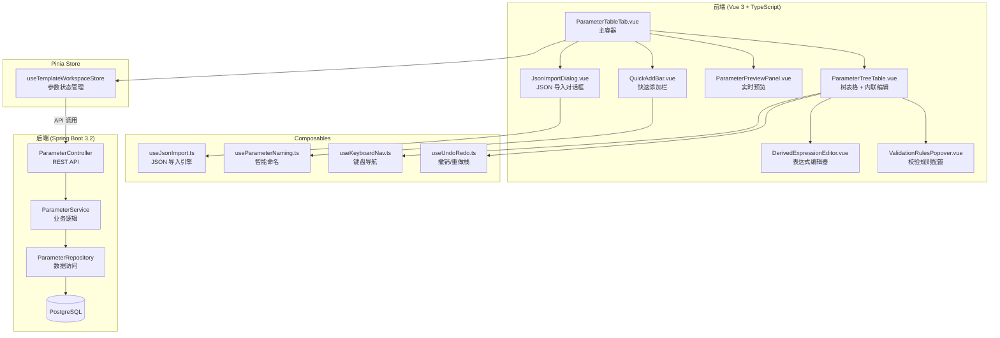
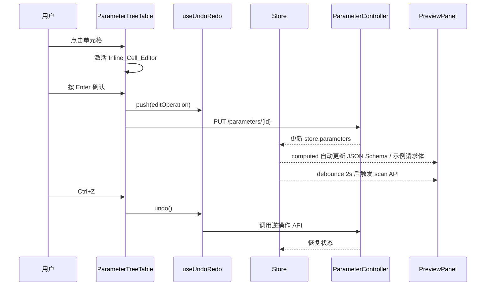

# Design Document: Parameter Settings UX

## Overview

本设计文档描述模板参数设置页面（ParameterTableTab）的 UX 全面升级方案。核心目标是将当前"表格 + 对话框"的传统编辑模式，升级为现代化、低代码、所见即所得的参数管理体验。

### 设计范围

- **前端重构**：ParameterTreeTable 内联编辑、拖拽排序、键盘导航、Undo/Redo 栈、JSON 导入、快速添加栏、右键菜单完整复制粘贴
- **后端新增**：批量删除/更新 API 端点、JSON 导入解析端点
- **组件移除**：删除 ParameterTemplateMenu 组件及其工具栏按钮
- **组件集成**：将已有的 ValidationRulesPopover 和 DerivedExpressionEditor 集成到 ParameterTreeTable 中

### 与现有代码的关系

| 现有组件 | 变更类型 | 说明 |
|---------|---------|------|
| `ParameterTableTab.vue` | 重构 | 移除 ParameterTemplateMenu 引用，新增 JSON 导入按钮、Quick_Add_Bar，改用批量 API |
| `ParameterTreeTable.vue` | 重构 | 消除 el-dialog 编辑，改为真正的内联编辑；集成 ValidationRulesPopover 和 DerivedExpressionEditor；添加拖拽排序、键盘导航 |
| `ParameterPreviewPanel.vue` | 增强 | 添加自动同步（debounced scan）、变更高亮 |
| `ParameterTemplateMenu.vue` | 删除 | 功能不直观，用 JSON 导入替代 |
| `ValidationRulesPopover.vue` | 保留 | 集成到 ParameterTreeTable 的校验规则列 |
| `DerivedExpressionEditor.vue` | 保留 | 集成到 ParameterTreeTable 的 DERIVED 行展开区域 |
| `ParameterController.java` | 扩展 | 新增 batch-delete、batch-update、json-import 端点 |
| `ParameterService.java` | 扩展 | 新增批量操作和 JSON 导入业务逻辑 |
| `useParameterUtils.ts` | 扩展 | 新增 JSON 类型推断、智能命名生成工具函数 |

## Architecture

### 整体架构



### 数据流



## Components and Interfaces

### 新增前端组件

#### 1. QuickAddBar.vue

位置：`frontend/src/views/template-workspace/components/QuickAddBar.vue`

```typescript
// Props
interface QuickAddBarProps {
  templateId: number
  existingNames: string[]  // 当前 root 级参数名列表，用于重复检查
}

// Emits
interface QuickAddBarEmits {
  (e: 'created', param: ParameterDTO): void
}
```

功能：底部快速添加栏，输入参数名按 Enter 创建，支持 `company.name` 点号语法自动创建嵌套结构。

#### 2. JsonImportDialog.vue

位置：`frontend/src/views/template-workspace/components/JsonImportDialog.vue`

```typescript
// Props
interface JsonImportDialogProps {
  visible: boolean
  templateId: number
}

// Emits
interface JsonImportDialogEmits {
  (e: 'update:visible', val: boolean): void
  (e: 'imported'): void
}
```

功能：JSON 导入对话框，用户粘贴 JSON 数据后自动推断参数结构并批量创建。

### 新增 Composables

#### 1. useUndoRedo.ts

位置：`frontend/src/composables/useUndoRedo.ts`

```typescript
interface UndoRedoOperation {
  type: 'add' | 'edit' | 'delete' | 'reorder' | 'batchDelete'
  // add: 记录创建的参数 ID，undo 时删除
  // edit: 记录 paramId + oldValue + newValue + field，undo 时用 oldValue 调用 update API
  // delete: 记录删除前的完整参数快照（含子参数），undo 时重新创建
  // reorder: 记录旧的 sortOrder 映射，undo 时恢复
  // batchDelete: 记录所有删除前的参数快照
  payload: any
}

interface UseUndoRedoReturn {
  canUndo: ComputedRef<boolean>
  canRedo: ComputedRef<boolean>
  push: (op: UndoRedoOperation) => void
  undo: () => Promise<void>
  redo: () => Promise<void>
  clear: () => void
}

export function useUndoRedo(maxSize?: number): UseUndoRedoReturn
```

#### 2. useParameterNaming.ts

位置：`frontend/src/composables/useParameterNaming.ts`

```typescript
interface UseParameterNamingReturn {
  generateName: (parentId: number | null, parentDataType: DataType | null, siblings: ParameterDTO[]) => string
}

export function useParameterNaming(): UseParameterNamingReturn
```

命名规则：
- root 级：`param_1`, `param_2`, ...
- OBJECT 子级：`field_1`, `field_2`, ...
- ARRAY 子级：`item_1`, `item_2`, ...

#### 3. useJsonImport.ts

位置：`frontend/src/composables/useJsonImport.ts`

```typescript
interface JsonImportResult {
  parameters: CreateParameterRequest[]
  warnings: string[]
}

interface UseJsonImportReturn {
  parseAndInfer: (jsonStr: string) => JsonImportResult
  validateJson: (jsonStr: string) => { valid: boolean; error?: string }
}

export function useJsonImport(): UseJsonImportReturn
```

类型推断规则：
| JSON 值类型 | 推断的 DataType |
|------------|----------------|
| `string` | STRING |
| `number` | NUMBER |
| `boolean` | BOOLEAN |
| `null` | STRING (required=false) |
| `object` | OBJECT (递归创建子参数) |
| `array` (含对象元素) | ARRAY (取首元素 keys 创建子参数) |
| `array` (仅原始值) | ARRAY (无子参数，description 注明元素类型) |

#### 4. useKeyboardNav.ts

位置：`frontend/src/composables/useKeyboardNav.ts`

```typescript
interface UseKeyboardNavReturn {
  handleKeyDown: (event: KeyboardEvent) => void
  focusedRowId: Ref<number | null>
  isEditing: Ref<boolean>
}

export function useKeyboardNav(options: {
  parameters: Ref<ParameterDTO[]>
  onDelete: (id: number) => void
  onDuplicate: (id: number) => void
  undoRedo: UseUndoRedoReturn
}): UseKeyboardNavReturn
```

### 新增后端 API 端点

#### 1. POST /api/templates/{templateId}/parameters/batch-delete

```java
// Request DTO
public record BatchDeleteParameterRequest(
    @NotEmpty(message = "参数ID列表不能为空")
    List<@NotNull Long> ids
) {}

// Response: HTTP 204 No Content
```

> **CASCADE 处理**：`parent_id` 列有 `ON DELETE CASCADE` 约束，删除父参数会自动级联删除子参数。批量删除时，Service 层需要先按树深度排序（先删子后删父），或者过滤掉已被 CASCADE 删除的 ID（即如果 ID 列表中同时包含父和子，只需删除父即可）。推荐实现：先查询所有待删 ID 的祖先关系，过滤出"最顶层"的 ID 集合，仅删除这些顶层 ID，子参数由 CASCADE 自动处理。

#### 2. POST /api/templates/{templateId}/parameters/batch-update

```java
// Request DTO
public record BatchUpdateParameterRequest(
    @NotEmpty(message = "更新列表不能为空")
    List<@Valid BatchUpdateItem> items
) {}

public record BatchUpdateItem(
    @NotNull(message = "参数ID不能为空") Long id,
    @NotNull(message = "版本号不能为空") Integer version,
    String name,
    String parameterType,
    String dataType,
    Boolean required,
    String defaultValue,
    String description,
    Integer sortOrder,
    String expressionText,
    String expressionType,
    Map<String, Object> validationRules
) {}

// Response: HTTP 200 with List<ParameterDTO>
```

#### 3. POST /api/templates/{templateId}/parameters/json-import

```java
// Request DTO
public record JsonImportRequest(
    @NotBlank(message = "JSON 数据不能为空")
    String jsonData,
    Long parentId  // 可选，指定导入到哪个父参数下
) {}

// Response: HTTP 201 with List<ParameterDTO>
```

### 前端 API 层扩展

位置：`frontend/src/api/parameters.ts`

```typescript
// 新增 API 函数
export function batchDeleteParameters(templateId: number, ids: number[]) {
  return request.post(`/templates/${templateId}/parameters/batch-delete`, { ids })
}

export function batchUpdateParameters(templateId: number, items: BatchUpdateItem[]) {
  return request.post<any, ParameterDTO[]>(
    `/templates/${templateId}/parameters/batch-update`, { items }
  )
}

export function jsonImportParameters(templateId: number, jsonData: string, parentId?: number) {
  return request.post<any, ParameterDTO[]>(
    `/templates/${templateId}/parameters/json-import`, { jsonData, parentId }
  )
}
```

### 新增 TypeScript 类型

位置：`frontend/src/types/parameter.ts`

```typescript
// 批量更新项
export interface BatchUpdateItem {
  id: number
  version: number
  name?: string
  parameterType?: ParameterType
  dataType?: DataType
  required?: boolean
  defaultValue?: string
  description?: string
  sortOrder?: number
  expressionText?: string
  expressionType?: ExpressionType
  validationRules?: ValidationRules
}
```

### ParameterTreeTable 内联编辑改造

当前 ParameterTreeTable 使用 `el-dialog` 编辑字段（startEdit → editDialogVisible → confirmEdit），需要改为真正的内联编辑：

```typescript
// 内联编辑状态
interface InlineEditState {
  rowId: number | null
  field: 'name' | 'defaultValue' | 'description' | null
  value: string
  originalValue: string
}

// 单元格渲染逻辑
// 非编辑态：显示文本 span.editable-cell
// 编辑态：显示 el-input（name/description）或类型适配控件（defaultValue）
// Enter → 确认 + 移动到同行下一个可编辑字段
// Esc → 取消恢复原值
// Tab → 确认 + 移动到下一行同字段
// blur → 确认
```

### 拖拽排序集成

使用 `sortablejs` 库（非 vuedraggable，因为需要与 el-table 的 DOM 结构配合）：

```typescript
// 在 ParameterTreeTable 的 onMounted 中初始化
import Sortable from 'sortablejs'

function initSortable() {
  const tbody = tableRef.value?.$el.querySelector('.el-table__body-wrapper tbody')
  if (!tbody) return
  
  Sortable.create(tbody, {
    handle: '.drag-handle',           // 仅通过拖拽手柄触发
    animation: 150,
    ghostClass: 'sortable-ghost',
    chosenClass: 'sortable-chosen',
    onEnd: (evt) => handleDragEnd(evt)
  })
}
```

约束：仅允许同级拖拽（同一 parentId 下的 siblings），跨级拖拽显示禁止光标。

> **el-table 树形模式注意事项**：el-table 将树形数据渲染为扁平的 `<tr>` 列表（通过缩进表示层级），sortablejs 会将所有可见行视为同级。因此需要在 `onMove` 回调中检查拖拽源和目标的 `parentId` 是否相同，不同则返回 `false` 阻止放置。同时需要在 `onEnd` 回调中根据 `data-row-key` 属性（el-table 自动添加）查找对应的参数数据，计算新的 sort_order。

## Data Models

### 现有数据模型（无变更）

`template_parameters` 表结构保持不变，所有字段已满足本 spec 需求：

| 字段 | 类型 | 说明 |
|------|------|------|
| id | BIGINT PK | 自增主键 |
| template_id | BIGINT NOT NULL | 所属模板 |
| parent_id | BIGINT | 父参数 ID（树结构） |
| name | VARCHAR(100) NOT NULL | 参数名 |
| parameter_type | VARCHAR(20) NOT NULL | REQUEST / DERIVED |
| data_type | VARCHAR(20) NOT NULL | STRING / NUMBER / DATE / BOOLEAN / ARRAY / OBJECT |
| required | BOOLEAN NOT NULL | 是否必填 |
| default_value | TEXT | 默认值 |
| description | TEXT | 描述 |
| sort_order | INT NOT NULL | 排序序号 |
| expression_text | TEXT | 衍生表达式 |
| expression_type | VARCHAR(20) | JAVASCRIPT / EXCEL_FORMULA |
| validation_rules | JSONB | 校验规则 JSON |
| version | INT NOT NULL | 乐观锁版本 |
| created_at | TIMESTAMP | 创建时间 |
| updated_at | TIMESTAMP | 更新时间 |

### 新增 ErrorCode 常量

```java
// ── PARAMETER BATCH (参数批量操作) ──
public static final String PARAMETER_BATCH_INVALID_IDS = "PARAMETER_BATCH_INVALID_IDS";
public static final String PARAMETER_BATCH_VALIDATION_FAILED = "PARAMETER_BATCH_VALIDATION_FAILED";
public static final String PARAMETER_JSON_IMPORT_FAILED = "PARAMETER_JSON_IMPORT_FAILED";
public static final String PARAMETER_JSON_IMPORT_DEPTH_EXCEEDED = "PARAMETER_JSON_IMPORT_DEPTH_EXCEEDED";
```

### 新增 AuditLog 操作类型

| action | resourceType | 说明 |
|--------|-------------|------|
| BATCH_DELETE_PARAMETER | PARAMETER | 批量删除参数 |
| BATCH_UPDATE_PARAMETER | PARAMETER | 批量更新参数 |
| JSON_IMPORT_PARAMETER | PARAMETER | JSON 导入参数 |

### 新增前端依赖

| 包名 | 版本 | 用途 |
|------|------|------|
| `sortablejs` | `^1.15.0` | 拖拽排序 |
| `@types/sortablejs` | `^1.15.0` | TypeScript 类型定义（devDependencies） |

### i18n 变更

**删除的 key**（三语言文件同步）：
- `parameter.insertTemplate`
- `parameter.template.address`
- `parameter.template.contact`
- `parameter.template.productList`

**新增的 key**（三语言文件同步）：
- `parameter.jsonImport` — "从 JSON 导入"
- `parameter.jsonImport.title` — "从 JSON 导入参数"
- `parameter.jsonImport.placeholder` — "粘贴 JSON 数据..."
- `parameter.jsonImport.import` — "导入"
- `parameter.jsonImport.emptyWarning` — "JSON 数据为空，无法生成参数"
- `parameter.jsonImport.depthWarning` — "JSON 嵌套超过 5 层，深层数据已扁平化为 STRING"
- `parameter.jsonImport.parseError` — "JSON 解析错误"
- `parameter.quickAdd.placeholder` — "输入参数名，按 Enter 添加..."
- `parameter.quickAdd.duplicateError` — "参数名已存在"
- `parameter.quickAdd.invalidNameError` — "参数名格式无效"
- `parameter.contextMenu.duplicate` — "复制参数"
- `parameter.deleteConfirm.withChildren` — "确定删除参数 {name} 及其 {count} 个子参数？"
- `parameter.paste.depthExceeded` — "粘贴后将超过最大嵌套深度（5层）"

### 前端 Undo/Redo 操作栈数据结构

```typescript
interface UndoRedoOperation {
  type: 'add' | 'edit' | 'delete' | 'reorder' | 'batchDelete'
  timestamp: number
  payload: AddPayload | EditPayload | DeletePayload | ReorderPayload | BatchDeletePayload
}

interface AddPayload {
  parameterId: number
  templateId: number
}

interface EditPayload {
  parameterId: number
  field: string
  oldValue: any
  newValue: any
  version: number  // 编辑前的 version，用于 undo 时的乐观锁
}

interface DeletePayload {
  snapshot: ParameterDTO  // 删除前的完整快照（含 children 递归）
  templateId: number
}

interface ReorderPayload {
  templateId: number
  parentId: number | null
  oldOrder: Array<{ id: number; sortOrder: number }>
  newOrder: Array<{ id: number; sortOrder: number }>
}

interface BatchDeletePayload {
  snapshots: ParameterDTO[]
  templateId: number
}
```

栈容量上限 50，超出时丢弃最旧的操作。执行新操作时清空 redo 栈。

## Correctness Properties

*A property is a characteristic or behavior that should hold true across all valid executions of a system — essentially, a formal statement about what the system should do. Properties serve as the bridge between human-readable specifications and machine-verifiable correctness guarantees.*

### Property 1: 智能命名唯一性

*For any* scope type (root / OBJECT child / ARRAY child) and *for any* set of existing sibling names, the Smart_Name_Generator SHALL produce a name that (a) follows the correct prefix pattern (`param_N` for root, `field_N` for OBJECT, `item_N` for ARRAY) and (b) does not collide with any existing sibling name.

**Validates: Requirements 2.1, 2.2, 2.3, 2.4**

### Property 2: JSON 导入结构正确性

*For any* valid JSON object, the JSON_Import_Engine SHALL produce a parameter tree where: (a) each top-level key becomes a root parameter, (b) nested objects become OBJECT parameters with children matching the object's keys, (c) arrays with object elements become ARRAY parameters with children matching the union of all element keys, and (d) the tree depth never exceeds 5 levels.

**Validates: Requirements 3.2, 3.4, 3.5, 3.7**

### Property 3: JSON 导入类型推断正确性

*For any* JSON value, the JSON_Import_Engine SHALL infer the correct DataType: `typeof(value) === 'string'` → STRING, `typeof(value) === 'number'` → NUMBER, `typeof(value) === 'boolean'` → BOOLEAN, `value === null` → STRING, `typeof(value) === 'object' && !Array.isArray(value)` → OBJECT, `Array.isArray(value)` → ARRAY.

**Validates: Requirements 3.3**

### Property 4: 拖拽排序后 sort_order 连续性

*For any* set of sibling parameters under the same parent and *for any* valid drag-and-drop reorder operation, the resulting sort_order values SHALL form a contiguous sequence of integers starting from 0 (i.e., `[0, 1, 2, ..., N-1]` where N is the number of siblings), and the total count of siblings SHALL remain unchanged.

**Validates: Requirements 4.3, 4.5**

### Property 5: 校验规则与数据类型兼容矩阵

*For any* DataType, the ValidationRulesPopover SHALL display exactly the set of applicable rule types as defined by the compatibility matrix: STRING → {not_null, not_blank, min_length, max_length, pattern, enum_values}, NUMBER → {not_null, min, max, enum_values}, DATE → {not_null}, BOOLEAN → {not_null}, ARRAY → {not_null, min_items, max_items}, OBJECT → {not_null}.

**Validates: Requirements 5.3**

### Property 6: 衍生参数表达式编辑器参数排除

*For any* parameter list and *for any* current DERIVED parameter, the DerivedExpressionEditor's available parameter dropdown SHALL contain all REQUEST and DERIVED parameters except the current parameter itself.

**Validates: Requirements 6.4**

### Property 7: Undo/Redo 栈不变量

*For any* sequence of push, undo, and redo operations on the Undo_Redo_Stack: (a) after undo, the state matches the state before the undone operation, (b) after redo, the state matches the state after the redone operation, (c) the stack size never exceeds 50, and (d) pushing a new operation clears the redo stack.

**Validates: Requirements 8.2, 8.3, 8.6**

### Property 8: 参数深拷贝完整性

*For any* parameter tree (including nested children), a deep copy operation (duplicate via Ctrl+D or paste via context menu) SHALL produce a new parameter tree where all attribute values are identical to the source (data_type, required, default_value, description, validation_rules, expression_text, expression_type) except for id (new), name (with suffix), and parentId (adjusted to new parent).

**Validates: Requirements 8.5, 11.2**

### Property 9: 批量更新原子性

*For any* batch-update request where at least one item contains invalid data (e.g., duplicate name, invalid data_type), the Batch_API SHALL reject the entire batch: no parameter in the batch SHALL be modified, and the response SHALL contain all validation errors.

**Validates: Requirements 9.4**

### Property 10: 点号语法嵌套结构解析

*For any* valid dotted parameter name (e.g., `a.b.c`), the Quick_Add_Bar SHALL create a nested parameter structure where each segment becomes a parameter: intermediate segments as OBJECT type, and the final segment as STRING type, with correct parent-child relationships.

**Validates: Requirements 10.3**

### Property 11: 参数名称格式校验

*For any* string, the parameter name validation SHALL accept the string if and only if it matches the regex `^[a-zA-Z_][a-zA-Z0-9_-]*$`.

**Validates: Requirements 10.6**

### Property 12: 粘贴深度检查

*For any* target position depth D and *for any* paste source tree with maximum depth S, the paste operation SHALL be allowed if and only if `D + S ≤ 5`, where D is the depth of the target position in the existing tree (root = 1).

**Validates: Requirements 11.5**

## Error Handling

### 后端错误处理

| 场景 | ErrorCode | HTTP Status | 说明 |
|------|-----------|-------------|------|
| 批量删除包含无效 ID | PARAMETER_BATCH_INVALID_IDS | 400 | 返回无效 ID 列表 |
| 批量更新校验失败 | PARAMETER_BATCH_VALIDATION_FAILED | 400 | 返回所有校验错误详情 |
| JSON 导入解析失败 | PARAMETER_JSON_IMPORT_FAILED | 400 | 返回解析错误位置和原因 |
| JSON 导入超过深度限制 | PARAMETER_JSON_IMPORT_DEPTH_EXCEEDED | 400 | 返回超限层级信息 |
| 乐观锁冲突（批量更新） | PARAMETER_CONCURRENT_MODIFICATION | 409 | 返回冲突的参数 ID 和当前版本 |
| 参数名重复（批量更新） | PARAMETER_DUPLICATE_NAME | 400 | 返回重复的参数名 |

### 前端错误处理

| 场景 | 处理方式 |
|------|---------|
| 内联编辑 API 失败 | 回滚单元格值到编辑前状态，显示 `ElMessage.error` |
| 批量删除 API 失败 | 显示 `ElMessage.error`，刷新参数列表恢复一致状态 |
| 批量更新 API 失败（乐观锁） | 显示冲突提示，自动刷新参数列表获取最新版本 |
| JSON 导入解析失败 | 在对话框内 JSON 文本区下方显示红色错误信息 |
| JSON 导入 API 失败 | 显示 `ElMessage.error`，保留对话框内容供用户修改 |
| 拖拽排序 API 失败 | 回滚到拖拽前的排序状态，显示 `ElMessage.error` |
| Undo 操作 API 失败 | 显示 `ElMessage.error`，清空 undo/redo 栈防止状态不一致 |
| 快速添加栏名称重复 | 输入框下方显示红色内联错误 "参数名已存在" |
| 快速添加栏名称格式无效 | 输入框下方显示红色内联错误 "参数名格式无效" |
| 粘贴超过深度限制 | 显示 `ElMessage.warning` "粘贴后将超过最大嵌套深度（5层）" |
| 预览面板 scan API 失败 | 静默失败，保留上次 scan 结果，不阻断编辑流程 |

## Testing Strategy

### 后端测试

#### 单元测试 (JUnit 5)

- `ParameterService.batchDelete()` — 正常删除、无效 ID、跨模板 ID、CASCADE 子参数
- `ParameterService.batchUpdate()` — 正常更新、校验失败回滚、乐观锁冲突、部分无效
- `ParameterService.jsonImport()` — 各种 JSON 结构、空 JSON、超深度、无效 JSON
- `ParameterController` 端点测试 — HTTP 状态码、请求体校验、响应格式

#### 属性测试 (jqwik)

- **Property 9 (批量更新原子性)**：生成随机批量更新请求（含有效和无效项），验证要么全部成功要么全部回滚
- **Property 11 (参数名称格式校验)**：生成随机字符串，验证 `validateName()` 的结果与正则匹配一致
- 每个属性测试最少 100 次迭代
- 标签格式：`Feature: parameter-settings-ux, Property {number}: {property_text}`

### 前端测试

#### 单元测试 (Vitest)

- `useParameterNaming` — 各种 scope 和已有名称组合
- `useJsonImport` — JSON 解析、类型推断、深度限制、错误处理
- `useUndoRedo` — push/undo/redo 序列、栈容量限制
- `useKeyboardNav` — 键盘事件处理
- 组件测试：QuickAddBar、JsonImportDialog 的渲染和交互

#### 属性测试 (fast-check)

- **Property 1 (智能命名唯一性)**：生成随机已有名称集合和 scope，验证生成名称唯一且符合模式
- **Property 2 (JSON 导入结构正确性)**：生成随机 JSON 对象，验证参数树结构正确
- **Property 3 (JSON 导入类型推断)**：生成随机 JSON 值，验证类型推断正确
- **Property 4 (排序连续性)**：生成随机 siblings 和 reorder 操作，验证 sort_order 连续
- **Property 5 (校验规则兼容矩阵)**：生成随机 DataType，验证规则集合正确
- **Property 7 (Undo/Redo 栈不变量)**：生成随机操作序列，验证栈状态正确
- **Property 8 (深拷贝完整性)**：生成随机参数树，验证深拷贝属性一致
- **Property 10 (点号语法解析)**：生成随机点号分隔名称，验证嵌套结构正确
- **Property 11 (名称格式校验)**：生成随机字符串，验证校验结果与正则一致
- **Property 12 (粘贴深度检查)**：生成随机深度组合，验证深度检查正确
- 每个属性测试最少 100 次迭代
- 标签格式：`Feature: parameter-settings-ux, Property {number}: {property_text}`

### 集成测试

- 批量 API 端点的事务原子性验证（Testcontainers + PostgreSQL）
- JSON 导入端点的端到端流程
- 内联编辑 → 预览面板自动更新的完整数据流

