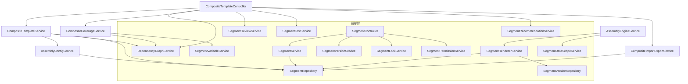
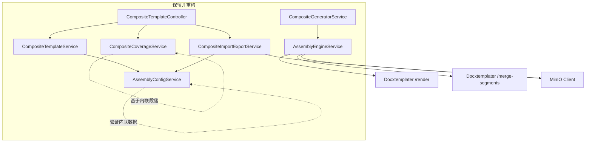

# Design Document: Remove Segment Library

## Overview

本设计文档描述从文档生成系统中移除"段落库"（Segment Library）独立共享模块，并将组合模板的段落编排从"引用模式"重构为"内联模式"的技术方案。

### 核心变更

1. **数据模型变更**：`assembly_config` JSONB 中的段落条目从 `segmentId`（引用 segments 表）变为 `filePath + name + segmentType`（内联元数据）
2. **后端服务层重构**：移除 Segment* 系列服务/仓库/实体，重构 AssemblyEngineService 直接基于内联 filePath 渲染
3. **数据迁移**：Flyway 脚本在删表前将 segmentId 引用解析为内联数据
4. **前端重构**：移除段落库页面/store/api，重构 SegmentArrangementTab 为直接上传模式

### 设计原则

- **最小影响面**：仅修改与段落库有直接依赖的代码，不改变组合模板自身的编排逻辑
- **数据安全**：先迁移数据再删表，保留 MinIO 中被引用的文件
- **向后兼容**：迁移脚本处理 segmentId 引用不存在的边界情况

## Architecture

### 变更前架构



### 变更后架构



### 关键架构决策

| 决策 | 选择 | 理由 |
|------|------|------|
| DataScope 逻辑位置 | 内联到 AssemblyEngineService | SegmentDataScopeService 仅有一个纯函数 resolveDataScope，无需独立服务 |
| 段落渲染方式 | AssemblyEngineService 直接调用 /render | 移除 SegmentRendererService 中间层，filePath 已在 assembly_config 中 |
| 覆盖率计算 | CompositeCoverageService 直接扫描 MinIO 文件 | 不再通过 DependencyGraphService 获取段落列表 |
| 导入导出 | 基于内联 filePath 直接读写 MinIO | 不再通过 SegmentRepository 查找段落 |

## Components and Interfaces

### 1. AssemblySegmentEntry（重构）

**变更前**：通过 `segmentId` 引用 segments 表记录
**变更后**：内联包含段落元数据

```java
// backend: com.docgen.dto.AssemblySegmentEntry
public class AssemblySegmentEntry {
    // 移除: private Long segmentId;
    // 移除: private Integer lockedVersion;
    
    // 新增: 内联段落元数据
    private String filePath;          // MinIO 文件路径（必填）
    private String name;              // 段落名称（必填）
    private String segmentType;       // 段落类型: COVER, TOC, CHAPTER, TABLE, SIGNATURE, LEGAL, APPENDIX
    
    // 保留: 编排属性
    private Integer position;
    private boolean enabled = true;
    private boolean pageBreakBefore = false;
    private String conditionExpression;
    private Map<String, String> dataScope;
}
```

```typescript
// frontend: types/segment.ts
export interface AssemblySegmentEntry {
  // 移除: segmentId: number
  // 移除: lockedVersion: number | null
  
  // 新增: 内联段落元数据
  filePath: string
  name: string
  segmentType: SegmentType | string | null
  
  // 保留: 编排属性
  position: number
  enabled: boolean
  pageBreakBefore: boolean
  conditionExpression: string | null
  dataScope: Record<string, string> | null
}
```

### 2. AssemblyConfigService（重构）

移除对 `SegmentRepository` 的依赖，验证逻辑改为基于内联数据。

```java
@Service
public class AssemblyConfigService {
    private final ObjectMapper objectMapper;
    // 移除: private final SegmentRepository segmentRepository;

    public AssemblyConfigService(ObjectMapper objectMapper) {
        this.objectMapper = objectMapper;
    }

    public void validate(AssemblyConfigDTO config) {
        List<AssemblySegmentEntry> segments = config.getSegments();
        
        // 检查至少一个启用的段落
        boolean hasEnabled = segments != null && segments.stream()
                .anyMatch(AssemblySegmentEntry::isEnabled);
        if (!hasEnabled) {
            throw new BusinessException(ErrorCode.COMPOSITE_TEMPLATE_EMPTY, ...);
        }
        
        // 检查每个段落的 filePath 非空
        for (AssemblySegmentEntry entry : segments) {
            if (entry.getFilePath() == null || entry.getFilePath().isBlank()) {
                throw new BusinessException(ErrorCode.ASSEMBLY_CONFIG_INVALID,
                    "Segment entry missing filePath: " + entry.getName(), 
                    HttpStatus.UNPROCESSABLE_ENTITY);
            }
        }
    }
    
    // serialize / deserialize 保持不变
}
```

### 3. AssemblyEngineService（重构）

移除对 `SegmentRendererService` 和 `SegmentDataScopeService` 的依赖，内联 DataScope 逻辑，直接调用 Docxtemplater /render。

```java
@Service
public class AssemblyEngineService {
    // 移除: private final SegmentRendererService segmentRendererService;
    // 移除: private final SegmentDataScopeService segmentDataScopeService;
    
    private final ExpressionEngine expressionEngine;
    private final RestTemplate restTemplate;
    private final CircuitBreaker docxtemplaterCb;
    private final MinioClient minioClient;  // 新增

    @Value("${docxtemplater.service-url:http://localhost:3000}")
    private String docxtemplaterServiceUrl;
    
    @Value("${minio.bucket-name:docgen}")
    private String bucketName;  // 新增

    public AssemblyResult assembleDocument(AssemblyConfigDTO config, Map<String, Object> globalData) {
        // 流程不变：排序 → 跳过禁用 → 评估条件 → 解析 DataScope → 渲染 → 合并
        for (AssemblySegmentEntry entry : sortedEntries) {
            if (!entry.isEnabled()) continue;
            if (!evaluateCondition(entry.getConditionExpression(), globalData)) continue;
            
            // 内联 DataScope 解析（原 SegmentDataScopeService.resolveDataScope）
            Map<String, Object> scopedData = resolveDataScope(globalData, entry.getDataScope());
            
            // 直接渲染（原 SegmentRendererService.renderSegmentSafe）
            SegmentRenderResult renderResult = renderSegmentSafe(
                    entry.getFilePath(), entry.getName(), scopedData);
            // ...
        }
    }
    
    /** 内联的 DataScope 解析逻辑 */
    Map<String, Object> resolveDataScope(Map<String, Object> globalData, Map<String, String> dataScope) {
        if (dataScope == null || dataScope.isEmpty()) return globalData;
        Map<String, Object> scopedData = new HashMap<>();
        for (Map.Entry<String, String> mapping : dataScope.entrySet()) {
            scopedData.put(mapping.getKey(), globalData.getOrDefault(mapping.getValue(), null));
        }
        return scopedData;
    }
    
    /** 直接渲染段落（替代 SegmentRendererService） */
    SegmentRenderResult renderSegmentSafe(String filePath, String name, Map<String, Object> data) {
        SegmentRenderResult result = new SegmentRenderResult();
        result.setSegmentName(name);
        long start = System.currentTimeMillis();
        try {
            byte[] rendered = renderSegment(filePath, data);
            result.setSuccess(true);
            result.setRenderTimeMs(System.currentTimeMillis() - start);
            result.setRenderedBytes(rendered);
        } catch (Exception e) {
            result.setSuccess(false);
            result.setRenderTimeMs(System.currentTimeMillis() - start);
            result.setErrorMessage(e.getMessage());
        }
        return result;
    }
    
    /** 调用 Docxtemplater /render 端点 */
    byte[] renderSegment(String filePath, Map<String, Object> data) {
        Map<String, Object> requestBody = Map.of("templatePath", filePath, "data", data != null ? data : Map.of());
        HttpHeaders headers = new HttpHeaders();
        headers.setContentType(MediaType.APPLICATION_JSON);
        HttpEntity<Map<String, Object>> entity = new HttpEntity<>(requestBody, headers);
        
        return docxtemplaterCb.executeSupplier(() -> {
            ResponseEntity<byte[]> response = restTemplate.exchange(
                    docxtemplaterServiceUrl + "/render", HttpMethod.POST, entity, byte[].class);
            if (response.getBody() == null || response.getBody().length == 0) {
                throw new BusinessException(ErrorCode.GENERATE_RENDER_FAILED, ...);
            }
            return response.getBody();
        });
    }
}
```

### 4. CompositeTemplateService（重构）

移除对 `SegmentRepository` 和 `DependencyGraphService` 的依赖。

```java
@Service
public class CompositeTemplateService {
    private final TemplateRepository templateRepository;
    // 移除: private final SegmentRepository segmentRepository;
    private final AssemblyConfigService assemblyConfigService;
    // 移除: private final DependencyGraphService dependencyGraphService;

    // preview 方法改为基于内联数据
    public CompositePreviewDTO previewCompositeTemplate(Long templateId) {
        // 直接从 assembly_config 中读取段落名称和状态
        for (AssemblySegmentEntry entry : config.getSegments()) {
            SegmentPreviewEntry previewEntry = new SegmentPreviewEntry();
            previewEntry.setSegmentName(entry.getName());
            previewEntry.setStatus(entry.isEnabled() ? "READY" : "DISABLED");
            // 不再查询 segments 表
        }
    }
    
    // activate 方法改为验证内联 filePath
    public TemplateDTO activateCompositeTemplate(Long templateId) {
        // 验证所有段落的 filePath 非空
        // 不再查询 SegmentRepository 验证段落存在性
    }
    
    // previewSelectiveSegments 方法改为基于 position 过滤
    // SelectivePreviewRequest 中的 segmentIds 改为 positions
}
```

### 5. CompositeCoverageService（重构）

移除对 `DependencyGraphService` 和 `SegmentVariableService` 的依赖。

```java
@Service
public class CompositeCoverageService {
    private final AssemblyConfigService assemblyConfigService;
    private final TemplateRepository templateRepository;
    private final MinioClient minioClient;
    private final RestTemplate restTemplate;
    // 移除: private final SegmentVariableService segmentVariableService;
    // 移除: private final DependencyGraphService dependencyGraphService;

    public CompositeCoverageReport checkCoverage(Long compositeTemplateId) {
        Template template = findCompositeTemplateOrThrow(compositeTemplateId);
        AssemblyConfigDTO config = assemblyConfigService.deserialize(template.getAssemblyConfig());
        
        // 遍历内联段落，通过 Docxtemplater /evaluate 端点扫描变量
        for (AssemblySegmentEntry entry : config.getSegments()) {
            List<String> variables = scanVariablesFromFile(entry.getFilePath());
            // 计算覆盖率...
        }
    }
}
```

### 6. CompositeImportExportService（重构）

移除对 `SegmentRepository` 的依赖，基于内联 filePath 直接操作 MinIO。

```java
// 导出：直接从 assembly_config 中的 filePath 下载文件
// 导入：上传文件到 MinIO，将 filePath 内联写入 assembly_config
// 不再创建 Segment 实体
```

### 7. CompositeTemplateController（重构）

移除依赖段落库的端点，保留组合模板自身功能端点。

**移除的端点**：
- `GET /{id}/segments` — 依赖 DependencyGraphService
- `POST /{id}/reviews` — 依赖 SegmentReviewService
- `GET /{id}/reviews/{reviewId}/segments` — 依赖 SegmentReviewService
- `GET /{id}/recommendations` — 依赖 SegmentRecommendationService
- `POST /{id}/tests/run` — 依赖 SegmentTestService

**保留的端点**：
- `POST /` — 创建组合模板
- `GET /{id}/assembly-config` — 获取编排配置
- `PUT /{id}/assembly-config` — 更新编排配置
- `POST /{id}/preview` — 预览
- `POST /{id}/preview/selective` — 选择性预览
- `GET /{id}/coverage` — 覆盖率
- `GET /{id}/export` — 导出 ZIP
- `GET /{id}/export-config` — 导出配置
- `POST /import` — 导入 ZIP

### 8. DashboardService / DashboardController（重构）

**移除**：
- `getSegmentStats()` 方法和 `/segment-stats` 端点
- `getComponentRanking()` 方法和 `/component-ranking` 端点
- `getSystemOverview()` 中的 `segmentCount`、`componentCount` 字段
- 对 `SegmentRepository` 和 `DependencyGraphService` 的依赖

### 9. SegmentRenderResult（重构）

```java
public class SegmentRenderResult {
    // 移除: private Long segmentId;
    private String segmentName;  // 保留，从内联 name 获取
    private boolean success;
    private long renderTimeMs;
    private String errorMessage;
    private transient byte[] renderedBytes;
}
```

### 9a. SegmentRenderStat（重构）

```java
public class SegmentRenderStat {
    // 移除: private Long segmentId;
    private String segmentName;  // 保留，从内联 name 获取
    private long renderTimeMs;
    private boolean success;
    private String errorMessage;
}
```

### 10. CompositePreviewDTO.SegmentPreviewEntry（重构）

```java
public static class SegmentPreviewEntry {
    // 移除: private Long segmentId;
    private String segmentName;  // 从内联 name 获取
    private String status;
    private String errorMessage;
}
```

### 11. CompositeCoverageReport.SegmentCoverageEntry（重构）

```java
public static class SegmentCoverageEntry {
    // 移除: private Long segmentId;
    private String segmentName;  // 从内联 name 获取
    private int totalVariables;
    private int boundVariables;
    private double coveragePercent;
}
```


### 12. 前端类型重构

```typescript
// types/segment.ts — 保留并重构的类型

export type SegmentType = 'COVER' | 'TOC' | 'CHAPTER' | 'TABLE' | 'SIGNATURE' | 'LEGAL' | 'APPENDIX'

export interface AssemblySegmentEntry {
  filePath: string
  name: string
  segmentType: SegmentType | string | null
  position: number
  enabled: boolean
  pageBreakBefore: boolean
  conditionExpression: string | null
  dataScope: Record<string, string> | null
}

export interface AssemblyConfig {
  segments: AssemblySegmentEntry[]
}

// 保留: CreateCompositeTemplateRequest, UpdateAssemblyConfigRequest, 
//       SelectivePreviewRequest, CompositePreview, SegmentPreviewEntry,
//       CompositeCoverageReport, SegmentCoverageEntry, MigrationResult

// 移除: Segment, SegmentVersion, SegmentVariable, SegmentReview, SegmentReviewStatus,
//       SegmentTestData, SegmentTestResult, LockInfo, SegmentRecommendation, DuplicatePair,
//       DuplicateAnalysis, SegmentTemplate, SegmentPermission, GrantSegmentPermissionRequest,
//       SegmentQuery, CreateSegmentRequest, UpdateSegmentRequest, CreateSegmentTestDataRequest,
//       CreateSegmentTemplateRequest, SubmitCompositeReviewRequest, SegmentReviewerAssignment,
//       ReviewActionRequest, CompositeTestReport
```

### 13. 前端 SegmentArrangementTab 重构

**变更前**：通过段落库 API 创建段落，通过"添加已有段落"对话框搜索段落库
**变更后**：直接上传 .docx 文件，通过后端上传到 MinIO 并返回 filePath，将段落信息内联到 assembly_config

新增后端端点（在 CompositeTemplateController 中）：
```java
@PostMapping("/{id}/upload-segment")
public ResponseEntity<AssemblySegmentEntry> uploadSegment(
        @PathVariable Long id,
        @RequestPart("file") MultipartFile file,
        @RequestParam String name,
        @RequestParam(required = false) String segmentType) {
    // 上传文件到 MinIO，返回内联的 AssemblySegmentEntry
}
```

### 14. templateWorkspace Store 重构

```typescript
// 移除: segments state, refreshSegments action
// 移除: getCompositeSegments API 调用
// 段落数据改为从 assemblyConfig.segments 中直接获取
```

### 15. useWorkflowSteps 适配

```typescript
function hasEnabledSegment(config: AssemblyConfig | null): boolean {
  return config?.segments?.some(s => s.enabled) ?? false
  // 无需变更，AssemblySegmentEntry 仍有 enabled 字段
}

function allSegmentsEdited(config: AssemblyConfig | null): boolean {
  const enabled = config?.segments?.filter(s => s.enabled) ?? []
  if (enabled.length === 0) return false
  // 变更: 不再检查 lockedVersion，改为检查 filePath 非空
  return enabled.every(s => s.filePath != null && s.filePath.length > 0)
}
```

## Data Models

### assembly_config JSONB 结构变更

**变更前**（引用模式）：
```json
{
  "segments": [
    {
      "segmentId": 42,
      "position": 0,
      "enabled": true,
      "pageBreakBefore": false,
      "lockedVersion": null,
      "conditionExpression": null,
      "dataScope": null
    }
  ]
}
```

**变更后**（内联模式）：
```json
{
  "segments": [
    {
      "filePath": "segments/1/abc123_cover.docx",
      "name": "封面",
      "segmentType": "COVER",
      "position": 0,
      "enabled": true,
      "pageBreakBefore": false,
      "conditionExpression": null,
      "dataScope": null
    }
  ]
}
```

### Flyway 数据迁移脚本

新迁移版本号：V36（V35 是当前最大版本）

#### V36__migrate_assembly_config_and_drop_segments.sql

```sql
-- V36__migrate_assembly_config_and_drop_segments.sql
-- 步骤 1: 将 assembly_config 中的 segmentId 引用转换为内联模式
-- 步骤 2: 清理 permissions 表中的 SEGMENT 类型记录
-- 步骤 3: 按依赖顺序删除段落库相关表

-- ═══════════════════════════════════════════════════════════
-- 步骤 1: 数据迁移 — 将 segmentId 引用解析为内联数据
-- ═══════════════════════════════════════════════════════════

UPDATE templates t
SET assembly_config = (
    SELECT jsonb_build_object(
        'segments',
        COALESCE(
            (SELECT jsonb_agg(
                CASE
                    WHEN s.id IS NOT NULL THEN
                        jsonb_build_object(
                            'filePath', s.file_path,
                            'name', s.name,
                            'segmentType', s.segment_type,
                            'position', (elem->>'position')::int,
                            'enabled', COALESCE((elem->>'enabled')::boolean, true),
                            'pageBreakBefore', COALESCE((elem->>'pageBreakBefore')::boolean, false),
                            'conditionExpression', elem->>'conditionExpression',
                            'dataScope', elem->'dataScope'
                        )
                    ELSE
                        -- segmentId 引用不存在的段落，标记为无效
                        jsonb_build_object(
                            'filePath', '',
                            'name', 'INVALID_SEGMENT_' || (elem->>'segmentId'),
                            'segmentType', null,
                            'position', (elem->>'position')::int,
                            'enabled', false,
                            'pageBreakBefore', COALESCE((elem->>'pageBreakBefore')::boolean, false),
                            'conditionExpression', elem->>'conditionExpression',
                            'dataScope', elem->'dataScope'
                        )
                END
                ORDER BY (elem->>'position')::int
            )
            FROM jsonb_array_elements(t.assembly_config->'segments') AS elem
            LEFT JOIN segments s ON s.id = (elem->>'segmentId')::bigint
            ),
            '[]'::jsonb
        )
    )
)
WHERE t.template_type = 'COMPOSITE'
  AND t.assembly_config IS NOT NULL
  AND t.assembly_config != ''
  AND t.assembly_config::text != 'null';

-- ═══════════════════════════════════════════════════════════
-- 步骤 2: 清理 permissions 表中的 SEGMENT 类型记录
-- ═══════════════════════════════════════════════════════════

DELETE FROM permissions WHERE resource_type = 'SEGMENT';

-- ═══════════════════════════════════════════════════════════
-- 步骤 3: 按依赖顺序删除段落库相关表
-- ═══════════════════════════════════════════════════════════

-- 先删除依赖表
DROP TABLE IF EXISTS segment_favorites CASCADE;
DROP TABLE IF EXISTS segment_test_data CASCADE;
DROP TABLE IF EXISTS segment_reviews CASCADE;
DROP TABLE IF EXISTS segment_tag_mappings CASCADE;
DROP TABLE IF EXISTS segment_versions CASCADE;

-- 最后删除主表
DROP TABLE IF EXISTS segments CASCADE;
```

### 要移除的数据库对象

| 表名 | 创建于 | 说明 |
|------|--------|------|
| segment_favorites | V35 | 段落收藏 |
| segment_test_data | V34 | 段落测试数据 |
| segment_reviews | V33 | 段落审查 |
| segment_tag_mappings | V31 | 段落标签映射 |
| segment_versions | V30 | 段落版本 |
| segments | V29 | 段落主表 |

### 保留的数据库对象

| 对象 | 说明 |
|------|------|
| templates.assembly_config (JSONB) | 组合模板编排配置，迁移为内联模式 |
| templates.template_type | 模板类型标识（SINGLE/COMPOSITE） |
| permissions.resource_type / resource_id | 保留列，仅清理 SEGMENT 类型记录 |

### 要移除的后端文件清单

#### Controllers
- `SegmentController.java`
- `SegmentReviewController.java`

#### Services
- `SegmentService.java`
- `SegmentVersionService.java`
- `SegmentVariableService.java`
- `SegmentLockService.java`
- `SegmentPermissionService.java`
- `SegmentTestService.java`
- `SegmentRecommendationService.java`
- `SegmentReviewService.java`
- `DependencyGraphService.java`
- `SegmentRendererService.java`
- `SegmentDataScopeService.java`

#### Entities
- `Segment.java`
- `SegmentFavorite.java`
- `SegmentReview.java`
- `SegmentTagMapping.java`
- `SegmentTestData.java`
- `SegmentVersion.java`

#### Repositories
- `SegmentRepository.java`
- `SegmentFavoriteRepository.java`
- `SegmentReviewRepository.java`
- `SegmentTagMappingRepository.java`
- `SegmentTestDataRepository.java`
- `SegmentVersionRepository.java`

#### DTOs
- `SegmentDTO.java`
- `CreateSegmentRequest.java`
- `UpdateSegmentRequest.java`
- `SegmentVersionDTO.java`
- `SegmentVariableDTO.java`
- `SegmentTestDataDTO.java`
- `SegmentTestResultDTO.java`
- `SegmentReviewDTO.java`
- `SegmentRecommendationDTO.java`
- `SegmentStatsDTO.java`
- `SegmentTemplateDTO.java`
- `SegmentQueryRequest.java`
- `CreateSegmentTemplateRequest.java`
- `CreateSegmentTestDataRequest.java`
- `DuplicateAnalysisDTO.java`
- `LockInfo.java` (如果仅用于段落锁定)
- `SubmitCompositeReviewRequest.java`
- `SegmentReviewerAssignment.java`
- `ComponentRankingDTO.java`
- `CompositeTestReportDTO.java`

### 要移除的前端文件清单

#### Pages
- `views/segments/Index.vue`
- `views/segments/Detail.vue`
- `views/segments/Editor.vue`
- `views/segments/components/SegmentFormDialog.vue`
- `views/segments/components/SegmentPermissionDialog.vue`
- `views/segments/components/SegmentVariableList.vue`
- `views/segments/components/SegmentVersionList.vue`
- `views/composite-templates/components/SegmentReviewPanel.vue`
- `views/composite-templates/components/SegmentSearchPanel.vue`
- `views/composite-templates/components/SegmentRecommendPanel.vue`

#### API / Store / Composable
- `api/segments.ts`
- `stores/segment.ts`
- `composables/useSegmentLock.ts`

#### Tests
- `__tests__/SegmentIndex.test.ts`
- `__tests__/useSegmentLock.test.ts`


## Correctness Properties

*A property is a characteristic or behavior that should hold true across all valid executions of a system — essentially, a formal statement about what the system should do. Properties serve as the bridge between human-readable specifications and machine-verifiable correctness guarantees.*

### Property 1: AssemblyConfig 序列化往返一致性

*For any* valid `AssemblyConfigDTO` containing inline segment entries (with arbitrary filePath, name, segmentType, position, enabled, pageBreakBefore, conditionExpression, dataScope), serializing to JSON then deserializing back SHALL produce an equivalent object with all fields preserved.

**Validates: Requirements 1.7, 3.1, 8.2**

### Property 2: AssemblyConfigService 内联验证正确性

*For any* `AssemblyConfigDTO`, validation SHALL accept the config if and only if it contains at least one enabled segment AND every segment entry has a non-empty filePath. Configs with all segments disabled or any segment with empty/null filePath SHALL be rejected with the appropriate error.

**Validates: Requirements 3.3**

### Property 3: DataScope 解析映射正确性

*For any* globalData map and dataScope mapping (localKey → globalKey), the resolved data map SHALL contain exactly the keys defined in dataScope, where each localKey maps to `globalData.get(globalKey)` (or null if globalKey is absent). When dataScope is null or empty, the full globalData SHALL be returned unchanged.

**Validates: Requirements 3.4, 3.5**

### Property 4: 组装引擎段落排序与条件过滤

*For any* `AssemblyConfigDTO` with inline segment entries, the assembly engine SHALL process segments in ascending position order, skip all disabled segments, and skip segments whose conditionExpression evaluates to false. The resulting rendered segment list SHALL contain only enabled segments with true conditions, in position order.

**Validates: Requirements 3.4, 3.6, 11.14**

### Property 5: 数据迁移 segmentId 到内联模式转换

*For any* assembly_config JSON containing segmentId references and a corresponding segments table with matching records, the migration SQL SHALL produce an inline assembly_config where each entry's filePath, name, and segmentType match the corresponding segment record, and all other fields (position, enabled, pageBreakBefore, conditionExpression, dataScope) are preserved. For non-existent segmentId references, the entry SHALL be marked with enabled=false and name prefixed with "INVALID_SEGMENT_".

**Validates: Requirements 3.8, 12.1, 12.2**

### Property 6: useAssemblyConfig 操作不变量

*For any* sequence of add/remove/update operations on an AssemblySegmentEntry array with inline fields (filePath, name, segmentType), after each operation the segments array SHALL have consecutive positions from 0 to length-1, and undo SHALL restore the previous state exactly.

**Validates: Requirements 6.5**

### Property 7: useWorkflowSteps 内联段落适配

*For any* `AssemblyConfig` with inline segment entries, `hasEnabledSegment()` SHALL return true if and only if at least one segment has `enabled === true`. `allSegmentsEdited()` SHALL return true if and only if all enabled segments have a non-empty `filePath`.

**Validates: Requirements 6.7**

## Error Handling

### 新增 ErrorCode

| ErrorCode | 场景 | HTTP Status |
|-----------|------|-------------|
| `ASSEMBLY_CONFIG_INVALID` | 段落条目缺少 filePath | 422 |
| `SEGMENT_FILE_NOT_FOUND` | MinIO 中找不到段落文件 | 422 |

### 保留的 ErrorCode

| ErrorCode | 场景 | HTTP Status |
|-----------|------|-------------|
| `COMPOSITE_TEMPLATE_EMPTY` | 组合模板无启用段落 | 422 |
| `GENERATE_ALL_SEGMENTS_SKIPPED` | 所有段落被条件跳过 | 200 |
| `GENERATE_RENDER_FAILED` | 段落渲染失败 | 500/503 |
| `MERGE_FAILED` | 段落合并失败 | 500 |
| `EXPORT_FAILED` | 导出失败 | 500 |
| `IMPORT_INVALID_FILE` | 导入文件无效 | 400 |

### 移除的 ErrorCode

| ErrorCode | 原因 |
|-----------|------|
| `SEGMENT_NOT_FOUND` | 不再查询 segments 表 |
| `SEGMENT_REFERENCED` | 不再有段落引用关系 |
| `SEGMENT_VERSION_FILE_MISSING` | 不再有段落版本 |
| `COMPONENT_REFERENCED` | 不再有组件模板概念 |

### 错误处理策略

1. **渲染失败**：AssemblyEngineService 的 `renderSegmentSafe` 方法捕获异常，记录错误信息到 `SegmentRenderResult`，继续处理其他段落（部分失败模式）
2. **MinIO 文件不存在**：渲染时如果 filePath 对应的文件不存在，记录为渲染失败，不中断整体流程
3. **数据迁移异常**：segmentId 引用不存在的段落时，标记为 `enabled=false`，名称前缀 `INVALID_SEGMENT_`，不中断迁移
4. **验证失败**：AssemblyConfigService.validate() 对 filePath 为空的条目抛出 `ASSEMBLY_CONFIG_INVALID`

## Testing Strategy

### Property-Based Testing (PBT)

本功能适合 PBT，因为核心逻辑涉及数据结构序列化、验证规则、数据映射等纯函数行为，输入空间大且有明确的通用属性。

**后端 PBT 框架**：jqwik（已在项目中使用）
**前端 PBT 框架**：fast-check（已在项目中使用）

每个 property test 配置最少 100 次迭代，标签格式：
`Feature: remove-segment-library, Property {number}: {property_text}`

#### 后端 Property Tests

| Property | 测试文件 | 说明 |
|----------|---------|------|
| Property 1 | `SegmentAssemblyConfigPropertyTest.java`（更新） | 内联 AssemblyConfig 序列化往返 |
| Property 2 | `AssemblyConfigServiceTest.java`（更新） | 内联验证逻辑 |
| Property 3 | `DataScopeResolutionPropertyTest.java`（新增） | DataScope 解析 |
| Property 4 | `AssemblyOrderPropertyTest.java` + `ConditionalRenderingPropertyTest.java`（更新） | 排序与条件过滤 |
| Property 5 | `MigrationPropertyTest.java`（新增） | 数据迁移正确性 |

#### 前端 Property Tests

| Property | 测试文件 | 说明 |
|----------|---------|------|
| Property 6 | `useAssemblyConfig.test.ts`（更新） | 操作不变量 |
| Property 7 | `useWorkflowSteps.property.test.ts`（更新） | 内联段落适配 |

### Unit Tests（示例测试）

- AssemblyConfigService：具体的验证场景（空配置、全禁用、filePath 为空）
- AssemblyEngineService：具体的渲染场景（单段落、多段落、部分失败）
- CompositeTemplateService：preview 和 activate 的具体场景
- CompositeImportExportService：导入导出的具体场景

### Integration Tests

- CompositeTemplateControllerIntegrationTest：更新以移除段落库端点测试，验证保留端点正常工作
- Flyway 迁移测试：验证 V36 迁移脚本在 Testcontainers PostgreSQL 上正确执行

### 要移除的测试文件

**后端**：
- `SegmentServiceTest.java`
- `SegmentLockServiceTest.java`
- `SegmentVersionPropertyTest.java`
- `SegmentTenantIsolationPropertyTest.java`
- `SegmentServicePropertyTest.java`
- `SegmentLockPropertyTest.java`
- `SegmentEmptyDocxPropertyTest.java`
- `SegmentEntityIntegrationTest.java`
- `SegmentControllerIntegrationTest.java`

**前端**：
- `SegmentIndex.test.ts`
- `useSegmentLock.test.ts`
