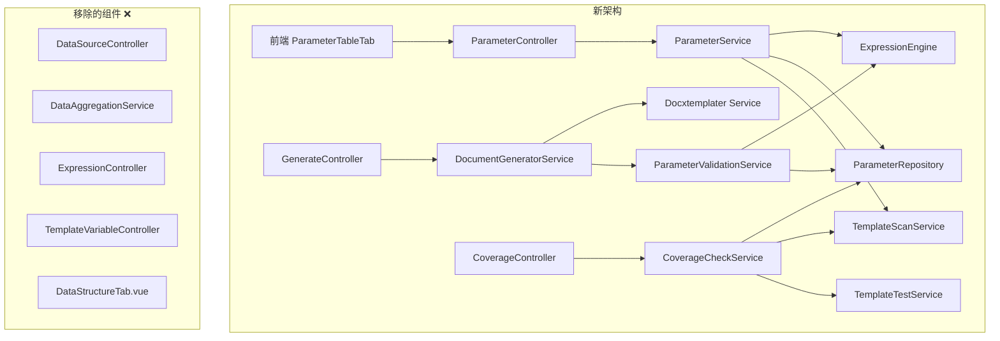
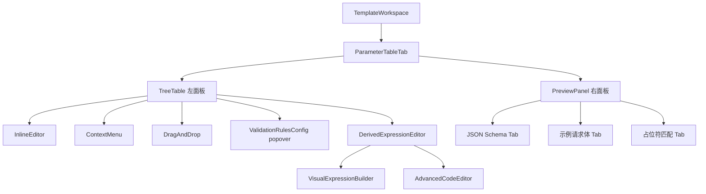

# Design Document: Template Parameter Redesign

## Overview

本设计将模板参数管理从"DataSource + Expression + TemplateVariable 手动绑定"三层架构重构为统一的"参数表 (Parameter Table)"模型。核心变更：

1. **新建 `template_parameters` 表**：通过 `parent_id` 自引用外键支持最大 5 层嵌套的树形结构，统一管理 REQUEST 和 DERIVED 两类参数
2. **新建 ParameterController / ParameterService**：提供参数 CRUD、扫描关联、参数 Schema 端点
3. **新建 TemplateScanService**：从 TemplateVariableService 提取并增强占位符扫描逻辑，支持 dot-notation 和 loop 语法解析
4. **新建 ParameterValidationService**：文档生成前验证参数类型、必填、validation_rules，支持递归嵌套验证
5. **简化 DocumentGeneratorService**：三步管道（验证参数 → 计算衍生参数 → 渲染模板），移除 DataAggregationService
6. **重构 CoverageCheckService**：从绑定覆盖率改为三维覆盖率（Branch / Loop / Parameter），基于测试用例执行结果
7. **前端 ParameterTableTab 替代 DataStructureTab**：Tree Table + Preview Panel + Visual Expression Builder
8. **Flyway V37 迁移**：创建 template_parameters → 迁移数据 → 删除 data_sources / expressions / template_variables
9. **彻底移除旧代码**：DataSource*、Expression*（Controller/Service/Entity/Repository/DTO）、TemplateVariable* 全部删除

## Architecture

### 系统架构变更



### 后端分层

| 层 | 组件 | 职责 |
|---|---|---|
| Controller | ParameterController | 参数 CRUD、扫描、auto-create、parameter-schema |
| Service | ParameterService | 参数业务逻辑、树形构建、验证规则校验 |
| Service | TemplateScanService | .docx 占位符扫描、dot-notation/loop 解析 |
| Service | ParameterValidationService | 文档生成时参数验证、递归嵌套验证、validation_rules 校验 |
| Service | CoverageCheckService (重构) | 三维覆盖率计算（Branch/Loop/Parameter） |
| Service | DocumentGeneratorService (简化) | 三步管道：验证 → 衍生计算 → 渲染 |
| Repository | ParameterRepository | template_parameters 表 CRUD |
| Entity | ParameterDefinition | JPA 实体映射 |

### 前端组件架构



## Components and Interfaces

### 1. ParameterController

```java
@RestController
public class ParameterController {
    // 参数 CRUD
    @PostMapping("/api/templates/{templateId}/parameters")        // → 201
    @GetMapping("/api/templates/{templateId}/parameters")         // → 200 (tree)
    @GetMapping("/api/templates/{templateId}/parameters?flat=true") // → 200 (flat + path)
    @PutMapping("/api/parameters/{id}")                           // → 200
    @DeleteMapping("/api/parameters/{id}")                        // → 204
    
    // 扫描与自动创建
    @PostMapping("/api/templates/{templateId}/parameters/scan")        // → 200
    @PostMapping("/api/templates/{templateId}/parameters/auto-create") // → 201
    
    // 参数 Schema
    @GetMapping("/api/templates/{templateId}/parameter-schema")   // → 200
}
```

### 2. ParameterService

```java
@Service
public class ParameterService {
    // CRUD
    ParameterDTO createParameter(Long templateId, CreateParameterRequest req);
    List<ParameterDTO> getParameterTree(Long templateId);
    List<ParameterDTO> getParameterFlat(Long templateId);
    ParameterDTO updateParameter(Long id, UpdateParameterRequest req);
    void deleteParameter(Long id);
    
    // 扫描关联
    ScanResultDTO scanPlaceholders(Long templateId);
    List<ParameterDTO> autoCreateParameters(Long templateId);
    
    // Schema
    ParameterSchemaDTO getParameterSchema(Long templateId);
    
    // 内部方法
    String computeParameterPath(ParameterDefinition param);
    void validateDepth(Long parentId, int currentDepth);
    void validateName(String name);
    void validateParentType(ParameterDefinition parent);
    void detectCircularDependency(Long templateId, String expressionText, String paramName);
    void validateValidationRules(String dataType, Map<String, Object> rules);
}
```

### 3. TemplateScanService

从 TemplateVariableService.extractVariableNames 提取并增强：

```java
@Service
public class TemplateScanService {
    // 扫描 .docx 文件中的所有占位符
    List<PlaceholderInfo> scanPlaceholders(String templateFilePath);
    
    // 从 .docx ZIP 中提取 XML 内容
    String extractXmlFromDocx(InputStream docxStream);
    
    // 解析占位符为结构化信息（支持 dot-notation、loop、条件分支）
    List<PlaceholderInfo> parsePlaceholders(String xmlContent);
    
    // PlaceholderInfo 包含：
    // - name: 占位符名称
    // - fullPath: 完整路径 (e.g., "company.address.city")
    // - type: SIMPLE | OBJECT_PATH | LOOP | CONDITION
    // - children: 子占位符（用于 loop 内部字段）
    // - segments: 路径分段 ["company", "address", "city"]
}
```

### 4. ParameterValidationService

```java
@Service
public class ParameterValidationService {
    // 验证并构建完整数据上下文
    Map<String, Object> validateAndBuildContext(Long templateId, Map<String, Object> params);
    
    // 验证单个参数值
    void validateParameterValue(ParameterDefinition param, Object value, String path);
    
    // 验证 validation_rules
    void applyValidationRules(ParameterDefinition param, Object value, String path);
    
    // 递归验证嵌套结构
    void validateNestedObject(List<ParameterDefinition> children, Map<String, Object> obj, String parentPath);
    void validateNestedArray(List<ParameterDefinition> children, List<?> array, String parentPath);
    
    // 计算衍生参数
    Map<String, Object> evaluateDerivedParameters(List<ParameterDefinition> derivedParams, Map<String, Object> context);
}
```

### 5. CoverageCheckService (重构)

```java
@Service
public class CoverageCheckService {
    CoverageReport checkCoverage(Long templateId);
    CoverageReport checkCoverage(Long templateId, double threshold);
    
    // 三维覆盖率计算
    double computeBranchCoverage(List<PlaceholderInfo> conditions, List<TestCaseExecution> executions);
    double computeLoopCoverage(List<PlaceholderInfo> loops, List<TestCaseExecution> executions);
    double computeParameterCoverage(List<ParameterDefinition> params, List<TestCaseExecution> executions);
    
    List<UncoveredItem> findUncoveredItems(...);
}
```

### 6. 前端 API 模块 (`src/api/parameters.ts`)

```typescript
// CRUD
export function getParameters(templateId: number): Promise<ParameterDTO[]>
export function getParametersFlat(templateId: number): Promise<ParameterDTO[]>
export function createParameter(templateId: number, data: CreateParameterRequest): Promise<ParameterDTO>
export function updateParameter(id: number, data: UpdateParameterRequest): Promise<ParameterDTO>
export function deleteParameter(id: number): Promise<void>

// 扫描
export function scanPlaceholders(templateId: number): Promise<ScanResultDTO>
export function autoCreateParameters(templateId: number): Promise<ParameterDTO[]>

// Schema
export function getParameterSchema(templateId: number): Promise<ParameterSchemaDTO>
```

### 7. 前端组件

| 组件 | 路径 | 职责 |
|---|---|---|
| ParameterTableTab | views/template-workspace/components/ParameterTableTab.vue | 主容器，双面板布局 |
| ParameterTreeTable | views/template-workspace/components/ParameterTreeTable.vue | 树表格，内联编辑 |
| ParameterPreviewPanel | views/template-workspace/components/ParameterPreviewPanel.vue | JSON Schema / 示例 / 匹配 |
| ValidationRulesPopover | views/template-workspace/components/ValidationRulesPopover.vue | 校验规则配置弹出面板 |
| DerivedExpressionEditor | views/template-workspace/components/DerivedExpressionEditor.vue | 衍生参数表达式编辑器 |
| VisualExpressionBuilder | views/template-workspace/components/VisualExpressionBuilder.vue | 可视化表达式构建器 |
| ParameterTemplateMenu | views/template-workspace/components/ParameterTemplateMenu.vue | 参数模板下拉菜单 |


## Data Models

### 1. template_parameters 表 (Flyway V37)

```sql
CREATE TABLE template_parameters (
    id              BIGSERIAL PRIMARY KEY,
    template_id     BIGINT NOT NULL REFERENCES templates(id) ON DELETE CASCADE,
    parent_id       BIGINT REFERENCES template_parameters(id) ON DELETE CASCADE,
    name            VARCHAR(100) NOT NULL,
    parameter_type  VARCHAR(20) NOT NULL DEFAULT 'REQUEST',  -- REQUEST | DERIVED
    data_type       VARCHAR(20) NOT NULL DEFAULT 'STRING',   -- STRING | NUMBER | DATE | BOOLEAN | ARRAY | OBJECT
    required        BOOLEAN NOT NULL DEFAULT FALSE,
    default_value   TEXT,
    description     TEXT,
    sort_order      INT NOT NULL DEFAULT 0,
    expression_text TEXT,           -- DERIVED 参数的表达式
    expression_type VARCHAR(20),    -- JAVASCRIPT | EXCEL_FORMULA
    validation_rules JSONB,         -- 校验规则 JSON
    version         INT NOT NULL DEFAULT 0,  -- 乐观锁
    created_at      TIMESTAMPTZ NOT NULL DEFAULT NOW(),
    updated_at      TIMESTAMPTZ NOT NULL DEFAULT NOW(),
    
    CONSTRAINT uq_template_parameters_scope_name 
        UNIQUE (template_id, parent_id, name),
    CONSTRAINT chk_parameter_type 
        CHECK (parameter_type IN ('REQUEST', 'DERIVED')),
    CONSTRAINT chk_data_type 
        CHECK (data_type IN ('STRING', 'NUMBER', 'DATE', 'BOOLEAN', 'ARRAY', 'OBJECT')),
    CONSTRAINT chk_derived_expression 
        CHECK (parameter_type != 'DERIVED' OR (expression_text IS NOT NULL AND expression_text != '')),
    CONSTRAINT chk_request_no_expression 
        CHECK (parameter_type != 'REQUEST' OR expression_text IS NULL),
    CONSTRAINT chk_expression_type 
        CHECK (expression_type IS NULL OR expression_type IN ('JAVASCRIPT', 'EXCEL_FORMULA')),
    CONSTRAINT chk_name_pattern 
        CHECK (name ~ '^[a-zA-Z_][a-zA-Z0-9_-]*$')
);

-- 索引
CREATE INDEX idx_template_parameters_template_id ON template_parameters(template_id);
CREATE INDEX idx_template_parameters_parent_id ON template_parameters(parent_id);

-- 处理 UNIQUE 约束中 parent_id 为 NULL 的情况（PostgreSQL 中 NULL != NULL）
CREATE UNIQUE INDEX uq_template_parameters_root_name 
    ON template_parameters(template_id, name) WHERE parent_id IS NULL;
```

> **设计决策**：PostgreSQL 的 UNIQUE 约束对 NULL 值不生效（两个 NULL 不相等），因此需要额外创建一个 partial unique index `WHERE parent_id IS NULL` 来保证根级参数名唯一。非根级参数由 `(template_id, parent_id, name)` 的 UNIQUE 约束保证。

### 2. ParameterDefinition Entity

```java
@Entity
@Table(name = "template_parameters")
@Filter(name = "tenantFilter", condition = "template_id IN (SELECT id FROM templates WHERE tenant_id = :tenantId)")
public class ParameterDefinition {
    @Id
    @GeneratedValue(strategy = GenerationType.IDENTITY)
    private Long id;

    @Column(name = "template_id", nullable = false)
    private Long templateId;

    @Column(name = "parent_id")
    private Long parentId;

    @Column(name = "name", nullable = false, length = 100)
    private String name;

    @Column(name = "parameter_type", nullable = false, length = 20)
    private String parameterType = "REQUEST";  // REQUEST | DERIVED

    @Column(name = "data_type", nullable = false, length = 20)
    private String dataType = "STRING";

    @Column(name = "required", nullable = false)
    private boolean required = false;

    @Column(name = "default_value", columnDefinition = "TEXT")
    private String defaultValue;

    @Column(name = "description", columnDefinition = "TEXT")
    private String description;

    @Column(name = "sort_order", nullable = false)
    private int sortOrder = 0;

    @Column(name = "expression_text", columnDefinition = "TEXT")
    private String expressionText;

    @Column(name = "expression_type", length = 20)
    private String expressionType;

    @Column(name = "validation_rules", columnDefinition = "JSONB")
    @JdbcTypeCode(SqlTypes.JSON)
    private String validationRules;

    @Version
    @Column(name = "version", nullable = false)
    private int version = 0;

    @Column(name = "created_at", nullable = false, updatable = false)
    private Instant createdAt;

    @Column(name = "updated_at", nullable = false)
    private Instant updatedAt;

    @PrePersist
    protected void onCreate() {
        Instant now = Instant.now();
        this.createdAt = now;
        this.updatedAt = now;
    }

    @PreUpdate
    protected void onUpdate() {
        this.updatedAt = Instant.now();
    }
}
```

### 3. DTO 定义

```java
// 响应 DTO（树形结构）
public class ParameterDTO {
    private Long id;
    private Long templateId;
    private Long parentId;
    private String name;
    private String parameterType;
    private String dataType;
    private boolean required;
    private String defaultValue;
    private String description;
    private int sortOrder;
    private String expressionText;
    private String expressionType;
    private Map<String, Object> validationRules;
    private int version;
    private String parameterPath;       // 计算得出的完整路径
    private List<ParameterDTO> children; // 子参数列表
    private Instant createdAt;
    private Instant updatedAt;
}

// 创建请求
public record CreateParameterRequest(
    @NotBlank String name,
    String parameterType,    // 默认 REQUEST
    String dataType,         // 默认 STRING
    Boolean required,
    String defaultValue,
    String description,
    Integer sortOrder,
    String expressionText,
    String expressionType,
    Map<String, Object> validationRules,
    Long parentId            // 可选，NULL 表示根级
) {}

// 更新请求
public record UpdateParameterRequest(
    String name,
    String parameterType,
    String dataType,
    Boolean required,
    String defaultValue,
    String description,
    Integer sortOrder,
    String expressionText,
    String expressionType,
    Map<String, Object> validationRules
) {}

// 扫描结果
public record ScanResultDTO(
    List<PlaceholderInfo> matched,
    List<PlaceholderInfo> unmatchedPlaceholders,
    List<ParameterDTO> unusedParameters
) {}

// 占位符信息
public record PlaceholderInfo(
    String name,
    String fullPath,
    String type,           // SIMPLE | OBJECT_PATH | LOOP | CONDITION
    List<String> segments,
    List<PlaceholderInfo> children
) {}

// 参数 Schema
public record ParameterSchemaDTO(
    String templateName,
    int templateVersion,
    int totalParameterCount,
    int requiredParameterCount,
    List<ParameterSchemaEntry> parameters,
    Map<String, Object> sampleRequestBody
) {}
```

### 4. CoverageReport DTO (重构)

```java
public class CoverageReport {
    private Long templateId;
    private String templateName;
    
    // 三维覆盖率
    private double branchCoverage;       // 分支覆盖率 %
    private double loopCoverage;         // 循环覆盖率 %
    private double parameterCoverage;    // 参数覆盖率 %
    private double overallCoverage;      // 加权平均 %
    
    // 统计
    private int totalBranches;           // 条件分支总数 × 2
    private int coveredBranches;
    private int totalLoopScenarios;      // 循环场景总数 × 2
    private int coveredLoopScenarios;
    private int totalParameters;
    private int coveredParameters;
    
    // 未覆盖项
    private List<UncoveredItem> uncoveredItems;
    
    // 阈值
    private boolean belowThreshold;
    private double threshold;
    private Instant checkedAt;
    
    // 警告
    private List<String> warnings;
}

public record UncoveredItem(
    String type,       // BRANCH | LOOP | PARAMETER
    String name,       // 条件名/循环变量名/参数名
    String missingPath // true/false 或 empty/non-empty 或 null
) {}
```

### 5. validation_rules JSONB 结构

```json
{
  "not_null": true,
  "not_blank": true,
  "min_length": 1,
  "max_length": 100,
  "min": 0,
  "max": 999999,
  "pattern": "^[A-Z].*",
  "enum_values": ["OPTION_A", "OPTION_B", "OPTION_C"],
  "min_items": 1,
  "max_items": 50,
  "custom_message": "自定义错误提示"
}
```

规则与 data_type 的兼容性矩阵：

| 规则 | STRING | NUMBER | DATE | BOOLEAN | ARRAY | OBJECT |
|------|--------|--------|------|---------|-------|--------|
| not_null | ✓ | ✓ | ✓ | ✓ | ✓ | ✓ |
| not_blank | ✓ | ✗ | ✗ | ✗ | ✗ | ✗ |
| min_length | ✓ | ✗ | ✗ | ✗ | ✗ | ✗ |
| max_length | ✓ | ✗ | ✗ | ✗ | ✗ | ✗ |
| min | ✗ | ✓ | ✗ | ✗ | ✗ | ✗ |
| max | ✗ | ✓ | ✗ | ✗ | ✗ | ✗ |
| pattern | ✓ | ✗ | ✗ | ✗ | ✗ | ✗ |
| enum_values | ✓ | ✓ | ✗ | ✗ | ✗ | ✗ |
| min_items | ✗ | ✗ | ✗ | ✗ | ✓ | ✗ |
| max_items | ✗ | ✗ | ✗ | ✗ | ✓ | ✗ |
| custom_message | ✓ | ✓ | ✓ | ✓ | ✓ | ✓ |

### 6. Flyway V37 迁移 SQL 设计

```sql
-- V37__create_template_parameters_and_migrate_data.sql

-- Step 1: 创建 template_parameters 表
CREATE TABLE template_parameters ( ... );  -- 如上所述

-- Step 2: 迁移 TemplateVariable → REQUEST 参数
INSERT INTO template_parameters (template_id, name, parameter_type, data_type, required, default_value, description, sort_order, created_at, updated_at)
SELECT tv.template_id, tv.name, 'REQUEST', 
       CASE tv.variable_type 
           WHEN 'STRING' THEN 'STRING' WHEN 'NUMBER' THEN 'NUMBER' 
           WHEN 'DATE' THEN 'DATE' WHEN 'BOOLEAN' THEN 'BOOLEAN' 
           ELSE 'STRING' END,
       FALSE, tv.default_value, tv.description, 0, tv.created_at, NOW()
FROM template_variables tv
WHERE tv.binding_source IS NULL 
   OR tv.binding_source != 'EXPRESSION';

-- Step 3: 迁移绑定到 Expression 的 TemplateVariable → DERIVED 参数
INSERT INTO template_parameters (template_id, name, parameter_type, data_type, default_value, description, sort_order, expression_text, expression_type, created_at, updated_at)
SELECT tv.template_id, tv.name, 'DERIVED', 'STRING',
       tv.default_value, tv.description, e.execution_order,
       e.expression_text, e.expression_type, tv.created_at, NOW()
FROM template_variables tv
JOIN expressions e ON e.template_id = tv.template_id AND e.name = tv.binding_field
WHERE tv.binding_source = 'EXPRESSION';

-- Step 4: 迁移独立 Expression（未绑定到任何 TemplateVariable）→ DERIVED 参数
INSERT INTO template_parameters (template_id, name, parameter_type, data_type, description, sort_order, expression_text, expression_type, created_at, updated_at)
SELECT e.template_id, e.name, 'DERIVED', 'STRING',
       e.description, e.execution_order, e.expression_text, e.expression_type, e.created_at, NOW()
FROM expressions e
WHERE NOT EXISTS (
    SELECT 1 FROM template_variables tv 
    WHERE tv.template_id = e.template_id 
      AND tv.binding_source = 'EXPRESSION' 
      AND tv.binding_field = e.name
);

-- Step 5: 删除旧表
DROP TABLE IF EXISTS data_sources CASCADE;
DROP TABLE IF EXISTS expressions CASCADE;
DROP TABLE IF EXISTS template_variables CASCADE;
```

### 7. 前端 TypeScript 类型

```typescript
interface ParameterDTO {
  id: number
  templateId: number
  parentId: number | null
  name: string
  parameterType: 'REQUEST' | 'DERIVED'
  dataType: 'STRING' | 'NUMBER' | 'DATE' | 'BOOLEAN' | 'ARRAY' | 'OBJECT'
  required: boolean
  defaultValue: string | null
  description: string | null
  sortOrder: number
  expressionText: string | null
  expressionType: 'JAVASCRIPT' | 'EXCEL_FORMULA' | null
  validationRules: ValidationRules | null
  version: number
  parameterPath: string
  children: ParameterDTO[]
  createdAt: string
  updatedAt: string
}

interface ValidationRules {
  not_null?: boolean
  not_blank?: boolean
  min_length?: number
  max_length?: number
  min?: number
  max?: number
  pattern?: string
  enum_values?: string[]
  min_items?: number
  max_items?: number
  custom_message?: string
}

interface ScanResultDTO {
  matched: PlaceholderInfo[]
  unmatchedPlaceholders: PlaceholderInfo[]
  unusedParameters: ParameterDTO[]
}

interface PlaceholderInfo {
  name: string
  fullPath: string
  type: 'SIMPLE' | 'OBJECT_PATH' | 'LOOP' | 'CONDITION'
  segments: string[]
  children: PlaceholderInfo[]
}

interface ParameterSchemaDTO {
  templateName: string
  templateVersion: number
  totalParameterCount: number
  requiredParameterCount: number
  parameters: ParameterSchemaEntry[]
  sampleRequestBody: Record<string, unknown>
}

interface CoverageReport {
  templateId: number
  templateName: string
  branchCoverage: number
  loopCoverage: number
  parameterCoverage: number
  overallCoverage: number
  totalBranches: number
  coveredBranches: number
  totalLoopScenarios: number
  coveredLoopScenarios: number
  totalParameters: number
  coveredParameters: number
  uncoveredItems: UncoveredItem[]
  belowThreshold: boolean
  threshold: number
  checkedAt: string
  warnings: string[]
}
```


## Correctness Properties

*A property is a characteristic or behavior that should hold true across all valid executions of a system—essentially, a formal statement about what the system should do. Properties serve as the bridge between human-readable specifications and machine-verifiable correctness guarantees.*

### Property 1: Parameter type determines expression presence

*For any* ParameterDefinition, if parameter_type is DERIVED then expression_text must be non-null and non-empty, and if parameter_type is REQUEST then expression_text must be null. Creating or updating a parameter that violates this invariant shall be rejected.

**Validates: Requirements 1.3, 1.4, 2.6**

### Property 2: Duplicate name rejection within scope

*For any* two ParameterDefinitions with the same template_id, parent_id, and name, the second creation attempt shall be rejected with PARAMETER_DUPLICATE_NAME (HTTP 409). This holds for both root-level parameters (parent_id = NULL) and child parameters.

**Validates: Requirements 1.2, 2.5**

### Property 3: Range constraint consistency

*For any* validation_rules containing a pair of range bounds (min_length/max_length, min/max, or min_items/max_items), the lower bound must be less than or equal to the upper bound. Creating or updating a parameter with an inconsistent range shall be rejected with HTTP 400.

**Validates: Requirements 1.8, 1.9, 1.10**

### Property 4: Validation rules compatibility with data_type

*For any* (data_type, rule_type) pair, if the rule_type is not compatible with the data_type per the compatibility matrix (e.g., min_length for NUMBER, min for STRING), the API shall reject the request with PARAMETER_VALIDATION_RULE_INCOMPATIBLE.

**Validates: Requirements 2.9, 4.35**

### Property 5: validation_rules round-trip

*For any* valid validation_rules JSON object, storing it in a ParameterDefinition and retrieving it shall produce an equivalent JSON structure.

**Validates: Requirements 1.7**

### Property 6: Parameter path computation

*For any* parameter in a tree, the computed parameterPath shall equal the dot-joined names traversing from the root ancestor to the parameter itself (e.g., root "company" → child "address" → grandchild "city" produces "company.address.city").

**Validates: Requirements 1.15, 2.13**

### Property 7: Maximum depth enforcement

*For any* parameter tree, attempting to create a parameter that would result in a nesting depth exceeding 5 levels shall be rejected with PARAMETER_MAX_DEPTH_EXCEEDED.

**Validates: Requirements 1.16**

### Property 8: Parent type constraint

*For any* ParameterDefinition whose data_type is not OBJECT or ARRAY, attempting to add a child parameter (with parent_id referencing it) shall be rejected with PARAMETER_PARENT_TYPE_INVALID.

**Validates: Requirements 2.12**

### Property 9: Cascade deletion preserves tree integrity

*For any* parameter tree, deleting a parent parameter shall also delete all its descendant parameters. After deletion, no parameter with the deleted parent's id as parent_id shall exist.

**Validates: Requirements 1.11, 2.4**

### Property 10: Tree structure correctness

*For any* set of ParameterDefinitions belonging to a template, the GET tree response shall produce a correctly nested structure where each parameter's children array contains exactly the parameters whose parent_id equals the parameter's id, ordered by sort_order ascending at each level.

**Validates: Requirements 2.2**

### Property 11: Parameter name pattern validation

*For any* string that does not match the pattern `^[a-zA-Z_][a-zA-Z0-9_-]*$`, creating or updating a parameter with that name shall be rejected with PARAMETER_INVALID_NAME.

**Validates: Requirements 1.17**

### Property 12: Placeholder parsing round-trip

*For any* .docx XML content containing Docxtemplater placeholders (simple variables, dot-notation paths, loop constructs, nested loops), the TemplateScanService shall extract all placeholder names with correct structure types, path segments, and parent-child relationships.

**Validates: Requirements 3.1, 3.6, 3.7, 3.8**

### Property 13: Scan comparison set partitioning

*For any* set of scanned placeholders P and existing parameter paths Q, the scan result shall partition into: matched = P ∩ Q, unmatched_placeholders = P \ Q, unused_parameters = Q \ P. The three sets shall be disjoint and their union shall equal P ∪ Q.

**Validates: Requirements 3.2**

### Property 14: Auto-create tree construction from paths

*For any* set of dot-notation paths and loop constructs, auto-create shall produce a parameter tree where: each path segment maps to the correct tree level, intermediate segments are created as OBJECT type, loop variables are created as ARRAY type, and leaf parameters default to STRING type.

**Validates: Requirements 3.3**

### Property 15: Data type recommendation from placeholder name

*For any* placeholder name containing keywords ("price", "amount", "count", "total", "qty", "quantity" → NUMBER; "date", "time", "created", "updated" → DATE; "is", "has", "enable", "active", "flag" → BOOLEAN), the recommended data_type shall match the expected type. All other names shall default to STRING.

**Validates: Requirements 4.16**

### Property 16: DERIVED parameter evaluation order

*For any* ordered set of DERIVED parameters evaluated in sort_order, each parameter's expression shall have access to all REQUEST parameters and all previously evaluated DERIVED parameters in the context. The final context shall contain all REQUEST and DERIVED parameter values.

**Validates: Requirements 5.2, 5.5, 6.6**

### Property 17: Circular dependency detection

*For any* set of DERIVED parameters where parameter A's expression references parameter B and parameter B's expression (directly or transitively) references parameter A, the API shall detect the cycle and return PARAMETER_CIRCULAR_DEPENDENCY.

**Validates: Requirements 5.6**

### Property 18: Required parameter handling with defaults

*For any* required REQUEST parameter, if it is missing from the request: if it has a default_value, the default shall be used in the context; if it has no default_value, validation shall fail with PARAMETER_MISSING_REQUIRED.

**Validates: Requirements 6.2, 6.4**

### Property 19: Type validation

*For any* parameter and input value where the value's type does not match the parameter's data_type, validation shall fail with PARAMETER_TYPE_MISMATCH.

**Validates: Requirements 6.3**

### Property 20: Extra parameters are ignored

*For any* request containing parameters not defined in the Parameter_Table, validation shall succeed and the extra parameters shall not appear in the final data context.

**Validates: Requirements 6.5**

### Property 21: Validation rules enforcement

*For any* parameter with validation_rules and a value that violates any active rule (not_null, not_blank, min_length, max_length, min, max, pattern, enum_values, min_items, max_items), validation shall fail with PARAMETER_VALIDATION_FAILED, reporting the parameter name, rule type, constraint value, and actual value. When custom_message is defined, it shall be used as the error detail.

**Validates: Requirements 6.10, 6.11, 6.12, 6.13, 6.14, 6.15, 6.16, 6.17, 6.18**

### Property 22: Multiple validation errors collected

*For any* request where N parameter values fail validation, the response shall contain exactly N error entries in the errors array, each identifying the specific parameter and violation.

**Validates: Requirements 6.19**

### Property 23: Recursive nested validation

*For any* parameter tree with OBJECT and ARRAY types, validation shall recursively validate nested structures: OBJECT children against corresponding JSON object fields, ARRAY children against each array element. Validation errors shall include the full parameter path (e.g., "company.address.city" or "items[2].price").

**Validates: Requirements 6.20, 6.21, 6.22, 6.23**

### Property 24: Parameter schema structure

*For any* parameter tree, the parameter-schema response shall represent OBJECT parameters with children under a "properties" key and ARRAY parameters with children under an "items" key, consistent with JSON Schema conventions. The schema shall include all REQUEST parameters with their name, data_type, required, default_value, description, validation_rules constraints, and nested children.

**Validates: Requirements 7.1, 7.5, 7.6, 7.7**

### Property 25: Parameter schema metadata accuracy

*For any* parameter table, the schema metadata shall report totalParameterCount equal to the total number of parameters (including nested) and requiredParameterCount equal to the count of required parameters.

**Validates: Requirements 7.4**

### Property 26: Sample request body generation

*For any* parameter tree, the sample request body shall contain all parameters in the correct nested JSON structure with example values based on data_type (using default_value when defined).

**Validates: Requirements 7.2**

### Property 27: Branch coverage computation

*For any* set of conditional branches in a template and test case execution results, branchCoverage shall equal (number of branches triggered in both true and false paths across all test cases) / (total conditional branches × 2) × 100%.

**Validates: Requirements 8.2**

### Property 28: Loop coverage computation

*For any* set of loop constructs in a template and test case execution results, loopCoverage shall equal (loop constructs exercised with both empty and non-empty arrays across all test cases) / (total loop constructs × 2) × 100%.

**Validates: Requirements 8.3**

### Property 29: Parameter coverage computation

*For any* set of parameter definitions and test case data, parameterCoverage shall equal (parameters receiving a non-null value in at least one test case) / (total parameters) × 100%.

**Validates: Requirements 8.4**

### Property 30: Overall coverage weighted average

*For any* three coverage dimensions (branch, loop, parameter), overallCoverage shall equal their equal-weighted average. When a dimension has zero items (e.g., no branches), it shall be excluded from the average.

**Validates: Requirements 8.5, 8.7**

### Property 31: Coverage threshold

*For any* (overallCoverage, threshold) pair, belowThreshold shall be true if and only if overallCoverage < threshold.

**Validates: Requirements 8.9**

### Property 32: Data migration correctness

*For any* existing TemplateVariable record: if binding_source is "EXPRESSION" and a matching Expression exists, the migrated parameter shall be DERIVED with the Expression's expression_text and expression_type; otherwise it shall be REQUEST. For any standalone Expression (not bound to any TemplateVariable), it shall be migrated as a DERIVED parameter preserving expression_text, expression_type, and execution_order as sort_order.

**Validates: Requirements 9.2, 9.3, 9.9**


## Error Handling

### 新增 ErrorCode 常量

```java
// ── PARAMETER (参数表) ──
public static final String PARAMETER_NOT_FOUND = "PARAMETER_NOT_FOUND";
public static final String PARAMETER_DUPLICATE_NAME = "PARAMETER_DUPLICATE_NAME";
public static final String PARAMETER_EXPRESSION_REQUIRED = "PARAMETER_EXPRESSION_REQUIRED";
public static final String PARAMETER_INVALID_NAME = "PARAMETER_INVALID_NAME";
public static final String PARAMETER_INVALID_PARENT = "PARAMETER_INVALID_PARENT";
public static final String PARAMETER_PARENT_TYPE_INVALID = "PARAMETER_PARENT_TYPE_INVALID";
public static final String PARAMETER_MAX_DEPTH_EXCEEDED = "PARAMETER_MAX_DEPTH_EXCEEDED";
public static final String PARAMETER_CIRCULAR_DEPENDENCY = "PARAMETER_CIRCULAR_DEPENDENCY";
public static final String PARAMETER_CONCURRENT_MODIFICATION = "PARAMETER_CONCURRENT_MODIFICATION";
public static final String PARAMETER_VALIDATION_RULE_INCOMPATIBLE = "PARAMETER_VALIDATION_RULE_INCOMPATIBLE";
public static final String PARAMETER_INVALID_PATTERN = "PARAMETER_INVALID_PATTERN";
public static final String PARAMETER_MISSING_REQUIRED = "PARAMETER_MISSING_REQUIRED";
public static final String PARAMETER_TYPE_MISMATCH = "PARAMETER_TYPE_MISMATCH";
public static final String PARAMETER_VALIDATION_FAILED = "PARAMETER_VALIDATION_FAILED";
public static final String PARAMETER_EXPRESSION_EVALUATION_FAILED = "PARAMETER_EXPRESSION_EVALUATION_FAILED";
public static final String PARAMETER_SCAN_FAILED = "PARAMETER_SCAN_FAILED";
```

### 错误响应格式

所有参数相关错误遵循现有 BusinessException 模式：

```json
{
  "code": "PARAMETER_VALIDATION_FAILED",
  "message": "参数验证失败",
  "timestamp": "2025-01-01T00:00:00Z",
  "errors": [
    {
      "parameterName": "company.address.city",
      "ruleType": "min_length",
      "constraint": 1,
      "actualValue": "",
      "message": "字符串长度不能小于 1"
    },
    {
      "parameterName": "items[0].price",
      "ruleType": "min",
      "constraint": 0,
      "actualValue": -5,
      "message": "数值不能小于 0"
    }
  ]
}
```

### 错误处理策略

| 场景 | HTTP 状态码 | ErrorCode | 处理方式 |
|------|------------|-----------|---------|
| 参数名重复 | 409 | PARAMETER_DUPLICATE_NAME | DataIntegrityViolationException 捕获 |
| DERIVED 缺少表达式 | 400 | PARAMETER_EXPRESSION_REQUIRED | Service 层校验 |
| 参数名格式非法 | 400 | PARAMETER_INVALID_NAME | Service 层正则校验 |
| 父参数不存在/跨模板 | 400 | PARAMETER_INVALID_PARENT | Service 层校验 |
| 父参数类型非 OBJECT/ARRAY | 400 | PARAMETER_PARENT_TYPE_INVALID | Service 层校验 |
| 超过最大嵌套深度 | 400 | PARAMETER_MAX_DEPTH_EXCEEDED | Service 层递归计算深度 |
| 循环依赖 | 400 | PARAMETER_CIRCULAR_DEPENDENCY | Service 层拓扑排序检测 |
| 乐观锁冲突 | 409 | PARAMETER_CONCURRENT_MODIFICATION | OptimisticLockException 捕获 |
| 校验规则与类型不兼容 | 400 | PARAMETER_VALIDATION_RULE_INCOMPATIBLE | Service 层兼容性矩阵校验 |
| 正则表达式语法错误 | 400 | PARAMETER_INVALID_PATTERN | Pattern.compile 异常捕获 |
| 必填参数缺失 | 400 | PARAMETER_MISSING_REQUIRED | ParameterValidationService |
| 参数类型不匹配 | 400 | PARAMETER_TYPE_MISMATCH | ParameterValidationService |
| 校验规则违反 | 400 | PARAMETER_VALIDATION_FAILED | ParameterValidationService，收集所有错误 |
| 衍生参数计算失败 | 400 | PARAMETER_EXPRESSION_EVALUATION_FAILED | ExpressionEngine 异常捕获 |
| 模板扫描失败 | 500 | PARAMETER_SCAN_FAILED | MinIO/ZIP 读取异常捕获 |

### 乐观锁处理

ParameterDefinition 使用 JPA `@Version` 注解。当 PUT 请求携带的 version 与数据库不一致时，JPA 抛出 `OptimisticLockException`，全局异常处理器捕获并返回 HTTP 409。

### 验证错误收集模式

ParameterValidationService 在文档生成时采用"收集所有错误"模式：遍历所有参数，收集所有验证失败，最终一次性返回包含 errors 数组的响应，而非遇到第一个错误就中断。

## Testing Strategy

### 测试框架

- 后端单元测试：JUnit 5 + Mockito
- 后端属性测试：jqwik（Property-Based Testing）
- 后端集成测试：Testcontainers (PostgreSQL)
- 前端单元测试：Vitest + Vue Test Utils
- 前端属性测试：fast-check

### Property-Based Testing 配置

- 每个属性测试最少 100 次迭代
- 每个属性测试必须引用设计文档中的属性编号
- 标签格式：`Feature: template-parameter-redesign, Property {number}: {property_text}`

### 后端测试计划

#### 属性测试 (jqwik)

| 测试类 | 覆盖属性 | 描述 |
|--------|---------|------|
| ParameterTypeExpressionPropertyTest | Property 1 | 参数类型与表达式存在性约束 |
| ParameterDuplicateNamePropertyTest | Property 2 | 同作用域参数名唯一性 |
| ValidationRulesRangePropertyTest | Property 3 | 范围约束一致性 |
| ValidationRulesCompatibilityPropertyTest | Property 4 | 校验规则与数据类型兼容性 |
| ValidationRulesRoundTripPropertyTest | Property 5 | validation_rules 存取往返 |
| ParameterPathPropertyTest | Property 6 | 参数路径计算 |
| MaxDepthPropertyTest | Property 7 | 最大嵌套深度 |
| ParentTypePropertyTest | Property 8 | 父参数类型约束 |
| CascadeDeletePropertyTest | Property 9 | 级联删除完整性 |
| TreeStructurePropertyTest | Property 10 | 树形结构正确性 |
| NamePatternPropertyTest | Property 11 | 参数名格式校验 |
| PlaceholderParsingPropertyTest | Property 12 | 占位符解析 |
| ScanComparisonPropertyTest | Property 13 | 扫描比较集合分区 |
| AutoCreateTreePropertyTest | Property 14 | 自动创建树构建 |
| DataTypeRecommendationPropertyTest | Property 15 | 数据类型推荐 |
| DerivedEvaluationOrderPropertyTest | Property 16 | 衍生参数求值顺序 |
| CircularDependencyPropertyTest | Property 17 | 循环依赖检测 |
| RequiredParameterPropertyTest | Property 18 | 必填参数处理 |
| TypeValidationPropertyTest | Property 19 | 类型验证 |
| ExtraParameterPropertyTest | Property 20 | 多余参数忽略 |
| ValidationRulesEnforcementPropertyTest | Property 21 | 校验规则执行 |
| MultipleErrorCollectionPropertyTest | Property 22 | 多错误收集 |
| RecursiveValidationPropertyTest | Property 23 | 递归嵌套验证 |
| ParameterSchemaPropertyTest | Property 24 | 参数 Schema 结构 |
| SchemaMetadataPropertyTest | Property 25 | Schema 元数据准确性 |
| SampleRequestBodyPropertyTest | Property 26 | 示例请求体生成 |
| BranchCoveragePropertyTest | Property 27 | 分支覆盖率计算 |
| LoopCoveragePropertyTest | Property 28 | 循环覆盖率计算 |
| ParameterCoveragePropertyTest | Property 29 | 参数覆盖率计算 |
| OverallCoveragePropertyTest | Property 30 | 总体覆盖率加权平均 |
| CoverageThresholdPropertyTest | Property 31 | 覆盖率阈值判断 |
| DataMigrationPropertyTest | Property 32 | 数据迁移正确性 |

#### 单元测试 (JUnit 5)

| 测试类 | 覆盖内容 |
|--------|---------|
| ParameterServiceTest | CRUD 操作、边界条件、错误场景 |
| TemplateScanServiceTest | .docx 扫描、XML 解析、边界条件 |
| ParameterValidationServiceTest | 验证流程、默认值、空参数表 |
| CoverageCheckServiceTest | 覆盖率计算、零分支/循环场景 |

#### 集成测试 (Testcontainers)

| 测试类 | 覆盖内容 |
|--------|---------|
| ParameterRepositoryIntegrationTest | 数据库约束、唯一索引、级联删除 |
| FlywayMigrationV37IntegrationTest | 迁移脚本执行、数据迁移正确性 |
| ParameterControllerIntegrationTest | API 端到端、乐观锁、并发 |

### 前端测试计划

#### 属性测试 (fast-check)

| 测试文件 | 覆盖属性 | 描述 |
|---------|---------|------|
| parameterPath.property.test.ts | Property 6 | 参数路径计算（前端工具函数） |
| dataTypeRecommendation.property.test.ts | Property 15 | 数据类型推荐逻辑 |
| jsonSchemaGeneration.property.test.ts | Property 24 | JSON Schema 生成 |
| sampleBodyGeneration.property.test.ts | Property 26 | 示例请求体生成 |

#### 组件测试 (Vitest + Vue Test Utils)

| 测试文件 | 覆盖内容 |
|---------|---------|
| ParameterTableTab.test.ts | 双面板布局、工具栏按钮 |
| ParameterTreeTable.test.ts | 树表格渲染、内联编辑、展开/折叠 |
| ParameterPreviewPanel.test.ts | 三个预览标签页 |
| ValidationRulesPopover.test.ts | 校验规则配置面板 |
| DerivedExpressionEditor.test.ts | 表达式编辑器 |

### 要移除的文件清单

#### 后端 Java 文件

**Controller:**
- `DataSourceController.java`
- `ExpressionController.java`
- `TemplateVariableController.java`

**Service:**
- `DataSourceCrudService.java`
- `DataAggregationService.java`
- `HttpApiDataSourceService.java`
- `DatabaseDataSourceService.java`
- `InternalSystemDataSourceService.java`
- `DataSourceCacheService.java`
- `ExpressionCrudService.java`
- `TemplateVariableService.java`
- `DataPipelineService.java` (接口)
- `DataPipelineServiceImpl.java`

**Entity:**
- `DataSource.java`
- `DataSourceType.java`
- `Expression.java`
- `TemplateVariable.java`

**Repository:**
- `DataSourceRepository.java`
- `ExpressionRepository.java`
- `TemplateVariableRepository.java`

**DTO:**
- `DataSourceDTO.java`
- `DataSourceHealthDTO.java`
- `CreateDataSourceRequest.java`
- `UpdateDataSourceRequest.java`
- `CreateExpressionRequest.java`
- `UpdateExpressionRequest.java`
- `ExpressionDTO.java` (后端 DTO)
- `TemplateVariableDTO.java`
- `BindVariableRequest.java`

**测试文件:**
- `DataSourceCrudServiceTest.java`
- `DatabaseDataSourceServiceTest.java`
- `HttpApiDataSourceServiceTest.java`
- `InternalSystemDataSourceServiceTest.java`
- `DataSourceCacheServiceTest.java`
- `DataSourceErrorPropagationPropertyTest.java`
- `DataAggregationServiceTest.java`
- `DataPipelineServiceImplTest.java`
- `ExpressionCrudServiceTest.java`

#### 需要更新的后端文件

- `DocumentGeneratorService.java` — 移除 DataAggregationService、dataSourceCb
- `CompositeGeneratorService.java` — 移除 DataAggregationService、dataSourceCb
- `TemplatePreviewService.java` — 移除 DataAggregationService
- `CoverageCheckService.java` — 移除 DataSource/Expression 依赖，重构为三维覆盖率
- `Resilience4jConfig.java` — 移除 dataSourceCircuitBreaker bean
- `DashboardController.java` / `DashboardService.java` — 移除数据源健康端点
- `CompositeImportExportService.java` — 移除 DataSource 导入导出
- `TemplateImportExportService.java` — 移除 DataSource 导入导出
- `MigrationService.java` — 移除 DataSource 迁移
- `ErrorCode.java` — 添加 PARAMETER_* 常量
- `SecurityConfig.java` — 添加 /api/templates/*/parameters/** 和 /api/parameters/** 路径
- `OpenApiConfig.java` — 添加 "Parameter" tag
- `RedisIntegrationTest.java` — 移除 DataSourceCacheService 依赖

#### 前端文件

**移除:**
- `src/api/data-sources.ts`
- `src/api/expressions.ts`
- `src/views/data-sources/` (整个目录，但先迁移 KeyValueEditor.vue)
- `src/views/templates/components/ExpressionFormDialog.vue`
- `src/views/templates/components/ExpressionPanel.vue`
- `src/views/template-workspace/components/DataStructureTab.vue`

**迁移:**
- `src/views/data-sources/KeyValueEditor.vue` → `src/components/KeyValueEditor.vue`

**需要更新:**
- `src/stores/templateWorkspace.ts` — 移除 dataSources/expressions，添加 parameters
- `src/composables/useWorkflowSteps.ts` — 替换数据源检查为参数表检查
- `src/router/index.ts` — 移除 data-sources 路由
- `src/layouts/MainLayout.vue` — 移除 data-sources 导航
- `src/views/templates/Detail.vue` — 移除 ExpressionPanel
- `src/views/template-workspace/components/ExportImportTab.vue` — 移除 data-source 导入
- `src/i18n/locales/en-US.json` — 移除 dataSource/expression 键，添加 parameter 键
- `src/i18n/locales/zh-CN.json` — 同上
- `src/i18n/locales/zh-TW.json` — 同上

