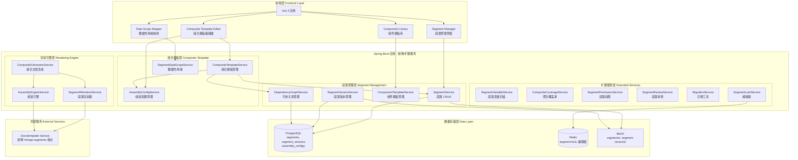
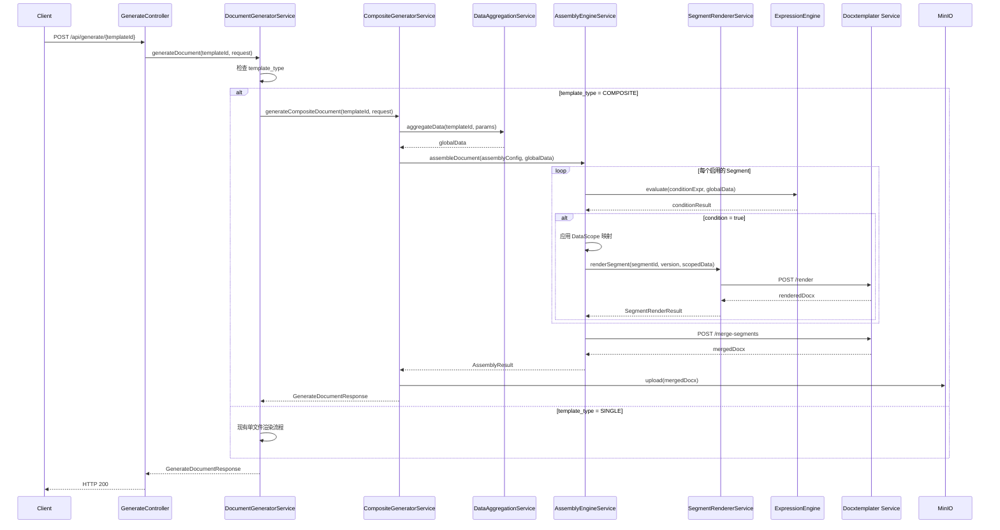
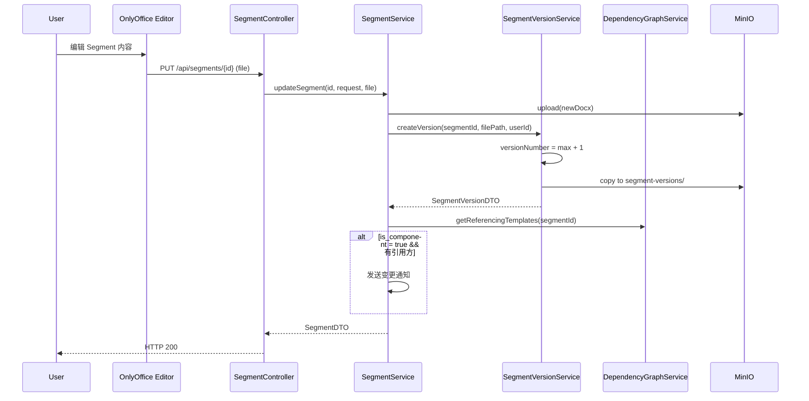
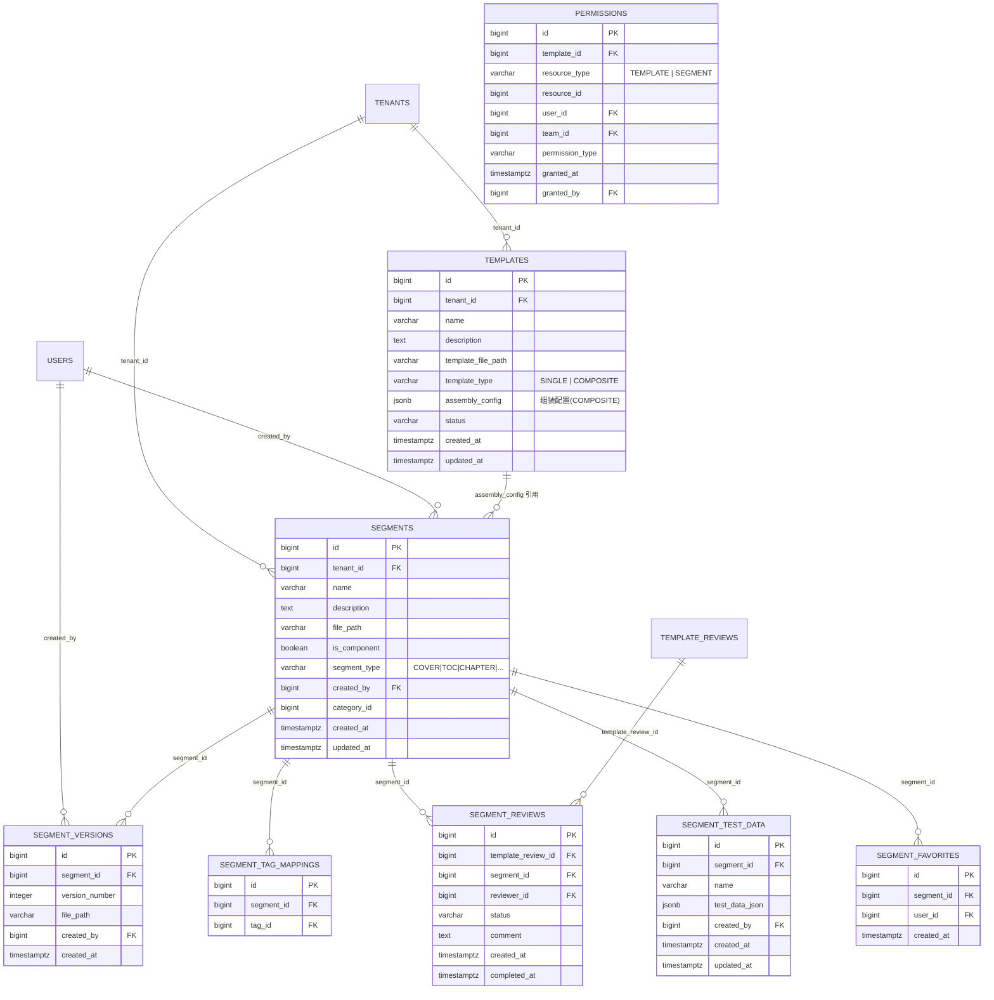

# 设计文档 - 模板分段/组件化

## Overview

模板分段/组件化功能将现有单文件模板体系扩展为支持段落级拆分、独立版本控制和组合装配的组件化架构。核心目标：

- 将长模板拆分为独立可编辑的 Segment（段落），每个 Segment 是一个独立 .docx 文件
- 引入 Composite_Template（组合模板），通过 Assembly_Config（JSONB）定义段落组合关系
- 支持 Component_Template（组件模板）跨多个组合模板复用，修改自动同步
- 段落级独立版本控制、权限控制、审查工作流和变量扫描
- 增量渲染：支持单段落预览和选择性预览
- 完全兼容现有单文件模板，支持渐进式迁移
- 复用现有技术栈和服务模式，保持代码风格一致

### 设计原则

1. **最小侵入**: 通过 `template_type` 字段区分 SINGLE/COMPOSITE，现有 Template 实体和 API 保持不变
2. **复用优先**: 段落权限复用 PermissionService、审查复用 TemplateReviewService、变量扫描复用 TemplateVariableService
3. **引用而非复制**: Component_Template 以引用方式共享，通过 Dependency_Graph 管理引用关系
4. **渐进式迁移**: 提供单文件模板到组合模板的迁移工具，零停机升级

## Architecture

### 系统架构扩展图



### 架构决策

**决策 1: Segment 独立于 Template 实体**
- 选择：创建独立的 `segments` 表，而非在 Template 表中添加 parent_id
- 理由：Segment 有独立的版本控制、权限模型和生命周期，与 Template 的状态机模型不同；独立表避免 Template 表膨胀，查询性能更优

**决策 2: Assembly_Config 存储方式**
- 选择：JSONB 字段存储在 `templates` 表中（通过新增 `assembly_config` 列）
- 理由：Assembly_Config 是组合模板的核心配置，与模板一一对应；JSONB 支持灵活的嵌套结构（排序、条件渲染、分页符、版本锁定、数据作用域）；PostgreSQL JSONB 支持索引和查询

**决策 3: 段落合并方式**
- 选择：在 Docxtemplater Node.js 服务中新增 `/merge-segments` 端点
- 理由：.docx 文件合并需要操作 Open XML 结构，Node.js 生态有成熟的 docx 操作库（如 docx-merger）；复用现有服务容器，无需新增服务

**决策 4: 段落权限模型**
- 选择：扩展现有 `permissions` 表，新增 `resource_type` 和 `resource_id` 列
- 理由：复用现有 PermissionService 的权限检查逻辑，仅需扩展资源类型；避免创建冗余的权限表

**决策 5: 编辑锁实现**
- 选择：Redis 分布式锁（TTL 30 分钟 + 心跳续期）
- 理由：轻量级、高性能、自动过期；复用现有 Redis 基础设施

**决策 6: 组合模板复用 Template 实体**
- 选择：在 Template 表新增 `template_type` 字段（SINGLE/COMPOSITE），组合模板复用 Template 的状态机和审查工作流
- 理由：统一 API 端点（`POST /api/generate/{templateId}`），减少代码重复；组合模板的生命周期与传统模板一致

## Components and Interfaces

### 1. SegmentService — 段落 CRUD 服务

```java
@Service
public class SegmentService {

    private static final Logger log = LoggerFactory.getLogger(SegmentService.class);

    private final SegmentRepository segmentRepository;
    private final SegmentVersionService segmentVersionService;
    private final DependencyGraphService dependencyGraphService;
    private final AuditLogService auditLogService;
    private final MinioClient minioClient;

    // 构造器注入

    @Transactional
    public SegmentDTO createSegment(CreateSegmentRequest request, MultipartFile file, Long userId);

    @Transactional
    public SegmentDTO updateSegment(Long segmentId, UpdateSegmentRequest request, MultipartFile file, Long userId);

    @Transactional
    public void deleteSegment(Long segmentId);
    // 删除前检查引用关系，被引用时返回 SEGMENT_REFERENCED (409)

    @Transactional(readOnly = true)
    public Page<SegmentDTO> listSegments(SegmentQueryRequest query, Pageable pageable);

    @Transactional(readOnly = true)
    public SegmentDTO getSegment(Long segmentId);

    @Transactional
    public SegmentDTO cloneSegment(Long segmentId, Long userId);
    // 名称加 "- 副本" 后缀，MinIO CopyObject 复制文件

    @Transactional
    public SegmentDTO promoteToComponent(Long segmentId);
    // 设置 is_component = true

    @Transactional
    public SegmentDTO demoteFromComponent(Long segmentId);
    // 引用数 >= 2 时拒绝，返回 COMPONENT_REFERENCED (409)
}
```

### 2. SegmentVersionService — 段落版本管理服务

```java
@Service
public class SegmentVersionService {

    private static final Logger log = LoggerFactory.getLogger(SegmentVersionService.class);

    private final SegmentVersionRepository segmentVersionRepository;
    private final SegmentRepository segmentRepository;
    private final MinioClient minioClient;
    private final AuditLogService auditLogService;

    @Transactional
    public SegmentVersionDTO createVersion(Long segmentId, String filePath, Long userId);
    // 版本号严格递增

    @Transactional(readOnly = true)
    public Page<SegmentVersionDTO> listVersions(Long segmentId, Pageable pageable);

    @Transactional
    public SegmentDTO rollbackToVersion(Long segmentId, Long versionId, Long userId);
    // 基于历史版本创建新版本，版本号继续递增

    @Transactional(readOnly = true)
    public VersionDiffResult compareVersions(Long segmentId, int versionA, int versionB);
    // 复用 VersionDiffService 的差异检测逻辑
}
```

### 3. DependencyGraphService — 引用关系管理服务

```java
@Service
public class DependencyGraphService {

    private static final Logger log = LoggerFactory.getLogger(DependencyGraphService.class);

    private final TemplateRepository templateRepository;
    private final SegmentRepository segmentRepository;

    @Transactional(readOnly = true)
    public List<TemplateDTO> getReferencingTemplates(Long segmentId);
    // 查询所有 assembly_config 中引用了该 segmentId 的 Composite_Template

    @Transactional(readOnly = true)
    public int getReferenceCount(Long segmentId);

    @Transactional(readOnly = true)
    public boolean isReferenced(Long segmentId);

    @Transactional(readOnly = true)
    public List<SegmentDTO> getSegmentsForTemplate(Long templateId);
    // 从 assembly_config 中提取所有 segment 引用
}
```

### 4. CompositeTemplateService — 组合模板管理服务

```java
@Service
public class CompositeTemplateService {

    private static final Logger log = LoggerFactory.getLogger(CompositeTemplateService.class);

    private final TemplateRepository templateRepository;
    private final SegmentRepository segmentRepository;
    private final AssemblyConfigService assemblyConfigService;
    private final TemplateStateMachineService stateMachineService;

    @Transactional
    public TemplateDTO createCompositeTemplate(CreateCompositeTemplateRequest request, Long userId);
    // template_type = COMPOSITE

    @Transactional
    public TemplateDTO updateAssemblyConfig(Long templateId, UpdateAssemblyConfigRequest request);
    // 验证至少一个启用的 Segment，验证所有 Segment ID 存在

    @Transactional
    public TemplateDTO activateCompositeTemplate(Long templateId);
    // 验证所有引用的 Segment 存在且可访问

    @Transactional(readOnly = true)
    public AssemblyConfigDTO getAssemblyConfig(Long templateId);

    @Transactional(readOnly = true)
    public CompositePreviewDTO previewCompositeTemplate(Long templateId, Map<String, Object> testData);
}
```

### 5. SegmentRendererService — 段落渲染器

```java
@Service
public class SegmentRendererService {

    private static final Logger log = LoggerFactory.getLogger(SegmentRendererService.class);

    private final RestTemplate restTemplate;
    private final CircuitBreaker docxtemplaterCb;
    private final SegmentRepository segmentRepository;
    private final SegmentVersionRepository segmentVersionRepository;
    private final MinioClient minioClient;

    public byte[] renderSegment(Long segmentId, Integer versionNumber, Map<String, Object> data);
    // 通过 CircuitBreaker 调用 Docxtemplater /render 端点

    public SegmentRenderResult renderSegmentSafe(Long segmentId, Integer versionNumber, Map<String, Object> data);
    // 捕获异常，返回包含错误信息的结果（部分失败模式）
}
```

### 6. AssemblyEngineService — 组装引擎

```java
@Service
public class AssemblyEngineService {

    private static final Logger log = LoggerFactory.getLogger(AssemblyEngineService.class);

    private final SegmentRendererService segmentRendererService;
    private final ExpressionEngine expressionEngine;
    private final RestTemplate restTemplate;
    private final CircuitBreaker docxtemplaterCb;

    @Value("${docxtemplater.service-url}")
    private String docxtemplaterServiceUrl;

    public AssemblyResult assembleDocument(AssemblyConfig config, Map<String, Object> globalData);
    // 1. 遍历 config 中的 segment 列表
    // 2. 计算条件渲染表达式，跳过条件为 false 的 segment
    // 3. 应用 Segment_Data_Scope 映射数据子集
    // 4. 调用 SegmentRendererService 渲染各 segment
    // 5. 调用 Docxtemplater /merge-segments 合并所有已渲染的 segment
    // 6. 返回合并后的文档和各 segment 渲染耗时统计
}
```

### 7. CompositeGeneratorService — 组合文档生成服务

```java
@Service
public class CompositeGeneratorService {

    private static final Logger log = LoggerFactory.getLogger(CompositeGeneratorService.class);

    private final TemplateRepository templateRepository;
    private final DataAggregationService dataAggregationService;
    private final ExpressionEngine expressionEngine;
    private final AssemblyEngineService assemblyEngineService;
    private final DocumentStorageService documentStorageService;
    private final WatermarkService watermarkService;
    private final CircuitBreaker dataSourceCb;

    public GenerateDocumentResponse generateCompositeDocument(Long templateId, GenerateDocumentRequest request);
    // 1. 执行数据管道（复用现有 DataAggregationService）
    // 2. 调用 AssemblyEngineService 组装文档
    // 3. 应用水印（复用 WatermarkService）
    // 4. 存储文档（复用 DocumentStorageService）
    // 5. 返回包含段落渲染耗时的响应
}
```

### 8. MigrationService — 迁移工具服务

```java
@Service
public class MigrationService {

    private static final Logger log = LoggerFactory.getLogger(MigrationService.class);

    private final TemplateRepository templateRepository;
    private final SegmentService segmentService;
    private final CompositeTemplateService compositeTemplateService;
    private final TemplateStateMachineService stateMachineService;
    private final AuditLogService auditLogService;
    private final MinioClient minioClient;

    @Transactional
    public MigrationResultDTO migrateToComposite(Long templateId, Long userId);
    // 1. 读取原始模板的 .docx 文件
    // 2. 创建单个 Segment（内容为原始 .docx）
    // 3. 创建 Composite_Template + Assembly_Config
    // 4. 迁移数据源、表达式、变量绑定到新模板
    // 5. 归档原始模板
    // 6. 记录审计日志
}
```

### 9. SegmentLockService — 编辑锁服务

```java
@Service
public class SegmentLockService {

    private static final Logger log = LoggerFactory.getLogger(SegmentLockService.class);

    private final StringRedisTemplate redisTemplate;

    private static final String LOCK_KEY_PREFIX = "segment-lock:";
    private static final long LOCK_TTL_MINUTES = 30;

    public boolean acquireLock(Long segmentId, Long userId);

    public void releaseLock(Long segmentId, Long userId);

    public boolean renewLock(Long segmentId, Long userId);

    public LockInfo getLockInfo(Long segmentId);
    // 返回当前持有锁的用户信息

    public Map<Long, LockInfo> getBatchLockInfo(List<Long> segmentIds);
    // 批量查询锁状态
}
```

### 10. SegmentVariableService — 段落变量扫描服务

```java
@Service
public class SegmentVariableService {

    private static final Logger log = LoggerFactory.getLogger(SegmentVariableService.class);

    private final SegmentRepository segmentRepository;
    private final MinioClient minioClient;

    @Transactional
    public List<SegmentVariableDTO> scanVariables(Long segmentId);
    // 复用 TemplateVariableService.extractVariableNames 逻辑
    // 从 Segment 的 .docx ZIP 中提取 word/*.xml 并匹配 Docxtemplater 变量模式

    @Transactional(readOnly = true)
    public List<SegmentVariableDTO> listVariables(Long segmentId);
}
```

### 11. CompositeCoverageService — 聚合覆盖率服务

```java
@Service
public class CompositeCoverageService {

    private static final Logger log = LoggerFactory.getLogger(CompositeCoverageService.class);

    private final SegmentVariableService segmentVariableService;
    private final DependencyGraphService dependencyGraphService;
    private final CoverageCheckService coverageCheckService;

    @Transactional(readOnly = true)
    public CompositeCoverageReport checkCoverage(Long compositeTemplateId);
    // 汇总所有 Segment 的变量，计算整体绑定覆盖率
    // 返回每个 Segment 的独立覆盖率 + 整体覆盖率

    @Transactional(readOnly = true)
    public boolean isBelowThreshold(Long compositeTemplateId, double threshold);
}
```

### 12. SegmentReviewService — 段落审查服务

```java
@Service
public class SegmentReviewService {

    private static final Logger log = LoggerFactory.getLogger(SegmentReviewService.class);

    private final SegmentReviewRepository segmentReviewRepository;
    private final TemplateReviewService templateReviewService;

    @Transactional
    public List<SegmentReviewDTO> createSegmentReviews(Long templateReviewId, List<SegmentReviewerAssignment> assignments);
    // 为每个 Segment 分配独立审查人

    @Transactional
    public SegmentReviewDTO approveSegmentReview(Long segmentReviewId, String comment, Long reviewerId);

    @Transactional
    public SegmentReviewDTO rejectSegmentReview(Long segmentReviewId, String reason, Long reviewerId);

    @Transactional(readOnly = true)
    public List<SegmentReviewDTO> getSegmentReviews(Long templateReviewId);

    void checkAndUpdateCompositeReviewStatus(Long templateReviewId);
    // 所有 Segment 审查通过 → 整体通过；任一驳回 → 整体驳回
}
```

### 13. CompositeImportExportService — 组合模板导入导出服务

```java
@Service
public class CompositeImportExportService {

    private static final Logger log = LoggerFactory.getLogger(CompositeImportExportService.class);

    private final TemplateRepository templateRepository;
    private final SegmentService segmentService;
    private final MinioClient minioClient;

    public byte[] exportAsZip(Long compositeTemplateId);
    // 打包所有 Segment .docx 文件 + config.json 为 ZIP

    public byte[] exportConfig(Long compositeTemplateId);
    // 仅导出 JSON 配置

    @Transactional
    public TemplateDTO importFromZip(MultipartFile zipFile, Long userId);
    // 验证 ZIP 结构 → 创建 Segments → 创建 Composite_Template
    // Component_Template 引用：同名存在则关联，不存在则作为普通 Segment 导入
}
```

### 14. SegmentTestService — 段落测试服务

```java
@Service
public class SegmentTestService {

    private static final Logger log = LoggerFactory.getLogger(SegmentTestService.class);

    private final SegmentTestDataRepository testDataRepository;
    private final SegmentRendererService segmentRendererService;
    private final TemplateTestService templateTestService;

    @Transactional
    public SegmentTestDataDTO saveTestData(Long segmentId, CreateSegmentTestDataRequest request, Long userId);

    @Transactional(readOnly = true)
    public List<SegmentTestDataDTO> listTestData(Long segmentId);

    @Transactional
    public void deleteTestData(Long testDataId);

    public TestResultDTO runSegmentTest(Long segmentId, Long testDataId);
    // 使用测试数据渲染 Segment，与预期结果比对

    public TestReportDTO runAllCompositeTests(Long compositeTemplateId);
    // 运行所有段落级 + 整体级测试用例
}
```

### 15. CompositeMarketService — 组合模板市场服务

```java
@Service
public class CompositeMarketService {

    private static final Logger log = LoggerFactory.getLogger(CompositeMarketService.class);

    private final TemplateMarketService templateMarketService;
    private final SegmentService segmentService;
    private final MinioClient minioClient;

    @Transactional
    public TemplateDTO copyCompositeFromMarket(Long marketTemplateId);
    // 创建完整独立副本：所有 Segment .docx 文件 + Assembly_Config
    // Component_Template 引用断开，作为独立 Segment 复制

    @Transactional
    public MarketTemplateDTO shareCompositeToMarket(Long templateId, String shareScope);
}
```

### 16. SegmentRecommendationService — 段落智能推荐服务

```java
@Service
public class SegmentRecommendationService {

    private static final Logger log = LoggerFactory.getLogger(SegmentRecommendationService.class);

    private final SegmentRepository segmentRepository;
    private final TemplateRepository templateRepository;

    @Transactional(readOnly = true)
    public List<SegmentDTO> recommendSegments(Long compositeTemplateId);
    // 基于当前已添加的段落类型标签，推荐可能需要的其他段落

    @Transactional(readOnly = true)
    public List<DuplicateAnalysisDTO> analyzeDuplicates(Long tenantId);
    // 扫描租户下所有非组件 Segment，识别文本内容重复率 > 80% 的段落
    // 建议提取为 Component_Template
}
```

### 核心交互流程

#### 组合模板文档生成流程



#### 段落版本控制流程




## Data Models

### 数据库表设计

#### Flyway 迁移 V29: 扩展 templates 表 + 创建 segments 表

```sql
-- V29__create_segments_and_extend_templates.sql

-- 1. 扩展 templates 表：添加 template_type 和 assembly_config
ALTER TABLE templates ADD COLUMN template_type VARCHAR(20) NOT NULL DEFAULT 'SINGLE';
ALTER TABLE templates ADD COLUMN assembly_config JSONB;

CREATE INDEX idx_templates_template_type ON templates(template_type);

-- 2. 创建 segments 表
CREATE TABLE segments (
    id BIGSERIAL PRIMARY KEY,
    tenant_id BIGINT NOT NULL REFERENCES tenants(id),
    name VARCHAR(200) NOT NULL,
    description TEXT,
    file_path VARCHAR(500) NOT NULL,
    is_component BOOLEAN NOT NULL DEFAULT FALSE,
    segment_type VARCHAR(30),
    created_by BIGINT NOT NULL REFERENCES users(id),
    category_id BIGINT,
    created_at TIMESTAMPTZ NOT NULL DEFAULT NOW(),
    updated_at TIMESTAMPTZ NOT NULL DEFAULT NOW()
);

CREATE INDEX idx_segments_tenant_id ON segments(tenant_id);
CREATE INDEX idx_segments_is_component ON segments(is_component);
CREATE INDEX idx_segments_created_by ON segments(created_by);
CREATE INDEX idx_segments_category_id ON segments(category_id);
CREATE INDEX idx_segments_name ON segments(tenant_id, name);
```

#### Flyway 迁移 V30: 创建 segment_versions 表

```sql
-- V30__create_segment_versions.sql

CREATE TABLE segment_versions (
    id BIGSERIAL PRIMARY KEY,
    segment_id BIGINT NOT NULL REFERENCES segments(id) ON DELETE CASCADE,
    version_number INTEGER NOT NULL,
    file_path VARCHAR(500) NOT NULL,
    created_by BIGINT NOT NULL REFERENCES users(id),
    created_at TIMESTAMPTZ NOT NULL DEFAULT NOW(),
    CONSTRAINT uq_segment_versions_segment_version UNIQUE (segment_id, version_number)
);

CREATE INDEX idx_segment_versions_segment_id ON segment_versions(segment_id);
```

#### Flyway 迁移 V31: 创建 segment_tag_mappings 表

```sql
-- V31__create_segment_tag_mappings.sql

CREATE TABLE segment_tag_mappings (
    id BIGSERIAL PRIMARY KEY,
    segment_id BIGINT NOT NULL REFERENCES segments(id) ON DELETE CASCADE,
    tag_id BIGINT NOT NULL REFERENCES template_tags(id) ON DELETE CASCADE,
    CONSTRAINT uq_segment_tag_mapping UNIQUE (segment_id, tag_id)
);

CREATE INDEX idx_segment_tag_mappings_segment_id ON segment_tag_mappings(segment_id);
CREATE INDEX idx_segment_tag_mappings_tag_id ON segment_tag_mappings(tag_id);
```

#### Flyway 迁移 V32: 扩展 permissions 表支持段落权限

```sql
-- V32__extend_permissions_for_segments.sql

-- 添加 resource_type 和 resource_id 列，支持多资源类型权限
ALTER TABLE permissions ADD COLUMN resource_type VARCHAR(20) NOT NULL DEFAULT 'TEMPLATE';
ALTER TABLE permissions ADD COLUMN resource_id BIGINT;

-- 将现有 template_id 数据迁移到 resource_id
UPDATE permissions SET resource_id = template_id WHERE resource_type = 'TEMPLATE';

CREATE INDEX idx_permissions_resource ON permissions(resource_type, resource_id);
```

#### Flyway 迁移 V33: 创建 segment_reviews 表

```sql
-- V33__create_segment_reviews.sql

CREATE TABLE segment_reviews (
    id BIGSERIAL PRIMARY KEY,
    template_review_id BIGINT NOT NULL REFERENCES template_reviews(id) ON DELETE CASCADE,
    segment_id BIGINT NOT NULL REFERENCES segments(id),
    reviewer_id BIGINT NOT NULL REFERENCES users(id),
    status VARCHAR(30) NOT NULL DEFAULT 'PENDING',
    comment TEXT,
    created_at TIMESTAMPTZ NOT NULL DEFAULT NOW(),
    completed_at TIMESTAMPTZ
);

CREATE INDEX idx_segment_reviews_template_review_id ON segment_reviews(template_review_id);
CREATE INDEX idx_segment_reviews_segment_id ON segment_reviews(segment_id);
CREATE INDEX idx_segment_reviews_reviewer_id ON segment_reviews(reviewer_id);
```

#### Flyway 迁移 V34: 创建 segment_test_data 表

```sql
-- V34__create_segment_test_data.sql

CREATE TABLE segment_test_data (
    id BIGSERIAL PRIMARY KEY,
    segment_id BIGINT NOT NULL REFERENCES segments(id) ON DELETE CASCADE,
    name VARCHAR(200) NOT NULL,
    test_data_json JSONB NOT NULL,
    created_by BIGINT NOT NULL REFERENCES users(id),
    created_at TIMESTAMPTZ NOT NULL DEFAULT NOW(),
    updated_at TIMESTAMPTZ NOT NULL DEFAULT NOW()
);

CREATE INDEX idx_segment_test_data_segment_id ON segment_test_data(segment_id);
```

#### Flyway 迁移 V35: 创建 segment_favorites 表

```sql
-- V35__create_segment_favorites.sql

CREATE TABLE segment_favorites (
    id BIGSERIAL PRIMARY KEY,
    segment_id BIGINT NOT NULL REFERENCES segments(id) ON DELETE CASCADE,
    user_id BIGINT NOT NULL REFERENCES users(id) ON DELETE CASCADE,
    created_at TIMESTAMPTZ NOT NULL DEFAULT NOW(),
    CONSTRAINT uq_segment_favorites UNIQUE (segment_id, user_id)
);

CREATE INDEX idx_segment_favorites_user_id ON segment_favorites(user_id);
```

### 实体关系图



### Assembly_Config JSONB 结构

```json
{
  "segments": [
    {
      "segmentId": 101,
      "position": 0,
      "enabled": true,
      "pageBreakBefore": false,
      "lockedVersion": null,
      "conditionExpression": null,
      "conditionType": null,
      "dataScope": {
        "companyName": "global.company.name",
        "contractDate": "global.contract.signDate"
      }
    },
    {
      "segmentId": 102,
      "position": 1,
      "enabled": true,
      "pageBreakBefore": true,
      "lockedVersion": 3,
      "conditionExpression": "data.includeAppendix === true",
      "conditionType": "JAVASCRIPT",
      "dataScope": null
    }
  ]
}
```

### 新增 JPA 实体

#### Segment 实体

```java
@Entity
@Table(name = "segments")
@Filter(name = "tenantFilter", condition = "tenant_id = :tenantId")
public class Segment {

    @Id
    @GeneratedValue(strategy = GenerationType.IDENTITY)
    private Long id;

    @Column(name = "tenant_id", nullable = false)
    private Long tenantId;

    @Column(name = "name", nullable = false, length = 200)
    private String name;

    @Column(name = "description", columnDefinition = "TEXT")
    private String description;

    @Column(name = "file_path", nullable = false, length = 500)
    private String filePath;

    @Column(name = "is_component", nullable = false)
    private boolean component = false;

    @Column(name = "segment_type", length = 30)
    private String segmentType;

    @Column(name = "created_by", nullable = false)
    private Long createdBy;

    @Column(name = "category_id")
    private Long categoryId;

    @Column(name = "created_at", nullable = false, updatable = false)
    private Instant createdAt;

    @Column(name = "updated_at", nullable = false)
    private Instant updatedAt;

    @PrePersist
    protected void onCreate() {
        Instant now = Instant.now();
        this.createdAt = now;
        this.updatedAt = now;
    }

    @PreUpdate
    protected void onUpdate() {
        this.updatedAt = Instant.now();
    }

    // getter/setter 省略
}
```

#### SegmentVersion 实体

```java
@Entity
@Table(name = "segment_versions",
        uniqueConstraints = @UniqueConstraint(columnNames = {"segment_id", "version_number"}))
public class SegmentVersion {

    @Id
    @GeneratedValue(strategy = GenerationType.IDENTITY)
    private Long id;

    @Column(name = "segment_id", nullable = false)
    private Long segmentId;

    @Column(name = "version_number", nullable = false)
    private Integer versionNumber;

    @Column(name = "file_path", nullable = false, length = 500)
    private String filePath;

    @Column(name = "created_by", nullable = false)
    private Long createdBy;

    @Column(name = "created_at", nullable = false, updatable = false)
    private Instant createdAt;

    @PrePersist
    protected void onCreate() {
        if (this.createdAt == null) {
            this.createdAt = Instant.now();
        }
    }

    // getter/setter 省略
}
```


## API Design

### 段落管理 API

| 方法 | 路径 | 说明 | 响应码 |
|------|------|------|--------|
| POST | `/api/segments` | 创建段落 | 201 |
| GET | `/api/segments` | 查询段落列表（分页、搜索、筛选） | 200 |
| GET | `/api/segments/{id}` | 获取段落详情 | 200 |
| PUT | `/api/segments/{id}` | 更新段落（含文件上传） | 200 |
| DELETE | `/api/segments/{id}` | 删除段落（被引用时 409） | 204 |
| POST | `/api/segments/{id}/clone` | 复制段落 | 201 |
| POST | `/api/segments/{id}/promote` | 提升为组件模板 | 200 |
| POST | `/api/segments/{id}/demote` | 降级为普通段落 | 200 |
| POST | `/api/segments/{id}/favorite` | 收藏段落 | 201 |
| DELETE | `/api/segments/{id}/favorite` | 取消收藏 | 204 |

### 段落版本 API

| 方法 | 路径 | 说明 | 响应码 |
|------|------|------|--------|
| GET | `/api/segments/{id}/versions` | 获取版本历史（分页） | 200 |
| POST | `/api/segments/{id}/rollback/{versionId}` | 回滚到指定版本 | 200 |
| GET | `/api/segments/{id}/versions/diff` | 版本对比（query: versionA, versionB） | 200 |

### 段落变量 API

| 方法 | 路径 | 说明 | 响应码 |
|------|------|------|--------|
| GET | `/api/segments/{id}/variables` | 获取段落变量列表（自动扫描） | 200 |

### 段落预览 API

| 方法 | 路径 | 说明 | 响应码 |
|------|------|------|--------|
| POST | `/api/segments/{id}/preview` | 单段落预览 | 200 |
| POST | `/api/segments/{id}/test-data` | 保存测试数据集 | 201 |
| GET | `/api/segments/{id}/test-data` | 获取测试数据集列表 | 200 |
| DELETE | `/api/segments/{id}/test-data/{testDataId}` | 删除测试数据集 | 204 |

### 段落权限 API

| 方法 | 路径 | 说明 | 响应码 |
|------|------|------|--------|
| GET | `/api/segments/{id}/permissions` | 查询段落权限 | 200 |
| POST | `/api/segments/{id}/permissions` | 分配段落权限 | 201 |
| DELETE | `/api/segments/{id}/permissions/{permId}` | 撤销段落权限 | 204 |

### 段落编辑锁 API

| 方法 | 路径 | 说明 | 响应码 |
|------|------|------|--------|
| POST | `/api/segments/{id}/lock` | 获取编辑锁 | 200 |
| DELETE | `/api/segments/{id}/lock` | 释放编辑锁 | 204 |
| POST | `/api/segments/{id}/lock/renew` | 续期编辑锁 | 200 |
| GET | `/api/segments/{id}/lock` | 查询锁状态 | 200 |

### 组件模板 API

| 方法 | 路径 | 说明 | 响应码 |
|------|------|------|--------|
| GET | `/api/components` | 查询组件模板列表（分页、搜索） | 200 |
| GET | `/api/components/{id}/references` | 查询组件引用关系 | 200 |

### 组合模板 API

| 方法 | 路径 | 说明 | 响应码 |
|------|------|------|--------|
| POST | `/api/composite-templates` | 创建组合模板 | 201 |
| GET | `/api/composite-templates/{id}/assembly-config` | 获取组装配置 | 200 |
| PUT | `/api/composite-templates/{id}/assembly-config` | 更新组装配置 | 200 |
| POST | `/api/composite-templates/{id}/preview` | 组合模板完整预览 | 200 |
| POST | `/api/composite-templates/{id}/preview/selective` | 选择性预览（指定 Segment 子集） | 200 |
| GET | `/api/composite-templates/{id}/coverage` | 聚合覆盖率报告 | 200 |
| GET | `/api/composite-templates/{id}/segments` | 获取组合模板的段落列表（含缩略信息） | 200 |

### 组合模板审查 API

| 方法 | 路径 | 说明 | 响应码 |
|------|------|------|--------|
| POST | `/api/composite-templates/{id}/reviews` | 提交审查（含段落级审查人分配） | 201 |
| GET | `/api/composite-templates/{id}/reviews/{reviewId}/segments` | 获取段落级审查状态 | 200 |
| PUT | `/api/segment-reviews/{id}/approve` | 段落审查通过 | 200 |
| PUT | `/api/segment-reviews/{id}/reject` | 段落审查驳回 | 200 |

### 迁移 API

| 方法 | 路径 | 说明 | 响应码 |
|------|------|------|--------|
| POST | `/api/templates/{id}/migrate-to-composite` | 单文件模板迁移为组合模板 | 200 |

### 组合模板导入导出 API

| 方法 | 路径 | 说明 | 响应码 |
|------|------|------|--------|
| GET | `/api/composite-templates/{id}/export` | 导出 ZIP（含所有 Segment .docx + config.json） | 200 |
| GET | `/api/composite-templates/{id}/export-config` | 仅导出 JSON 配置 | 200 |
| POST | `/api/composite-templates/import` | 导入 ZIP 还原组合模板 | 201 |

### 仪表板扩展 API

| 方法 | 路径 | 说明 | 响应码 |
|------|------|------|--------|
| GET | `/api/dashboard/segment-stats` | 段落统计信息 | 200 |
| GET | `/api/dashboard/component-ranking` | 组件复用率排行 | 200 |

### 智能推荐 API

| 方法 | 路径 | 说明 | 响应码 |
|------|------|------|--------|
| GET | `/api/composite-templates/{id}/recommendations` | 基于当前段落推荐可能需要的其他段落 | 200 |
| GET | `/api/segments/duplicate-analysis` | 段落复用分析（识别重复内容，建议提取为组件） | 200 |

### Docxtemplater 服务新增端点

| 方法 | 路径 | 说明 |
|------|------|------|
| POST | `/merge-segments` | 合并多个已渲染的 .docx 段落为一个完整文档 |

请求体:
```json
{
  "segments": [
    { "buffer": "<base64>", "pageBreakBefore": false },
    { "buffer": "<base64>", "pageBreakBefore": true }
  ]
}
```

响应: 合并后的 .docx 文件（binary）

### 现有服务集成说明

以下需求通过复用现有服务实现，无需新建服务类：

| 需求 | 复用的现有服务 | 集成方式 |
|------|---------------|----------|
| 需求 13: 定时任务/Webhook | ScheduledTaskService + WebhookService | Composite_Template 复用 Template 实体，现有定时任务和 Webhook 配置直接适用；WebhookService 的 payload 扩展段落级渲染状态字段 |
| 需求 16: 水印安全 | WatermarkService | CompositeGeneratorService 在合并文档后调用 WatermarkService.applyTextWatermark / applyImageWatermark |
| 需求 17: API 注册/限流 | DynamicApiService + RateLimitService | Composite_Template 复用 Template 实体，DynamicApiService 通过 template_type 字段路由到 CompositeGeneratorService；RateLimitService 无需修改 |
| 需求 18: 数据源/表达式 | DataSourceCrudService + ExpressionCrudService + DataPipelineService + DataSourceCacheService | 数据源和表达式关联到 Composite_Template 的 template_id，现有 CRUD 和管道执行逻辑直接适用 |
| 需求 19: 仪表板 | DashboardService | 扩展 SystemOverviewDTO 新增 segmentCount、componentCount、compositeTemplateCount 字段；新增 `/api/dashboard/segment-stats` 和 `/api/dashboard/component-ranking` 端点 |


## Correctness Properties

以下正确性属性将通过 Property-Based Testing (jqwik) 验证。

### Property 1: 段落顺序保持性 (Segment Order Preservation)

```
Property: segmentOrderPreservedAfterAssembly
Description: 组装引擎合并文档后，各段落内容的出现顺序必须与 Assembly_Config 中定义的 position 顺序一致
Formal: ∀ config ∈ ValidAssemblyConfig, ∀ i,j where config.segments[i].position < config.segments[j].position,
        contentOf(segment[i]) appears before contentOf(segment[j]) in mergedDocument
Test Strategy: 生成随机排列的 Segment 列表，渲染合并后验证内容顺序
```

### Property 2: 组件引用完整性 (Component Reference Integrity)

```
Property: componentReferenceIntegrity
Description: 被 Composite_Template 引用的 Component_Template 不可被删除；引用计数必须与实际引用数一致
Formal: ∀ segment ∈ Segments where isReferenced(segment) = true, delete(segment) → Error(SEGMENT_REFERENCED)
        ∧ referenceCount(segment) = |{t ∈ Templates | t.assemblyConfig contains segment.id}|
Test Strategy: 随机创建引用关系，验证删除保护和引用计数一致性
```

### Property 3: 版本号严格递增 (Version Number Monotonicity)

```
Property: segmentVersionMonotonicallyIncreasing
Description: 同一 Segment 的版本号必须严格递增，不允许重复或跳跃
Formal: ∀ segment ∈ Segments, ∀ versions = getVersions(segment),
        ∀ i ∈ [0, |versions|-2], versions[i].versionNumber < versions[i+1].versionNumber
Test Strategy: 对同一 Segment 执行随机次数的保存和回滚操作，验证版本号序列严格递增
```

### Property 4: 数据作用域隔离性 (Data Scope Isolation)

```
Property: dataScopeIsolation
Description: 配置了 DataScope 的 Segment 只能访问映射的数据子集，不能访问全局上下文中未映射的变量
Formal: ∀ segment ∈ AssemblyConfig.segments where segment.dataScope ≠ null,
        renderedData(segment) ⊆ mappedSubset(globalData, segment.dataScope)
Test Strategy: 生成随机全局数据和 DataScope 映射，验证渲染时传入的数据仅包含映射的子集
```

### Property 5: 租户隔离性 (Tenant Isolation)

```
Property: segmentTenantIsolation
Description: 不同租户的 Segment 数据完全隔离，租户 A 不能访问租户 B 的 Segment
Formal: ∀ tenantA, tenantB ∈ Tenants where tenantA ≠ tenantB,
        query(segments, tenantA) ∩ query(segments, tenantB) = ∅
Test Strategy: 创建多租户数据，切换租户上下文后验证查询结果不包含其他租户的 Segment
```

### Property 6: 条件渲染一致性 (Conditional Rendering Consistency)

```
Property: conditionalRenderingConsistency
Description: 条件表达式为 false 的 Segment 不出现在最终文档中；条件为 true 的 Segment 必须出现
Formal: ∀ segment ∈ AssemblyConfig.segments,
        evaluate(segment.conditionExpression, data) = false → segment ∉ mergedDocument
        ∧ evaluate(segment.conditionExpression, data) = true → segment ∈ mergedDocument
Test Strategy: 生成随机条件表达式和数据，验证合并文档中的段落与条件计算结果一致
```

### Property 7: 迁移往返一致性 (Migration Round-Trip)

```
Property: migrationPreservesConfiguration
Description: 单文件模板迁移为组合模板后，使用相同数据生成的文档内容必须与迁移前一致
Formal: ∀ template ∈ SingleTemplates, ∀ data ∈ ValidData,
        generate(template, data) ≈ generate(migrate(template), data)
        (≈ 表示文本内容等价，忽略格式微差)
Test Strategy: 对随机模板执行迁移，使用相同测试数据生成文档，比对文本内容
```

### Property 8: 编辑锁互斥性 (Edit Lock Mutual Exclusion)

```
Property: editLockMutualExclusion
Description: 同一 Segment 在同一时刻最多只有一个用户持有编辑锁
Formal: ∀ segment ∈ Segments, ∀ t ∈ Time,
        |{user | hasLock(segment, user, t)}| ≤ 1
Test Strategy: 并发模拟多用户同时获取同一 Segment 的编辑锁，验证只有一个成功
```

### Property 9: Assembly_Config 验证完备性 (Config Validation Completeness)

```
Property: assemblyConfigValidation
Description: 保存 Assembly_Config 时，所有引用的 Segment ID 必须存在，且至少有一个启用的 Segment
Formal: ∀ config ∈ AssemblyConfig,
        save(config) succeeds → (∀ s ∈ config.segments, exists(s.segmentId))
                                ∧ (∃ s ∈ config.segments, s.enabled = true)
Test Strategy: 生成包含无效 ID 和全部禁用的随机 Assembly_Config，验证保存被拒绝
```

### Property 10: 覆盖率计算正确性 (Coverage Calculation Correctness)

```
Property: compositeCoverageCalculation
Description: 组合模板的聚合覆盖率等于所有 Segment 的已绑定变量总数除以所有 Segment 的变量总数
Formal: ∀ composite ∈ CompositeTemplates,
        coverage(composite) = Σ(boundVars(segment)) / Σ(totalVars(segment)) × 100%
        for all segment ∈ composite.segments
Test Strategy: 创建包含随机变量绑定状态的多段落组合模板，验证聚合覆盖率计算结果
```


## Frontend Components

### 新增前端页面和组件

```
frontend/src/
├── views/
│   ├── segments/
│   │   ├── Index.vue              # 段落列表页
│   │   ├── Detail.vue             # 段落详情页
│   │   ├── Editor.vue             # 段落编辑器（OnlyOffice）
│   │   └── components/
│   │       ├── SegmentFormDialog.vue      # 创建/编辑段落对话框
│   │       ├── SegmentVersionList.vue     # 版本历史列表
│   │       ├── SegmentVariableList.vue    # 变量列表
│   │       └── SegmentPermissionDialog.vue # 权限管理对话框
│   ├── components/                # 组件模板管理
│   │   └── Index.vue              # 组件模板列表页
│   └── composite-templates/
│       ├── Index.vue              # 组合模板列表页
│       ├── Detail.vue             # 组合模板详情页
│       ├── AssemblyEditor.vue     # 组装配置编辑器（拖拽排序）
│       └── components/
│           ├── SegmentCard.vue            # 段落卡片（拖拽项）
│           ├── SegmentSearchPanel.vue     # 段落快速搜索面板
│           ├── DataScopeMapper.vue        # 数据作用域映射器
│           ├── OutlineNavigation.vue      # 大纲导航视图
│           ├── CoverageIndicator.vue      # 覆盖率指标组件
│           ├── SegmentReviewPanel.vue     # 段落审查面板
│           ├── SegmentRecommendPanel.vue  # 智能推荐面板
│           └── MigrationDialog.vue        # 迁移工具对话框
├── api/
│   ├── segments.ts                # 段落 API
│   └── composite-templates.ts     # 组合模板 API
├── composables/
│   ├── useSegmentDrag.ts          # 拖拽排序逻辑
│   ├── useSegmentLock.ts          # 编辑锁管理（心跳续期）
│   └── useAssemblyConfig.ts       # Assembly_Config 撤销/重做
├── stores/
│   └── segment.ts                 # 段落状态管理
└── types/
    └── segment.ts                 # 段落相关 TypeScript 类型
```

### 路由配置扩展

```typescript
// router/index.ts 新增路由
{
  path: 'segments',
  name: 'Segments',
  component: () => import('@/views/segments/Index.vue'),
  meta: { title: 'Segments' },
},
{
  path: 'segments/:id',
  name: 'SegmentDetail',
  component: () => import('@/views/segments/Detail.vue'),
  meta: { title: 'Segment Detail' },
},
{
  path: 'segments/:id/editor',
  name: 'SegmentEditor',
  component: () => import('@/views/segments/Editor.vue'),
  meta: { title: 'Segment Editor' },
},
{
  path: 'components',
  name: 'Components',
  component: () => import('@/views/components/Index.vue'),
  meta: { title: 'Component Templates' },
},
{
  path: 'composite-templates',
  name: 'CompositeTemplates',
  component: () => import('@/views/composite-templates/Index.vue'),
  meta: { title: 'Composite Templates' },
},
{
  path: 'composite-templates/:id',
  name: 'CompositeTemplateDetail',
  component: () => import('@/views/composite-templates/Detail.vue'),
  meta: { title: 'Composite Template Detail' },
},
{
  path: 'composite-templates/:id/assembly',
  name: 'AssemblyEditor',
  component: () => import('@/views/composite-templates/AssemblyEditor.vue'),
  meta: { title: 'Assembly Editor' },
},
```

### i18n 扩展

三个语言文件（en-US.json, zh-CN.json, zh-TW.json）需新增以下 key 前缀：
- `segment.*` — 段落管理相关
- `component.*` — 组件模板相关
- `composite.*` — 组合模板相关
- `assembly.*` — 组装配置相关
- `migration.*` — 迁移工具相关
