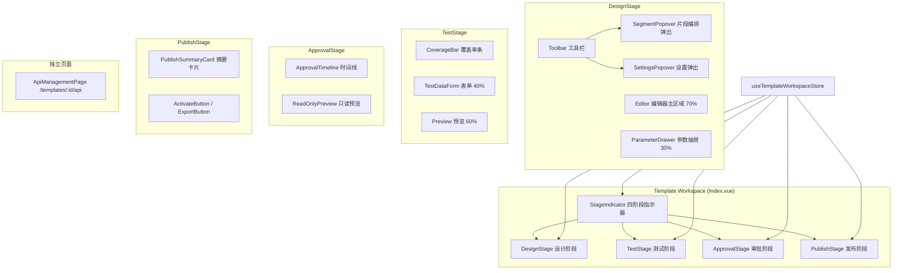
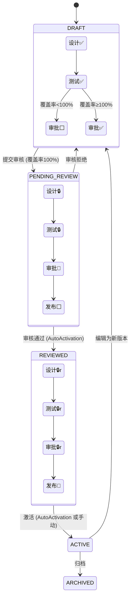

# 设计文档：模板工作流阶段化重构

## 概述

本设计将模板工作区从当前 7 个平铺 Tab + 8 步指示器重构为四阶段工作流（设计 → 测试 → 审批 → 发布）。核心设计理念为"封闭但强大，渐进式披露，一次只做一件事"。

### 设计目标

1. 将分散的 7 个 Tab 整合为 4 个语义清晰的阶段视图
2. 每个阶段聚焦单一目标，不可用操作隐藏而非灰显
3. 后端模板状态机（DRAFT → PENDING_REVIEW → REVIEWED → ACTIVE → ARCHIVED）保持不变
4. API 管理从工作流中移除，作为独立页面存在
5. 新增 `TEMPLATE_EXPORT_NOT_ACTIVE` 错误码，后端强制导出约束

### 变更范围

| 层 | 变更 | 影响 |
|----|------|------|
| 前端 | 重构 Index.vue、新增 4 个阶段组件、新增 API 管理页面、移除 5 个旧 Tab 组件 | 大 |
| 前端 | 新增 `useStageAvailability` composable、重写 `useWorkflowSteps` | 中 |
| 前端 | 新增路由 `/templates/:id/api` | 小 |
| 后端 | `CompositeImportExportService.exportAsZip` 增加状态检查 | 小 |
| 后端 | `ErrorCode` 新增常量 | 小 |
| i18n | 三语言新增阶段名称和提示文本 | 中 |

## 架构

### 整体架构图



### 阶段可用性状态机



说明：✅=可用, ⬜=不可用(灰色), 🔵=当前活跃, 🔒=只读可查看


## 组件与接口

### 1. StageIndicator 组件

替换现有 `WorkflowStepIndicator.vue` 和 `useWorkflowSteps.ts`。

```typescript
// types/workspace.ts — 新增类型
export type StageName = 'design' | 'test' | 'approval' | 'publish'
export type StageStatus = 'not_started' | 'in_progress' | 'completed' | 'readonly'

export interface StageDefinition {
  name: StageName
  label: string           // i18n key
  status: StageStatus
  clickable: boolean      // 是否可点击切换
}
```

```vue
<!-- components/StageIndicator.vue -->
<script setup lang="ts">
defineProps<{
  stages: StageDefinition[]
  currentStage: StageName
}>()
defineEmits<{
  (e: 'stage-click', stage: StageName): void
}>()
</script>
```

视觉规格：
- 四个圆形图标从左到右排列，间距均匀
- 未开始：灰色圆圈 + 灰色虚线连接
- 进行中：蓝色圆圈 + CSS pulse 动画 + 蓝色实线连接到已完成阶段
- 已完成：绿色勾选图标 + 绿色实线连接
- 只读：绿色勾选图标 + 绿色实线连接（与已完成相同视觉，但点击后进入只读视图）
- 不可用：灰色圆圈，`pointer-events: none`

### 2. useStageAvailability Composable

核心逻辑：根据模板状态和覆盖率计算各阶段可用性。

```typescript
// composables/useStageAvailability.ts
export function useStageAvailability(store: ReturnType<typeof useTemplateWorkspaceStore>) {
  const stages = computed<StageDefinition[]>(() => {
    const status = store.templateStatus
    const coverage100 = (store.coverage?.overallCoveragePercent ?? 0) >= 100
    const hasParams = store.parameters.length > 0
    const hasEnabledSegment = store.assemblyConfig?.segments?.some(s => s.enabled && s.filePath) ?? false

    // 设计阶段完成条件：模板已创建 + 至少一个参数 + 至少一个已启用且已编辑的片段
    const designCompleted = !!store.template && hasParams && hasEnabledSegment
    // 测试阶段完成条件：覆盖率 100%
    const testCompleted = coverage100
    // 审批阶段完成条件：状态为 REVIEWED 或 ACTIVE
    const approvalCompleted = ['REVIEWED', 'ACTIVE'].includes(status)
    // 发布阶段完成条件：状态为 ACTIVE
    const publishCompleted = status === 'ACTIVE'

    switch (status) {
      case 'DRAFT':
        return [
          { name: 'design', status: designCompleted ? 'completed' : 'in_progress', clickable: true },
          { name: 'test', status: testCompleted ? 'completed' : (designCompleted ? 'in_progress' : 'not_started'), clickable: true },
          { name: 'approval', status: 'not_started', clickable: coverage100 },
          { name: 'publish', status: 'not_started', clickable: false },
        ]
      case 'PENDING_REVIEW':
        return [
          { name: 'design', status: 'readonly', clickable: true },
          { name: 'test', status: 'readonly', clickable: true },
          { name: 'approval', status: 'in_progress', clickable: true },
          { name: 'publish', status: 'not_started', clickable: false },
        ]
      case 'REVIEWED':
        return [
          { name: 'design', status: 'readonly', clickable: true },
          { name: 'test', status: 'readonly', clickable: true },
          { name: 'approval', status: 'completed', clickable: true },
          { name: 'publish', status: 'in_progress', clickable: true },
        ]
      case 'ACTIVE':
        return [
          { name: 'design', status: 'readonly', clickable: true },
          { name: 'test', status: 'readonly', clickable: true },
          { name: 'approval', status: 'completed', clickable: true },
          { name: 'publish', status: 'completed', clickable: true },
        ]
      case 'ARCHIVED':
        return [
          { name: 'design', status: 'readonly', clickable: true },
          { name: 'test', status: 'readonly', clickable: true },
          { name: 'approval', status: 'readonly', clickable: true },
          { name: 'publish', status: 'readonly', clickable: true },
        ]
      default:
        return [] // fallback
    }
  })

  // 当前活跃阶段（自动聚焦）
  const activeStage = computed<StageName>(() => {
    const s = store.templateStatus
    if (s === 'DRAFT') return 'design'
    if (s === 'PENDING_REVIEW') return 'approval'
    if (s === 'REVIEWED' || s === 'ACTIVE') return 'publish'
    return 'design'
  })

  // 是否只读模式
  const isReadonly = computed(() => store.templateStatus !== 'DRAFT')

  return { stages, activeStage, isReadonly }
}
```

### 3. DesignStage 组件

```
┌─────────────────────────────────────────────────────────┐
│ [片段编排] [导入ZIP] [⚙设置]                    工具栏  │
├───────────────────────────────────┬─────────────────────┤
│                                   │ Parameter Drawer    │
│   OnlyOffice Editor / 片段列表    │ ┌─────────────────┐ │
│   (70% 宽度)                      │ │ [扫描占位符]     │ │
│                                   │ │ 参数树形表格     │ │
│                                   │ │ ...              │ │
│                                   │ └─────────────────┘ │
│                                   │ [收起 ◀]           │
├───────────────────────────────────┴─────────────────────┤
│ Segment Popover (弹出覆盖编辑器区域)                     │
│ Settings Popover (弹出覆盖编辑器区域)                    │
└─────────────────────────────────────────────────────────┘
```

关键接口：
- `ParameterDrawer`: 复用 `ParameterTableTab` 核心功能，以抽屉形式呈现
  - Props: `collapsed: boolean`, `readonly: boolean`
  - Emits: `update:collapsed`
  - 收起时编辑器扩展为 100%
- `SegmentPopover`: 复用 `SegmentArrangementTab` 核心功能
  - 通过 `el-drawer` 或 `el-dialog` 实现弹出面板
  - 关闭时检查未保存更改
- `SettingsPopover`: 复用 `SettingsTab` 子组件
  - 通过 `el-popover` 或 `el-drawer` 实现

> **编辑器实现说明**：当前系统有两种编辑器入口：(1) `VisualEditorTab`（工作区内的片段列表+预览按钮，OnlyOffice 在新窗口打开）和 (2) `Editor.vue`（独立路由页面，内嵌 `OnlyOfficeEditor` 组件通过 DocsAPI 实现 iframe 内联编辑）。DesignStage 的编辑器主区域将复用 `OnlyOfficeEditor` 组件实现内联编辑（与 `Editor.vue` 相同方式），替代当前 `VisualEditorTab` 的新窗口模式。对于多片段模板，编辑器区域顶部显示片段选择器（下拉或 Tab），用户选择片段后加载对应片段的 OnlyOffice 编辑器。

### 4. TestStage 组件

```
┌─────────────────────────────────────────────────────────┐
│ Coverage Bar: [分支 85%] [循环 90%] [参数 100%]          │
├─────────────────────────────────────────────────────────┤
│ 智能引导: "将 contract_type 设为 enterprise 以触发分支"  │
├────────────────────────┬────────────────────────────────┤
│ Test Data Form (40%)   │ Document Preview (60%)         │
│ ┌────────────────────┐ │ ┌────────────────────────────┐ │
│ │ 合同类型: [下拉]   │ │ │                            │ │
│ │ 客户名称: [输入]   │ │ │   实时预览区域             │ │
│ │ 金额: [数字]       │ │ │   (iframe / OnlyOffice)    │ │
│ │ 签约日期: [日期]   │ │ │                            │ │
│ │ ...                │ │ │                            │ │
│ │ [查看JSON] [运行]  │ │ │                            │ │
│ └────────────────────┘ │ └────────────────────────────┘ │
└────────────────────────┴────────────────────────────────┘
```

关键接口：
- `TestDataForm`: 根据参数表自动生成表单
  - Props: `parameters: ParameterDTO[]`, `readonly: boolean`
  - Emits: `update:formData`, `submit`
  - 类型映射：STRING→el-input, NUMBER→el-input-number, BOOLEAN→el-switch, DATE→el-date-picker, enum_values→el-select
  - OBJECT→可折叠嵌套表单组, ARRAY→动态增减列表
- `CoverageBar`: 三维度覆盖率展示
  - 调用 `GET /api/templates/{id}/coverage` 获取 `CoverageReport`
- 预览区域：500ms 防抖后调用预览接口

### 5. ApprovalStage 组件

```
┌──────────────────────────────────┬──────────────────────┐
│ Approval Timeline                │ Read-Only Preview    │
│ ┌──────────────────────────────┐ │ ┌──────────────────┐ │
│ │ ● 张三 - 通过               │ │ │                  │ │
│ │   "模板结构清晰"  2024-01-15│ │ │  模板快照预览    │ │
│ │ ● 李四 - 有条件通过         │ │ │  (只读)          │ │
│ │   "建议增加水印"  2024-01-16│ │ │                  │ │
│ │ ● 王五 - 待审核             │ │ │                  │ │
│ │   ...                       │ │ │                  │ │
│ └──────────────────────────────┘ │ └──────────────────┘ │
│ [提交审核] / [返回修改]          │                      │
└──────────────────────────────────┴──────────────────────┘
```

关键接口：
- `ApprovalTimeline`: 垂直时间线展示审批记录
  - 复用 `el-timeline` + `el-timeline-item`
  - 每条记录：审批人、状态标签、评论、时间戳
- 提交审核按钮：仅在 DRAFT + 覆盖率 100% 时显示
- 返回修改按钮：仅在审核被拒绝时显示
- 审核全部通过后自动刷新并切换到发布阶段

### 6. PublishStage 组件

```
┌─────────────────────────────────────────────────────────┐
│ Publish Summary Card                                     │
│ ┌─────────┬─────────┬─────────┬─────────┐              │
│ │ 版本    │ 参数    │ 覆盖率  │ 审核    │              │
│ │ v3      │ 24个    │ 100%    │ 已通过  │              │
│ └─────────┴─────────┴─────────┴─────────┘              │
│                                                          │
│              [ 🚀 激活 ]  (REVIEWED 状态)                │
│                                                          │
│   [导出 ZIP 包]  [编辑为新版本]  (ACTIVE 状态)           │
└─────────────────────────────────────────────────────────┘
```

### 7. ApiManagementPage 独立页面

路由：`/templates/:id/api`

```
┌─────────────────────────────────────────────────────────┐
│ API 管理 - {模板名称}                    [返回模板列表]  │
├─────────────────────────────────────────────────────────┤
│ ACTIVE 版本列表                                          │
│ ┌─────────────────────────────────────────────────────┐ │
│ │ v3 (当前) | v2 | v1                                 │ │
│ └─────────────────────────────────────────────────────┘ │
│ API 端点信息 (复用 ApiEndpointInfo)                      │
│ API Key 管理                                             │
│ 调用统计                                                 │
└─────────────────────────────────────────────────────────┘
```

### 8. 后端变更

#### ErrorCode 新增

```java
// ErrorCode.java — TEMPLATE 区域新增
public static final String TEMPLATE_EXPORT_NOT_ACTIVE = "TEMPLATE_EXPORT_NOT_ACTIVE";
```

#### CompositeImportExportService 导出约束

```java
// exportAsZip 方法开头增加状态检查
public byte[] exportAsZip(Long compositeTemplateId) {
    Template template = findCompositeTemplateOrThrow(compositeTemplateId);
    if (!"ACTIVE".equals(template.getStatus())) {
        throw new BusinessException(
            ErrorCode.TEMPLATE_EXPORT_NOT_ACTIVE,
            "Only ACTIVE templates can be exported as ZIP",
            HttpStatus.BAD_REQUEST);
    }
    // ... 现有逻辑
}
```

### 9. Index.vue 重构

```vue
<!-- 重构后的 Index.vue 核心结构 -->
<template>
  <div class="template-workspace">
    <el-skeleton v-if="store.loading" :rows="12" animated />
    <div v-else-if="store.criticalError" class="error-page">...</div>
    <template v-else-if="store.template">
      <!-- Header -->
      <div class="workspace-header">...</div>
      <!-- ACTIVE banner -->
      <el-alert v-if="store.isActive" ...>...</el-alert>
      <!-- Stage Indicator (替换 WorkflowStepIndicator) -->
      <StageIndicator
        :stages="stageAvailability.stages.value"
        :current-stage="currentStage"
        @stage-click="handleStageClick"
      />
      <!-- Stage Views (替换 el-tabs) -->
      <KeepAlive>
        <component :is="currentStageComponent" :readonly="stageAvailability.isReadonly.value" />
      </KeepAlive>
    </template>
  </div>
</template>
```

移除的组件引用：
- `ParameterTableTab` (迁移到 ParameterDrawer)
- `SegmentArrangementTab` (迁移到 SegmentPopover)
- `ExportImportTab` (导入→设计工具栏，导出→发布阶段)
- `SettingsTab` (迁移到 SettingsPopover)
- `WorkflowStepIndicator` (替换为 StageIndicator)

### 10. 阶段切换按需加载（需求 15）

阶段切换时的数据按需加载通过 `handleStageClick` 函数实现：

```typescript
// Index.vue 中的阶段切换处理
const stageDataLoaded = reactive({
  test: false,
  approval: false,
})
const stageLoading = ref(false)

async function handleStageClick(stage: StageName) {
  if (stage === currentStage.value) return

  // 按需加载阶段数据
  stageLoading.value = true
  try {
    if (stage === 'test' && !stageDataLoaded.test) {
      await Promise.all([
        store.refreshTestCases(),
        store.refreshCoverage(),
      ])
      stageDataLoaded.test = true
    }
    if (stage === 'approval' && !stageDataLoaded.approval) {
      await store.refreshReviews()
      stageDataLoaded.approval = true
    }
    currentStage.value = stage
  } catch (e: any) {
    // 加载失败仍切换到该阶段，阶段组件内部显示错误+重试
    currentStage.value = stage
  } finally {
    stageLoading.value = false
  }
}
```

加载状态展示：
- `stageLoading` 为 true 时，阶段视图区域显示 `el-skeleton` 骨架屏
- 加载失败时，阶段组件内部通过 `store.warnings` 检测并显示 `el-result` 错误页 + 重试按钮


## 数据模型

### 前端类型变更

```typescript
// types/workspace.ts — 替换现有类型

// 移除
export type StepKey = 'create' | 'data' | 'segments' | 'editor' | 'testing' | 'review' | 'export' | 'settings'
export type TabName = 'dataStructure' | 'segments' | 'editor' | 'testing' | 'reviewPublish' | 'exportImport' | 'settings'

// 新增
export type StageName = 'design' | 'test' | 'approval' | 'publish'
export type StageStatus = 'not_started' | 'in_progress' | 'completed' | 'readonly'

export interface StageDefinition {
  name: StageName
  label: string
  status: StageStatus
  clickable: boolean
}

// 保留 WorkflowStep 接口用于向后兼容（标记 @deprecated）
```

### Store 变更

`useTemplateWorkspaceStore` 无需结构性变更，现有 state 已满足四阶段需求：
- `template`, `assemblyConfig`, `parameters` → 设计阶段
- `testCases`, `testReport`, `coverage` → 测试阶段
- `reviews` → 审批阶段
- `template.status`, `versions` → 发布阶段

新增 computed：
```typescript
// 当前阶段的只读状态
const isStageReadonly = computed(() => templateStatus.value !== 'DRAFT')
```

### 测试数据表单模型

```typescript
// types/testDataForm.ts — 新增
export interface FormField {
  parameterId: number
  name: string
  path: string           // 参数路径，如 "contract.parties[0].name"
  dataType: DataType
  required: boolean
  defaultValue: string | null
  enumValues: string[] | null
  children?: FormField[] // OBJECT 类型的子字段
  isArray?: boolean      // ARRAY 类型标记
}

export interface TestDataFormState {
  fields: FormField[]
  values: Record<string, unknown>  // path -> value 映射
  mode: 'form' | 'json'           // 表单模式 / JSON 编辑模式
}
```

### 参数到表单控件映射规则

| 参数 DataType | validation_rules.enum_values | 表单控件 |
|---------------|------------------------------|----------|
| STRING | 无 | el-input |
| STRING | 有 | el-select |
| NUMBER | 无 | el-input-number |
| NUMBER | 有 | el-select |
| BOOLEAN | — | el-switch |
| DATE | — | el-date-picker |
| OBJECT | — | 可折叠嵌套表单组 (el-collapse-item) |
| ARRAY | — | 动态列表 (el-button 增减 + v-for) |

### 后端数据模型

后端无数据库 schema 变更。仅在 `ErrorCode.java` 新增一个常量。

### 路由变更

```typescript
// router/index.ts — 新增路由
{
  path: 'templates/:id/api',
  name: 'TemplateApiManagement',
  component: () => import('@/views/template-api/Index.vue'),
  meta: { title: 'API Management', requiresAuth: true },
}
```

### i18n Key 结构

```
workspace.stage.design      = "设计" / "Design" / "設計"
workspace.stage.test        = "测试" / "Test" / "測試"
workspace.stage.approval    = "审批" / "Approval" / "審批"
workspace.stage.publish     = "发布" / "Publish" / "發布"
workspace.stage.notAvailable = "完成前置阶段后解锁" / ...
workspace.stage.readonly    = "只读模式" / ...
workspace.coverageBar.branch = "分支覆盖率" / ...
workspace.coverageBar.loop   = "循环覆盖率" / ...
workspace.coverageBar.param  = "参数覆盖率" / ...
workspace.approval.timeline.approved = "通过" / ...
workspace.approval.timeline.rejected = "拒绝" / ...
workspace.approval.timeline.conditional = "有条件通过" / ...
workspace.approval.timeline.pending = "待审核" / ...
workspace.approval.submitReview = "提交审核" / ...
workspace.approval.returnToEdit = "返回修改" / ...
workspace.publish.summary.version = "版本" / ...
workspace.publish.summary.params = "参数数量" / ...
workspace.publish.summary.coverage = "覆盖率" / ...
workspace.publish.summary.reviewStatus = "审核状态" / ...
workspace.publish.activate = "激活" / ...
workspace.publish.exportZip = "导出 ZIP 包" / ...
workspace.publish.newVersion = "编辑为新版本" / ...
workspace.testForm.viewJson = "查看 JSON" / ...
workspace.testForm.viewForm = "表单模式" / ...
workspace.api.title = "API 管理" / ...
workspace.api.versions = "版本列表" / ...
workspace.api.endpoint = "端点信息" / ...
workspace.api.keys = "API Key 管理" / ...
workspace.api.stats = "调用统计" / ...
```


## 正确性属性

*正确性属性是在系统所有有效执行中都应成立的特征或行为——本质上是关于系统应该做什么的形式化陈述。属性是人类可读规范与机器可验证正确性保证之间的桥梁。*

### Property 1: 阶段可用性与完成状态一致性

*对于任意*模板状态 S（DRAFT / PENDING_REVIEW / REVIEWED / ACTIVE / ARCHIVED）和任意覆盖率百分比 C（0-100），以及任意参数数量 P 和片段配置 Seg，`useStageAvailability` 函数返回的四阶段定义数组必须满足：

1. 数组长度恒为 4，顺序恒为 [design, test, approval, publish]
2. 当 S=DRAFT 时：design 和 test 的 clickable=true；approval 的 clickable 当且仅当 C≥100；publish 的 clickable=false
3. 当 S=PENDING_REVIEW 时：design、test 的 status=readonly 且 clickable=true；approval 的 status=in_progress 且 clickable=true；publish 的 clickable=false
4. 当 S=REVIEWED 或 S=ACTIVE 时：所有四个阶段 clickable=true；publish 的 status 为 in_progress 或 completed
5. 当 S=ARCHIVED 时：所有四个阶段 status=readonly 且 clickable=true
6. 设计阶段 completed 当且仅当 template 存在 且 P>0 且 Seg 中至少一个 enabled=true 且 filePath 非空
7. 测试阶段 completed 当且仅当 C≥100
8. 审批阶段 completed 当且仅当 S∈{REVIEWED, ACTIVE}
9. 发布阶段 completed 当且仅当 S=ACTIVE

**Validates: Requirements 2.1, 2.2, 2.3, 2.4, 2.5, 2.6, 3.1, 3.2, 3.3, 3.4**

### Property 2: 参数树到表单控件树同构映射

*对于任意*参数树结构（包含任意深度的 OBJECT/ARRAY 嵌套、任意 DataType 组合、任意 required/defaultValue/enum_values 配置），`buildFormFields` 函数生成的表单字段树必须满足：

1. 表单字段树与参数树同构：每个参数节点对应恰好一个表单字段节点，父子关系保持一致
2. 叶子节点类型映射正确：STRING→input（无 enum）或 select（有 enum）、NUMBER→number-input（无 enum）或 select（有 enum）、BOOLEAN→switch、DATE→date-picker
3. OBJECT 节点生成嵌套表单组，其 children 与参数的 children 一一对应
4. ARRAY 节点标记 isArray=true
5. required=true 的参数对应的表单字段 required=true
6. 有 defaultValue 的参数对应的表单字段初始值等于 defaultValue

**Validates: Requirements 8.1, 8.2, 8.3, 8.4**

### Property 3: 导出约束后端强制

*对于任意*非 ACTIVE 状态的模板（DRAFT / PENDING_REVIEW / REVIEWED / ARCHIVED），调用 `exportAsZip` 方法必须抛出 BusinessException，错误码为 TEMPLATE_EXPORT_NOT_ACTIVE，HTTP 状态码为 400。*对于任意* ACTIVE 状态的模板（且有有效片段），调用 `exportAsZip` 不会抛出该异常。

**Validates: Requirements 12.1**

## 错误处理

### 前端错误处理

| 场景 | 处理方式 |
|------|----------|
| 阶段数据加载失败 | 阶段视图内显示 `el-result` 错误页 + 重试按钮，不影响其他阶段 |
| 预览接口调用失败 | 预览区域显示错误信息 + 重试按钮，保留表单数据 |
| 激活/导出操作失败 | `ElMessage.error` 显示后端错误消息 |
| 提交审核失败 | `ElMessage.error` 显示后端错误消息 |
| 导入 ZIP 失败 | `ElMessage.error` 区分 400（文件无效）和 500（服务器错误） |
| 阶段切换时未保存更改 | `ElMessageBox.confirm` 确认对话框 |

### 后端错误处理

| 场景 | 错误码 | HTTP 状态 |
|------|--------|-----------|
| 非 ACTIVE 模板导出 ZIP | TEMPLATE_EXPORT_NOT_ACTIVE | 400 |
| 模板不存在 | TEMPLATE_NOT_FOUND | 404 |
| 非组合模板 | TEMPLATE_NOT_FOUND | 400 |

### i18n 错误消息映射

```
error.TEMPLATE_EXPORT_NOT_ACTIVE = "仅 ACTIVE 状态的模板可导出 ZIP 包" / "Only ACTIVE templates can be exported as ZIP" / "僅 ACTIVE 狀態的模板可匯出 ZIP 包"
```

## 测试策略

### 属性测试 (PBT)

本功能适合属性测试的部分集中在纯函数逻辑层：

| 属性 | 测试库 | 文件 | 最小迭代 |
|------|--------|------|----------|
| Property 1: 阶段可用性一致性 | fast-check | `frontend/src/__tests__/stageAvailability.property.test.ts` | 100 |
| Property 2: 参数→表单同构 | fast-check | `frontend/src/__tests__/testDataForm.property.test.ts` | 100 |
| Property 3: 导出约束 | jqwik | `backend/src/test/java/com/docgen/property/ExportConstraintPropertyTest.java` | 100 |

每个属性测试必须包含注释标签：
```
// Feature: template-workflow-stages, Property 1: 阶段可用性与完成状态一致性
```

### 单元测试

| 组件/函数 | 测试重点 | 文件 |
|-----------|----------|------|
| StageIndicator.vue | 渲染四阶段、状态样式、点击事件 | `frontend/src/__tests__/StageIndicator.test.ts` |
| DesignStage.vue | 布局比例、抽屉收起/展开、弹出面板 | `frontend/src/__tests__/DesignStage.test.ts` |
| TestStage.vue | 分栏布局、防抖预览、覆盖率条 | `frontend/src/__tests__/TestStage.test.ts` |
| TestDataForm.vue | 控件类型映射、必填标记、默认值 | `frontend/src/__tests__/TestDataForm.test.ts` |
| ApprovalStage.vue | 时间线渲染、按钮条件显示 | `frontend/src/__tests__/ApprovalStage.test.ts` |
| PublishStage.vue | 摘要卡片、按钮切换 | `frontend/src/__tests__/PublishStage.test.ts` |
| ApiManagementPage | 路由、内容区域 | `frontend/src/__tests__/ApiManagementPage.test.ts` |
| CompositeImportExportService | 导出状态约束 | `backend/src/test/java/com/docgen/service/CompositeImportExportServiceTest.java` |

### 集成测试

| 场景 | 测试重点 |
|------|----------|
| 导出约束端到端 | 非 ACTIVE 模板调用导出 API 返回 400 |
| 阶段切换数据加载 | 切换阶段时正确触发 API 调用 |

### 测试不覆盖的范围

- CSS 动画效果（pulse 动画）— 需视觉回归测试
- OnlyOffice 编辑器集成 — 需手动测试
- 实际文件下载行为 — 浏览器 API 限制
