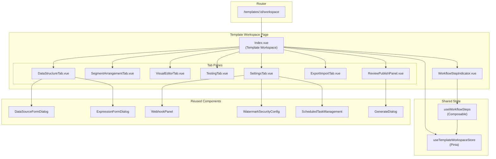
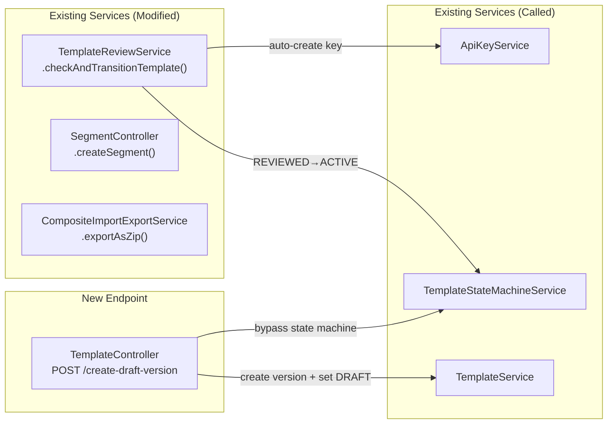
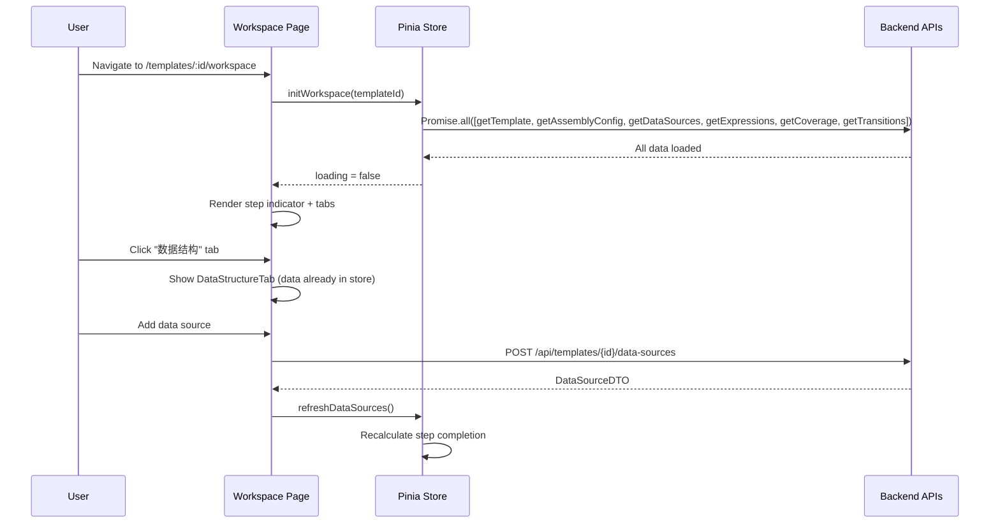

# Design Document — 模板工作台 (Template Workspace)

## Overview

模板工作台将当前分散在 5+ 个独立页面的模板管理操作整合为一个统一的、引导式的工作台界面。核心设计思路是：

1. **单页面 + 7 标签页架构**：一个 `Index.vue` 页面包含 7 个 `el-tab-pane`，每个标签页是独立子组件
2. **Pinia 集中状态管理**：所有标签页通过 `useTemplateWorkspaceStore` 共享数据，避免重复加载
3. **并行数据加载**：页面挂载时 `Promise.all` 并行加载 6 个 API，骨架屏过渡
4. **复用现有组件**：DataSourceFormDialog、ExpressionPanel、WebhookPanel、WatermarkSecurityConfig、ScheduledTaskManagement、OnlyOfficeEditor、useAssemblyConfig、useSegmentDrag 等直接嵌入
5. **后端最小改动**：仅扩展 `TemplateReviewService.checkAndTransitionTemplate()` 实现自动激活、新增 `create-draft-version` 端点、`SegmentController.createSegment` file 参数改为可选、ZIP 导出扩展

### 设计决策与理由

| 决策 | 理由 |
|------|------|
| 单页面 + Tab 而非多路由 | 减少路由跳转，共享 Pinia store 状态，切换标签无需重新加载 |
| Pinia store 而非 provide/inject | 跨组件层级共享、DevTools 可调试、支持 SSR |
| 步骤指示器为纯展示组件 | 完成状态由 store 计算，指示器只接收 props，易于测试 |
| 自动激活嵌入 `checkAndTransitionTemplate` | 最小改动点，复用现有状态机，事务一致性 |
| `create-draft-version` 绕过状态机 | ACTIVE → DRAFT 不在合法转换路径中，需要特殊端点 |

## Architecture

### 前端组件架构



### 后端改动架构



### 数据流




## Components and Interfaces

### 1. 前端新增组件

#### 1.1 `views/template-workspace/Index.vue` — 工作台主页面

职责：加载数据、渲染步骤指示器和 7 个标签页、管理活跃标签状态。

```typescript
// Props: none (从 route.params.id 获取 templateId)
// 主要逻辑：
// - onMounted → store.initWorkspace(templateId)
// - 监听 store.loading 显示骨架屏
// - ACTIVE 状态显示 banner + "Edit as New Version" 按钮
// - SINGLE 模板显示迁移提示
```

模板结构：
```
<div class="template-workspace">
  <!-- Page Header: name + status tag + version + back button -->
  <!-- ACTIVE banner (conditional) -->
  <!-- SINGLE migration prompt (conditional) -->
  <!-- WorkflowStepIndicator -->
  <!-- el-tabs with 7 tab-panes -->
</div>
```

#### 1.2 `WorkflowStepIndicator.vue` — 步骤指示器

纯展示组件，接收步骤完成数据。

```typescript
interface WorkflowStep {
  key: string           // 'create' | 'data' | 'segments' | 'editor' | 'testing' | 'review' | 'export' | 'settings'
  label: string         // i18n label
  completed: boolean
  active: boolean       // 当前推荐步骤（DRAFT 状态下第一个未完成步骤）
  alwaysAvailable: boolean  // export/settings 始终可用
}

defineProps<{
  steps: WorkflowStep[]
  currentTab: string
}>()

defineEmits<{
  (e: 'step-click', stepKey: string): void
}>()
```

渲染为水平 `el-steps` 组件，completed 步骤显示绿色勾，active 步骤脉冲高亮。

#### 1.3 `DataStructureTab.vue` — 数据结构标签页

上半部分：数据源表格 + 增删改测试连接
下半部分：表达式表格 + 增删改验证

```typescript
// 从 store 读取 dataSources 和 expressions
// 复用 DataSourceFormDialog（传入 templateId）
// 复用 ExpressionFormDialog（传入 templateId）
// 操作后调用 store.refreshDataSources() / store.refreshExpressions()
```

#### 1.4 `SegmentArrangementTab.vue` — 片段编排标签页

复用 `useAssemblyConfig` composable 和 `useSegmentDrag` composable。

```typescript
// 从 store 读取 assemblyConfig
// 拖拽排序、内联创建、添加已有片段
// 保存时调用 PUT /api/composite-templates/{id}/assembly-config
// 保存后调用 store.refreshAssemblyConfig()
// 支持键盘快捷键 Alt+↑/↓, Ctrl+Z/Ctrl+Shift+Z
```

内联创建片段表单字段：name, segmentType, description, file (optional)。
调用 `POST /api/segments`（file 参数已改为 optional）。

#### 1.5 `VisualEditorTab.vue` — 可视化编辑标签页

```typescript
// 显示 assembly config 中所有片段列表
// 每行：position, name, type, lastEdited, lockStatus, "Open Editor" button
// "Open Editor" → window.open(`/segments/${segmentId}/editor`, '_blank')
// "Preview Composite" → POST /api/composite-templates/{id}/preview
// "Selective Preview" → 勾选片段 → POST /api/composite-templates/{id}/preview/selective
// 锁状态：tab 激活时对每个 segment 调用 GET /api/segments/{id}/lock
```

#### 1.6 `TestingTab.vue` — 测试标签页

三个子区域：测试数据管理、测试执行、变量覆盖率。

```typescript
// 测试数据：从 store 读取各 segment 的 test data
// 运行测试：POST /api/composite-templates/{id}/tests/run
// 覆盖率：从 store 读取 coverage data
// 导出/导入测试数据：JSON 文件
// Quick Test：选择测试数据 → POST /api/composite-templates/{id}/preview → 下载
// Generate Test Document：同 Quick Test 但有更多选项
```

#### 1.7 `ReviewPublishPanel.vue` — 审核与发布面板

```typescript
// 状态展示：彩色 badge
// DRAFT/REVIEWED → "Submit for Review" 按钮
// PENDING_REVIEW → 审核状态表格
// REVIEWED → "Ready to Publish" 指示 + 手动 "Activate" 按钮
// ACTIVE → ApiEndpointInfo 组件
// 自动激活失败 → 错误提示 + 手动激活回退
// 低覆盖率激活 → 警告确认对话框
```

#### 1.8 `ApiEndpointInfo.vue` — API 端点信息组件

```typescript
defineProps<{
  templateId: number
  templateName: string
  apiKeyPrefix: string | null
}>()

// 展示：
// - API URL: POST /api/generate/{templateId}
// - API Key prefix (masked)
// - Copy URL / Copy API Key 按钮
// - cURL 示例
// - "Generate Document" 按钮 → 打开 GenerateDialog
// - 版本固定说明：?version={versionNumber}
```

#### 1.9 `ExportImportTab.vue` — 导出/导入标签页

```typescript
// 导出区域：
// - "Export Complete Package" → GET /api/composite-templates/{id}/export (blob download)
// - "Export Config Only" → GET /api/composite-templates/{id}/export-config
// - DRAFT 状态禁用完整导出
// - 导出摘要：segment count, data source count, expression count, test data count

// 导入区域：
// - "Import Package" → file upload (.zip) → POST /api/composite-templates/import
// - 冲突解决对话框：Rename / Overwrite / Cancel
// - 导入成功摘要 + "Go to Workspace" 按钮
// - 凭证占位符配置对话框
// - "Import Config Only" → file upload (.json) → POST /api/templates/import-config
```

#### 1.10 `SettingsTab.vue` — 设置标签页

```typescript
// 6 个可折叠面板 (el-collapse)：
// 1. Version History → GET /api/templates/{id}/versions + rollback
// 2. Version Diff → 选择两个版本号 → GET /api/templates/{id}/versions/diff
// 3. Webhooks → 嵌入 WebhookPanel
// 4. Watermark & Security → 嵌入 WatermarkSecurityConfig
// 5. Scheduled Tasks → 嵌入 ScheduledTaskManagement
// 6. Permissions → GET /api/templates/{id}/permissions + grant/revoke
```

#### 1.11 `TemplateCreationWizard.vue` — 模板创建向导

```typescript
// 两步向导对话框：
// Step 1: name (required), description, category (tree-select), tags (multi-select)
// Step 2: outputFormat (WORD/PDF, default WORD)
// Submit → POST /api/composite-templates → navigate to /templates/{id}/workspace
```

### 2. Pinia Store — `useTemplateWorkspaceStore`

```typescript
// stores/templateWorkspace.ts
export const useTemplateWorkspaceStore = defineStore('templateWorkspace', () => {
  // ── State ──
  const templateId = ref<number>(0)
  const template = ref<TemplateDTO | null>(null)
  const assemblyConfig = ref<AssemblyConfig | null>(null)
  const dataSources = ref<DataSourceDTO[]>([])
  const expressions = ref<ExpressionDTO[]>([])
  const coverage = ref<CompositeCoverageReport | null>(null)
  const availableTransitions = ref<string[]>([])
  const reviews = ref<ReviewDTO[]>([])

  const loading = ref(false)
  const criticalError = ref<string | null>(null)
  const warnings = ref<Record<string, string>>({})  // section → error message

  // ── Derived ──
  const templateStatus = computed(() => template.value?.status ?? 'DRAFT')
  const isActive = computed(() => templateStatus.value === 'ACTIVE')
  const isDraft = computed(() => templateStatus.value === 'DRAFT')

  // ── Actions ──
  async function initWorkspace(id: number): Promise<void>
  async function refreshTemplate(): Promise<void>
  async function refreshAssemblyConfig(): Promise<void>
  async function refreshDataSources(): Promise<void>
  async function refreshExpressions(): Promise<void>
  async function refreshCoverage(): Promise<void>
  async function refreshTransitions(): Promise<void>
  async function refreshReviews(page?: number, size?: number): Promise<void>

  return { /* all state, computed, actions */ }
})
```

### 3. Composable — `useWorkflowSteps`

```typescript
// composables/useWorkflowSteps.ts
export function useWorkflowSteps(store: ReturnType<typeof useTemplateWorkspaceStore>) {
  const steps = computed<WorkflowStep[]>(() => {
    const s = store
    return [
      { key: 'create', completed: !!s.template, ... },
      { key: 'data', completed: s.dataSources.length > 0 || s.expressions.length > 0, ... },
      { key: 'segments', completed: hasEnabledSegment(s.assemblyConfig), ... },
      { key: 'editor', completed: allSegmentsEdited(s.assemblyConfig), ... },
      { key: 'testing', completed: hasPassedTestsAndFullCoverage(s.coverage), ... },
      { key: 'review', completed: s.templateStatus === 'ACTIVE', ... },
      { key: 'export', alwaysAvailable: true, ... },
      { key: 'settings', alwaysAvailable: true, ... },
    ]
  })

  // 步骤 → 标签页映射
  const stepToTab: Record<string, string> = {
    data: 'dataStructure',
    segments: 'segments',
    editor: 'editor',
    testing: 'testing',
    review: 'reviewPublish',
    export: 'exportImport',
    settings: 'settings',
  }

  return { steps, stepToTab }
}
```

### 4. 后端接口变更

#### 4.1 `TemplateReviewService.checkAndTransitionTemplate()` — 扩展自动激活

```java
// 现有逻辑：all reviews completed → transition to REVIEWED
// 新增逻辑：transition to REVIEWED 成功后 → transition to ACTIVE + auto-create API Key
private void checkAndTransitionTemplate(Long templateId, int reviewLevel) {
    // ... existing check logic ...
    if (!nextLevelPending) {
        stateMachineService.transition(templateId, TemplateState.REVIEWED);
        // ── NEW: Auto-activation ──
        try {
            stateMachineService.transition(templateId, TemplateState.ACTIVE);
            ensureApiKeyExists(templateId);
            log.info("Template {} auto-activated after review approval", templateId);
        } catch (Exception e) {
            log.error("Auto-activation failed for template {}: {}", templateId, e.getMessage());
            // Leave in REVIEWED state — user can manually activate
        }
    }
}

private void ensureApiKeyExists(Long templateId) {
    Template template = findTemplateOrThrow(templateId);
    List<ApiKeyDTO> keys = apiKeyService.listApiKeys(template.getTenantId());
    if (keys.isEmpty()) {
        CreateApiKeyRequest req = new CreateApiKeyRequest();
        req.setName("auto-" + template.getName() + "-" + Instant.now().toEpochMilli());
        apiKeyService.createApiKey(template.getTenantId(), template.getCreatedBy(), req);
    }
}
```

#### 4.2 `POST /api/templates/{id}/create-draft-version` — 新端点

```java
// TemplateController.java
@PostMapping("/{id}/create-draft-version")
public ResponseEntity<TemplateDTO> createDraftVersion(
        @PathVariable Long id,
        @AuthenticationPrincipal UserPrincipal principal) {
    TemplateDTO result = templateService.createDraftVersion(id, principal.getUserId());
    return ResponseEntity.ok(result);
}
```

```java
// TemplateService.java — new method
@Transactional
public TemplateDTO createDraftVersion(Long templateId, Long userId) {
    Template template = findTemplateOrThrow(templateId);
    // Only allowed from ACTIVE status
    if (!"ACTIVE".equals(template.getStatus())) {
        throw new BusinessException(ErrorCode.TEMPLATE_INVALID_STATE_TRANSITION,
            "只有 ACTIVE 状态的模板才能创建草稿版本", HttpStatus.BAD_REQUEST);
    }
    // Create a new version snapshot (preserves current state before editing)
    createVersionSnapshot(template);
    // Directly set status to DRAFT (bypass state machine — special edit operation)
    template.setStatus("DRAFT");
    templateRepository.save(template);
    return toDTO(template);
}
```

#### 4.3 `SegmentController.createSegment` — file 参数改为可选

```java
// Before:
@RequestPart("file") MultipartFile file

// After:
@RequestPart(value = "file", required = false) MultipartFile file
```

`SegmentService.createSegment` 需处理 `file == null` 的情况：创建空 .docx 模板文件。

#### 4.4 `CompositeImportExportService.exportAsZip()` — 扩展 ZIP 内容

新增 4 个文件到 ZIP：
- `data-sources.json` — 数据源配置（敏感字段替换为 `__CREDENTIAL_PLACEHOLDER__`）
- `expressions.json` — 表达式定义
- `test-data.json` — 所有片段测试数据
- `coverage-report.json` — 覆盖率报告

### 5. 前端 API 层扩展

```typescript
// api/templates.ts — 新增
export function createDraftVersion(templateId: number) {
  return request.post<any, TemplateDTO>(`/templates/${templateId}/create-draft-version`)
}

// api/segments.ts — 修改 createSegment 支持 file 可选
export function createSegment(data: CreateSegmentRequest, file?: File) {
  const formData = new FormData()
  if (file) formData.append('file', file)
  formData.append('request', new Blob([JSON.stringify(data)], { type: 'application/json' }))
  return request.post<any, Segment>('/segments', formData, {
    headers: { 'Content-Type': 'multipart/form-data' },
  })
}
```

### 6. 路由配置

```typescript
// router/index.ts — 新增/修改
{
  path: 'templates/:id/workspace',
  name: 'TemplateWorkspace',
  component: () => import('@/views/template-workspace/Index.vue'),
  meta: { title: 'Template Workspace' },
},
// Legacy redirects
{
  path: 'templates/:id',
  name: 'TemplateDetail',
  redirect: to => `/templates/${to.params.id}/workspace`,
},
{
  path: 'composite-templates/:id',
  name: 'CompositeTemplateDetail',
  redirect: to => `/templates/${to.params.id}/workspace`,
},
```

### 7. 侧边栏导航变更

```vue
<!-- MainLayout.vue — 替换现有菜单项 -->
<!-- 移除: standalone Templates, Data Sources, template-components sub-menu -->
<!-- 新增: -->
<el-sub-menu index="template-management">
  <template #title>
    <el-icon><Document /></el-icon>
    <span>{{ $t('nav.templateManagement') }}</span>
  </template>
  <el-menu-item index="/templates">{{ $t('nav.templateList') }}</el-menu-item>
  <el-menu-item index="/segments">{{ $t('nav.segmentLibrary') }}</el-menu-item>
</el-sub-menu>
<!-- 保留: Dashboard, Documents, Tasks, Market, Admin, Audit -->
```


## Data Models

### 前端类型定义

```typescript
// types/workspace.ts — 新增

/** 工作流步骤 */
export interface WorkflowStep {
  key: string
  label: string
  completed: boolean
  active: boolean
  alwaysAvailable: boolean
}

/** 步骤 key 到标签页 name 的映射 */
export type StepKey = 'create' | 'data' | 'segments' | 'editor' | 'testing' | 'review' | 'export' | 'settings'
export type TabName = 'dataStructure' | 'segments' | 'editor' | 'testing' | 'reviewPublish' | 'exportImport' | 'settings'

/** 导入冲突解决策略 */
export type ConflictResolution = 'RENAME' | 'OVERWRITE' | 'CANCEL'

/** 导入结果 */
export interface ImportResult {
  templateId: number
  templateName: string
  segmentCount: number
  dataSourceCount: number
  expressionCount: number
  hasPlaceholderCredentials: boolean
  credentialPlaceholders: CredentialPlaceholder[]
}

/** 凭证占位符 */
export interface CredentialPlaceholder {
  dataSourceName: string
  dataSourceType: string
  fields: string[]  // e.g., ['password', 'apiKey']
}

/** 导出摘要 */
export interface ExportSummary {
  segmentCount: number
  dataSourceCount: number
  expressionCount: number
  testDataCount: number
}
```

### 后端数据模型

无新增数据库表。所有变更基于现有表结构：

- `templates` — status 字段的 ACTIVE→DRAFT 直接更新（create-draft-version）
- `template_versions` — 新增版本记录（create-draft-version 时创建快照）
- `api_keys` — 自动激活时可能新增记录
- `segments` — createSegment 允许 file 为 null 时，service 层生成空 .docx 并上传 MinIO

### ZIP 导出扩展数据结构

```json
// data-sources.json 示例
[
  {
    "name": "User API",
    "type": "HTTP_API",
    "configJson": {
      "url": "https://api.example.com/users",
      "method": "GET",
      "authType": "API_KEY",
      "authConfig": { "apiKey": "__CREDENTIAL_PLACEHOLDER__" },
      "timeout": 5000
    },
    "cacheEnabled": true,
    "cacheTtl": 300,
    "priority": 0
  }
]

// expressions.json 示例
[
  {
    "name": "fullName",
    "expressionType": "JAVASCRIPT",
    "expressionText": "data.firstName + ' ' + data.lastName",
    "executionOrder": 1
  }
]

// test-data.json 示例
[
  {
    "segmentName": "Cover Page",
    "testDataEntries": [
      { "name": "Default Test", "testDataJson": "{\"title\": \"Report\"}" }
    ]
  }
]

// coverage-report.json — 直接序列化 CompositeCoverageReport
```


## Correctness Properties

*A property is a characteristic or behavior that should hold true across all valid executions of a system — essentially, a formal statement about what the system should do. Properties serve as the bridge between human-readable specifications and machine-verifiable correctness guarantees.*

### Property 1: Workflow step completion is deterministic and consistent

*For any* workspace state (template with arbitrary status, any number of data sources ≥ 0, any number of expressions ≥ 0, any assembly config with 0+ segments of varying enabled/version states, any coverage report with 0-100% rate, any test execution history), the `useWorkflowSteps` composable SHALL compute step completion as follows:
- Step 1 (Create): always `true`
- Step 2 (Data): `true` iff `dataSources.length > 0 || expressions.length > 0`
- Step 3 (Segments): `true` iff assembly config has at least one segment with `enabled = true`
- Step 4 (Editor): `true` iff all enabled segments have `versionNumber > 1`
- Step 5 (Testing): `true` iff at least one test executed AND coverage rate === 100
- Step 6 (Review): `true` iff template status === 'ACTIVE'
- Steps 7-8: always `alwaysAvailable = true`

Additionally, when template status is DRAFT, the `active` (highlighted) step SHALL be the first step where `completed === false`, or no step if all are complete.

**Validates: Requirements 3.5, 3.8**

### Property 2: Segment reorder preserves collection invariants

*For any* array of `AssemblySegmentEntry` items and any valid `fromIndex` and `toIndex` within bounds, the `reorder` function SHALL produce a result where:
- The result array has the same length as the input
- The result array contains exactly the same set of segment IDs as the input
- The item originally at `fromIndex` is now at `toIndex`
- All items have their `position` field equal to their array index

**Validates: Requirements 6.2**

### Property 3: Auto-activation transitions template to ACTIVE after full approval

*For any* template in PENDING_REVIEW state with a set of review records, when the last pending review is approved (all reviews reach APPROVED or CONDITIONAL_APPROVED status) and no higher review level is pending, the `checkAndTransitionTemplate` method SHALL transition the template first to REVIEWED, then to ACTIVE. If the ACTIVE transition fails, the template SHALL remain in REVIEWED state (not revert to PENDING_REVIEW).

**Validates: Requirements 17.1, 17.2**

### Property 4: API Key auto-creation is conditional on tenant key absence

*For any* tenant, when auto-activation succeeds, if the tenant has zero existing API keys, exactly one new API key SHALL be created with name matching the pattern `auto-{templateName}-{timestamp}`. If the tenant already has one or more API keys, no new key SHALL be created.

**Validates: Requirements 17.3, 10.3**

### Property 5: ZIP export contains all required files

*For any* composite template with N segments (N ≥ 1), M data sources (M ≥ 0), K expressions (K ≥ 0), and T test data entries (T ≥ 0), the exported ZIP SHALL contain:
- Exactly N `.docx` segment files
- Exactly 1 `assembly-config.json`
- Exactly 1 `data-sources.json` (even if M = 0, as an empty array)
- Exactly 1 `expressions.json` (even if K = 0, as an empty array)
- Exactly 1 `test-data.json` (even if T = 0, as an empty array)
- Exactly 1 `coverage-report.json`

**Validates: Requirements 12.2, 18.1**

### Property 6: Credential masking replaces all sensitive fields

*For any* data source configuration containing sensitive fields (database passwords, API keys in auth configs, OAuth client secrets), the exported `data-sources.json` SHALL replace every sensitive field value with the string `"__CREDENTIAL_PLACEHOLDER__"`. No original credential value SHALL appear in the exported JSON. Non-sensitive fields (URL, method, timeout, etc.) SHALL be preserved unchanged.

**Validates: Requirements 18.2**


## Error Handling

### 前端错误处理

| 场景 | 处理方式 |
|------|----------|
| 工作台初始化 — 关键 API 失败（template/assembly config） | 全页错误页 + "Retry" 按钮 + 错误消息 |
| 工作台初始化 — 非关键 API 失败（data sources/expressions/coverage/transitions） | 正常渲染工作台 + 对应区域显示警告 banner + "Retry" 按钮 |
| 创建向导 — API 返回错误 | 对话框内显示错误消息，保持当前步骤 |
| 保存片段编排 — API 失败 | `ElMessage.error` 提示，保留本地编辑状态 |
| 自动激活失败 — 后端返回错误 | Review_Publish_Panel 显示 "Auto-activation failed. Please activate manually." |
| 手动激活 — 状态转换失败 | `ElMessage.error` 提示，保持当前状态 |
| 导入 ZIP — 格式错误 | 显示 "Invalid package format" 错误消息 |
| 导入 ZIP — 命名冲突 | 弹出冲突解决对话框（Rename/Overwrite/Cancel） |
| 回滚版本 — API 失败 | `ElMessage.error` 提示，不改变当前状态 |
| 测试执行 — 部分片段失败 | 显示测试报告，失败片段标红，不阻断其他操作 |
| 编辑 ACTIVE 模板 — create-draft-version 失败 | `ElMessage.error` 提示，保持 ACTIVE 状态 |
| 迁移 SINGLE 模板 — migrate-to-composite 失败 | `ElMessage.error` 提示，保持迁移提示 |

### 后端错误处理

| 场景 | 错误码 | HTTP 状态 | 处理方式 |
|------|--------|-----------|----------|
| create-draft-version 非 ACTIVE 状态调用 | `TEMPLATE_INVALID_STATE_TRANSITION` | 400 | 抛出 BusinessException |
| 自动激活 REVIEWED→ACTIVE 转换失败 | — | — | 捕获异常，log.error，保持 REVIEWED 状态，不向调用方抛出 |
| 自动创建 API Key 失败 | — | — | 捕获异常，log.error，模板仍为 ACTIVE（API Key 创建是尽力而为） |
| createSegment file=null 时创建空 .docx 失败 | `INTERNAL_ERROR` | 500 | 抛出 BusinessException |
| ZIP 导出 — 数据源/表达式查询失败 | — | — | 捕获异常，对应 JSON 文件写入空数组，不阻断导出 |
| ZIP 导入 — 缺少扩展文件 | — | — | 跳过缺失文件，仅导入可用内容 |

## Testing Strategy

### 测试分层

#### 1. Property-Based Tests (PBT)

使用 **fast-check** (前端) 和 **jqwik** (后端) 框架，每个属性测试最少 100 次迭代。

**前端 PBT (fast-check):**

- **Property 1**: `useWorkflowSteps` 步骤完成计算
  - 生成器：随机 workspace state（dataSources 数组长度 0-10，expressions 数组长度 0-10，assembly config 含 0-20 个 segment entry，coverage rate 0-100，template status 从 5 种状态随机选择）
  - 断言：每个步骤的 completed 值符合规则
  - Tag: `Feature: template-workspace, Property 1: Workflow step completion is deterministic and consistent`

- **Property 2**: `useSegmentDrag.reorder` 集合不变量
  - 生成器：随机 AssemblySegmentEntry 数组（长度 1-50），随机 fromIndex/toIndex
  - 断言：长度不变、segment ID 集合不变、position 字段等于数组索引
  - Tag: `Feature: template-workspace, Property 2: Segment reorder preserves collection invariants`

**后端 PBT (jqwik):**

- **Property 3**: 自动激活状态转换
  - 生成器：随机 review 集合（1-5 个 reviewer，全部 APPROVED 或 CONDITIONAL_APPROVED）
  - 断言：最后一个 review 审批后，模板状态为 ACTIVE
  - Tag: `Feature: template-workspace, Property 3: Auto-activation transitions template to ACTIVE`

- **Property 4**: API Key 自动创建条件
  - 生成器：随机 tenant（有/无现有 API Key）
  - 断言：激活后，无 key 的 tenant 有 1 个新 key；有 key 的 tenant key 数量不变
  - Tag: `Feature: template-workspace, Property 4: API Key auto-creation is conditional`

- **Property 5**: ZIP 导出完整性
  - 生成器：随机模板配置（1-10 segments，0-5 data sources，0-5 expressions，0-10 test data）
  - 断言：ZIP 包含所有必需文件
  - Tag: `Feature: template-workspace, Property 5: ZIP export contains all required files`

- **Property 6**: 凭证掩码
  - 生成器：随机数据源配置（各种 auth type，随机密码/key 字符串）
  - 断言：导出 JSON 中无原始凭证，所有敏感字段为 `__CREDENTIAL_PLACEHOLDER__`
  - Tag: `Feature: template-workspace, Property 6: Credential masking replaces all sensitive fields`

#### 2. Unit Tests (Example-Based)

**前端 (Vitest):**

- `WorkflowStepIndicator.vue` — 渲染 8 个步骤、点击触发事件、DRAFT 状态高亮
- `TemplateCreationWizard.vue` — 两步表单验证、提交成功导航、错误显示
- `ApiEndpointInfo.vue` — URL 显示、cURL 示例、复制按钮
- `DataStructureTab.vue` — 空状态显示、表格列渲染
- `ReviewPublishPanel.vue` — 各状态下按钮可见性
- `ExportImportTab.vue` — DRAFT 状态禁用导出、冲突对话框
- `SettingsTab.vue` — 6 个折叠面板渲染
- 路由重定向测试 — `/templates/:id` → `/templates/:id/workspace`

**后端 (JUnit 5):**

- `TemplateService.createDraftVersion()` — ACTIVE 状态允许、非 ACTIVE 状态拒绝
- `SegmentService.createSegment()` — file=null 时创建空 .docx
- `CompositeImportExportService` — 导入缺少扩展文件时不报错

#### 3. Integration Tests

**后端 (Testcontainers):**

- 完整审核→自动激活→API Key 生成流程
- ZIP 导出→导入往返测试
- create-draft-version 端点 E2E 测试

**前端 (Vitest + MSW):**

- 工作台初始化并行加载 6 个 API
- 关键 API 失败显示错误页
- 非关键 API 失败显示警告 banner
- 标签页切换不重新加载数据

