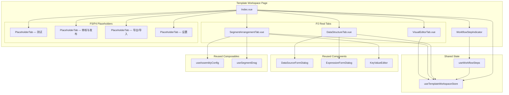
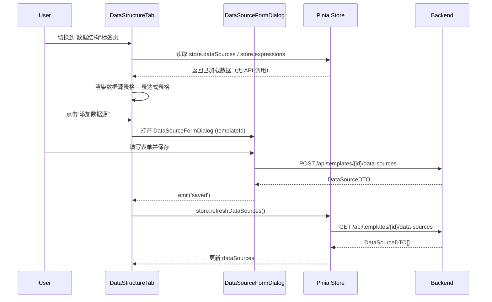
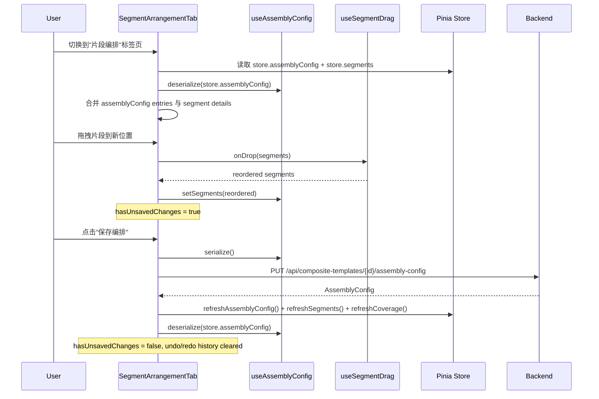
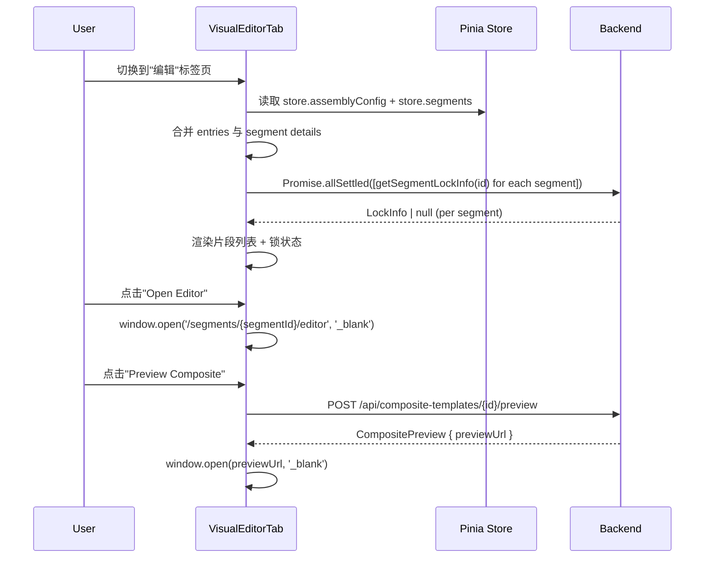
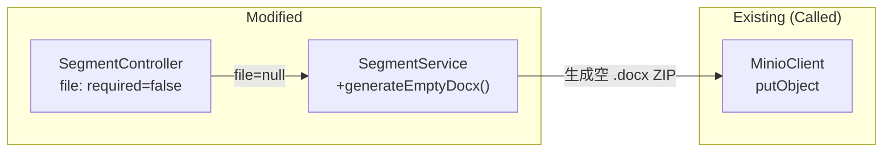

# Design Document — 工作台数据与片段标签页 (Workspace Data & Segments)

## Overview

本设计文档是模板工作台 Phase 2 的技术设计，将 P1 骨架中的 3 个占位标签页替换为真实实现：

1. **DataStructureTab** — 数据源 + 表达式管理（从 store 读取，复用 DataSourceFormDialog / ExpressionFormDialog）
2. **SegmentArrangementTab** — 片段拖拽编排（复用 useAssemblyConfig + useSegmentDrag，支持 undo/redo、内联配置、新建/添加已有片段）
3. **VisualEditorTab** — 片段列表 + OnlyOffice 编辑器入口 + 组合/选择性预览 + 锁状态检查

同时包含：
- **后端变更**：SegmentController `file` 参数改为可选 + SegmentService 空 .docx 创建
- **Store 扩展**：新增 `segments: Segment[]` 状态 + `refreshSegments()` action
- **Index.vue 集成**：替换 3 个占位组件 + 未保存变更守卫
- **i18n**：3 个 locale 文件新增 P2 相关 key

### 设计决策与理由

| 决策 | 理由 |
|------|------|
| DataStructureTab 从 store 读取而非直接调 API | P1 initWorkspace 已并行加载 dataSources/expressions，避免重复请求 |
| 不复用 ExpressionPanel，仅复用 ExpressionFormDialog | ExpressionPanel 在 onMounted 自行调 API，与 store 驱动模式冲突 |
| useAssemblyConfig.deserialize() 在每次保存后调用 | 重置 undo/redo 历史，确保本地状态与服务端一致 |
| "Add Existing Segment" 客户端过滤已有片段 | assembly config 中片段数量有限（通常 < 50），客户端过滤足够高效 |
| lockedVersion 使用 "Use Latest" checkbox 模式 | null 表示始终使用最新版本，checkbox 比空输入框语义更清晰 |
| 锁状态检查使用 Promise.allSettled | 单个片段锁查询失败不应阻塞整个标签页渲染 |
| 空 .docx 生成逻辑复制到 SegmentService | 与 TemplateService 解耦，避免跨 service 依赖；代码量小（~30 行） |
| segments 作为非关键请求加载 | 片段详情加载失败不应阻塞工作台，降级显示 "Unknown Segment" |

## Architecture

### 前端组件架构




### 数据流 — DataStructureTab



### 数据流 — SegmentArrangementTab



### 数据流 — VisualEditorTab



### 后端变更架构



## Components and Interfaces

### 1. DataStructureTab.vue

路径：`frontend/src/views/template-workspace/components/DataStructureTab.vue`

职责：展示数据源表格和表达式表格，复用已有对话框组件进行增删改操作。

```typescript
// 无 props — 从 store 读取数据
// 内部状态：
const store = useTemplateWorkspaceStore()
const dsDialogVisible = ref(false)
const editingDataSource = ref<DataSourceDTO | null>(null)
const exprDialogVisible = ref(false)
const editingExpression = ref<ExpressionDTO | null>(null)
const deletingIds = ref<Set<number>>(new Set()) // 防止重复点击

// 数据源操作：
// - 添加 → dsDialogVisible = true, editingDataSource = null
// - 编辑 → dsDialogVisible = true, editingDataSource = row
// - 保存回调 → store.refreshDataSources()
// - 测试连接 → testConnection(id) → ElMessage 显示结果
// - 删除 → ElMessageBox.confirm → deletingIds.add(id) → deleteDataSource(id) → store.refreshDataSources() → deletingIds.delete(id)

// 表达式操作：
// - 添加 → exprDialogVisible = true, editingExpression = null
// - 编辑 → exprDialogVisible = true, editingExpression = row
// - 保存回调 → store.refreshExpressions()
// - 验证 → validateExpression({ expression, expressionType }) → ElMessage
// - 删除 → ElMessageBox.confirm → deleteExpression(id) → store.refreshExpressions()
```

模板结构：
```html
<div class="data-structure-tab">
  <!-- 数据源区域 -->
  <div class="section-header">
    <h3>{{ $t('workspace.dataSource.title') }}</h3>
    <el-button type="primary" @click="openAddDataSource">{{ $t('workspace.dataSource.add') }}</el-button>
  </div>
  <el-empty v-if="store.dataSources.length === 0" :description="$t('workspace.dataSource.empty')" />
  <el-table v-else :data="store.dataSources">
    <!-- name, type(el-tag), priority, cacheEnabled(icon), updatedAt, actions -->
  </el-table>

  <el-divider />

  <!-- 表达式区域 -->
  <div class="section-header">
    <h3>{{ $t('workspace.expression.title') }}</h3>
    <el-button type="primary" @click="openAddExpression">{{ $t('workspace.expression.add') }}</el-button>
  </div>
  <el-empty v-if="store.expressions.length === 0" :description="$t('workspace.expression.empty')" />
  <el-table v-else :data="store.expressions">
    <!-- name, expressionType(el-tag), expressionText(truncated+tooltip), executionOrder, createdAt, actions -->
  </el-table>

  <!-- 对话框 -->
  <DataSourceFormDialog v-model:visible="dsDialogVisible" :data-source="editingDataSource" :template-id="store.templateId" @saved="onDataSourceSaved" />
  <ExpressionFormDialog v-model:visible="exprDialogVisible" :template-id="store.templateId" :data="editingExpression" @saved="onExpressionSaved" />
</div>
```

### 2. SegmentArrangementTab.vue

路径：`frontend/src/views/template-workspace/components/SegmentArrangementTab.vue`

职责：片段拖拽编排、内联配置、新建/添加已有片段、undo/redo、未保存变更守卫。

```typescript
// 内部状态：
const store = useTemplateWorkspaceStore()
const assemblyConfig = useAssemblyConfig()
const segmentDrag = useSegmentDrag()

const saving = ref(false)
const selectedIndex = ref<number | null>(null)
const expandedIndex = ref<number | null>(null)
const addPanelVisible = ref(false)
const createFormVisible = ref(false)
const existingSegmentDialogVisible = ref(false)

// 初始化：从 store 反序列化（仅在组件挂载时执行一次，不使用 watch 以避免覆盖本地未保存变更）
onMounted(() => {
  if (store.assemblyConfig) {
    assemblyConfig.deserialize(store.assemblyConfig)
    updateSavedSnapshot()
  }
})

// 合并 segment details 用于展示
interface MergedSegmentEntry extends AssemblySegmentEntry {
  name: string
  segmentType: string | null
  updatedAt: string | null
}

const mergedSegments = computed<MergedSegmentEntry[]>(() => {
  const segmentMap = new Map(store.segments.map(s => [s.id, s]))
  return assemblyConfig.segments.value.map(entry => {
    const detail = segmentMap.get(entry.segmentId)
    return {
      ...entry,
      name: detail?.name ?? `Unknown Segment #${entry.segmentId}`,
      segmentType: detail?.segmentType ?? null,
      updatedAt: detail?.updatedAt ?? null,
    }
  })
})

// 未保存变更检测
const lastSavedSnapshot = ref<string>('')
const hasUnsavedChanges = computed(() => {
  return JSON.stringify(assemblyConfig.segments.value) !== lastSavedSnapshot.value
})

// 暴露给父组件（Index.vue 通过 ref 访问 hasUnsavedChanges）
defineExpose({ hasUnsavedChanges })

// 保存后更新快照
function updateSavedSnapshot() {
  lastSavedSnapshot.value = JSON.stringify(assemblyConfig.segments.value)
}

// 保存编排
async function handleSave() {
  saving.value = true
  try {
    await updateAssemblyConfig(store.templateId, assemblyConfig.serialize())
    await Promise.all([
      store.refreshAssemblyConfig(),
      store.refreshSegments(),
      store.refreshCoverage(),
    ])
    assemblyConfig.deserialize(store.assemblyConfig!)
    updateSavedSnapshot()
    ElMessage.success(t('message.saveSuccess'))
  } catch (e: any) {
    ElMessage.error(e.response?.data?.message || e.message || t('message.saveFailed'))
  } finally {
    saving.value = false
  }
}

// 键盘快捷键
function handleKeydown(e: KeyboardEvent) {
  if (e.ctrlKey && e.key === 'z' && !e.shiftKey) {
    e.preventDefault()
    assemblyConfig.undo()
  } else if (e.ctrlKey && e.shiftKey && e.key === 'Z') {
    e.preventDefault()
    assemblyConfig.redo()
  } else if (e.altKey && e.key === 'ArrowUp' && selectedIndex.value != null) {
    e.preventDefault()
    const result = segmentDrag.moveUp(assemblyConfig.segments.value, selectedIndex.value)
    if (result) { assemblyConfig.setSegments(result); selectedIndex.value-- }
  } else if (e.altKey && e.key === 'ArrowDown' && selectedIndex.value != null) {
    e.preventDefault()
    const result = segmentDrag.moveDown(assemblyConfig.segments.value, selectedIndex.value)
    if (result) { assemblyConfig.setSegments(result); selectedIndex.value++ }
  }
}
```

#### 新建片段表单

```typescript
const newSegmentForm = reactive({
  name: '',
  segmentType: '' as string,
  description: '',
  file: null as File | null,
})

async function handleCreateSegment() {
  // 1. POST /api/segments (file optional)
  const segment = await createSegment(
    { name: newSegmentForm.name, segmentType: newSegmentForm.segmentType || undefined, description: newSegmentForm.description || undefined },
    newSegmentForm.file ?? undefined,
  )
  // 2. 添加到本地 assembly config
  assemblyConfig.addSegment({
    segmentId: segment.id,
    position: assemblyConfig.segments.value.length,
    enabled: true,
    pageBreakBefore: false,
    lockedVersion: null,
    conditionExpression: null,
    dataScope: null,
  })
  // 3. 保存 assembly config
  try {
    await updateAssemblyConfig(store.templateId, assemblyConfig.serialize())
    await Promise.all([store.refreshAssemblyConfig(), store.refreshSegments()])
    assemblyConfig.deserialize(store.assemblyConfig!)
    updateSavedSnapshot()
  } catch {
    ElMessage.warning(t('workspace.segment.createdButNotAdded'))
  }
}
```

#### 添加已有片段

```typescript
const searchQuery = ref('')
const searchType = ref('')
const searchPage = ref(1)
const searchResults = ref<Segment[]>([])
const searchTotal = ref(0)
const selectedSegmentIds = ref<number[]>([])

const existingSegmentIds = computed(() =>
  new Set(assemblyConfig.segments.value.map(s => s.segmentId))
)

const filteredResults = computed(() =>
  searchResults.value.filter(s => !existingSegmentIds.value.has(s.id))
)

async function searchSegments() {
  const result = await getSegments({
    keyword: searchQuery.value || undefined,
    segmentType: searchType.value || undefined,
    page: searchPage.value,
    size: 20,
  })
  searchResults.value = result.content
  searchTotal.value = result.totalElements
}

async function handleAddExisting() {
  for (const id of selectedSegmentIds.value) {
    assemblyConfig.addSegment({
      segmentId: id,
      position: assemblyConfig.segments.value.length,
      enabled: true,
      pageBreakBefore: false,
      lockedVersion: null,
      conditionExpression: null,
      dataScope: null,
    })
  }
  // 保存 + 刷新（同 handleSave 逻辑）
  await handleSave()
}
```

### 3. VisualEditorTab.vue

路径：`frontend/src/views/template-workspace/components/VisualEditorTab.vue`

职责：展示片段列表、锁状态、OnlyOffice 编辑器入口、组合/选择性预览。

```typescript
const store = useTemplateWorkspaceStore()
const lockInfoMap = ref<Map<number, LockInfo | null>>(new Map())
const loadingLocks = ref(false)
const previewLoading = ref(false)
const selectiveMode = ref(false)
const selectedSegmentIds = ref<number[]>([])

// 合并 segment details（同 SegmentArrangementTab）
const mergedSegments = computed(() => {
  const segmentMap = new Map(store.segments.map(s => [s.id, s]))
  return (store.assemblyConfig?.segments ?? []).map(entry => {
    const detail = segmentMap.get(entry.segmentId)
    return {
      ...entry,
      name: detail?.name ?? `Unknown Segment #${entry.segmentId}`,
      segmentType: detail?.segmentType ?? null,
      updatedAt: detail?.updatedAt ?? null,
    }
  })
})

// 锁状态检查
async function checkLocks() {
  const segmentIds = store.assemblyConfig?.segments?.map(s => s.segmentId) ?? []
  if (segmentIds.length === 0) return
  loadingLocks.value = true
  const results = await Promise.allSettled(
    segmentIds.map(id => getSegmentLockInfo(id))
  )
  results.forEach((result, index) => {
    lockInfoMap.value.set(
      segmentIds[index],
      result.status === 'fulfilled' ? result.value : null,
    )
  })
  loadingLocks.value = false
}

// 标签页激活时检查锁
// 由 Index.vue 通过 watch(activeTab) 或 tab activated 事件触发

function openEditor(segmentId: number) {
  window.open(`/segments/${segmentId}/editor`, '_blank')
}

async function handlePreviewComposite() {
  previewLoading.value = true
  try {
    const result = await previewCompositeTemplate(store.templateId)
    window.open(result.previewUrl, '_blank')
  } catch (e: any) {
    ElMessage.error(e.response?.data?.message || e.message || t('workspace.editor.previewFailed'))
  } finally {
    previewLoading.value = false
  }
}

async function handleSelectivePreview() {
  if (selectedSegmentIds.value.length === 0) return
  previewLoading.value = true
  try {
    const result = await previewSelectiveSegments(store.templateId, {
      segmentIds: selectedSegmentIds.value,
    })
    window.open(result.previewUrl, '_blank')
  } catch (e: any) {
    ElMessage.error(e.response?.data?.message || e.message || t('workspace.editor.previewFailed'))
  } finally {
    previewLoading.value = false
  }
}
```

### 4. Store 扩展 — segments 状态

```typescript
// stores/templateWorkspace.ts — 新增部分

import { getCompositeSegments } from '@/api/composite-templates'
import type { Segment } from '@/types/segment'

// State 新增：
const segments = ref<Segment[]>([])

// initWorkspace 中 nonCriticalResults 扩展：
const nonCriticalResults = Promise.allSettled([
  getDataSources(id),
  getExpressions(id),
  getCompositeCoverage(id),
  getAvailableTransitions(id),
  getCompositeSegments(id),  // 新增
])
// settled[4] → segments

// 新增 action：
async function refreshSegments(): Promise<void> {
  if (!templateId.value) return
  try {
    segments.value = await getCompositeSegments(templateId.value)
    delete warnings.value.segments
  } catch (e: any) {
    warnings.value.segments = e.message || 'Refresh failed'
  }
}

// $reset 中新增：
// segments.value = []

// return 中新增：
// segments, refreshSegments
```

### 5. Index.vue 变更

```typescript
// 替换 import：
import DataStructureTab from './components/DataStructureTab.vue'
import SegmentArrangementTab from './components/SegmentArrangementTab.vue'
import VisualEditorTab from './components/VisualEditorTab.vue'

// placeholderTabs 数组中移除前 3 项，改为真实组件

// 未保存变更守卫：
import { onBeforeRouteLeave } from 'vue-router'

const segmentArrangementRef = ref<InstanceType<typeof SegmentArrangementTab> | null>(null)

// Tab 切换守卫
async function handleTabChange(newTab: TabName) {
  if (segmentArrangementRef.value?.hasUnsavedChanges && activeTab.value === 'segments') {
    try {
      await ElMessageBox.confirm(
        t('workspace.segment.unsavedConfirm'),
        t('common.confirm'),
        { type: 'warning' },
      )
    } catch {
      return // 取消切换
    }
  }
  activeTab.value = newTab
}

// 路由离开守卫
onBeforeRouteLeave(async () => {
  if (segmentArrangementRef.value?.hasUnsavedChanges) {
    try {
      await ElMessageBox.confirm(
        t('workspace.segment.unsavedConfirm'),
        t('common.confirm'),
        { type: 'warning' },
      )
      return true
    } catch {
      return false
    }
  }
  return true
})
```

### 6. 后端变更 — SegmentController + SegmentService

#### 6.1 SegmentController — file 参数改为可选

```java
// Before:
@RequestPart("file") MultipartFile file

// After:
@RequestPart(value = "file", required = false) MultipartFile file
```

#### 6.2 SegmentService — 支持 file=null

```java
@Transactional
public SegmentDTO createSegment(CreateSegmentRequest request, MultipartFile file, Long userId) {
    Long tenantId = TenantContext.getCurrentTenantId();

    String filePath;
    if (file != null && !file.isEmpty()) {
        filePath = uploadSegmentFile(file, tenantId);
    } else {
        filePath = createEmptyDocxSegment(tenantId, request.getName());
    }

    // ... 其余逻辑不变
}

/**
 * 创建空 .docx 片段文件并上传到 MinIO。
 * 逻辑与 TemplateService.createEmptyDocxTemplate 相同。
 */
private String createEmptyDocxSegment(Long tenantId, String segmentName) {
    String safeName = (segmentName != null
        ? segmentName.replaceAll("[^a-zA-Z0-9_\\-]", "_")
        : "segment");
    String objectName = String.format("segments/%d/%s_%s.docx",
        tenantId, UUID.randomUUID(), safeName);

    try {
        byte[] docxBytes = generateEmptyDocx();
        try (InputStream is = new ByteArrayInputStream(docxBytes)) {
            minioClient.putObject(PutObjectArgs.builder()
                .bucket(bucketName)
                .object(objectName)
                .stream(is, docxBytes.length, -1)
                .contentType("application/vnd.openxmlformats-officedocument.wordprocessingml.document")
                .build());
        }
        log.info("Created empty docx segment: {}", objectName);
    } catch (Exception e) {
        log.error("Failed to create empty docx segment: {}", e.getMessage(), e);
        throw new BusinessException(ErrorCode.INTERNAL_ERROR,
            "创建空片段文件失败", HttpStatus.INTERNAL_SERVER_ERROR, e);
    }
    return objectName;
}

private byte[] generateEmptyDocx() throws Exception {
    ByteArrayOutputStream baos = new ByteArrayOutputStream();
    try (ZipOutputStream zos = new ZipOutputStream(baos)) {
        addZipEntry(zos, "[Content_Types].xml",
            "<?xml version=\"1.0\" encoding=\"UTF-8\" standalone=\"yes\"?>"
            + "<Types xmlns=\"http://schemas.openxmlformats.org/package/2006/content-types\">"
            + "<Default Extension=\"rels\" ContentType=\"application/vnd.openxmlformats-package.relationships+xml\"/>"
            + "<Default Extension=\"xml\" ContentType=\"application/xml\"/>"
            + "<Override PartName=\"/word/document.xml\" ContentType=\"application/vnd.openxmlformats-officedocument.wordprocessingml.document.main+xml\"/>"
            + "</Types>");
        addZipEntry(zos, "_rels/.rels",
            "<?xml version=\"1.0\" encoding=\"UTF-8\" standalone=\"yes\"?>"
            + "<Relationships xmlns=\"http://schemas.openxmlformats.org/package/2006/relationships\">"
            + "<Relationship Id=\"rId1\" Type=\"http://schemas.openxmlformats.org/officeDocument/2006/relationships/officeDocument\" Target=\"word/document.xml\"/>"
            + "</Relationships>");
        addZipEntry(zos, "word/document.xml",
            "<?xml version=\"1.0\" encoding=\"UTF-8\" standalone=\"yes\"?>"
            + "<w:document xmlns:w=\"http://schemas.openxmlformats.org/wordprocessingml/2006/main\">"
            + "<w:body><w:p><w:r><w:t></w:t></w:r></w:p></w:body>"
            + "</w:document>");
    }
    return baos.toByteArray();
}

private void addZipEntry(ZipOutputStream zos, String name, String content) throws Exception {
    zos.putNextEntry(new ZipEntry(name));
    zos.write(content.getBytes(java.nio.charset.StandardCharsets.UTF_8));
    zos.closeEntry();
}
```

同时需修改现有 `uploadSegmentFile` 方法，移除 file 为空时的校验抛出（该校验移到调用方判断）：

```java
// Before:
private String uploadSegmentFile(MultipartFile file, Long tenantId) {
    if (file == null || file.isEmpty()) {
        throw new BusinessException(ErrorCode.VALIDATION_FAILED, "段落文件不能为空", HttpStatus.BAD_REQUEST);
    }
    // ...
}

// After: 保持不变，因为调用方已保证 file != null && !file.isEmpty()
```

### 7. 前端 API 层变更

```typescript
// api/segments.ts — createSegment 修改
export function createSegment(data: CreateSegmentRequest, file?: File) {
  const formData = new FormData()
  if (file) {
    formData.append('file', file)
  }
  formData.append('request', new Blob([JSON.stringify(data)], { type: 'application/json' }))
  return request.post<any, Segment>('/segments', formData, {
    headers: { 'Content-Type': 'multipart/form-data' },
  })
}
```

## Data Models

### 前端类型扩展

```typescript
// types/workspace.ts — 无新增类型，复用现有类型

// 组件内部使用的合并类型（不导出，各组件内部定义）：
interface MergedSegmentEntry extends AssemblySegmentEntry {
  name: string
  segmentType: string | null
  updatedAt: string | null
}
```

### Store 状态扩展

```typescript
// stores/templateWorkspace.ts — 新增字段
segments: Segment[]  // 从 getCompositeSegments(templateId) 加载

// 新增 action
refreshSegments(): Promise<void>
```

### 后端数据模型

无新增数据库表或字段。变更基于现有结构：

- `segments` 表 — `file_path` 字段现在可以指向自动生成的空 .docx（之前必须由用户上传）
- `SegmentController.createSegment` — `file` 参数从 required 改为 optional

### i18n Key 结构

```
workspace.dataSource.title        — "数据源" / "Data Sources"
workspace.dataSource.add          — "添加数据源" / "Add Data Source"
workspace.dataSource.empty        — 空状态提示
workspace.dataSource.testSuccess  — 测试连接成功
workspace.dataSource.testFailed   — 测试连接失败

workspace.expression.title        — "表达式" / "Expressions"
workspace.expression.add          — "添加表达式" / "Add Expression"
workspace.expression.empty        — 空状态提示

workspace.segment.title           — "片段编排" / "Segment Arrangement"
workspace.segment.save            — "保存编排" / "Save Arrangement"
workspace.segment.empty           — 空状态提示
workspace.segment.addSegment      — "添加片段" / "Add Segment"
workspace.segment.createNew       — "新建片段" / "Create New Segment"
workspace.segment.addExisting     — "添加已有片段" / "Add Existing Segment"
workspace.segment.unsavedConfirm  — 未保存变更确认提示
workspace.segment.createdButNotAdded — 片段已创建但未添加到编排
workspace.segment.useLatest       — "使用最新版本" / "Use Latest"
workspace.segment.lockedVersion   — "锁定版本" / "Locked Version"
workspace.segment.conditionExpr   — "条件表达式" / "Condition Expression"
workspace.segment.dataScope       — "数据范围" / "Data Scope"
workspace.segment.pageBreakBefore — "前置分页" / "Page Break Before"

workspace.editor.title            — "可视化编辑" / "Visual Editor"
workspace.editor.openEditor       — "打开编辑器" / "Open Editor"
workspace.editor.previewComposite — "预览组合文档" / "Preview Composite"
workspace.editor.selectivePreview — "选择性预览" / "Selective Preview"
workspace.editor.empty            — 空状态提示（含跳转到片段编排的链接）
workspace.editor.previewFailed    — 预览失败提示
workspace.editor.lockedBy         — "被 {user} 锁定" / "Locked by {user}"

workspace.warning.segments        — 片段详情加载失败警告
```


## Correctness Properties

*A property is a characteristic or behavior that should hold true across all valid executions of a system — essentially, a formal statement about what the system should do. Properties serve as the bridge between human-readable specifications and machine-verifiable correctness guarantees.*

### Property 1: Segment merge produces correct display names

*For any* assembly config containing N segment entries (N ≥ 0) with arbitrary segmentId values, and *for any* segment details array containing M segments (M ≥ 0) with arbitrary id/name/type values, the merge operation SHALL produce a result where:
- The result array has exactly N entries (same length as assembly config)
- For every entry whose `segmentId` matches a segment detail's `id`, the merged `name` equals that segment detail's `name` and `segmentType` equals that detail's `segmentType`
- For every entry whose `segmentId` does NOT match any segment detail's `id`, the merged `name` equals `"Unknown Segment #${segmentId}"`

**Validates: Requirements 3.1, 6.1**

### Property 2: Undo/redo round-trip restores previous state

*For any* initial assembly config and *for any* single modification operation (setSegments with reordered array, addSegment, removeSegment, or updateSegment with arbitrary patch), performing the operation followed by `undo()` SHALL restore the segments array to be deeply equal to the state before the operation. Additionally, performing `undo()` followed by `redo()` SHALL restore the segments array to be deeply equal to the state after the operation.

**Validates: Requirements 3.6**

### Property 3: Unsaved changes detection is consistent

*For any* assembly config, after calling `deserialize(config)` and recording the saved snapshot, the `hasUnsavedChanges` flag SHALL be `false`. After performing any modification operation (setSegments, addSegment, removeSegment, updateSegment) that changes at least one field, `hasUnsavedChanges` SHALL be `true`. After calling `deserialize()` again (simulating a save), `hasUnsavedChanges` SHALL return to `false`.

**Validates: Requirements 3.8**

### Property 4: Add Existing Segment filter excludes already-present segments

*For any* assembly config containing a set of segmentIds S₁, and *for any* search result containing a set of segments with ids S₂, the filtered result SHALL contain exactly those segments whose id is in S₂ \ S₁ (set difference). No segment with an id in S₁ SHALL appear in the filtered result, and every segment with an id in S₂ but not in S₁ SHALL appear.

**Validates: Requirements 4.4**

### Property 5: Empty .docx generation produces valid Open XML structure

*For any* segment name (arbitrary Unicode string, including empty string and strings with special characters), calling `generateEmptyDocx()` SHALL produce a byte array that is a valid ZIP archive containing exactly three entries: `[Content_Types].xml`, `_rels/.rels`, and `word/document.xml`. Each entry SHALL contain well-formed XML content. The resulting file path SHALL follow the pattern `segments/{tenantId}/{uuid}_{sanitizedName}.docx` where `sanitizedName` replaces all non-alphanumeric characters (except `_` and `-`) with underscores.

**Validates: Requirements 7.2**

## Error Handling

### 前端错误处理

| 场景 | 处理方式 |
|------|----------|
| DataStructureTab — 删除数据源 API 失败 | `ElMessage.error` 提示，重新启用操作按钮，保留当前列表 |
| DataStructureTab — refreshDataSources 失败 | `ElMessage.error` 提示，保留之前的数据源列表 |
| DataStructureTab — 测试连接失败 | `ElMessage.error` 显示失败原因和响应时间 |
| DataStructureTab — 删除表达式 API 失败 | `ElMessage.error` 提示，重新启用操作按钮 |
| DataStructureTab — 验证表达式失败 | `ElMessage.error` 显示错误消息和错误位置 |
| SegmentArrangementTab — 保存编排 API 失败 | `ElMessage.error` 提示，保留本地编辑状态，用户可重试 |
| SegmentArrangementTab — 新建片段成功但保存编排失败 | `ElMessage.warning` 提示片段已创建但未添加到编排，可通过"添加已有片段"重新添加 |
| SegmentArrangementTab — 搜索已有片段 API 失败 | `ElMessage.error` 提示，保留搜索面板 |
| SegmentArrangementTab — 未保存变更时切换标签/离开路由 | `ElMessageBox.confirm` 确认对话框，取消则阻止导航 |
| VisualEditorTab — 组合预览 API 失败 | `ElMessage.error` 提示 |
| VisualEditorTab — 选择性预览 API 失败 | `ElMessage.error` 提示 |
| VisualEditorTab — 单个片段锁查询失败 | 静默处理（Promise.allSettled），该片段视为未锁定 |
| Store — segments 加载失败 | `warnings.segments` 设置错误消息，工作台正常渲染，片段名称降级为 "Unknown Segment" |

### 后端错误处理

| 场景 | 错误码 | HTTP 状态 | 处理方式 |
|------|--------|-----------|----------|
| createSegment file=null 时空 .docx 创建失败 | `INTERNAL_ERROR` | 500 | 抛出 BusinessException |
| createSegment file=null 时 MinIO 上传失败 | `INTERNAL_ERROR` | 500 | 抛出 BusinessException |

## Testing Strategy

### 测试分层

#### 1. Property-Based Tests (PBT)

使用 **fast-check** (前端) 和 **jqwik** (后端) 框架，每个属性测试最少 100 次迭代。

**前端 PBT (fast-check):**

- **Property 1**: Segment merge 正确性
  - 生成器：随机 AssemblySegmentEntry 数组（长度 0-30，segmentId 从 1-100 随机），随机 Segment 数组（长度 0-50，id 从 1-100 随机，name 为随机字符串）
  - 断言：合并结果长度 = assembly config 长度；匹配的 entry 显示正确 name；不匹配的显示 "Unknown Segment #id"
  - Tag: `Feature: workspace-data-segments, Property 1: Segment merge produces correct display names`

- **Property 2**: Undo/redo round-trip
  - 生成器：随机初始 AssemblySegmentEntry 数组（长度 1-20），随机选择一种操作（setSegments/addSegment/removeSegment/updateSegment）并生成对应参数
  - 断言：操作后 undo 恢复原状态；undo 后 redo 恢复操作后状态
  - Tag: `Feature: workspace-data-segments, Property 2: Undo/redo round-trip restores previous state`

- **Property 3**: Unsaved changes detection
  - 生成器：随机初始 AssemblySegmentEntry 数组，随机修改操作序列（1-5 步）
  - 断言：deserialize 后 hasUnsavedChanges = false；任意修改后 hasUnsavedChanges = true；再次 deserialize 后 hasUnsavedChanges = false
  - Tag: `Feature: workspace-data-segments, Property 3: Unsaved changes detection is consistent`

- **Property 4**: Add Existing Segment 过滤
  - 生成器：随机 segmentId 集合 S₁（0-20 个，值 1-100），随机 Segment 数组 S₂（0-30 个，id 1-100）
  - 断言：过滤结果 = S₂ 中 id 不在 S₁ 中的子集
  - Tag: `Feature: workspace-data-segments, Property 4: Add Existing Segment filter excludes already-present segments`

**后端 PBT (jqwik):**

- **Property 5**: Empty .docx 生成有效性
  - 生成器：随机 Unicode 字符串作为 segment name（长度 0-200，包含特殊字符、空格、中文等）
  - 断言：生成的 byte[] 是有效 ZIP；包含 3 个 entry（`[Content_Types].xml`, `_rels/.rels`, `word/document.xml`）；每个 entry 内容为合法 XML；文件路径符合 `segments/{tenantId}/{uuid}_{sanitizedName}.docx` 格式
  - Tag: `Feature: workspace-data-segments, Property 5: Empty .docx generation produces valid Open XML structure`

#### 2. Unit Tests (Example-Based)

**前端 (Vitest):**

- `DataStructureTab.vue`
  - 渲染两个区域（数据源 + 表达式）和分隔线
  - 从 store 读取数据，不发起额外 API 调用
  - 数据源表格列渲染（name, type tag, priority, cache icon, updatedAt, actions）
  - 表达式表格列渲染（name, type tag, truncated content + tooltip, executionOrder, createdAt, actions）
  - 空状态卡片显示（dataSources 为空 / expressions 为空）
  - 添加/编辑数据源 → DataSourceFormDialog 打开并传入正确 props
  - 添加/编辑表达式 → ExpressionFormDialog 打开并传入正确 props
  - saved 事件 → 调用 store.refreshDataSources() / store.refreshExpressions()
  - 删除确认 → 禁用按钮 → API 调用 → 刷新 store
  - 删除失败 → 重新启用按钮 + ElMessage.error
  - 测试连接 → 显示成功/失败结果

- `SegmentArrangementTab.vue`
  - 从 store 读取并合并 assemblyConfig + segments
  - 拖拽排序 → setSegments 调用
  - 保存编排 → API 调用 → store 刷新 → deserialize
  - 保存失败 → ElMessage.error + 保留本地状态
  - 键盘快捷键 Alt+↑/↓ → moveUp/moveDown
  - Ctrl+Z / Ctrl+Shift+Z → undo/redo
  - 空状态卡片显示
  - 未保存变更指示器
  - 展开配置面板 → 显示 enabled/pageBreakBefore/lockedVersion/conditionExpression/dataScope
  - "Use Latest" checkbox → lockedVersion = null
  - 新建片段表单 → POST /api/segments → 添加到编排 → 保存
  - 添加已有片段 → 搜索 → 过滤已有 → 选择 → 保存
  - 移除片段 → 确认 → 从本地移除 → 标记未保存

- `VisualEditorTab.vue`
  - 从 store 读取并合并 assemblyConfig + segments
  - 锁状态检查 → Promise.allSettled → 显示锁图标和用户名
  - 锁查询失败 → 视为未锁定
  - Open Editor → window.open 正确 URL
  - Preview Composite → API 调用 → window.open previewUrl
  - Selective Preview → 选择片段 → API 调用
  - 无选择时 Selective Preview 按钮禁用
  - 空状态卡片 + 跳转链接

- `Index.vue` 集成
  - 前 3 个标签页渲染真实组件（非 PlaceholderTab）
  - 后 4 个标签页仍为 PlaceholderTab
  - Tab 切换时未保存变更确认
  - onBeforeRouteLeave 守卫

**后端 (JUnit 5):**

- `SegmentController.createSegment` — file=null 时返回 201 + SegmentDTO
- `SegmentController.createSegment` — file 提供时行为不变
- `SegmentService.createSegment` — file=null 时调用 createEmptyDocxSegment
- `SegmentService.createSegment` — file=null 时 MinIO 上传失败抛出 BusinessException
- `SegmentService.generateEmptyDocx` — 生成的 byte[] 是有效 ZIP 且包含 3 个 entry

#### 3. Integration Tests

**前端 (Vitest + MSW):**

- 工作台初始化加载 segments（第 5 个非关键请求）
- segments 加载失败 → warnings.segments 设置
- DataStructureTab 完整 CRUD 流程（mock API）
- SegmentArrangementTab 保存编排完整流程（mock API）

**后端 (Testcontainers):**

- `POST /api/segments` 不带 file → 创建片段 + 空 .docx 上传到 MinIO → 验证 MinIO 中文件存在且为有效 .docx
