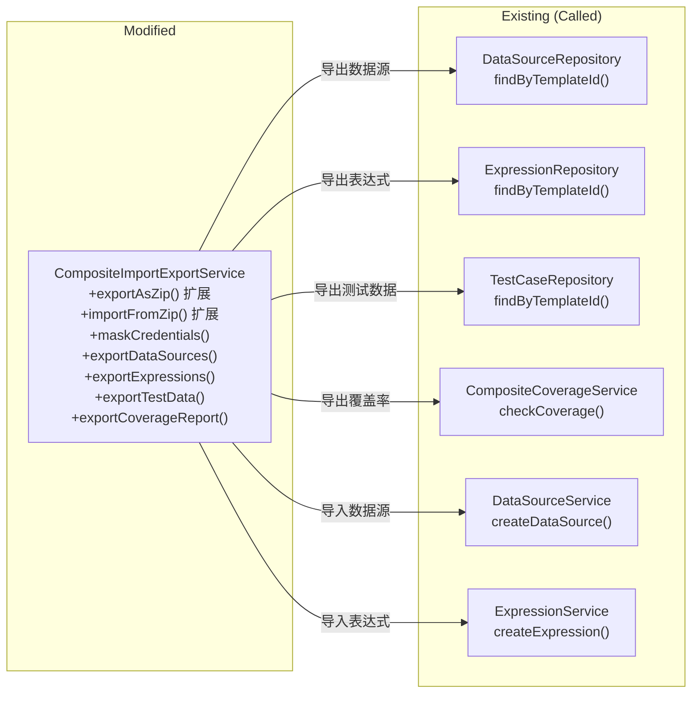
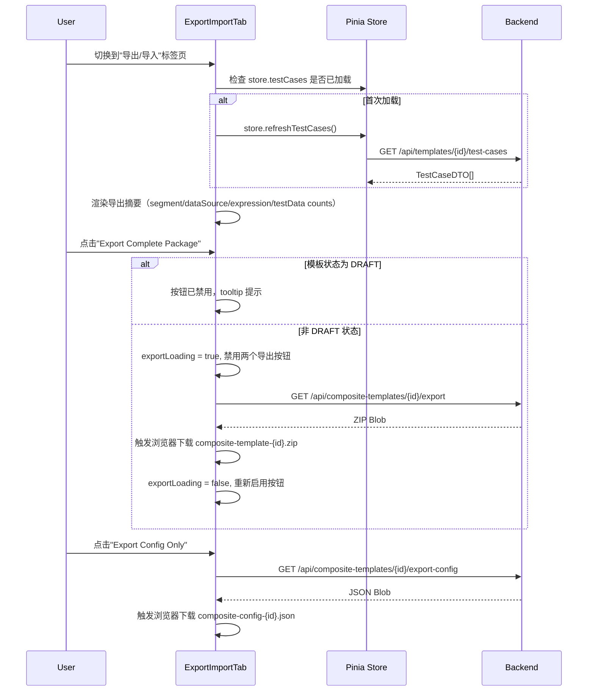
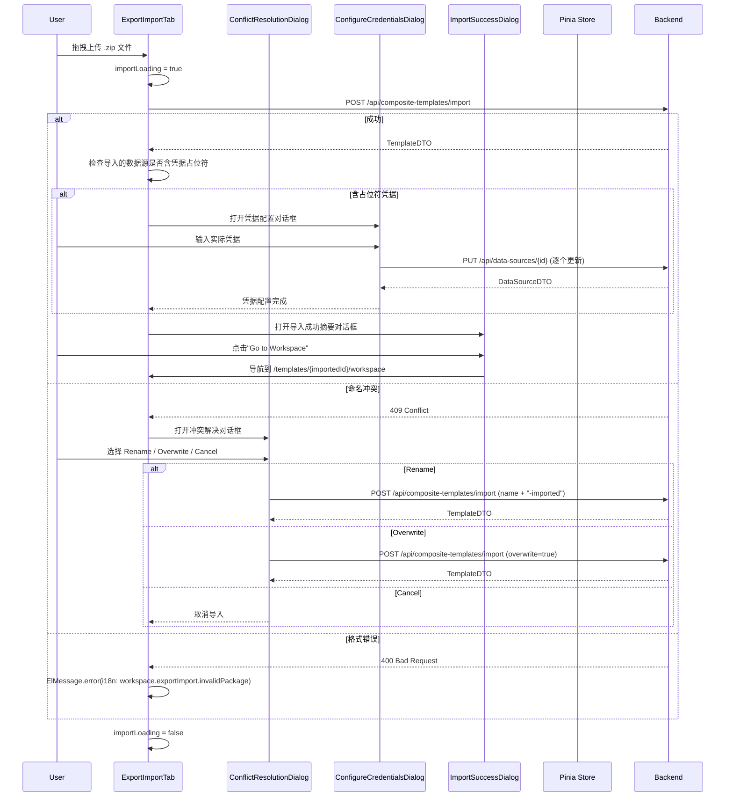
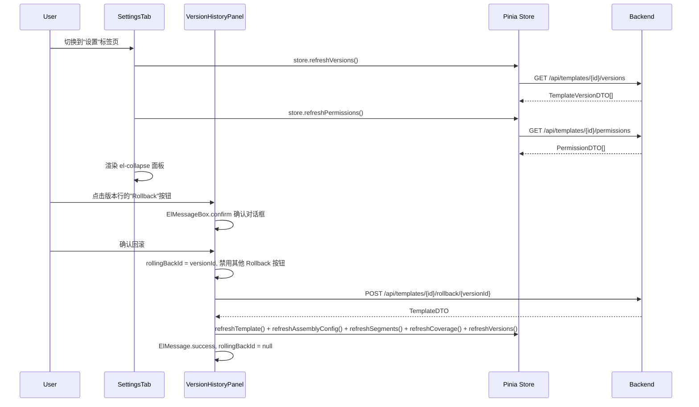
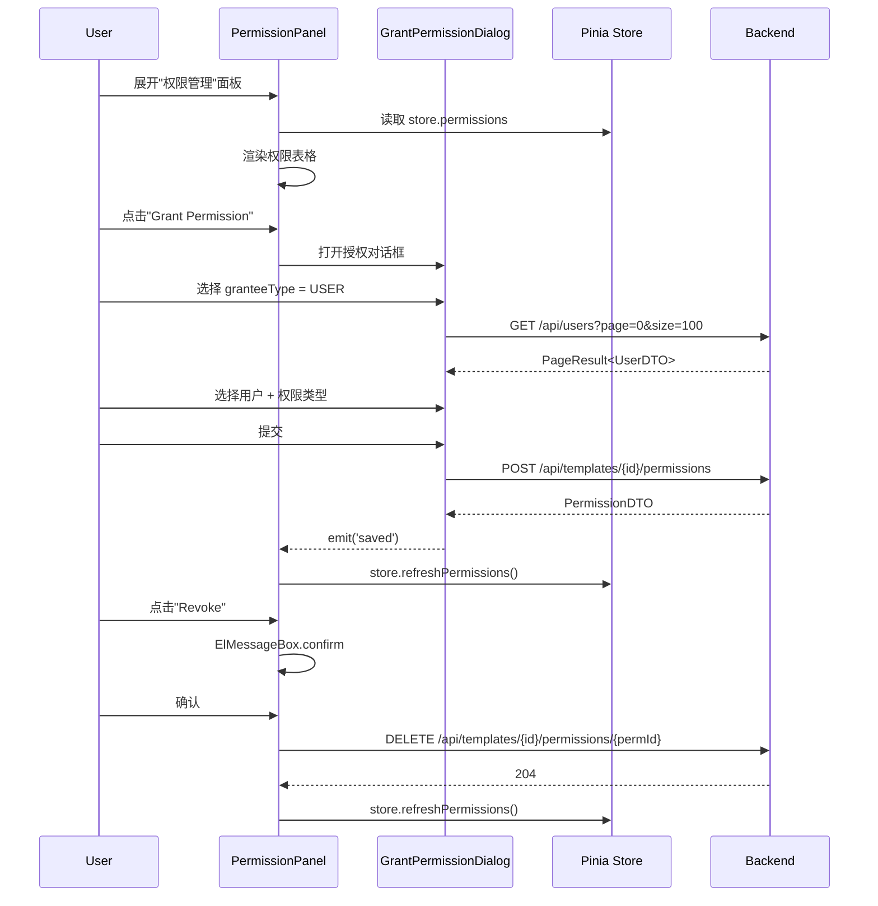

# Design Document — 工作台导出/导入与设置标签页 (Workspace Export/Import & Settings)

## Overview

本设计文档是模板工作台 Phase 4（最终阶段）的技术设计，将 P1 骨架中最后 2 个占位标签页替换为真实实现：

1. **ExportImportTab** — 跨环境 ZIP 完整包导出、JSON 配置导出、ZIP 导入（含冲突解决与凭据占位符检测）、JSON 配置导入
2. **SettingsTab** — 以 `el-collapse` 可折叠面板形式整合：版本历史（含回滚）、版本对比、Webhook 配置、水印与安全、定时任务、权限管理

同时包含：
- **后端变更**：`CompositeImportExportService` 扩展 ZIP 导出内容，新增 `data-sources.json`（含凭据脱敏）、`expressions.json`、`test-data.json`、`coverage-report.json`；导入时支持扩展文件解析及旧格式向后兼容
- **Store 扩展**：新增 `versions` 和 `permissions` 状态 + 对应 refresh actions（按需加载，不在 initWorkspace 中加载）
- **Index.vue 集成**：替换最后 2 个占位组件 + 移除 `placeholderTabs` 数组和 `PlaceholderTab` 导入
- **i18n**：3 个 locale 文件新增 P4 相关 key

### 设计决策与理由

| 决策 | 理由 |
|------|------|
| versions / permissions 按需加载而非 initWorkspace 加载 | 避免用户未访问设置标签页时的无效 API 调用 |
| ExportImportTab 激活时检查 testCases 是否已加载 | 导出摘要需要 testCases.length，但 testCases 是 P3 按需加载的状态 |
| 凭据脱敏在 Service 层而非 Controller 层 | 脱敏逻辑与导出打包紧密耦合，放在 Service 层更内聚 |
| 凭据占位符使用固定字符串 `__CREDENTIAL_PLACEHOLDER__` | 简单明确，导入时易于检测；避免正则匹配的复杂性 |
| coverage-report.json 仅导出不导入 | 覆盖率应从导入后的实际状态重新计算，导入旧覆盖率数据无意义 |
| 旧格式 ZIP（无扩展文件）向后兼容 | 已有导出的 ZIP 包不应因升级而无法导入 |
| SettingsTab 使用 el-collapse 而非 el-tabs | 可折叠面板允许同时展开多个区域，适合设置页面的浏览模式 |
| 嵌入组件（WebhookPanel 等）直接传 templateId prop | 这些组件已实现自包含的数据加载和刷新逻辑，无需额外适配 |
| 权限管理使用 admin.ts 中已有的 API 函数 | getTemplatePermissions、grantPermission、revokePermission 已存在 |
| 团队列表通过 teams.ts 的 listTeams 加载 | 需要当前租户的团队列表用于权限授予选择器 |

## Architecture

### 前端组件架构

```mermaid
graph TD
    subgraph "Template Workspace Page"
        WS["Index.vue"]
        SI["WorkflowStepIndicator"]

        subgraph "P2 Real Tabs"
            T1["DataStructureTab.vue"]
            T2["SegmentArrangementTab.vue"]
            T3["VisualEditorTab.vue"]
        end

        subgraph "P3 Real Tabs"
            T4["TestingTab.vue"]
            T5["ReviewPublishTab.vue"]
        end

        subgraph "P4 Real Tabs"
            T6["ExportImportTab.vue"]
            T7["SettingsTab.vue"]
        end
    end

    subgraph "Shared State"
        PS["useTemplateWorkspaceStore"]
        WF["useWorkflowSteps"]
    end

    subgraph "P4 Sub-Components"
        VH["VersionHistoryPanel"]
        VD["VersionDiffPanel"]
        PP["PermissionPanel"]
        GPD["GrantPermissionDialog"]
        CRD["ConflictResolutionDialog"]
        CCD["ConfigureCredentialsDialog"]
        ISD["ImportSuccessDialog"]
    end

    subgraph "Embedded Existing Components"
        WP["WebhookPanel"]
        WSC["WatermarkSecurityConfig"]
        STM["ScheduledTaskManagement"]
    end

    subgraph "Existing API Layer"
        CT["composite-templates.ts — export/import ZIP"]
        IE["import-export.ts — export/import config"]
        TM["templates.ts — versions, rollback, diff"]
        AD["admin.ts — permissions, users"]
        TE["teams.ts — team list"]
        DS["data-sources.ts — update credentials"]
    end

    WS --> SI
    WS --> T1 & T2 & T3 & T4 & T5 & T6 & T7
    WS --> PS
    SI --> WF
    WF --> PS
    T6 --> CRD & CCD & ISD
    T6 --> PS
    T6 --> CT & IE & DS
    T7 --> VH & VD & PP & WP & WSC & STM
    T7 --> PS
    PP --> GPD
    VH --> TM
    VD --> TM
    PP --> AD & TE
```



### 后端架构变更



### 数据流 — ExportImportTab 导出



### 数据流 — ExportImportTab 导入（含冲突解决与凭据配置）



### 数据流 — SettingsTab 版本历史与回滚



### 数据流 — SettingsTab 权限管理



## Components and Interfaces

### 1. ExportImportTab.vue

路径：`frontend/src/views/template-workspace/components/ExportImportTab.vue`

职责：跨环境 ZIP 导出、JSON 配置导出、ZIP 导入（含冲突解决与凭据配置）、JSON 配置导入。

```typescript
// 无 props — 从 store 读取数据
const store = useTemplateWorkspaceStore()
const { t } = useI18n()
const router = useRouter()

// ── 导出状态 ──
const exportZipLoading = ref(false)
const exportConfigLoading = ref(false)
const exportLoading = computed(() => exportZipLoading.value || exportConfigLoading.value)

// ── 导入状态 ──
const importZipLoading = ref(false)
const importConfigLoading = ref(false)

// ── 对话框状态 ──
const conflictDialogVisible = ref(false)
const conflictResolution = ref<'rename' | 'overwrite' | 'cancel'>('rename')
const pendingImportFile = ref<File | null>(null)

const credentialsDialogVisible = ref(false)
const credentialDataSources = ref<Array<{ id: number; name: string; type: string }>>([])
const credentialValues = ref<Record<number, Record<string, string>>>({})

const importSuccessDialogVisible = ref(false)
const importedTemplate = ref<TemplateDTO | null>(null)

// ── testCases 按需加载 ──
const testCasesLoaded = ref(false)

async function ensureTestCasesLoaded() {
  if (!testCasesLoaded.value && store.testCases.length === 0) {
    await store.refreshTestCases()
    testCasesLoaded.value = true
  }
}

onMounted(() => {
  ensureTestCasesLoaded()
})

// ── 导出摘要计算 ──
const exportSummary = computed(() => ({
  segmentCount: store.assemblyConfig?.segments?.length ?? 0,
  dataSourceCount: store.dataSources.length,
  expressionCount: store.expressions.length,
  testDataCount: store.testCases.length,
}))

// ── DRAFT 状态检查 ──
const isExportPackageDisabled = computed(() => store.isDraft)

// ── 导出 ZIP ──
async function handleExportZip() {
  exportZipLoading.value = true
  try {
    const blob = await exportCompositeAsZip(store.templateId)
    triggerDownload(blob, `composite-template-${store.templateId}.zip`)
  } catch (e: any) {
    ElMessage.error(e.response?.data?.message || e.message || t('message.exportFailed'))
  } finally {
    exportZipLoading.value = false
  }
}

// ── 导出 Config ──
async function handleExportConfig() {
  exportConfigLoading.value = true
  try {
    const blob = await exportCompositeConfig(store.templateId)
    triggerDownload(blob, `composite-config-${store.templateId}.json`)
  } catch (e: any) {
    ElMessage.error(e.response?.data?.message || e.message || t('message.exportFailed'))
  } finally {
    exportConfigLoading.value = false
  }
}

// ── 浏览器下载辅助 ──
function triggerDownload(blob: Blob, filename: string) {
  const url = URL.createObjectURL(blob)
  const a = document.createElement('a')
  a.href = url
  a.download = filename
  a.click()
  URL.revokeObjectURL(url)
}

// ── 导入 ZIP ──
async function handleImportZip(uploadFile: { raw: File }) {
  const file = uploadFile.raw
  importZipLoading.value = true
  try {
    const result = await importCompositeFromZip(file)
    importedTemplate.value = result
    // TODO: 检查导入的数据源是否含凭据占位符（需后端在响应中标记或前端查询）
    importSuccessDialogVisible.value = true
  } catch (e: any) {
    if (e.response?.status === 409) {
      // 命名冲突
      pendingImportFile.value = file
      conflictDialogVisible.value = true
    } else if (e.response?.status === 400) {
      ElMessage.error(t('workspace.exportImport.invalidPackage'))
    } else {
      ElMessage.error(e.response?.data?.message || e.message || t('message.importFailed'))
    }
  } finally {
    importZipLoading.value = false
  }
}

// ── 冲突解决 ──
async function handleConflictResolve() {
  if (!pendingImportFile.value) return
  if (conflictResolution.value === 'cancel') {
    conflictDialogVisible.value = false
    pendingImportFile.value = null
    return
  }
  importZipLoading.value = true
  conflictDialogVisible.value = false
  try {
    // 根据选择重试导入（rename 或 overwrite 通过查询参数传递）
    const result = await importCompositeFromZip(pendingImportFile.value)
    importedTemplate.value = result
    importSuccessDialogVisible.value = true
  } catch (e: any) {
    ElMessage.error(e.response?.data?.message || e.message || t('message.importFailed'))
  } finally {
    importZipLoading.value = false
    pendingImportFile.value = null
  }
}

// ── 凭据配置提交 ──
async function handleCredentialsSubmit() {
  for (const ds of credentialDataSources.value) {
    const values = credentialValues.value[ds.id]
    if (values) {
      try {
        await updateDataSource(ds.id, values)
      } catch (e: any) {
        ElMessage.error(`${ds.name}: ${e.response?.data?.message || e.message}`)
      }
    }
  }
  credentialsDialogVisible.value = false
  ElMessage.success(t('message.saveSuccess'))
}

// ── 导入 JSON Config ──
async function handleImportConfig(uploadFile: { raw: File }) {
  const file = uploadFile.raw
  importConfigLoading.value = true
  try {
    const result = await importConfig(file)
    importedTemplate.value = result
    ElMessage.success(t('workspace.exportImport.importSuccess'))
    importSuccessDialogVisible.value = true
  } catch (e: any) {
    ElMessage.error(e.response?.data?.message || e.message || t('message.importFailed'))
  } finally {
    importConfigLoading.value = false
  }
}

// ── 导航到导入的工作台 ──
function goToImportedWorkspace() {
  if (importedTemplate.value) {
    router.push(`/templates/${importedTemplate.value.id}/workspace`)
  }
  importSuccessDialogVisible.value = false
}
```

模板结构（关键部分）：
```html
<div class="export-import-tab">
  <!-- 导出区域 -->
  <div class="section">
    <h3>{{ $t('workspace.exportImport.exportTitle') }}</h3>

    <!-- 导出摘要卡片 -->
    <el-row :gutter="16" class="export-summary">
      <el-col :span="6">
        <div class="stat-card">
          <span class="stat-value">{{ exportSummary.segmentCount }}</span>
          <span class="stat-label">{{ $t('workspace.exportImport.segmentCount') }}</span>
        </div>
      </el-col>
      <el-col :span="6">
        <div class="stat-card">
          <span class="stat-value">{{ exportSummary.dataSourceCount }}</span>
          <span class="stat-label">{{ $t('workspace.exportImport.dataSourceCount') }}</span>
        </div>
      </el-col>
      <el-col :span="6">
        <div class="stat-card">
          <span class="stat-value">{{ exportSummary.expressionCount }}</span>
          <span class="stat-label">{{ $t('workspace.exportImport.expressionCount') }}</span>
        </div>
      </el-col>
      <el-col :span="6">
        <div class="stat-card">
          <span class="stat-value">{{ exportSummary.testDataCount }}</span>
          <span class="stat-label">{{ $t('workspace.exportImport.testDataCount') }}</span>
        </div>
      </el-col>
    </el-row>

    <!-- 导出按钮 -->
    <div class="export-actions">
      <el-tooltip :content="$t('workspace.exportImport.draftExportDisabled')" :disabled="!isExportPackageDisabled">
        <el-button type="primary" :loading="exportZipLoading" :disabled="isExportPackageDisabled || exportLoading" @click="handleExportZip">
          {{ $t('workspace.exportImport.exportPackage') }}
        </el-button>
      </el-tooltip>
      <el-button :loading="exportConfigLoading" :disabled="exportLoading" @click="handleExportConfig">
        {{ $t('workspace.exportImport.exportConfig') }}
      </el-button>
    </div>
  </div>

  <el-divider />

  <!-- 导入区域 -->
  <div class="section">
    <h3>{{ $t('workspace.exportImport.importTitle') }}</h3>

    <!-- ZIP 导入 -->
    <el-upload drag accept=".zip" :auto-upload="false" :show-file-list="false" :on-change="handleImportZip" :disabled="importZipLoading">
      <el-icon class="el-icon--upload"><upload-filled /></el-icon>
      <div class="el-upload__text">{{ $t('workspace.exportImport.importPackage') }}</div>
      <template #tip>
        <div class="el-upload__tip">.zip files only</div>
      </template>
    </el-upload>

    <!-- JSON Config 导入 -->
    <div style="margin-top: 16px">
      <el-upload accept=".json" :auto-upload="false" :show-file-list="false" :on-change="handleImportConfig" :disabled="importConfigLoading">
        <el-button :loading="importConfigLoading">{{ $t('workspace.exportImport.importConfig') }}</el-button>
      </el-upload>
    </div>
  </div>

  <!-- 冲突解决对话框 -->
  <el-dialog v-model="conflictDialogVisible" :title="$t('workspace.exportImport.conflictTitle')" width="480px">
    <el-radio-group v-model="conflictResolution">
      <el-radio value="rename">{{ $t('workspace.exportImport.conflictRename') }}</el-radio>
      <el-radio value="overwrite">{{ $t('workspace.exportImport.conflictOverwrite') }}</el-radio>
      <el-radio value="cancel">{{ $t('workspace.exportImport.conflictCancel') }}</el-radio>
    </el-radio-group>
    <template #footer>
      <el-button @click="conflictDialogVisible = false">{{ $t('common.cancel') }}</el-button>
      <el-button type="primary" @click="handleConflictResolve">{{ $t('common.confirm') }}</el-button>
    </template>
  </el-dialog>

  <!-- 凭据配置对话框 -->
  <el-dialog v-model="credentialsDialogVisible" :title="$t('workspace.exportImport.configureCredentials')" width="600px">
    <div v-for="ds in credentialDataSources" :key="ds.id" class="credential-item">
      <h4>{{ ds.name }} ({{ ds.type }})</h4>
      <!-- 根据数据源类型显示不同的凭据输入字段 -->
    </div>
    <template #footer>
      <el-button @click="credentialsDialogVisible = false">{{ $t('common.cancel') }}</el-button>
      <el-button type="primary" @click="handleCredentialsSubmit">{{ $t('common.save') }}</el-button>
    </template>
  </el-dialog>

  <!-- 导入成功对话框 -->
  <el-dialog v-model="importSuccessDialogVisible" :title="$t('workspace.exportImport.importSuccess')" width="480px">
    <template v-if="importedTemplate">
      <p>{{ importedTemplate.name }}</p>
      <!-- 导入摘要信息 -->
    </template>
    <template #footer>
      <el-button type="primary" @click="goToImportedWorkspace">{{ $t('workspace.exportImport.goToWorkspace') }}</el-button>
    </template>
  </el-dialog>
</div>
```

### 2. SettingsTab.vue

路径：`frontend/src/views/template-workspace/components/SettingsTab.vue`

职责：以可折叠面板形式整合版本历史、版本对比、Webhook、水印与安全、定时任务、权限管理。

```typescript
// 无 props — 从 store 读取数据
const store = useTemplateWorkspaceStore()
const { t } = useI18n()

// ── 数据加载 ──
const dataLoaded = ref(false)

async function loadSettingsData() {
  if (!dataLoaded.value) {
    await Promise.allSettled([
      store.refreshVersions(),
      store.refreshPermissions(),
    ])
    dataLoaded.value = true
  }
}

onMounted(() => {
  loadSettingsData()
})

// ── 默认展开的面板 ──
const activeCollapseNames = ref<string[]>(['versionHistory'])
```

模板结构：
```html
<div class="settings-tab">
  <el-collapse v-model="activeCollapseNames">
    <!-- 版本历史 -->
    <el-collapse-item :title="$t('workspace.settings.versionHistory')" name="versionHistory">
      <VersionHistoryPanel />
    </el-collapse-item>

    <!-- 版本对比 -->
    <el-collapse-item :title="$t('workspace.settings.versionDiff')" name="versionDiff">
      <VersionDiffPanel />
    </el-collapse-item>

    <!-- Webhook 配置 -->
    <el-collapse-item :title="$t('workspace.settings.webhooks')" name="webhooks">
      <WebhookPanel :template-id="store.templateId" />
    </el-collapse-item>

    <!-- 水印与安全 -->
    <el-collapse-item :title="$t('workspace.settings.watermarkSecurity')" name="watermarkSecurity">
      <WatermarkSecurityConfig :template-id="store.templateId" />
    </el-collapse-item>

    <!-- 定时任务 -->
    <el-collapse-item :title="$t('workspace.settings.scheduledTasks')" name="scheduledTasks">
      <ScheduledTaskManagement :template-id="store.templateId" />
    </el-collapse-item>

    <!-- 权限管理 -->
    <el-collapse-item :title="$t('workspace.settings.permissions')" name="permissions">
      <PermissionPanel />
    </el-collapse-item>
  </el-collapse>
</div>
```

### 3. VersionHistoryPanel.vue

路径：`frontend/src/views/template-workspace/components/VersionHistoryPanel.vue`

职责：展示版本历史列表，提供回滚操作。

```typescript
const store = useTemplateWorkspaceStore()
const { t } = useI18n()

const rollingBackId = ref<number | null>(null)

async function handleRollback(version: TemplateVersionDTO) {
  try {
    await ElMessageBox.confirm(
      t('workspace.settings.rollbackConfirm', { versionNumber: version.versionNumber }),
      t('common.confirm'),
      { type: 'warning' },
    )
  } catch { return }

  rollingBackId.value = version.id
  try {
    await rollbackVersion(store.templateId, version.id)
    await Promise.all([
      store.refreshTemplate(),
      store.refreshAssemblyConfig(),
      store.refreshSegments(),
      store.refreshCoverage(),
      store.refreshVersions(),
    ])
    ElMessage.success(t('workspace.settings.rollbackSuccess'))
  } catch (e: any) {
    ElMessage.error(e.response?.data?.message || e.message || t('message.operationFailed'))
  } finally {
    rollingBackId.value = null
  }
}
```

模板结构：
```html
<el-table :data="store.versions" border stripe>
  <el-table-column prop="versionNumber" :label="$t('common.version')" width="100" />
  <el-table-column prop="createdAt" :label="$t('common.createdAt')" width="180" />
  <el-table-column prop="createdBy" :label="$t('common.createdBy')" width="140" />
  <el-table-column prop="comment" :label="$t('common.comment')" />
  <el-table-column :label="$t('common.actions')" width="120" fixed="right">
    <template #default="{ row }">
      <el-button
        size="small"
        :loading="rollingBackId === row.id"
        :disabled="rollingBackId !== null && rollingBackId !== row.id"
        @click="handleRollback(row)"
      >{{ $t('workspace.settings.rollback') }}</el-button>
    </template>
  </el-table-column>
</el-table>
```

### 4. VersionDiffPanel.vue

路径：`frontend/src/views/template-workspace/components/VersionDiffPanel.vue`

职责：选择两个版本号进行对比，展示差异结果。

```typescript
const store = useTemplateWorkspaceStore()
const { t } = useI18n()

const versionA = ref<number | null>(null)
const versionB = ref<number | null>(null)
const diffResult = ref<VersionDiffResult | null>(null)
const comparing = ref(false)

const isCompareDisabled = computed(() =>
  versionA.value === null || versionB.value === null || versionA.value === versionB.value
)

async function handleCompare() {
  if (versionA.value === null || versionB.value === null) return
  comparing.value = true
  try {
    diffResult.value = await getVersionDiff(store.templateId, versionA.value, versionB.value)
  } catch (e: any) {
    ElMessage.error(e.response?.data?.message || e.message || t('message.operationFailed'))
  } finally {
    comparing.value = false
  }
}

// ── Diff 类型颜色映射 ──
function diffTypeTag(type: string): string {
  switch (type) {
    case 'ADDED': return 'success'
    case 'REMOVED': return 'danger'
    case 'MODIFIED': return 'warning'
    default: return 'info'
  }
}
```

模板结构：
```html
<div class="version-diff-panel">
  <el-row :gutter="16" align="middle">
    <el-col :span="8">
      <el-select v-model="versionA" :placeholder="$t('workspace.settings.versionA')" clearable>
        <el-option v-for="v in store.versions" :key="v.id" :label="`v${v.versionNumber}`" :value="v.versionNumber" />
      </el-select>
    </el-col>
    <el-col :span="8">
      <el-select v-model="versionB" :placeholder="$t('workspace.settings.versionB')" clearable>
        <el-option v-for="v in store.versions" :key="v.id" :label="`v${v.versionNumber}`" :value="v.versionNumber" />
      </el-select>
    </el-col>
    <el-col :span="8">
      <el-button type="primary" :loading="comparing" :disabled="isCompareDisabled" @click="handleCompare">
        {{ $t('workspace.settings.compareVersions') }}
      </el-button>
    </el-col>
  </el-row>

  <!-- Diff 结果展示 -->
  <template v-if="diffResult">
    <div class="diff-summary">
      <el-tag type="success">+{{ diffResult.summary.added }}</el-tag>
      <el-tag type="danger">-{{ diffResult.summary.removed }}</el-tag>
      <el-tag type="warning">~{{ diffResult.summary.modified }}</el-tag>
    </div>

    <!-- 文本差异 -->
    <el-table v-if="diffResult.textDiffs.length > 0" :data="diffResult.textDiffs" border stripe>
      <el-table-column prop="field" label="Field" width="200" />
      <el-table-column label="Type" width="120">
        <template #default="{ row }">
          <el-tag :type="diffTypeTag(row.type)" size="small">{{ row.type }}</el-tag>
        </template>
      </el-table-column>
      <el-table-column prop="oldValue" label="Old Value" />
      <el-table-column prop="newValue" label="New Value" />
    </el-table>

    <!-- 变量差异、数据源差异、表达式差异 — 同样结构 -->
  </template>
</div>
```

### 5. PermissionPanel.vue

路径：`frontend/src/views/template-workspace/components/PermissionPanel.vue`

职责：展示模板级别权限列表，提供授权/撤销操作。

```typescript
const store = useTemplateWorkspaceStore()
const { t } = useI18n()

const grantDialogVisible = ref(false)
const revokingId = ref<number | null>(null)

async function handleRevoke(permission: PermissionDTO) {
  try {
    await ElMessageBox.confirm(
      t('workspace.settings.revokeConfirm'),
      t('common.confirm'),
      { type: 'warning' },
    )
  } catch { return }

  revokingId.value = permission.id
  try {
    await revokePermission(store.templateId, permission.id)
    await store.refreshPermissions()
    ElMessage.success(t('message.deleteSuccess'))
  } catch (e: any) {
    ElMessage.error(e.response?.data?.message || e.message || t('message.operationFailed'))
  } finally {
    revokingId.value = null
  }
}

async function onGrantSaved() {
  grantDialogVisible.value = false
  await store.refreshPermissions()
  ElMessage.success(t('message.saveSuccess'))
}
```

模板结构：
```html
<div class="permission-panel">
  <div class="toolbar">
    <el-button type="primary" @click="grantDialogVisible = true">{{ $t('workspace.settings.grantPermission') }}</el-button>
  </div>

  <el-empty v-if="store.permissions.length === 0" :description="$t('workspace.settings.noPermissions')" />

  <el-table v-else :data="store.permissions" border stripe>
    <el-table-column prop="granteeName" :label="$t('common.name')" min-width="140" />
    <el-table-column :label="$t('workspace.settings.granteeType')" width="120">
      <template #default="{ row }">
        <el-tag :type="row.granteeType === 'USER' ? 'primary' : 'success'" size="small">{{ row.granteeType }}</el-tag>
      </template>
    </el-table-column>
    <el-table-column :label="$t('workspace.settings.permissionType')" width="120">
      <template #default="{ row }">
        <el-tag size="small">{{ row.permissionType }}</el-tag>
      </template>
    </el-table-column>
    <el-table-column prop="createdAt" :label="$t('common.createdAt')" width="180" />
    <el-table-column :label="$t('common.actions')" width="120" fixed="right">
      <template #default="{ row }">
        <el-button
          size="small"
          type="danger"
          :loading="revokingId === row.id"
          @click="handleRevoke(row)"
        >{{ $t('common.revoke') }}</el-button>
      </template>
    </el-table-column>
  </el-table>

  <GrantPermissionDialog
    v-model:visible="grantDialogVisible"
    :template-id="store.templateId"
    @saved="onGrantSaved"
  />
</div>
```

### 6. GrantPermissionDialog.vue

路径：`frontend/src/views/template-workspace/components/GrantPermissionDialog.vue`

职责：授权表单对话框，收集被授权方类型、被授权方、权限类型。

```typescript
const props = defineProps<{
  visible: boolean
  templateId: number
}>()

const emit = defineEmits<{
  'update:visible': [value: boolean]
  saved: []
}>()

const form = reactive({
  granteeType: 'USER' as 'USER' | 'TEAM',
  granteeId: null as number | null,
  permissionType: 'VIEW' as 'VIEW' | 'EDIT' | 'DELETE' | 'CALL_API',
})

const users = ref<UserDTO[]>([])
const teams = ref<TeamDTO[]>([])
const loadingGrantees = ref(false)
const submitting = ref(false)

// 切换 granteeType 时加载对应列表
watch(() => form.granteeType, async (type) => {
  form.granteeId = null
  loadingGrantees.value = true
  try {
    if (type === 'USER') {
      const result = await getUsers({ page: 0, size: 100 })
      users.value = result.content
    } else {
      // 需要当前租户 ID — 从 store.template.tenantId 获取
      const tenantId = useTemplateWorkspaceStore().template?.tenantId
      if (tenantId) {
        teams.value = await listTeams(tenantId)
      }
    }
  } catch { /* 静默处理 */ }
  finally { loadingGrantees.value = false }
}, { immediate: true })

// 打开对话框时重置
watch(() => props.visible, (val) => {
  if (val) {
    form.granteeType = 'USER'
    form.granteeId = null
    form.permissionType = 'VIEW'
  }
})

async function handleSubmit() {
  if (!form.granteeId) {
    ElMessage.warning(t('workspace.settings.selectGrantee'))
    return
  }
  submitting.value = true
  try {
    await grantPermission(props.templateId, {
      granteeId: form.granteeId,
      granteeType: form.granteeType,
      permissionType: form.permissionType,
    })
    emit('saved')
  } catch (e: any) {
    ElMessage.error(e.response?.data?.message || e.message || t('message.saveFailed'))
  } finally {
    submitting.value = false
  }
}
```

模板结构：
```html
<el-dialog :model-value="visible" @update:model-value="emit('update:visible', $event)" :title="$t('workspace.settings.grantPermission')" width="480px">
  <el-form :model="form" label-width="120px">
    <el-form-item :label="$t('workspace.settings.granteeType')">
      <el-radio-group v-model="form.granteeType">
        <el-radio value="USER">USER</el-radio>
        <el-radio value="TEAM">TEAM</el-radio>
      </el-radio-group>
    </el-form-item>
    <el-form-item :label="$t('common.name')">
      <el-select v-model="form.granteeId" filterable :loading="loadingGrantees" :placeholder="$t('common.select')">
        <template v-if="form.granteeType === 'USER'">
          <el-option v-for="u in users" :key="u.id" :label="u.username" :value="u.id" />
        </template>
        <template v-else>
          <el-option v-for="team in teams" :key="team.id" :label="team.name" :value="team.id" />
        </template>
      </el-select>
    </el-form-item>
    <el-form-item :label="$t('workspace.settings.permissionType')">
      <el-select v-model="form.permissionType">
        <el-option label="VIEW" value="VIEW" />
        <el-option label="EDIT" value="EDIT" />
        <el-option label="DELETE" value="DELETE" />
        <el-option label="CALL_API" value="CALL_API" />
      </el-select>
    </el-form-item>
  </el-form>
  <template #footer>
    <el-button @click="emit('update:visible', false)">{{ $t('common.cancel') }}</el-button>
    <el-button type="primary" :loading="submitting" @click="handleSubmit">{{ $t('common.confirm') }}</el-button>
  </template>
</el-dialog>
```

### 7. 后端变更 — CompositeImportExportService 扩展

#### 7.1 exportAsZip 扩展 — 新增 4 个文件

```java
@Transactional(readOnly = true)
public byte[] exportAsZip(Long compositeTemplateId) {
    Template template = findCompositeTemplateOrThrow(compositeTemplateId);
    AssemblyConfigDTO config = assemblyConfigService.deserialize(template.getAssemblyConfig());

    try (ByteArrayOutputStream baos = new ByteArrayOutputStream();
         ZipOutputStream zos = new ZipOutputStream(baos)) {

        // ── 现有逻辑：config.json + segments/*.docx ──
        CompositeExportConfig exportConfig = buildExportConfig(template, config);
        byte[] configBytes = objectMapper.writerWithDefaultPrettyPrinter().writeValueAsBytes(exportConfig);
        zos.putNextEntry(new ZipEntry("config.json"));
        zos.write(configBytes);
        zos.closeEntry();

        if (config.getSegments() != null) {
            Set<String> usedNames = new HashSet<>();
            for (AssemblySegmentEntry entry : config.getSegments()) {
                Segment segment = segmentRepository.findById(entry.getSegmentId()).orElse(null);
                if (segment == null) {
                    log.warn("Segment {} not found during export, skipping", entry.getSegmentId());
                    continue;
                }
                byte[] docxBytes = downloadFromMinio(segment.getFilePath());
                String fileName = uniqueFileName(segment.getName(), usedNames);
                zos.putNextEntry(new ZipEntry("segments/" + fileName + ".docx"));
                zos.write(docxBytes);
                zos.closeEntry();
            }
        }

        // ── P4 新增：data-sources.json ──
        List<DataSource> dataSources = dataSourceRepository.findByTemplateId(compositeTemplateId);
        List<Map<String, Object>> maskedDataSources = dataSources.stream()
                .map(this::toMaskedDataSourceMap)
                .toList();
        byte[] dsBytes = objectMapper.writerWithDefaultPrettyPrinter().writeValueAsBytes(maskedDataSources);
        zos.putNextEntry(new ZipEntry("data-sources.json"));
        zos.write(dsBytes);
        zos.closeEntry();

        // ── P4 新增：expressions.json ──
        List<Expression> expressions = expressionRepository.findByTemplateId(compositeTemplateId);
        byte[] exprBytes = objectMapper.writerWithDefaultPrettyPrinter().writeValueAsBytes(
                expressions.stream().map(this::toExpressionExportMap).toList());
        zos.putNextEntry(new ZipEntry("expressions.json"));
        zos.write(exprBytes);
        zos.closeEntry();

        // ── P4 新增：test-data.json ──
        List<TestCase> testCases = testCaseRepository.findByTemplateId(compositeTemplateId);
        byte[] testBytes = objectMapper.writerWithDefaultPrettyPrinter().writeValueAsBytes(
                testCases.stream().map(this::toTestCaseExportMap).toList());
        zos.putNextEntry(new ZipEntry("test-data.json"));
        zos.write(testBytes);
        zos.closeEntry();

        // ── P4 新增：coverage-report.json（仅信息性，不导入）──
        try {
            CompositeCoverageReport coverageReport = compositeCoverageService.checkCoverage(compositeTemplateId);
            byte[] covBytes = objectMapper.writerWithDefaultPrettyPrinter().writeValueAsBytes(coverageReport);
            zos.putNextEntry(new ZipEntry("coverage-report.json"));
            zos.write(covBytes);
            zos.closeEntry();
        } catch (Exception e) {
            log.warn("Failed to generate coverage report for export, skipping: {}", e.getMessage());
        }

        zos.finish();
        return baos.toByteArray();
    } catch (BusinessException e) {
        throw e;
    } catch (Exception e) {
        log.error("Failed to export composite template as ZIP: templateId={}", compositeTemplateId, e);
        throw new BusinessException(ErrorCode.EXPORT_FAILED,
                "Failed to export composite template as ZIP", HttpStatus.INTERNAL_SERVER_ERROR, e);
    }
}
```

#### 7.2 凭据脱敏辅助方法

```java
private static final String CREDENTIAL_PLACEHOLDER = "__CREDENTIAL_PLACEHOLDER__";

/**
 * 将 DataSource 转换为导出 Map，对敏感字段进行脱敏。
 * 敏感字段：DATABASE 类型的 password、HTTP_API 类型的 apiKey、OAuth 的 clientSecret。
 */
private Map<String, Object> toMaskedDataSourceMap(DataSource ds) {
    Map<String, Object> map = new LinkedHashMap<>();
    map.put("name", ds.getName());
    map.put("type", ds.getType());
    map.put("cacheEnabled", ds.isCacheEnabled());
    map.put("cacheTtl", ds.getCacheTtl());
    map.put("priority", ds.getPriority());

    // 解析 configJson 并脱敏
    try {
        Map<String, Object> config = objectMapper.readValue(ds.getConfigJson(),
                new TypeReference<Map<String, Object>>() {});
        maskCredentialFields(config, ds.getType());
        map.put("config", config);
    } catch (Exception e) {
        log.warn("Failed to parse configJson for data source {}, exporting raw", ds.getId());
        map.put("config", ds.getConfigJson());
    }
    return map;
}

/**
 * 根据数据源类型脱敏敏感字段。
 */
private void maskCredentialFields(Map<String, Object> config, String type) {
    if ("DATABASE".equals(type)) {
        if (config.containsKey("password")) {
            config.put("password", CREDENTIAL_PLACEHOLDER);
        }
    }
    // HTTP_API — apiKey in auth config
    if (config.containsKey("apiKey")) {
        config.put("apiKey", CREDENTIAL_PLACEHOLDER);
    }
    // OAuth — clientSecret
    if (config.containsKey("clientSecret")) {
        config.put("clientSecret", CREDENTIAL_PLACEHOLDER);
    }
    // 递归处理嵌套的 auth 配置
    if (config.containsKey("auth") && config.get("auth") instanceof Map) {
        @SuppressWarnings("unchecked")
        Map<String, Object> auth = (Map<String, Object>) config.get("auth");
        if (auth.containsKey("apiKey")) auth.put("apiKey", CREDENTIAL_PLACEHOLDER);
        if (auth.containsKey("clientSecret")) auth.put("clientSecret", CREDENTIAL_PLACEHOLDER);
        if (auth.containsKey("password")) auth.put("password", CREDENTIAL_PLACEHOLDER);
    }
}

private Map<String, Object> toExpressionExportMap(Expression expr) {
    Map<String, Object> map = new LinkedHashMap<>();
    map.put("name", expr.getName());
    map.put("expressionType", expr.getExpressionType());
    map.put("expressionText", expr.getExpressionText());
    map.put("description", expr.getDescription());
    map.put("executionOrder", expr.getExecutionOrder());
    return map;
}

private Map<String, Object> toTestCaseExportMap(TestCase tc) {
    Map<String, Object> map = new LinkedHashMap<>();
    map.put("name", tc.getName());
    map.put("testDataJson", tc.getTestDataJson());
    map.put("expectedResultJson", tc.getExpectedResultJson());
    map.put("comparisonType", tc.getComparisonType());
    return map;
}
```

#### 7.3 importFromZip 扩展 — 解析扩展文件

在现有 `importFromZip` 方法的 ZIP 解析循环中新增对扩展文件的处理：

```java
@Transactional
public TemplateDTO importFromZip(MultipartFile zipFile, Long userId) {
    Long tenantId = TenantContext.getCurrentTenantId();

    Map<String, byte[]> segmentFiles = new LinkedHashMap<>();
    CompositeExportConfig exportConfig = null;
    // P4 新增：扩展文件内容
    byte[] dataSourcesBytes = null;
    byte[] expressionsBytes = null;
    byte[] testDataBytes = null;
    // coverage-report.json 不导入

    // Parse ZIP
    try (ZipInputStream zis = new ZipInputStream(zipFile.getInputStream())) {
        ZipEntry entry;
        while ((entry = zis.getNextEntry()) != null) {
            if (entry.isDirectory()) continue;
            String name = entry.getName();
            byte[] content = zis.readAllBytes();

            if ("config.json".equals(name)) {
                exportConfig = objectMapper.readValue(content, CompositeExportConfig.class);
            } else if (name.startsWith("segments/") && name.endsWith(".docx")) {
                String segmentName = name.substring("segments/".length(), name.length() - ".docx".length());
                segmentFiles.put(segmentName, content);
            } else if ("data-sources.json".equals(name)) {
                dataSourcesBytes = content;
            } else if ("expressions.json".equals(name)) {
                expressionsBytes = content;
            } else if ("test-data.json".equals(name)) {
                testDataBytes = content;
            }
            // coverage-report.json 被忽略
            zis.closeEntry();
        }
    } catch (Exception e) {
        log.error("Failed to parse import ZIP file", e);
        throw new BusinessException(ErrorCode.IMPORT_INVALID_FILE,
                "Invalid ZIP file: " + e.getMessage(), HttpStatus.BAD_REQUEST, e);
    }

    // Validate structure
    if (exportConfig == null) {
        throw new BusinessException(ErrorCode.IMPORT_INVALID_FILE,
                "ZIP must contain config.json", HttpStatus.BAD_REQUEST);
    }

    // ... 现有 segment 创建和 template 创建逻辑不变 ...

    // P4 新增：导入扩展文件（向后兼容 — 文件不存在时跳过）
    if (dataSourcesBytes != null) {
        importDataSources(dataSourcesBytes, template.getId(), tenantId);
    }
    if (expressionsBytes != null) {
        importExpressions(expressionsBytes, template.getId(), tenantId);
    }
    if (testDataBytes != null) {
        importTestData(testDataBytes, template.getId());
    }

    log.info("Imported composite template: name={}, id={}, segments={}, dataSources={}, expressions={}, testData={}",
            template.getName(), template.getId(), nameToSegmentId.size(),
            dataSourcesBytes != null, expressionsBytes != null, testDataBytes != null);
    return toTemplateDTO(template);
}

private void importDataSources(byte[] bytes, Long templateId, Long tenantId) {
    try {
        List<Map<String, Object>> dsList = objectMapper.readValue(bytes,
                new TypeReference<List<Map<String, Object>>>() {});
        for (Map<String, Object> dsMap : dsList) {
            DataSource ds = new DataSource();
            ds.setTemplateId(templateId);
            ds.setName((String) dsMap.get("name"));
            ds.setType((String) dsMap.get("type"));
            ds.setCacheEnabled(Boolean.TRUE.equals(dsMap.get("cacheEnabled")));
            ds.setCacheTtl(dsMap.get("cacheTtl") != null ? ((Number) dsMap.get("cacheTtl")).intValue() : 300);
            ds.setPriority(dsMap.get("priority") != null ? ((Number) dsMap.get("priority")).intValue() : 0);
            Object config = dsMap.get("config");
            ds.setConfigJson(config instanceof String ? (String) config : objectMapper.writeValueAsString(config));
            dataSourceRepository.save(ds);
        }
        log.info("Imported {} data sources for template {}", dsList.size(), templateId);
    } catch (Exception e) {
        log.warn("Failed to import data sources: {}", e.getMessage());
    }
}

private void importExpressions(byte[] bytes, Long templateId, Long tenantId) {
    try {
        List<Map<String, Object>> exprList = objectMapper.readValue(bytes,
                new TypeReference<List<Map<String, Object>>>() {});
        for (Map<String, Object> exprMap : exprList) {
            Expression expr = new Expression();
            expr.setTemplateId(templateId);
            expr.setName((String) exprMap.get("name"));
            expr.setExpressionType((String) exprMap.get("expressionType"));
            expr.setExpressionText((String) exprMap.get("expressionText"));
            expr.setDescription((String) exprMap.get("description"));
            expr.setExecutionOrder(exprMap.get("executionOrder") != null
                    ? ((Number) exprMap.get("executionOrder")).intValue() : 0);
            expressionRepository.save(expr);
        }
        log.info("Imported {} expressions for template {}", exprList.size(), templateId);
    } catch (Exception e) {
        log.warn("Failed to import expressions: {}", e.getMessage());
    }
}

private void importTestData(byte[] bytes, Long templateId) {
    try {
        List<Map<String, Object>> testList = objectMapper.readValue(bytes,
                new TypeReference<List<Map<String, Object>>>() {});
        for (Map<String, Object> tcMap : testList) {
            TestCase tc = new TestCase();
            tc.setTemplateId(templateId);
            tc.setName((String) tcMap.get("name"));
            tc.setTestDataJson((String) tcMap.get("testDataJson"));
            tc.setExpectedResultJson((String) tcMap.get("expectedResultJson"));
            tc.setComparisonType((String) tcMap.get("comparisonType"));
            testCaseRepository.save(tc);
        }
        log.info("Imported {} test cases for template {}", testList.size(), templateId);
    } catch (Exception e) {
        log.warn("Failed to import test data: {}", e.getMessage());
    }
}
```

#### 7.4 新增依赖注入

```java
// CompositeImportExportService 构造器新增参数：
private final DataSourceRepository dataSourceRepository;
private final ExpressionRepository expressionRepository;
private final TestCaseRepository testCaseRepository;
private final CompositeCoverageService compositeCoverageService;

public CompositeImportExportService(
        TemplateRepository templateRepository,
        SegmentRepository segmentRepository,
        AssemblyConfigService assemblyConfigService,
        ObjectMapper objectMapper,
        MinioClient minioClient,
        @Value("${minio.bucket-name:docgen}") String bucketName,
        // P4 新增：
        DataSourceRepository dataSourceRepository,
        ExpressionRepository expressionRepository,
        TestCaseRepository testCaseRepository,
        CompositeCoverageService compositeCoverageService) {
    // ... 现有赋值 ...
    this.dataSourceRepository = dataSourceRepository;
    this.expressionRepository = expressionRepository;
    this.testCaseRepository = testCaseRepository;
    this.compositeCoverageService = compositeCoverageService;
}
```

### 8. Store 扩展 — versions / permissions 状态

```typescript
// stores/templateWorkspace.ts — P4 新增部分

import { getTemplateVersions } from '@/api/templates'
import { getTemplatePermissions } from '@/api/admin'
import type { TemplateVersionDTO } from '@/api/templates'
import type { PermissionDTO } from '@/api/admin'

// State 新增：
const versions = ref<TemplateVersionDTO[]>([])
const permissions = ref<PermissionDTO[]>([])

// 注意：versions 和 permissions 不在 initWorkspace 中加载（按需加载）

// 新增 action：
async function refreshVersions(): Promise<void> {
  if (!templateId.value) return
  try {
    versions.value = await getTemplateVersions(templateId.value)
    delete warnings.value.versions
  } catch (e: any) {
    warnings.value.versions = e.message || 'Refresh failed'
  }
}

async function refreshPermissions(): Promise<void> {
  if (!templateId.value) return
  try {
    permissions.value = await getTemplatePermissions(templateId.value)
    delete warnings.value.permissions
  } catch (e: any) {
    warnings.value.permissions = e.message || 'Refresh failed'
  }
}

// $reset 中新增：
// versions.value = []
// permissions.value = []

// return 中新增：
// versions, permissions, refreshVersions, refreshPermissions
```

### 9. Index.vue 变更

```typescript
// ── 替换 import ──
// 移除：
// import PlaceholderTab from './components/PlaceholderTab.vue'
// 新增：
import ExportImportTab from './components/ExportImportTab.vue'
import SettingsTab from './components/SettingsTab.vue'

// ── 移除 placeholderTabs 数组 ──
// 删除整个 const placeholderTabs = [...] 定义

// ── 模板变更 ──
// 移除 v-for="tab in placeholderTabs" 的 PlaceholderTab 渲染
// 替换为：
// <el-tab-pane :label="$t('workspace.tabExportImport')" name="exportImport">
//   <ExportImportTab />
// </el-tab-pane>
// <el-tab-pane :label="$t('workspace.tabSettings')" name="settings">
//   <SettingsTab />
// </el-tab-pane>
```

## Data Models

### 前端类型扩展

```typescript
// types/workspace.ts — 无新增类型文件，复用现有类型

// 已有类型（直接使用）：
// - TemplateVersionDTO (from @/api/templates)
// - VersionDiffResult, DiffEntry (from @/api/templates)
// - PermissionDTO, GrantPermissionRequest (from @/api/admin)
// - UserDTO (from @/api/admin)
// - TeamDTO (from @/api/teams)
// - TemplateDTO (from @/api/templates)
// - TestCaseDTO (from @/api/market)
```

### Store 状态扩展

```typescript
// stores/templateWorkspace.ts — P4 新增字段
versions: TemplateVersionDTO[]    // 从 getTemplateVersions(templateId) 按需加载
permissions: PermissionDTO[]      // 从 getTemplatePermissions(templateId) 按需加载

// P4 新增 actions
refreshVersions(): Promise<void>
refreshPermissions(): Promise<void>
```

### 后端数据模型

无新增数据库表或字段。变更基于现有结构：

- `CompositeImportExportService` — 新增 4 个 Repository/Service 依赖注入，扩展 `exportAsZip` 和 `importFromZip` 方法
- `DataSource` 表 — 导出时 `configJson` 中的敏感字段被脱敏为 `__CREDENTIAL_PLACEHOLDER__`
- `Expression` 表 — 导出/导入时使用 `expressionRepository.findByTemplateId()`
- `TestCase` 表 — 导出/导入时使用 `testCaseRepository.findByTemplateId()`

### i18n Key 结构

```
# 导出/导入标签页
workspace.exportImport.exportTitle          — "跨环境导出" / "Cross-Environment Export"
workspace.exportImport.importTitle          — "跨环境导入" / "Cross-Environment Import"
workspace.exportImport.exportPackage        — "导出完整包" / "Export Complete Package"
workspace.exportImport.exportConfig         — "仅导出配置" / "Export Config Only"
workspace.exportImport.importPackage        — "导入完整包" / "Import Package"
workspace.exportImport.importConfig         — "导入配置" / "Import Config Only"
workspace.exportImport.draftExportDisabled  — "模板必须处于 PENDING_REVIEW、REVIEWED 或 ACTIVE 状态才能导出完整包" / "Template must be in PENDING_REVIEW, REVIEWED, or ACTIVE status to export a complete package"
workspace.exportImport.invalidPackage       — "无效的包格式" / "Invalid package format"
workspace.exportImport.importSuccess        — "导入成功" / "Import Successful"
workspace.exportImport.goToWorkspace        — "前往工作台" / "Go to Workspace"
workspace.exportImport.conflictTitle        — "命名冲突" / "Naming Conflict"
workspace.exportImport.conflictRename       — "重命名（添加 -imported 后缀）" / "Rename (append -imported suffix)"
workspace.exportImport.conflictOverwrite    — "覆盖现有模板" / "Overwrite existing template"
workspace.exportImport.conflictCancel       — "取消导入" / "Cancel import"
workspace.exportImport.configureCredentials — "配置凭据" / "Configure Credentials"
workspace.exportImport.segmentCount         — "片段数" / "Segments"
workspace.exportImport.dataSourceCount      — "数据源数" / "Data Sources"
workspace.exportImport.expressionCount      — "表达式数" / "Expressions"
workspace.exportImport.testDataCount        — "测试数据数" / "Test Data"

# 设置标签页
workspace.settings.versionHistory           — "版本历史" / "Version History"
workspace.settings.versionDiff              — "版本对比" / "Version Diff"
workspace.settings.webhooks                 — "Webhook 配置" / "Webhooks"
workspace.settings.watermarkSecurity        — "水印与安全" / "Watermark & Security"
workspace.settings.scheduledTasks           — "定时任务" / "Scheduled Tasks"
workspace.settings.permissions              — "权限管理" / "Permissions"
workspace.settings.rollbackConfirm          — "回滚到版本 {versionNumber} 将基于该版本内容创建新版本。您需要重新走审核流程才能发布。是否继续？" / "Rolling back to version {versionNumber} will create a new version based on that version's content. You will need to go through the review process again to publish. Continue?"
workspace.settings.rollbackSuccess          — "回滚成功" / "Rollback successful"
workspace.settings.rollback                 — "回滚" / "Rollback"
workspace.settings.compareVersions          — "对比版本" / "Compare Versions"
workspace.settings.versionA                 — "版本 A" / "Version A"
workspace.settings.versionB                 — "版本 B" / "Version B"
workspace.settings.grantPermission          — "授予权限" / "Grant Permission"
workspace.settings.revokeConfirm            — "确定要撤销此权限吗？" / "Are you sure you want to revoke this permission?"
workspace.settings.noPermissions            — "暂无权限记录。点击"授予权限"添加。" / "No permissions configured. Click 'Grant Permission' to add."
workspace.settings.granteeType              — "被授权方类型" / "Grantee Type"
workspace.settings.permissionType           — "权限类型" / "Permission Type"
workspace.settings.selectGrantee            — "请选择被授权方" / "Please select a grantee"
```

## Correctness Properties

*A property is a characteristic or behavior that should hold true across all valid executions of a system — essentially, a formal statement about what the system should do. Properties serve as the bridge between human-readable specifications and machine-verifiable correctness guarantees.*

### Property 1: Export button disabled state based on template status

*For any* template status value, the "Export Complete Package" button SHALL be disabled if and only if the status is `DRAFT`. For statuses `PENDING_REVIEW`, `REVIEWED`, `ACTIVE`, and `ARCHIVED`, the button SHALL be enabled (not disabled by status — may still be disabled by loading state).

**Validates: Requirements 1.4**

### Property 2: Export summary counts match store state

*For any* store state containing `assemblyConfig.segments` (length 0-100), `dataSources` (length 0-50), `expressions` (length 0-50), and `testCases` (length 0-200), the export summary card SHALL display exactly four counts where: segment count equals `assemblyConfig.segments.length`, data source count equals `dataSources.length`, expression count equals `expressions.length`, and test data count equals `testCases.length`.

**Validates: Requirements 1.5**

### Property 3: Credential placeholder detection filters correctly

*For any* array of imported data source objects (length 0-20) where each data source's config may or may not contain the string `__CREDENTIAL_PLACEHOLDER__` in any field value, the credential configuration dialog SHALL list exactly those data sources whose config contains at least one `__CREDENTIAL_PLACEHOLDER__` value. Data sources without any placeholder values SHALL NOT appear in the list.

**Validates: Requirements 2.5**

### Property 4: Version compare button disabled when same version selected

*For any* pair of version selector values (versionA, versionB) where both are non-null, the "Compare" button SHALL be disabled if and only if `versionA === versionB`. When either selector is null, the button SHALL also be disabled.

**Validates: Requirements 4.4**

### Property 5: ZIP export contains all required files with credential masking

*For any* template with N data sources (N ≥ 0) each having arbitrary `configJson` containing zero or more credential fields (`password`, `apiKey`, `clientSecret`), M expressions (M ≥ 0), K test cases (K ≥ 0), and a valid assembly config, the exported ZIP SHALL contain: `config.json`, `segments/*.docx` files, `data-sources.json` (with exactly N entries), `expressions.json` (with exactly M entries), `test-data.json` (with exactly K entries), and `coverage-report.json`. Furthermore, in the exported `data-sources.json`, every credential field (`password`, `apiKey`, `clientSecret`) SHALL have the value `__CREDENTIAL_PLACEHOLDER__`, and all non-credential fields SHALL retain their original values.

**Validates: Requirements 7.1, 7.2**

## Error Handling

### 前端错误处理

| 场景 | 处理方式 |
|------|----------|
| ExportImportTab — 导出 ZIP API 失败 | `ElMessage.error` 提示，重新启用导出按钮 |
| ExportImportTab — 导出 Config API 失败 | `ElMessage.error` 提示，重新启用导出按钮 |
| ExportImportTab — 导入 ZIP 命名冲突 (409) | 打开冲突解决对话框（Rename / Overwrite / Cancel） |
| ExportImportTab — 导入 ZIP 格式错误 (400) | `ElMessage.error` 使用 i18n key `workspace.exportImport.invalidPackage` |
| ExportImportTab — 导入 ZIP 其他错误 | `ElMessage.error` 提示具体错误消息 |
| ExportImportTab — 冲突解决重试失败 | `ElMessage.error` 提示 |
| ExportImportTab — 凭据更新 API 失败 | `ElMessage.error` 提示具体数据源名称和错误 |
| ExportImportTab — 导入 JSON Config 失败 | `ElMessage.error` 提示 |
| ExportImportTab — refreshTestCases 失败 | 静默处理，导出摘要中 testDataCount 显示 0 |
| SettingsTab — refreshVersions 失败 | `warnings.versions` 设置错误消息 |
| SettingsTab — refreshPermissions 失败 | `warnings.permissions` 设置错误消息 |
| VersionHistoryPanel — 回滚 API 失败 | `ElMessage.error` 提示，重新启用 Rollback 按钮 |
| VersionHistoryPanel — 回滚后 refresh 失败 | 部分 refresh 失败不阻塞成功提示，warnings 中记录 |
| VersionDiffPanel — 版本对比 API 失败 | `ElMessage.error` 提示 |
| PermissionPanel — 撤销权限 API 失败 | `ElMessage.error` 提示 |
| PermissionPanel — refreshPermissions 失败 | `warnings.permissions` 设置错误消息 |
| GrantPermissionDialog — 加载用户/团队列表失败 | 静默处理，选择器显示空列表 |
| GrantPermissionDialog — 授权 API 失败 | `ElMessage.error` 提示，保持对话框打开 |

### 后端错误处理

| 场景 | 错误码 | HTTP 状态 | 处理方式 |
|------|--------|-----------|----------|
| exportAsZip — 数据源查询失败 | `EXPORT_FAILED` | 500 | 抛出 BusinessException |
| exportAsZip — 覆盖率报告生成失败 | N/A | N/A | WARN 日志，跳过 coverage-report.json，不影响导出 |
| importFromZip — data-sources.json 解析失败 | N/A | N/A | WARN 日志，跳过数据源导入，不影响基础导入 |
| importFromZip — expressions.json 解析失败 | N/A | N/A | WARN 日志，跳过表达式导入 |
| importFromZip — test-data.json 解析失败 | N/A | N/A | WARN 日志，跳过测试数据导入 |
| importFromZip — 旧格式 ZIP（无扩展文件） | N/A | 200 | 正常导入 config.json + segments，向后兼容 |

## Testing Strategy

### 测试分层

#### 1. Property-Based Tests (PBT)

使用 **fast-check** (前端) 和 **jqwik** (后端) 框架，每个属性测试最少 100 次迭代。

**前端 PBT (fast-check):**

- **Property 1**: Export button disabled state based on template status
  - 生成器：从 `['DRAFT', 'PENDING_REVIEW', 'REVIEWED', 'ACTIVE', 'ARCHIVED']` 随机选择 status
  - 断言：`isExportPackageDisabled` = (status === 'DRAFT')
  - Tag: `Feature: workspace-export-settings, Property 1: Export button disabled state based on template status`

- **Property 2**: Export summary counts match store state
  - 生成器：随机 assemblyConfig.segments 数组（长度 0-100），随机 dataSources 数组（长度 0-50），随机 expressions 数组（长度 0-50），随机 testCases 数组（长度 0-200）
  - 断言：exportSummary.segmentCount = segments.length；exportSummary.dataSourceCount = dataSources.length；exportSummary.expressionCount = expressions.length；exportSummary.testDataCount = testCases.length
  - Tag: `Feature: workspace-export-settings, Property 2: Export summary counts match store state`

- **Property 3**: Credential placeholder detection filters correctly
  - 生成器：随机数据源数组（长度 0-20），每个数据源的 config 随机包含或不包含 `__CREDENTIAL_PLACEHOLDER__` 值
  - 断言：过滤结果 = 仅包含 config 中含有 placeholder 的数据源
  - Tag: `Feature: workspace-export-settings, Property 3: Credential placeholder detection filters correctly`

- **Property 4**: Version compare button disabled when same version selected
  - 生成器：随机 versionA（null 或 1-100），随机 versionB（null 或 1-100）
  - 断言：`isCompareDisabled` = (versionA === null || versionB === null || versionA === versionB)
  - Tag: `Feature: workspace-export-settings, Property 4: Version compare button disabled when same version selected`

**后端 PBT (jqwik):**

- **Property 5**: ZIP export contains all required files with credential masking
  - 生成器：随机 DataSource 列表（0-10 个，每个含随机 configJson 包含 password/apiKey/clientSecret 字段），随机 Expression 列表（0-10 个），随机 TestCase 列表（0-10 个），mock 覆盖率服务
  - 断言：导出的 ZIP 包含 `config.json`、`data-sources.json`、`expressions.json`、`test-data.json`、`coverage-report.json`；`data-sources.json` 中所有 credential 字段值为 `__CREDENTIAL_PLACEHOLDER__`；非 credential 字段保持原值；entry 数量匹配
  - Tag: `Feature: workspace-export-settings, Property 5: ZIP export contains all required files with credential masking`

#### 2. Unit Tests (Example-Based)

**前端 (Vitest):**

- `ExportImportTab.vue`
  - 渲染两个区域（导出 + 导入）和分隔线
  - 导出摘要卡片显示 4 个统计数字
  - DRAFT 状态 → Export Complete Package 按钮禁用 + tooltip 显示
  - ACTIVE 状态 → Export Complete Package 按钮启用
  - 点击 Export Complete Package → API 调用 → 触发下载
  - 点击 Export Config Only → API 调用 → 触发下载
  - 导出中 → 两个按钮均禁用 + loading 状态
  - 导出失败 → ElMessage.error + 按钮重新启用
  - ZIP 上传 → API 调用 → 成功 → 显示成功对话框
  - ZIP 上传 → 409 冲突 → 显示冲突解决对话框
  - ZIP 上传 → 400 格式错误 → ElMessage.error
  - 冲突解决 — Rename → 重试导入
  - 冲突解决 — Overwrite → 重试导入
  - 冲突解决 — Cancel → 关闭对话框
  - 凭据配置对话框 → 提交 → 逐个更新数据源
  - JSON Config 上传 → 成功 → ElMessage.success + 成功对话框
  - JSON Config 上传 → 失败 → ElMessage.error
  - 首次挂载时调用 store.refreshTestCases()
  - "Go to Workspace" 按钮 → 导航到导入模板的工作台

- `SettingsTab.vue`
  - 渲染 6 个 el-collapse-item
  - 首次挂载时调用 store.refreshVersions() + store.refreshPermissions()
  - WebhookPanel 嵌入并传入正确 templateId prop
  - WatermarkSecurityConfig 嵌入并传入正确 templateId prop
  - ScheduledTaskManagement 嵌入并传入正确 templateId prop

- `VersionHistoryPanel.vue`
  - 版本表格列渲染（versionNumber, createdAt, createdBy, comment, actions）
  - 点击 Rollback → 确认对话框
  - 确认回滚 → API 调用 → store 多个 refresh → ElMessage.success
  - 回滚失败 → ElMessage.error + 按钮重新启用
  - 回滚中 → 当前按钮 loading + 其他按钮禁用

- `VersionDiffPanel.vue`
  - 两个版本选择器 + Compare 按钮
  - 选择相同版本 → Compare 按钮禁用
  - 未选择版本 → Compare 按钮禁用
  - 点击 Compare → API 调用 → 渲染 diff 结果
  - diff 结果摘要（added/removed/modified 标签）
  - diff 表格渲染（field, type tag, oldValue, newValue）
  - Compare 失败 → ElMessage.error

- `PermissionPanel.vue`
  - 权限表格列渲染（granteeName, granteeType tag, permissionType tag, createdAt, actions）
  - 空状态显示 noPermissions 提示
  - 点击 Grant Permission → 打开 GrantPermissionDialog
  - 点击 Revoke → 确认 → API 调用 → store.refreshPermissions()
  - 撤销失败 → ElMessage.error

- `GrantPermissionDialog.vue`
  - 打开时重置表单
  - granteeType = USER → 加载用户列表
  - granteeType = TEAM → 加载团队列表
  - 切换 granteeType → 清空 granteeId + 重新加载列表
  - 未选择 grantee → 警告提示
  - 提交 → API 调用 → emit saved
  - 提交失败 → ElMessage.error + 对话框保持打开

- `Index.vue` 集成
  - exportImport 标签页渲染 ExportImportTab（非 PlaceholderTab）
  - settings 标签页渲染 SettingsTab（非 PlaceholderTab）
  - 无 PlaceholderTab 渲染（所有 7 个标签页均为真实组件）

**后端 (JUnit 5):**

- `CompositeImportExportService.exportAsZip`
  - 导出 ZIP 包含 config.json + segments/*.docx + data-sources.json + expressions.json + test-data.json + coverage-report.json
  - data-sources.json 中 DATABASE 类型的 password 被替换为 `__CREDENTIAL_PLACEHOLDER__`
  - data-sources.json 中 apiKey 被替换为 `__CREDENTIAL_PLACEHOLDER__`
  - data-sources.json 中 clientSecret 被替换为 `__CREDENTIAL_PLACEHOLDER__`
  - 非敏感字段保持原值
  - 无数据源/表达式/测试数据时 → 对应 JSON 文件为空数组 `[]`
  - 覆盖率报告生成失败 → ZIP 仍然成功（无 coverage-report.json）

- `CompositeImportExportService.importFromZip`
  - 导入含扩展文件的 ZIP → 创建数据源 + 表达式 + 测试数据记录
  - 导入旧格式 ZIP（无扩展文件）→ 仅导入 config.json + segments，无错误
  - data-sources.json 解析失败 → WARN 日志，基础导入不受影响
  - coverage-report.json 存在但不被导入

- `CompositeImportExportService.maskCredentialFields`
  - DATABASE 类型 config 含 password → 替换为 placeholder
  - HTTP_API 类型 config 含 auth.apiKey → 替换为 placeholder
  - config 含嵌套 auth 对象中的 clientSecret → 替换为 placeholder
  - 无敏感字段的 config → 保持不变

#### 3. Integration Tests

**前端 (Vitest + MSW):**

- ExportImportTab 完整导出流程（mock API）
- ExportImportTab 完整导入流程含冲突解决（mock API）
- SettingsTab 版本历史加载 + 回滚完整流程（mock API）
- SettingsTab 权限管理 CRUD 完整流程（mock API）
- Store 扩展 — refreshVersions / refreshPermissions 正确调用 API 并更新状态
- initWorkspace 不加载 versions 和 permissions

**后端 (Testcontainers):**

- `CompositeImportExportService` 集成测试：创建模板 + 数据源 + 表达式 + 测试数据 → 导出 ZIP → 验证 ZIP 内容完整 + 凭据已脱敏
- `CompositeImportExportService` 集成测试：导出 ZIP → 导入 ZIP → 验证数据源/表达式/测试数据记录已创建
- `CompositeImportExportService` 集成测试：导入旧格式 ZIP → 验证向后兼容
