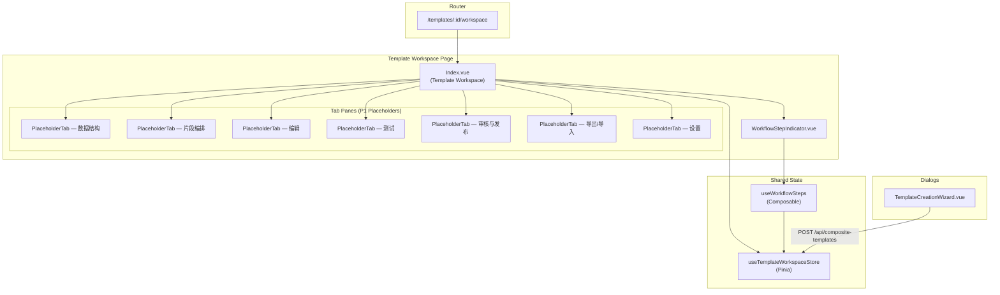
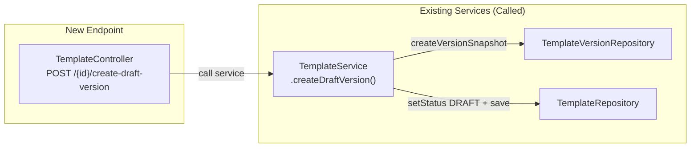
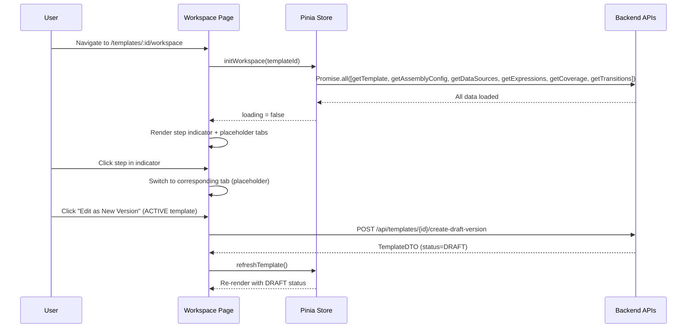

# Design Document — 工作台骨架 (Workspace Foundation)

## Overview

工作台骨架是模板工作台（Template Workspace）的 Phase 1 实现，从父级 spec 提取核心骨架需求。本阶段交付一个完整可运行的工作台页面框架，包含：

1. **工作台主页面** (`Index.vue`)：骨架屏加载、页面头部、步骤指示器、7 个标签页（占位组件）
2. **步骤指示器** (`WorkflowStepIndicator.vue`)：8 步水平进度条，基于真实数据计算完成状态
3. **占位标签页** (`PlaceholderTab.vue`)：通用占位组件，显示 Phase 提示信息
4. **创建向导** (`TemplateCreationWizard.vue`)：2 步对话框，创建后导航到工作台
5. **Pinia Store** (`templateWorkspace.ts`)：并行加载 6 个 API，跨标签页共享状态
6. **Composable** (`useWorkflowSteps.ts`)：步骤完成状态计算逻辑
7. **路由变更**：新增工作台路由 + 旧路由重定向
8. **导航变更**：侧边栏菜单重构为"模板管理"分组
9. **后端新端点**：`POST /api/templates/{id}/create-draft-version`

### 设计决策与理由

| 决策 | 理由 |
|------|------|
| 单页面 + Tab 而非多路由 | 减少路由跳转，共享 Pinia store 状态，切换标签无需重新加载 |
| Pinia store 而非 provide/inject | 跨组件层级共享、DevTools 可调试、支持 SSR |
| 步骤指示器为纯展示组件 | 完成状态由 composable 计算，指示器只接收 props，易于测试 |
| P1 加载全部数据 | 确保 P2/P3/P4 可直接替换占位组件而无需修改 store |
| `create-draft-version` 绕过状态机 | ACTIVE → DRAFT 不在合法转换路径中，需要特殊端点直接设置状态 |
| 占位组件使用通用 `PlaceholderTab` | 7 个标签页共用一个组件，通过 props 区分内容，减少重复代码 |

## Architecture

### 前端组件架构



### 后端改动架构



### 数据流



## Components and Interfaces

### 1. 前端新增组件

#### 1.1 `views/template-workspace/Index.vue` — 工作台主页面

职责：加载数据、渲染步骤指示器和 7 个占位标签页、管理活跃标签状态。

```typescript
// Props: none (从 route.params.id 获取 templateId)
// 主要逻辑：
// - onMounted → store.initWorkspace(templateId)
// - onBeforeUnmount → store.$reset() (清理状态，避免切换模板时残留旧数据)
// - 监听 store.loading 显示骨架屏
// - ACTIVE 状态显示 banner + "Edit as New Version" 按钮
// - SINGLE 模板显示迁移提示
```

模板结构：
```
<div class="template-workspace">
  <!-- Page Header: name + status tag + version + back button -->
  <!-- ACTIVE banner (conditional) -->
  <!-- SINGLE migration prompt (conditional) -->
  <!-- WorkflowStepIndicator -->
  <!-- el-tabs with 7 tab-panes (all PlaceholderTab in P1) -->
</div>
```

#### 1.2 `views/template-workspace/components/WorkflowStepIndicator.vue` — 步骤指示器

纯展示组件，接收步骤完成数据，渲染为水平 `el-steps` 组件。

```typescript
interface WorkflowStep {
  key: string           // 'create' | 'data' | 'segments' | 'editor' | 'testing' | 'review' | 'export' | 'settings'
  label: string         // i18n label
  completed: boolean
  active: boolean       // 当前推荐步骤（DRAFT 状态下第一个未完成步骤）
  alwaysAvailable: boolean  // export/settings 始终可用
}

defineProps<{
  steps: WorkflowStep[]
  currentTab: string
}>()

defineEmits<{
  (e: 'step-click', stepKey: string): void
}>()
```

completed 步骤显示绿色勾，active 步骤脉冲高亮。

#### 1.3 `views/template-workspace/components/PlaceholderTab.vue` — 通用占位组件

```typescript
defineProps<{
  icon: string          // Element Plus icon name
  phase: number         // 2, 3, or 4
  messageKey: string    // i18n key for the placeholder message
  descriptionKey: string // i18n key for the description
}>()
```

渲染为居中卡片：图标 + "Coming in Phase N" 消息 + 功能描述。

#### 1.4 `views/template-workspace/components/TemplateCreationWizard.vue` — 模板创建向导

```typescript
defineProps<{
  visible: boolean
  categories: CategoryDTO[]
  tags: TagDTO[]
}>()

defineEmits<{
  (e: 'update:visible', val: boolean): void
  (e: 'created', template: TemplateDTO): void
}>()

// 两步向导对话框：
// Step 1: name (required, max 200), description (optional, max 500), category (tree-select), tags (multi-select)
// Step 2: outputFormat (WORD/PDF, default WORD)
// Submit → POST /api/composite-templates → then associate tags via POST /api/tags/{tagId}/templates/{templateId} → emit 'created' with new template
```

### 2. Pinia Store — `useTemplateWorkspaceStore`

```typescript
// stores/templateWorkspace.ts
export const useTemplateWorkspaceStore = defineStore('templateWorkspace', () => {
  // ── State ──
  const templateId = ref<number>(0)
  const template = ref<TemplateDTO | null>(null)
  const assemblyConfig = ref<AssemblyConfig | null>(null)
  const dataSources = ref<DataSourceDTO[]>([])
  const expressions = ref<ExpressionDTO[]>([])
  const coverage = ref<CompositeCoverageReport | null>(null)
  const availableTransitions = ref<string[]>([])

  const loading = ref(false)
  const criticalError = ref<string | null>(null)
  const warnings = ref<Record<string, string>>({})  // section → error message

  // ── Derived ──
  const templateStatus = computed(() => template.value?.status ?? 'DRAFT')
  const isActive = computed(() => templateStatus.value === 'ACTIVE')
  const isDraft = computed(() => templateStatus.value === 'DRAFT')

  // ── Actions ──
  async function initWorkspace(id: number): Promise<void> {
    // Guard: if already loading for a different template, reset first
    if (templateId.value !== 0 && templateId.value !== id) {
      $reset()
    }
    templateId.value = id
    loading.value = true
    criticalError.value = null
    warnings.value = {}

    // Critical requests — failure shows error page
    // getTemplate from api/templates.ts, getAssemblyConfig from api/composite-templates.ts
    const criticalPromises = Promise.all([
      getTemplate(id),
      getAssemblyConfig(id),
    ])

    // Non-critical requests — failure shows warning banner
    const nonCriticalResults = Promise.allSettled([
      getDataSources(id),
      getExpressions(id),
      getCompositeCoverage(id),
      getAvailableTransitions(id),
    ])

    try {
      const [tmpl, config] = await criticalPromises
      template.value = tmpl
      assemblyConfig.value = config
    } catch (e: any) {
      criticalError.value = e.message || 'Failed to load workspace'
      loading.value = false
      return
    }

    const settled = await nonCriticalResults
    // Process each non-critical result...
    // settled[0] → dataSources, settled[1] → expressions, etc.
    // On rejection → set warnings[section] = error message

    loading.value = false
  }

  async function refreshTemplate(): Promise<void> { /* ... */ }
  async function refreshAssemblyConfig(): Promise<void> { /* ... */ }
  async function refreshDataSources(): Promise<void> { /* ... */ }
  async function refreshExpressions(): Promise<void> { /* ... */ }
  async function refreshCoverage(): Promise<void> { /* ... */ }
  async function refreshTransitions(): Promise<void> { /* ... */ }

  function $reset() {
    templateId.value = 0
    template.value = null
    assemblyConfig.value = null
    dataSources.value = []
    expressions.value = []
    coverage.value = null
    availableTransitions.value = []
    loading.value = false
    criticalError.value = null
    warnings.value = {}
  }

  return {
    templateId, template, assemblyConfig, dataSources, expressions,
    coverage, availableTransitions, loading, criticalError, warnings,
    templateStatus, isActive, isDraft,
    initWorkspace, refreshTemplate, refreshAssemblyConfig,
    refreshDataSources, refreshExpressions, refreshCoverage,
    refreshTransitions, $reset,
  }
})
```

### 3. Composable — `useWorkflowSteps`

```typescript
// composables/useWorkflowSteps.ts
export function useWorkflowSteps(store: ReturnType<typeof useTemplateWorkspaceStore>) {
  const steps = computed<WorkflowStep[]>(() => {
    const s = store
    return [
      { key: 'create', label: t('workspace.step1'), completed: !!s.template, active: false, alwaysAvailable: false },
      { key: 'data', label: t('workspace.step2'), completed: s.dataSources.length > 0 || s.expressions.length > 0, active: false, alwaysAvailable: false },
      { key: 'segments', label: t('workspace.step3'), completed: hasEnabledSegment(s.assemblyConfig), active: false, alwaysAvailable: false },
      { key: 'editor', label: t('workspace.step4'), completed: allSegmentsEdited(s.assemblyConfig), active: false, alwaysAvailable: false },
      { key: 'testing', label: t('workspace.step5'), completed: hasFullCoverage(s.coverage), active: false, alwaysAvailable: false },
      { key: 'review', label: t('workspace.step6'), completed: s.templateStatus === 'ACTIVE', active: false, alwaysAvailable: false },
      { key: 'export', label: t('workspace.step7'), completed: false, active: false, alwaysAvailable: true },
      { key: 'settings', label: t('workspace.step8'), completed: false, active: false, alwaysAvailable: true },
    ]
  })

  // Helper: check if assembly config has at least one enabled segment
  function hasEnabledSegment(config: AssemblyConfig | null): boolean {
    return config?.segments?.some(s => s.enabled) ?? false
  }

  // Helper: check if all enabled segments have been edited (versionNumber > 1)
  // Note: versionNumber is not in AssemblySegmentEntry — needs segment detail data
  // For P1, this checks lockedVersion > 1 as a proxy, or defaults to false
  function allSegmentsEdited(config: AssemblyConfig | null): boolean {
    const enabled = config?.segments?.filter(s => s.enabled) ?? []
    if (enabled.length === 0) return false
    return enabled.every(s => (s.lockedVersion ?? 0) > 1)
  }

  // Helper: check if coverage is 100% and at least one test executed
  function hasFullCoverage(cov: CompositeCoverageReport | null): boolean {
    if (!cov) return false
    return cov.overallCoveragePercent >= 100 && cov.segmentCoverages.length > 0
  }

  // When DRAFT, highlight first incomplete step
  const stepsWithActive = computed<WorkflowStep[]>(() => {
    const raw = steps.value
    if (store.templateStatus !== 'DRAFT') return raw
    const firstIncomplete = raw.findIndex(s => !s.completed && !s.alwaysAvailable)
    return raw.map((s, i) => ({ ...s, active: i === firstIncomplete }))
  })

  // Step → tab mapping
  const stepToTab: Record<string, string> = {
    data: 'dataStructure',
    segments: 'segments',
    editor: 'editor',
    testing: 'testing',
    review: 'reviewPublish',
    export: 'exportImport',
    settings: 'settings',
  }

  return { steps: stepsWithActive, stepToTab }
}
```

### 4. 后端接口变更

#### 4.0 `TemplateDTO` 扩展 — 新增 `templateType` 和 `version` 字段

当前 `TemplateDTO` 不包含 `templateType` 和 `version` 字段，但工作台需要：
- `templateType` 用于检测 SINGLE 模板并显示迁移提示（Req 3.2）
- `version` 用于页面头部显示当前版本号（Req 3.3）

```java
// TemplateDTO.java — 新增字段
private String templateType;
private Integer version;  // 当前最大版本号

// TemplateService.toDTO() — 补充映射
dto.setTemplateType(template.getTemplateType());
dto.setVersion(templateVersionRepository.findMaxVersionNumber(template.getId()).orElse(0));
```

前端 `TemplateDTO` 类型也需同步新增 `templateType` 字段：
```typescript
// api/templates.ts — TemplateDTO 新增
templateType: 'SINGLE' | 'COMPOSITE'
```

#### 4.1 `POST /api/templates/{id}/create-draft-version` — 新端点

```java
// TemplateController.java — 新增
@PostMapping("/{id}/create-draft-version")
public ResponseEntity<TemplateDTO> createDraftVersion(
        @PathVariable Long id,
        @AuthenticationPrincipal UserPrincipal principal) {
    TemplateDTO result = templateService.createDraftVersion(id, principal.getUserId());
    return ResponseEntity.ok(result);
}
```

```java
// TemplateService.java — 新增方法
@Transactional
public TemplateDTO createDraftVersion(Long templateId, Long userId) {
    Template template = findTemplateOrThrow(templateId);
    // Only allowed from ACTIVE status
    if (!"ACTIVE".equals(template.getStatus())) {
        throw new BusinessException(ErrorCode.TEMPLATE_INVALID_STATE_TRANSITION,
            "只有 ACTIVE 状态的模板才能创建草稿版本", HttpStatus.BAD_REQUEST);
    }
    // Create a new version snapshot (preserves current state before editing)
    createVersionSnapshot(template);
    // Directly set status to DRAFT (bypass state machine — special edit operation)
    template.setStatus("DRAFT");
    templateRepository.save(template);
    return toDTO(template);
}
```

### 5. 前端 API 层扩展

```typescript
// api/templates.ts — 新增
export function createDraftVersion(templateId: number) {
  return request.post<any, TemplateDTO>(`/templates/${templateId}/create-draft-version`)
}
```

### 6. 路由配置

```typescript
// router/index.ts — 新增/修改
{
  path: 'templates/:id/workspace',
  name: 'TemplateWorkspace',
  component: () => import('@/views/template-workspace/Index.vue'),
  meta: { title: 'Template Workspace' },
},
// Legacy redirects
{
  path: 'templates/:id',
  name: 'TemplateDetail',
  redirect: to => `/templates/${to.params.id}/workspace`,
},
{
  path: 'composite-templates/:id',
  name: 'CompositeTemplateDetail',
  redirect: to => `/templates/${to.params.id}/workspace`,
},
```

### 7. 侧边栏导航变更

```vue
<!-- MainLayout.vue — 替换现有菜单项 -->
<!-- 移除: standalone Templates, Data Sources, template-components sub-menu -->
<!-- 新增: -->
<el-sub-menu index="template-management">
  <template #title>
    <el-icon><Document /></el-icon>
    <span>{{ $t('nav.templateManagement') }}</span>
  </template>
  <el-menu-item index="/templates">{{ $t('nav.templateList') }}</el-menu-item>
  <el-menu-item index="/segments">{{ $t('nav.segmentLibrary') }}</el-menu-item>
</el-sub-menu>
<!-- 保留: Dashboard, Documents, Tasks, Market, Admin, Audit -->
```

### 8. 模板列表页变更

- 模板名称链接改为 `/templates/{id}/workspace`
- 操作列新增 "Workspace" 按钮
- "Create" 按钮打开 `TemplateCreationWizard` 对话框（替代原有 `TemplateFormDialog` 的创建功能；`TemplateFormDialog` 保留用于编辑）

## Data Models

### 前端类型定义

```typescript
// types/workspace.ts — 新增

/** 工作流步骤 */
export interface WorkflowStep {
  key: string
  label: string
  completed: boolean
  active: boolean
  alwaysAvailable: boolean
}

/** 步骤 key 枚举 */
export type StepKey = 'create' | 'data' | 'segments' | 'editor' | 'testing' | 'review' | 'export' | 'settings'

/** 标签页 name 枚举 */
export type TabName = 'dataStructure' | 'segments' | 'editor' | 'testing' | 'reviewPublish' | 'exportImport' | 'settings'

/** 占位标签页配置 */
export interface PlaceholderTabConfig {
  tabName: TabName
  icon: string
  phase: number
  messageKey: string
  descriptionKey: string
}
```

### 后端数据模型

无新增数据库表。变更基于现有表结构：

- `templates` — status 字段的 ACTIVE→DRAFT 直接更新（create-draft-version）
- `template_versions` — 新增版本记录（create-draft-version 时创建快照）


## Correctness Properties

*A property is a characteristic or behavior that should hold true across all valid executions of a system — essentially, a formal statement about what the system should do. Properties serve as the bridge between human-readable specifications and machine-verifiable correctness guarantees.*

### Property 1: Workflow step completion is deterministic and consistent

*For any* workspace state (template with arbitrary status from {DRAFT, PENDING_REVIEW, REVIEWED, ACTIVE, ARCHIVED}, any number of data sources ≥ 0, any number of expressions ≥ 0, any assembly config with 0+ segments of varying enabled/lockedVersion states, any coverage report with 0-100% rate), the `useWorkflowSteps` composable SHALL compute step completion as follows:
- Step 1 (Create): always `true` when template exists
- Step 2 (Data): `true` iff `dataSources.length > 0 || expressions.length > 0`
- Step 3 (Segments): `true` iff assembly config has at least one segment with `enabled = true`
- Step 4 (Editor): `true` iff all enabled segments have `lockedVersion > 1` and at least one enabled segment exists
- Step 5 (Testing): `true` iff coverage report exists with `overallCoveragePercent >= 100` and at least one segment coverage entry
- Step 6 (Review): `true` iff template status === 'ACTIVE'
- Steps 7-8: always `alwaysAvailable = true`

Additionally, when template status is DRAFT, the `active` (highlighted) step SHALL be the first step where `completed === false` and `alwaysAvailable === false`, or no step if all non-alwaysAvailable steps are complete.

**Validates: Requirements 3.5, 3.8**

### Property 2: Wizard form validation rejects invalid inputs and accepts valid inputs

*For any* string `name` and string `description`, the Template Creation Wizard validation SHALL:
- Accept `name` if and only if `name.trim().length > 0` AND `name.length <= 200`
- Accept `description` if and only if `description.length <= 500` (empty is allowed)
- Reject form submission when `name` is invalid, regardless of other field values

**Validates: Requirements 2.2**

## Error Handling

### 前端错误处理

| 场景 | 处理方式 |
|------|----------|
| 工作台初始化 — 关键 API 失败（template / assembly config） | 全页错误页 + "Retry" 按钮 + 错误消息 |
| 工作台初始化 — 非关键 API 失败（data sources / expressions / coverage / transitions） | 正常渲染工作台 + 对应区域显示警告 banner + "Retry" 按钮 |
| 创建向导 — API 返回错误 | 对话框内显示错误消息，保持当前步骤 |
| 编辑 ACTIVE 模板 — create-draft-version 失败 | `ElMessage.error` 提示，保持 ACTIVE 状态 |
| 迁移 SINGLE 模板 — migrate-to-composite 失败 | `ElMessage.error` 提示，保持迁移提示 |

### 后端错误处理

| 场景 | 错误码 | HTTP 状态 | 处理方式 |
|------|--------|-----------|----------|
| create-draft-version 非 ACTIVE 状态调用 | `TEMPLATE_INVALID_STATE_TRANSITION` | 400 | 抛出 BusinessException |
| create-draft-version 模板不存在 | `TEMPLATE_NOT_FOUND` | 404 | 抛出 ResourceNotFoundException |

## Testing Strategy

### 测试分层

#### 1. Property-Based Tests (PBT)

使用 **fast-check** (前端) 框架，每个属性测试最少 100 次迭代。

- **Property 1**: `useWorkflowSteps` 步骤完成计算
  - 生成器：随机 workspace state — dataSources 数组长度 0-10，expressions 数组长度 0-10，assembly config 含 0-20 个 segment entry（随机 enabled/lockedVersion），coverage rate 0-100，template status 从 5 种状态随机选择
  - 断言：每个步骤的 completed 值符合规则；DRAFT 状态下 active 步骤为第一个未完成步骤
  - Tag: `Feature: workspace-foundation, Property 1: Workflow step completion is deterministic and consistent`

- **Property 2**: `TemplateCreationWizard` 表单验证
  - 生成器：随机 unicode 字符串（长度 0-200）作为 name，随机字符串（长度 0-1000）作为 description
  - 断言：name 非空且 ≤200 字符时验证通过；name 为空或 >200 字符时验证失败；description ≤500 字符时通过，>500 时失败
  - Tag: `Feature: workspace-foundation, Property 2: Wizard form validation rejects invalid inputs and accepts valid inputs`

#### 2. Unit Tests (Example-Based)

**前端 (Vitest):**

- `WorkflowStepIndicator.vue` — 渲染 8 个步骤、点击触发 step-click 事件、DRAFT 状态高亮样式
- `PlaceholderTab.vue` — 渲染图标、Phase 消息、描述文本
- `TemplateCreationWizard.vue` — 两步表单切换、提交成功导航、错误显示
- `Index.vue` — 骨架屏显示、ACTIVE banner 显示、SINGLE 迁移提示、标签页切换
- 路由重定向测试 — `/templates/:id` → `/templates/:id/workspace`、`/composite-templates/:id` → `/templates/:id/workspace`
- 侧边栏导航 — 菜单结构验证、Data Sources 移除、模板管理分组

**后端 (JUnit 5):**

- `TemplateService.createDraftVersion()` — ACTIVE 状态允许、非 ACTIVE 状态拒绝（400）、模板不存在（404）、版本快照创建验证

#### 3. Integration Tests

**前端 (Vitest + MSW):**

- 工作台初始化并行加载 6 个 API
- 关键 API 失败显示错误页
- 非关键 API 失败显示警告 banner
- 创建向导完整流程：填写表单 → 提交 → 导航到工作台

**后端 (Testcontainers):**

- create-draft-version 端点 E2E 测试：ACTIVE 模板 → 创建草稿版本 → 验证状态为 DRAFT + 版本记录已创建
