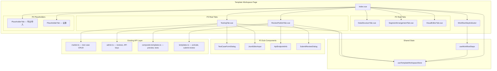
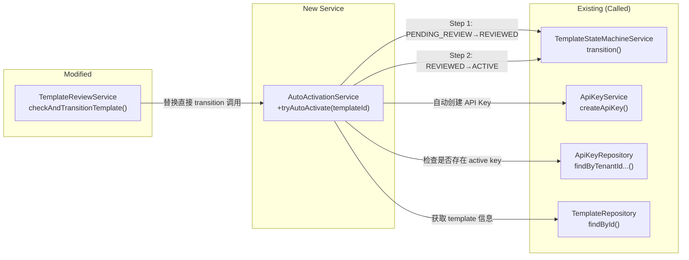
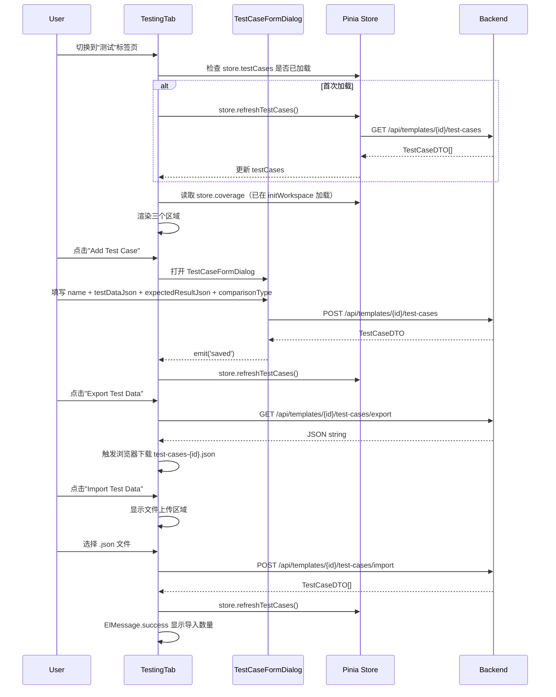
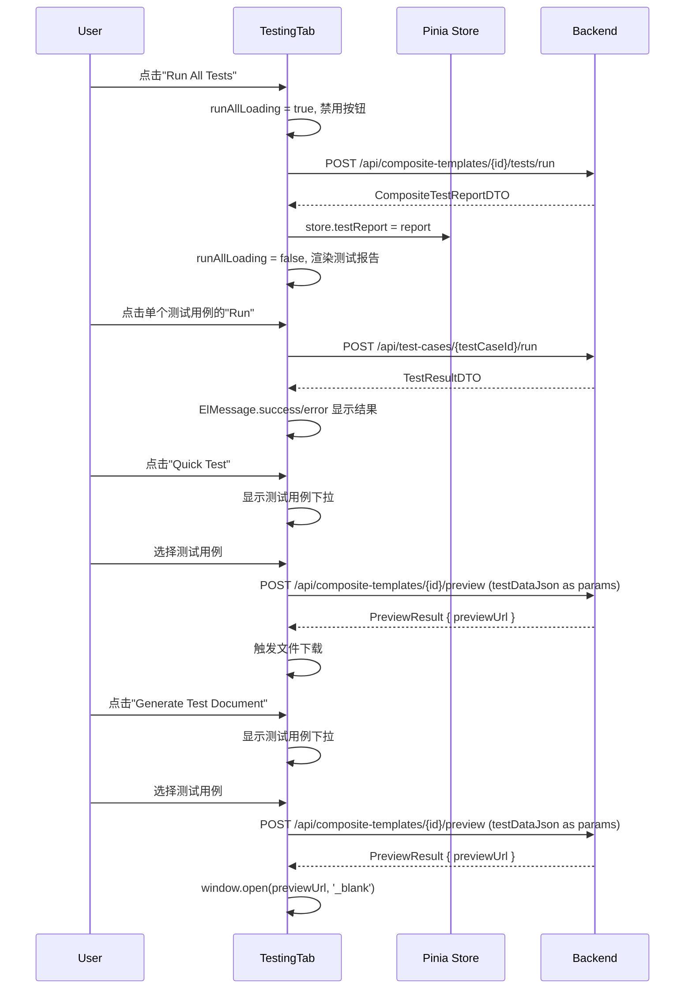
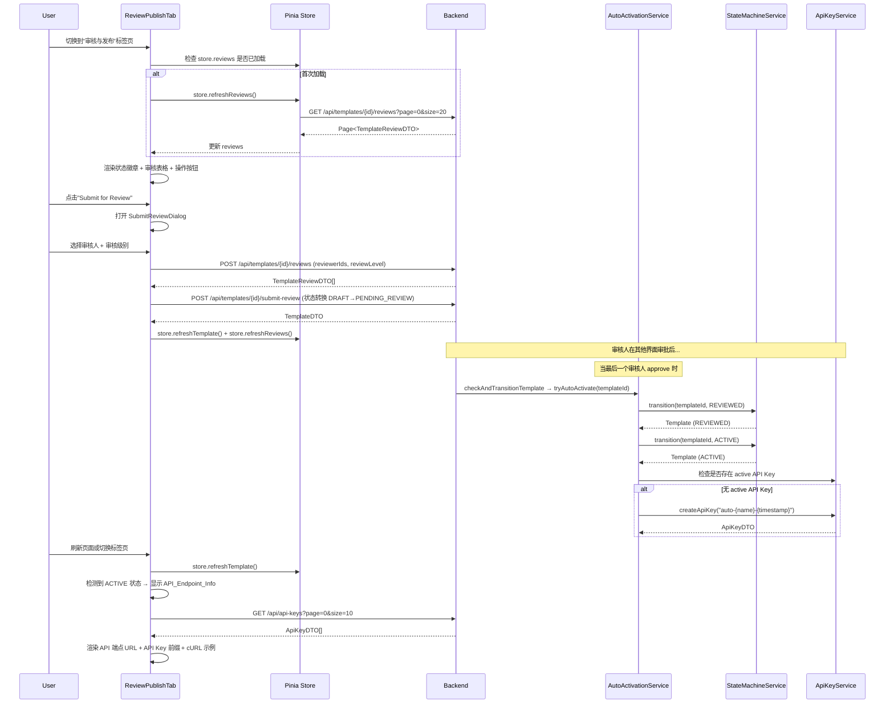
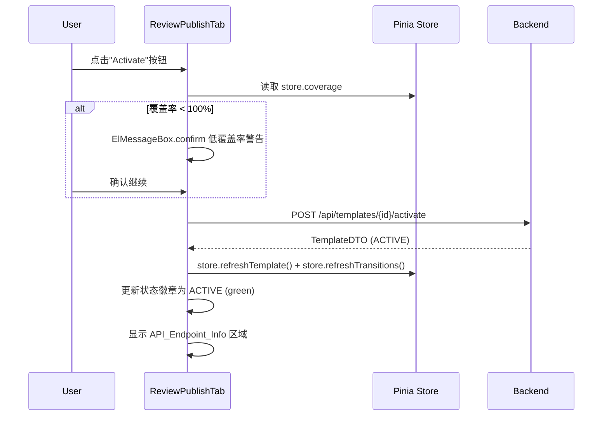

# Design Document — 工作台测试与审核发布标签页 (Workspace Testing & Review-Publish)

## Overview

本设计文档是模板工作台 Phase 3 的技术设计，将 P1 骨架中的 2 个占位标签页替换为真实实现：

1. **TestingTab** — 测试数据管理（CRUD、导入/导出）+ 测试执行（Run All、Quick Test、Generate Test Document）+ 变量覆盖率展示
2. **ReviewPublishTab** — 提交审核、审核状态跟踪、自动/手动激活、API 端点信息展示

同时包含：
- **后端变更**：新增 `AutoActivationService`，在审核全部通过后自动执行两步状态转换（PENDING_REVIEW → REVIEWED → ACTIVE）+ 自动生成 API Key
- **TemplateReviewService 集成**：`checkAndTransitionTemplate()` 中调用 `AutoActivationService.tryAutoActivate()`
- **Store 扩展**：新增 `testCases`、`testReport`、`reviews` 状态 + 对应 refresh actions（按需加载，不在 initWorkspace 中加载）
- **Index.vue 集成**：替换 2 个占位组件 + 保留 2 个 P4 占位
- **i18n**：3 个 locale 文件新增 P3 相关 key

### 设计决策与理由

| 决策 | 理由 |
|------|------|
| testCases / reviews 按需加载而非 initWorkspace 加载 | 避免用户未访问测试/审核标签页时的无效 API 调用 |
| testReport 存储在 store 而非组件本地 | WorkflowStepIndicator 需要读取 testReport 计算 Step 5 完成状态 |
| AutoActivationService 不抛异常，仅 WARN 日志 | 审核通过是关键操作，自动激活失败不应阻塞审核流程；前端提供手动激活兜底 |
| AutoActivationService 在 checkAndTransitionTemplate 内调用 | 替换原有的单步 REVIEWED 转换，实现审核通过后自动激活的完整流程 |
| API Key 检查基于 tenant 而非 template | API Key 是租户级别资源，一个租户只需一个 API Key 即可调用所有模板 |
| ReviewPublishTab 使用 admin.ts 中已有的 API 函数 | submitForReview、getTemplateReviews、getApiKeys 等函数已存在，无需重复定义 |
| 覆盖率展示复用 store.coverage（CompositeCoverageReport）+ 新增 store.templateCoverage（CoverageReport） | CompositeCoverageReport 提供 per-segment 分解，CoverageReport 提供 unboundTagNames 和 unusedDataSourceFields；后者按需加载 |
| 测试用例表单使用 JSON 编辑器组件 | testDataJson 和 expectedResultJson 是 JSON 字符串，需要语法高亮和校验 |
| Quick Test 和 Generate Test Document 均调用 preview API | 模板可能未激活，preview 端点不要求 ACTIVE 状态 |

## Architecture

### 前端组件架构



### 后端架构变更



### 数据流 — TestingTab 测试数据管理



### 数据流 — TestingTab 测试执行



### 数据流 — ReviewPublishTab 提交审核与自动激活



### 数据流 — ReviewPublishTab 手动激活



## Components and Interfaces

### 1. TestingTab.vue

路径：`frontend/src/views/template-workspace/components/TestingTab.vue`

职责：统一管理测试数据 CRUD、测试执行、变量覆盖率展示。

```typescript
// 无 props — 从 store 读取数据
// 内部状态：
const store = useTemplateWorkspaceStore()
const { t } = useI18n()

// ── 测试数据管理 ──
const testCaseDialogVisible = ref(false)
const editingTestCase = ref<TestCaseDTO | null>(null)
const deletingIds = ref<Set<number>>(new Set())
const testCasesLoaded = ref(false)

// ── 测试执行 ──
const runAllLoading = ref(false)
const runningTestCaseId = ref<number | null>(null)
const quickTestDropdownVisible = ref(false)
const generateDocDropdownVisible = ref(false)

// ── 导入/导出 ──
const importLoading = ref(false)

// ── 覆盖率 ──
const coverageRefreshing = ref(false)

// ── 单模板覆盖率（含 unboundTagNames / unusedDataSourceFields）──
const templateCoverage = ref<CoverageReport | null>(null)

// ── 首次加载 ──
async function loadTestCasesIfNeeded() {
  if (!testCasesLoaded.value) {
    await store.refreshTestCases()
    testCasesLoaded.value = true
  }
  // 加载单模板覆盖率以获取 unboundTagNames 和 unusedDataSourceFields
  if (!templateCoverage.value) {
    try {
      templateCoverage.value = await getTemplateCoverage(store.templateId)
    } catch { /* 静默处理 */ }
  }
}

// 标签页激活时调用（由 Index.vue 通过 watch 或 activated 事件触发）
onMounted(() => {
  loadTestCasesIfNeeded()
})

// ── 测试数据 CRUD ──
function openAddTestCase() {
  editingTestCase.value = null
  testCaseDialogVisible.value = true
}

function openEditTestCase(row: TestCaseDTO) {
  editingTestCase.value = row
  testCaseDialogVisible.value = true
}

async function onTestCaseSaved() {
  testCaseDialogVisible.value = false
  await store.refreshTestCases()
}

async function handleDeleteTestCase(id: number) {
  try {
    await ElMessageBox.confirm(t('workspace.testing.deleteConfirm'), t('common.confirm'), { type: 'warning' })
  } catch { return }
  deletingIds.value.add(id)
  try {
    await deleteTestCase(id)
    await store.refreshTestCases()
  } catch (e: any) {
    ElMessage.error(e.response?.data?.message || e.message || t('message.deleteFailed'))
  } finally {
    deletingIds.value.delete(id)
  }
}

// ── 导出 ──
async function handleExport() {
  try {
    const json = await exportTestCases(store.templateId)
    const blob = new Blob([json], { type: 'application/json' })
    const url = URL.createObjectURL(blob)
    const a = document.createElement('a')
    a.href = url
    a.download = `test-cases-${store.templateId}.json`
    a.click()
    URL.revokeObjectURL(url)
  } catch (e: any) {
    ElMessage.error(e.response?.data?.message || e.message || t('message.exportFailed'))
  }
}

// ── 导入 ──
async function handleImport(file: File) {
  importLoading.value = true
  try {
    const text = await file.text()
    const imported = await importTestCases(store.templateId, text)
    await store.refreshTestCases()
    ElMessage.success(t('workspace.testing.importSuccess', { count: imported.length }))
  } catch (e: any) {
    ElMessage.error(e.response?.data?.message || e.message || t('message.importFailed'))
  } finally {
    importLoading.value = false
  }
}

// ── 测试执行 ──
async function handleRunAll() {
  runAllLoading.value = true
  try {
    const report = await runAllCompositeTests(store.templateId)
    store.testReport = report
  } catch (e: any) {
    ElMessage.error(e.response?.data?.message || e.message || t('workspace.testing.runAllFailed'))
  } finally {
    runAllLoading.value = false
  }
}

async function handleRunSingle(testCaseId: number) {
  runningTestCaseId.value = testCaseId
  try {
    const result = await runTestCase(testCaseId)
    if (result.status === 'PASSED') {
      ElMessage.success(t('workspace.testing.testPassed'))
    } else {
      ElMessage.error(result.diffDetails || t('workspace.testing.testFailed'))
    }
  } catch (e: any) {
    ElMessage.error(e.response?.data?.message || e.message || t('workspace.testing.runFailed'))
  } finally {
    runningTestCaseId.value = null
  }
}

async function handleQuickTest(testCase: TestCaseDTO) {
  try {
    const result = await previewCompositeTemplate(store.templateId)
    // 触发文件下载
    window.open(result.previewUrl, '_blank')
  } catch (e: any) {
    ElMessage.error(e.response?.data?.message || e.message || t('workspace.testing.quickTestFailed'))
  }
}

async function handleGenerateTestDoc(testCase: TestCaseDTO) {
  try {
    const result = await previewCompositeTemplate(store.templateId)
    window.open(result.previewUrl, '_blank')
  } catch (e: any) {
    ElMessage.error(e.response?.data?.message || e.message || t('workspace.testing.generateFailed'))
  }
}

// ── 覆盖率 ──
async function handleRefreshCoverage() {
  coverageRefreshing.value = true
  try {
    await store.refreshCoverage()
    templateCoverage.value = await getTemplateCoverage(store.templateId)
  } catch (e: any) {
    ElMessage.error(e.response?.data?.message || e.message || t('message.refreshFailed'))
  } finally {
    coverageRefreshing.value = false
  }
}

// ── 覆盖率计算辅助 ──
const overallCoveragePercent = computed(() => store.coverage?.overallCoveragePercent ?? 0)
const totalVariables = computed(() => {
  if (!store.coverage?.segmentCoverages) return 0
  return store.coverage.segmentCoverages.reduce((sum, s) => sum + s.totalVariables, 0)
})
const boundVariables = computed(() => {
  if (!store.coverage?.segmentCoverages) return 0
  return store.coverage.segmentCoverages.reduce((sum, s) => sum + s.boundVariables, 0)
})
const unboundVariables = computed(() => totalVariables.value - boundVariables.value)

const coverageColor = computed(() => {
  const pct = overallCoveragePercent.value
  if (pct >= 100) return '#67C23A' // green
  if (pct >= 50) return '#E6A23C'  // orange
  return '#F56C6C'                  // red
})

// testDataJson 预览截断
function truncateJson(json: string, maxLen = 80): string {
  return json.length > maxLen ? json.substring(0, maxLen) + '...' : json
}
```

模板结构（关键部分）：
```html
<div class="testing-tab">
  <!-- 区域 1: 测试数据 -->
  <div class="section">
    <div class="section-header">
      <h3>{{ $t('workspace.testing.testData') }}</h3>
      <div class="section-actions">
        <el-button type="primary" @click="openAddTestCase">{{ $t('workspace.testing.addTestCase') }}</el-button>
        <el-button @click="handleExport" :disabled="store.testCases.length === 0">{{ $t('workspace.testing.export') }}</el-button>
        <el-upload :auto-upload="false" :show-file-list="false" accept=".json" @change="handleImport">
          <el-button :loading="importLoading">{{ $t('workspace.testing.import') }}</el-button>
        </el-upload>
      </div>
    </div>
    <el-empty v-if="store.testCases.length === 0" :description="$t('workspace.testing.emptyTestData')" />
    <el-table v-else :data="store.testCases">
      <!-- name, comparisonType(el-tag), testDataJson(truncated+tooltip), updatedAt, actions(Edit/Run/Delete) -->
    </el-table>
  </div>

  <el-divider />

  <!-- 区域 2: 测试执行 -->
  <div class="section">
    <div class="section-header">
      <h3>{{ $t('workspace.testing.testExecution') }}</h3>
      <div class="section-actions">
        <el-button type="primary" :loading="runAllLoading" @click="handleRunAll">{{ $t('workspace.testing.runAll') }}</el-button>
        <el-dropdown @command="handleQuickTest">
          <el-button>{{ $t('workspace.testing.quickTest') }}</el-button>
          <!-- dropdown items: store.testCases -->
        </el-dropdown>
        <el-dropdown @command="handleGenerateTestDoc">
          <el-button>{{ $t('workspace.testing.generateTestDoc') }}</el-button>
          <!-- dropdown items: store.testCases -->
        </el-dropdown>
      </div>
    </div>
    <!-- 测试报告展示 -->
    <template v-if="store.testReport">
      <div class="test-summary">
        <span>{{ $t('workspace.testing.total') }}: {{ store.testReport.totalTests }}</span>
        <span class="text-success">{{ $t('workspace.testing.passed') }}: {{ store.testReport.passedTests }}</span>
        <span class="text-danger">{{ $t('workspace.testing.failed') }}: {{ store.testReport.failedTests }}</span>
        <span>{{ $t('workspace.testing.executedAt') }}: {{ store.testReport.executedAt }}</span>
      </div>
      <el-table :data="store.testReport.segmentResults">
        <!-- segmentName, totalTests, passedTests, failedTests, status icon -->
      </el-table>
    </template>
  </div>

  <el-divider />

  <!-- 区域 3: 变量覆盖率 -->
  <div class="section">
    <div class="section-header">
      <h3>{{ $t('workspace.testing.variableCoverage') }}</h3>
      <el-button :loading="coverageRefreshing" @click="handleRefreshCoverage">{{ $t('workspace.testing.refreshCoverage') }}</el-button>
    </div>
    <template v-if="totalVariables === 0">
      <el-empty :description="$t('workspace.testing.noVariables')" />
    </template>
    <template v-else>
      <div class="coverage-summary">
        <span class="coverage-percent">{{ overallCoveragePercent.toFixed(1) }}%</span>
        <el-progress :percentage="overallCoveragePercent" :color="coverageColor" :stroke-width="12" />
        <span>{{ boundVariables }} / {{ totalVariables }} {{ $t('workspace.testing.variablesBound') }}</span>
      </div>
      <el-alert v-if="overallCoveragePercent < 100" type="warning" :title="$t('workspace.testing.coverageWarning')" show-icon>
        <div class="unbound-tags">
          <!-- templateCoverage.unboundTagNames rendered as red el-tag -->
        </div>
      </el-alert>
      <el-table :data="store.coverage?.segmentCoverages ?? []">
        <!-- segmentName, totalVariables, boundVariables, coveragePercent(el-progress), status icon -->
      </el-table>
      <!-- 未使用数据源字段（可折叠） -->
      <el-collapse>
        <el-collapse-item :title="$t('workspace.testing.unusedFields')">
          <!-- templateCoverage.unusedDataSourceFields rendered as gray el-tag -->
        </el-collapse-item>
      </el-collapse>
    </template>
  </div>

  <!-- 测试用例表单对话框 -->
  <TestCaseFormDialog
    v-model:visible="testCaseDialogVisible"
    :template-id="store.templateId"
    :test-case="editingTestCase"
    @saved="onTestCaseSaved"
  />
</div>
```

### 2. TestCaseFormDialog.vue

路径：`frontend/src/views/template-workspace/components/TestCaseFormDialog.vue`

职责：测试用例创建/编辑表单对话框。

```typescript
const props = defineProps<{
  visible: boolean
  templateId: number
  testCase: TestCaseDTO | null  // null = 新建模式
}>()

const emit = defineEmits<{
  'update:visible': [value: boolean]
  saved: []
}>()

const form = reactive({
  name: '',
  testDataJson: '{}',
  expectedResultJson: '',
  comparisonType: 'VARIABLE_VALUES' as ComparisonType,
})

const saving = ref(false)
const formRef = ref<FormInstance | null>(null)

const rules: FormRules = {
  name: [
    { required: true, message: t('workspace.testing.nameRequired'), trigger: 'blur' },
    { max: 100, message: t('workspace.testing.nameMaxLength'), trigger: 'blur' },
  ],
  testDataJson: [
    { required: true, message: t('workspace.testing.testDataRequired'), trigger: 'blur' },
    { validator: validateJson, trigger: 'blur' },
  ],
}

function validateJson(_rule: any, value: string, callback: (error?: Error) => void) {
  try {
    JSON.parse(value)
    callback()
  } catch {
    callback(new Error(t('workspace.testing.invalidJson')))
  }
}

watch(() => props.visible, (val) => {
  if (val && props.testCase) {
    // 编辑模式：填充表单
    form.name = props.testCase.name
    form.testDataJson = props.testCase.testDataJson
    form.expectedResultJson = props.testCase.expectedResultJson ?? ''
    form.comparisonType = props.testCase.comparisonType
  } else if (val) {
    // 新建模式：重置表单
    form.name = ''
    form.testDataJson = '{}'
    form.expectedResultJson = ''
    form.comparisonType = 'VARIABLE_VALUES'
  }
})

async function handleSubmit() {
  await formRef.value?.validate()
  saving.value = true
  try {
    const data = {
      name: form.name,
      testDataJson: form.testDataJson,
      expectedResultJson: form.expectedResultJson || null,
      comparisonType: form.comparisonType,
    }
    if (props.testCase) {
      await updateTestCase(props.testCase.id, data)
    } else {
      await createTestCase(props.templateId, data)
    }
    emit('saved')
  } catch (e: any) {
    ElMessage.error(e.response?.data?.message || e.message || t('message.saveFailed'))
  } finally {
    saving.value = false
  }
}
```

### 3. ReviewPublishTab.vue

路径：`frontend/src/views/template-workspace/components/ReviewPublishTab.vue`

职责：展示模板状态、提交审核、审核状态跟踪、自动/手动激活、API 端点信息。

```typescript
// 无 props — 从 store 读取数据
const store = useTemplateWorkspaceStore()
const { t } = useI18n()

// ── 状态 ──
const reviewsLoaded = ref(false)
const submitDialogVisible = ref(false)
const activating = ref(false)
const apiKeys = ref<ApiKeyDTO[]>([])
const apiKeysLoading = ref(false)
const creatingApiKey = ref(false)
const reviewPage = ref(1)
const reviewPageSize = ref(10)

// ── 用户映射（用于显示审核人名称）──
const userMap = ref<Map<number, string>>(new Map())

// ── 状态徽章映射 ──
type TagType = 'info' | 'warning' | 'primary' | 'success' | 'danger'
const statusTagType: Record<string, TagType> = {
  DRAFT: 'info',
  PENDING_REVIEW: 'warning',
  REVIEWED: 'primary',
  ACTIVE: 'success',
  ARCHIVED: 'danger',
}

const reviewStatusTagType: Record<string, TagType> = {
  PENDING: 'info',
  APPROVED: 'success',
  CONDITIONAL_APPROVED: 'warning',
  REJECTED: 'danger',
}

// ── 计算属性 ──
const canSubmitReview = computed(() =>
  store.templateStatus === 'DRAFT' || store.templateStatus === 'REVIEWED'
)

const showReviewTable = computed(() =>
  ['PENDING_REVIEW', 'REVIEWED', 'ACTIVE'].includes(store.templateStatus)
)

const allReviewsApproved = computed(() => {
  if (store.reviews.length === 0) return false
  return store.reviews.every(r =>
    r.status === 'APPROVED' || r.status === 'CONDITIONAL_APPROVED'
  )
})

const hasRejectedReview = computed(() =>
  store.reviews.some(r => r.status === 'REJECTED')
)

const rejectedReview = computed(() =>
  store.reviews.find(r => r.status === 'REJECTED') ?? null
)

const showActivateButton = computed(() =>
  store.templateStatus === 'REVIEWED'
)

const showApiEndpointInfo = computed(() =>
  store.templateStatus === 'ACTIVE'
)

const autoActivationFailed = computed(() =>
  store.templateStatus === 'REVIEWED' && allReviewsApproved.value
)

// ── 首次加载 ──
async function loadReviewsIfNeeded() {
  if (!reviewsLoaded.value) {
    await store.refreshReviews()
    reviewsLoaded.value = true
  }
  if (store.templateStatus === 'ACTIVE') {
    await loadApiKeys()
  }
}

onMounted(() => {
  loadReviewsIfNeeded()
})

// ── 提交审核 ──
async function handleSubmitReview(reviewerIds: number[], reviewLevel: number) {
  try {
    await submitForReview(store.templateId, { reviewerIds, reviewLevel })
    await submitReview(store.templateId) // 状态转换 DRAFT → PENDING_REVIEW
    await Promise.all([store.refreshTemplate(), store.refreshReviews()])
    submitDialogVisible.value = false
    ElMessage.success(t('workspace.reviewPublish.submitSuccess'))
  } catch (e: any) {
    ElMessage.error(e.response?.data?.message || e.message || t('workspace.reviewPublish.submitFailed'))
    // 保持对话框打开以便重试
  }
}

// ── 手动激活 ──
async function handleActivate() {
  // 检查覆盖率
  if (store.coverage && store.coverage.overallCoveragePercent < 100) {
    try {
      await ElMessageBox.confirm(
        t('workspace.reviewPublish.lowCoverageWarning'),
        t('common.confirm'),
        { type: 'warning' },
      )
    } catch { return }
  }

  activating.value = true
  try {
    await activateTemplate(store.templateId)
    await Promise.all([store.refreshTemplate(), store.refreshTransitions()])
    ElMessage.success(t('workspace.reviewPublish.activateSuccess'))
    await loadApiKeys()
  } catch (e: any) {
    ElMessage.error(e.response?.data?.message || e.message || t('workspace.reviewPublish.activateFailed'))
  } finally {
    activating.value = false
  }
}

// ── Revise & Resubmit ──
async function handleReviseResubmit() {
  await Promise.all([store.refreshTemplate(), store.refreshReviews()])
  // 后端 rejectReview 已将状态转为 DRAFT，刷新后 canSubmitReview 自动为 true
}

// ── API Keys ──
async function loadApiKeys() {
  apiKeysLoading.value = true
  try {
    const result = await getApiKeys({ page: 0, size: 10 })
    apiKeys.value = result.content
  } catch (e: any) {
    // 静默处理，API Key 加载失败不阻塞页面
  } finally {
    apiKeysLoading.value = false
  }
}

async function handleCreateApiKey() {
  creatingApiKey.value = true
  try {
    const result = await createApiKey({
      name: `manual-${store.template?.name ?? 'template'}-${Date.now()}`,
    })
    apiKeys.value.unshift(result)
    ElMessage.success(t('workspace.reviewPublish.apiKeyCreated'))
  } catch (e: any) {
    ElMessage.error(e.response?.data?.message || e.message || t('workspace.reviewPublish.apiKeyFailed'))
  } finally {
    creatingApiKey.value = false
  }
}

// ── 复制到剪贴板 ──
function copyToClipboard(text: string) {
  navigator.clipboard.writeText(text)
  ElMessage.success(t('common.copied'))
}

// ── cURL 示例 ──
const curlExample = computed(() => {
  const keyPrefix = apiKeys.value[0]?.keyPrefix ?? 'YOUR_API_KEY'
  return `curl -X POST \\
  ${window.location.origin}/api/generate/${store.templateId} \\
  -H "X-API-Key: ${keyPrefix}" \\
  -H "Content-Type: application/json" \\
  -d '{"data": {}}'`
})
```

模板结构（关键部分）：
```html
<div class="review-publish-tab">
  <!-- 状态徽章 -->
  <div class="status-section">
    <el-tag :type="statusTagType[store.templateStatus]" size="large">
      {{ $t(`workspace.reviewPublish.status.${store.templateStatus.toLowerCase()}`) }}
    </el-tag>
  </div>

  <!-- 提交审核按钮 -->
  <el-button v-if="canSubmitReview" type="primary" @click="submitDialogVisible = true">
    {{ $t('workspace.reviewPublish.submitForReview') }}
  </el-button>

  <!-- 自动激活失败提示 -->
  <el-alert v-if="autoActivationFailed" type="error" :title="$t('workspace.reviewPublish.autoActivationFailed')" show-icon />

  <!-- Ready to Publish 提示 -->
  <el-alert v-if="allReviewsApproved && store.templateStatus === 'PENDING_REVIEW'" type="success" :title="$t('workspace.reviewPublish.readyToPublish')" show-icon />

  <!-- Review Rejected 提示 -->
  <el-alert v-if="hasRejectedReview" type="error" show-icon>
    <template #title>{{ $t('workspace.reviewPublish.reviewRejected') }}</template>
    <p>{{ rejectedReview?.comment }}</p>
    <el-button size="small" @click="handleReviseResubmit">{{ $t('workspace.reviewPublish.reviseResubmit') }}</el-button>
  </el-alert>

  <!-- 审核状态表格 -->
  <template v-if="showReviewTable">
    <el-table :data="paginatedReviews">
      <!-- reviewerName, status(el-tag), reviewLevel, comment, suggestions, createdAt, completedAt -->
    </el-table>
    <el-pagination v-model:current-page="reviewPage" :page-size="reviewPageSize" :total="store.reviews.length" />
  </template>

  <!-- 手动激活按钮 -->
  <el-button v-if="showActivateButton" type="success" :loading="activating" @click="handleActivate">
    {{ $t('workspace.reviewPublish.activate') }}
  </el-button>

  <!-- API 端点信息 -->
  <ApiEndpointInfo v-if="showApiEndpointInfo" :template-id="store.templateId" :api-keys="apiKeys" :curl-example="curlExample"
    :api-keys-loading="apiKeysLoading" :creating-api-key="creatingApiKey"
    @copy="copyToClipboard" @create-api-key="handleCreateApiKey" />

  <!-- 提交审核对话框 -->
  <SubmitReviewDialog v-model:visible="submitDialogVisible" @submit="handleSubmitReview" />
</div>
```

### 4. ApiEndpointInfo.vue

路径：`frontend/src/views/template-workspace/components/ApiEndpointInfo.vue`

职责：展示已激活模板的 API 端点 URL、API Key、cURL 示例。

```typescript
const props = defineProps<{
  templateId: number
  apiKeys: ApiKeyDTO[]
  curlExample: string
  apiKeysLoading: boolean
  creatingApiKey: boolean
}>()

const emit = defineEmits<{
  copy: [text: string]
  'create-api-key': []
}>()

const apiUrl = computed(() => `${window.location.origin}/api/generate/${props.templateId}`)
const activeKey = computed(() => props.apiKeys.find(k => k.enabled) ?? props.apiKeys[0] ?? null)
```

模板结构：
```html
<el-card class="api-endpoint-info">
  <template #header>{{ $t('workspace.reviewPublish.apiEndpoint') }}</template>

  <div class="endpoint-row">
    <span class="label">URL:</span>
    <code>POST {{ apiUrl }}</code>
    <el-button size="small" @click="emit('copy', apiUrl)">{{ $t('common.copy') }}</el-button>
  </div>

  <template v-if="activeKey">
    <div class="endpoint-row">
      <span class="label">API Key:</span>
      <code>{{ activeKey.keyPrefix }}</code>
      <el-button size="small" @click="emit('copy', activeKey.keyPrefix)">{{ $t('common.copy') }}</el-button>
    </div>
  </template>
  <template v-else>
    <el-alert type="warning" :title="$t('workspace.reviewPublish.noApiKey')" show-icon>
      <el-button size="small" :loading="creatingApiKey" @click="emit('create-api-key')">
        {{ $t('workspace.reviewPublish.createApiKey') }}
      </el-button>
    </el-alert>
  </template>

  <div class="curl-section">
    <span class="label">cURL:</span>
    <pre>{{ curlExample }}</pre>
    <el-button size="small" @click="emit('copy', curlExample)">{{ $t('common.copy') }}</el-button>
  </div>

  <el-button type="primary" @click="/* open GenerateDialog */">{{ $t('workspace.reviewPublish.generateDocument') }}</el-button>

  <el-alert type="info" :title="$t('workspace.reviewPublish.apiNote')" show-icon :closable="false" />
</el-card>
```

### 5. SubmitReviewDialog.vue

路径：`frontend/src/views/template-workspace/components/SubmitReviewDialog.vue`

职责：提交审核对话框，收集审核人和审核级别。

```typescript
const props = defineProps<{
  visible: boolean
}>()

const emit = defineEmits<{
  'update:visible': [value: boolean]
  submit: [reviewerIds: number[], reviewLevel: number]
}>()

const form = reactive({
  reviewerIds: [] as number[],
  reviewLevel: 1,
})

const users = ref<UserDTO[]>([])
const loadingUsers = ref(false)
const submitting = ref(false)

watch(() => props.visible, async (val) => {
  if (val && users.value.length === 0) {
    loadingUsers.value = true
    try {
      const result = await getUsers({ page: 0, size: 100 })
      users.value = result.content
    } catch { /* 静默处理 */ }
    finally { loadingUsers.value = false }
  }
})

async function handleSubmit() {
  if (form.reviewerIds.length === 0) {
    ElMessage.warning(t('workspace.reviewPublish.selectReviewers'))
    return
  }
  submitting.value = true
  try {
    emit('submit', form.reviewerIds, form.reviewLevel)
  } finally {
    submitting.value = false
  }
}
```

### 6. 后端 — AutoActivationService

路径：`backend/src/main/java/com/docgen/service/AutoActivationService.java`

职责：审核全部通过后自动执行两步状态转换 + 自动生成 API Key。

```java
package com.docgen.service;

import com.docgen.dto.CreateApiKeyRequest;
import com.docgen.entity.ApiKey;
import com.docgen.entity.Template;
import com.docgen.entity.TemplateState;
import com.docgen.repository.ApiKeyRepository;
import com.docgen.repository.TemplateRepository;
import org.slf4j.Logger;
import org.slf4j.LoggerFactory;
import org.springframework.stereotype.Service;
import org.springframework.transaction.annotation.Transactional;

import java.time.Instant;
import java.util.List;

/**
 * Service that automatically activates a template after all reviews are approved.
 * Performs a two-step state transition: PENDING_REVIEW → REVIEWED → ACTIVE,
 * and auto-creates an API Key if none exists for the tenant.
 *
 * All failures are logged at WARN level and swallowed — the caller
 * (TemplateReviewService.checkAndTransitionTemplate) should not be blocked
 * by activation failures.
 */
@Service
public class AutoActivationService {

    private static final Logger log = LoggerFactory.getLogger(AutoActivationService.class);

    private final TemplateStateMachineService stateMachineService;
    private final ApiKeyService apiKeyService;
    private final ApiKeyRepository apiKeyRepository;
    private final TemplateRepository templateRepository;

    public AutoActivationService(TemplateStateMachineService stateMachineService,
                                 ApiKeyService apiKeyService,
                                 ApiKeyRepository apiKeyRepository,
                                 TemplateRepository templateRepository) {
        this.stateMachineService = stateMachineService;
        this.apiKeyService = apiKeyService;
        this.apiKeyRepository = apiKeyRepository;
        this.templateRepository = templateRepository;
    }

    /**
     * Attempt to auto-activate a template after all reviews are approved.
     * Performs two state transitions and optionally creates an API Key.
     *
     * @param templateId the template to activate
     */
    @Transactional
    public void tryAutoActivate(Long templateId) {
        // Step 1: PENDING_REVIEW → REVIEWED
        Template template;
        try {
            template = stateMachineService.transition(templateId, TemplateState.REVIEWED);
            log.info("Auto-activation step 1: template {} transitioned to REVIEWED", templateId);
        } catch (Exception e) {
            log.warn("Auto-activation step 1 failed for template {}: {}", templateId, e.getMessage());
            return;
        }

        // Step 2: REVIEWED → ACTIVE
        try {
            template = stateMachineService.transition(templateId, TemplateState.ACTIVE);
            log.info("Auto-activation step 2: template {} transitioned to ACTIVE", templateId);
        } catch (Exception e) {
            log.warn("Auto-activation step 2 failed for template {}: {}", templateId, e.getMessage());
            return; // Template remains in REVIEWED status
        }

        // Step 3: Auto-create API Key if none exists for the tenant
        try {
            Long tenantId = template.getTenantId();
            List<ApiKey> existingKeys = apiKeyRepository.findByTenantIdOrderByCreatedAtDesc(tenantId);
            boolean hasActiveKey = existingKeys.stream()
                    .anyMatch(k -> k.isEnabled()
                            && (k.getExpiresAt() == null || k.getExpiresAt().isAfter(Instant.now())));

            if (!hasActiveKey) {
                String autoKeyName = String.format("auto-%s-%d",
                        template.getName() != null ? template.getName().replaceAll("[^a-zA-Z0-9_\\-]", "_") : "template",
                        Instant.now().toEpochMilli());

                CreateApiKeyRequest keyRequest = new CreateApiKeyRequest();
                keyRequest.setName(autoKeyName);

                // Use the template's creator as the key owner
                apiKeyService.createApiKey(tenantId, template.getCreatedBy(), keyRequest);
                log.info("Auto-activation: created API Key '{}' for tenant {}", autoKeyName, tenantId);
            } else {
                log.info("Auto-activation: active API Key already exists for tenant {}", tenantId);
            }
        } catch (Exception e) {
            log.warn("Auto-activation API Key creation failed for template {}: {}", templateId, e.getMessage());
            // Template remains ACTIVE — only key generation failed
        }
    }
}
```

### 7. 后端变更 — TemplateReviewService.checkAndTransitionTemplate

修改 `checkAndTransitionTemplate` 方法，将直接的 `stateMachineService.transition(templateId, TemplateState.REVIEWED)` 调用替换为 `autoActivationService.tryAutoActivate(templateId)`。

```java
// ── TemplateReviewService 变更 ──

// 新增依赖注入：
private final AutoActivationService autoActivationService;

// 构造器新增参数：
public TemplateReviewService(TemplateReviewRepository reviewRepository,
                             TemplateRepository templateRepository,
                             TemplateStateMachineService stateMachineService,
                             AutoActivationService autoActivationService) {
    this.reviewRepository = reviewRepository;
    this.templateRepository = templateRepository;
    this.stateMachineService = stateMachineService;
    this.autoActivationService = autoActivationService;
}

// checkAndTransitionTemplate 方法变更：
private void checkAndTransitionTemplate(Long templateId, int reviewLevel) {
    List<TemplateReview> levelReviews = reviewRepository
            .findByTemplateIdAndReviewLevel(templateId, reviewLevel);

    boolean allCompleted = levelReviews.stream()
            .allMatch(r -> r.getStatus() == ReviewStatus.APPROVED
                    || r.getStatus() == ReviewStatus.CONDITIONAL_APPROVED);

    if (!allCompleted) {
        return;
    }

    boolean nextLevelPending = reviewRepository
            .existsByTemplateIdAndReviewLevelAndStatus(templateId, reviewLevel + 1, ReviewStatus.PENDING);

    if (!nextLevelPending) {
        // Before: stateMachineService.transition(templateId, TemplateState.REVIEWED);
        // After: Auto-activate (PENDING_REVIEW → REVIEWED → ACTIVE + API Key)
        autoActivationService.tryAutoActivate(templateId);
        log.info("All review levels completed, auto-activation triggered for template {}", templateId);
    }
}
```

### 8. Store 扩展 — testCases / testReport / reviews

```typescript
// stores/templateWorkspace.ts — 新增部分

import { getTestCases } from '@/api/market'
import { getTemplateReviews } from '@/api/admin'
import type { TestCaseDTO, TestReportDTO } from '@/types/testing'
import type { ReviewDTO } from '@/types/review'

// State 新增：
const testCases = ref<TestCaseDTO[]>([])
const testReport = ref<CompositeTestReportDTO | null>(null)
const reviews = ref<ReviewDTO[]>([])

// 注意：testCases 和 reviews 不在 initWorkspace 中加载（按需加载）

// 新增 action：
async function refreshTestCases(): Promise<void> {
  if (!templateId.value) return
  try {
    testCases.value = await getTestCases(templateId.value)
    delete warnings.value.testCases
  } catch (e: any) {
    warnings.value.testCases = e.message || 'Refresh failed'
  }
}

async function refreshReviews(): Promise<void> {
  if (!templateId.value) return
  try {
    const result = await getTemplateReviews(templateId.value, { page: 0, size: 20 })
    reviews.value = result.content
    delete warnings.value.reviews
  } catch (e: any) {
    warnings.value.reviews = e.message || 'Refresh failed'
  }
}

// $reset 中新增：
// testCases.value = []
// testReport.value = null
// reviews.value = []

// return 中新增：
// testCases, testReport, reviews, refreshTestCases, refreshReviews
```

### 9. Index.vue 变更

```typescript
// 替换 import — 新增 P3 组件：
import TestingTab from './components/TestingTab.vue'
import ReviewPublishTab from './components/ReviewPublishTab.vue'

// placeholderTabs 数组中移除 testing 和 reviewPublish，仅保留 P4 占位：
const placeholderTabs = [
  { tabName: 'exportImport' as TabName, labelKey: 'workspace.tabExportImport', icon: 'Switch', phase: 4, messageKey: 'workspace.placeholder.exportImport', descriptionKey: 'workspace.placeholder.exportImportDesc' },
  { tabName: 'settings' as TabName, labelKey: 'workspace.tabSettings', icon: 'Setting', phase: 4, messageKey: 'workspace.placeholder.settings', descriptionKey: 'workspace.placeholder.settingsDesc' },
]

// 模板中新增 P3 真实标签页（在 P2 标签页之后、P4 占位之前）：
// <el-tab-pane :label="$t('workspace.tabTesting')" name="testing">
//   <TestingTab />
// </el-tab-pane>
// <el-tab-pane :label="$t('workspace.tabReviewPublish')" name="reviewPublish">
//   <ReviewPublishTab />
// </el-tab-pane>
```

## Data Models

### 前端类型扩展

```typescript
// types/testing.ts — 复用已有类型，无需新增文件
// TestCaseDTO, TestResultDTO, TestReportDTO 已在 market.ts 中定义
// CompositeTestReportDTO 对应前端类型 CompositeTestReport 已在 types/segment.ts 中定义

// 组件内部使用的类型（不导出）：
type ComparisonType = 'VARIABLE_VALUES' | 'TEXT_CONTENT' | 'FILE_SNAPSHOT'
```

### Store 状态扩展

```typescript
// stores/templateWorkspace.ts — 新增字段
testCases: TestCaseDTO[]                    // 从 getTestCases(templateId) 按需加载
testReport: CompositeTestReportDTO | null   // 运行测试后设置
reviews: ReviewDTO[]                        // 从 getTemplateReviews(templateId) 按需加载

// 新增 actions
refreshTestCases(): Promise<void>
refreshReviews(): Promise<void>
```

### 后端数据模型

无新增数据库表或字段。变更基于现有结构：

- `AutoActivationService` — 新增 Spring Service，无数据库变更
- `TemplateReviewService` — 新增 `AutoActivationService` 依赖注入，修改 `checkAndTransitionTemplate` 方法
- `ApiKey` 表 — 自动激活时可能新增记录（通过已有 `ApiKeyService.createApiKey`）

### i18n Key 结构

```
# 测试标签页
workspace.testing.testData              — "测试数据" / "Test Data"
workspace.testing.addTestCase           — "添加测试用例" / "Add Test Case"
workspace.testing.emptyTestData         — 空状态提示
workspace.testing.export                — "导出测试数据" / "Export Test Data"
workspace.testing.import                — "导入测试数据" / "Import Test Data"
workspace.testing.importSuccess         — "成功导入 {count} 条测试用例" / "Successfully imported {count} test cases"
workspace.testing.deleteConfirm         — 删除确认提示
workspace.testing.nameRequired          — 名称必填提示
workspace.testing.nameMaxLength         — 名称最大长度提示
workspace.testing.testDataRequired      — 测试数据必填提示
workspace.testing.invalidJson           — JSON 格式无效提示
workspace.testing.testExecution         — "测试执行" / "Test Execution"
workspace.testing.runAll                — "运行所有测试" / "Run All Tests"
workspace.testing.quickTest             — "快速测试" / "Quick Test"
workspace.testing.generateTestDoc       — "生成测试文档" / "Generate Test Document"
workspace.testing.total                 — "总计" / "Total"
workspace.testing.passed                — "通过" / "Passed"
workspace.testing.failed                — "失败" / "Failed"
workspace.testing.executedAt            — "执行时间" / "Executed At"
workspace.testing.testPassed            — "测试通过" / "Test passed"
workspace.testing.testFailed            — "测试失败" / "Test failed"
workspace.testing.runAllFailed          — 运行所有测试失败提示
workspace.testing.runFailed             — 运行单个测试失败提示
workspace.testing.quickTestFailed       — 快速测试失败提示
workspace.testing.generateFailed        — 生成测试文档失败提示
workspace.testing.variableCoverage      — "变量覆盖率" / "Variable Coverage"
workspace.testing.refreshCoverage       — "刷新覆盖率" / "Refresh Coverage"
workspace.testing.noVariables           — 无变量提示
workspace.testing.variablesBound        — "变量已绑定" / "variables bound"
workspace.testing.coverageWarning       — 覆盖率不足警告
workspace.testing.unusedFields          — "未使用的数据源字段" / "Unused Data Source Fields"

# 审核与发布标签页
workspace.reviewPublish.submitForReview — "提交审核" / "Submit for Review"
workspace.reviewPublish.submitSuccess   — 提交成功提示
workspace.reviewPublish.submitFailed    — 提交失败提示
workspace.reviewPublish.selectReviewers — "请选择审核人" / "Please select reviewers"
workspace.reviewPublish.reviewLevel     — "审核级别" / "Review Level"
workspace.reviewPublish.initialReview   — "初审" / "Initial Review"
workspace.reviewPublish.finalReview     — "终审" / "Final Review"
workspace.reviewPublish.readyToPublish  — "审核已通过，可以发布" / "All reviews approved, ready to publish"
workspace.reviewPublish.reviewRejected  — "审核被拒绝" / "Review Rejected"
workspace.reviewPublish.reviseResubmit  — "修改并重新提交" / "Revise & Resubmit"
workspace.reviewPublish.activate        — "激活" / "Activate"
workspace.reviewPublish.activateSuccess — 激活成功提示
workspace.reviewPublish.activateFailed  — 激活失败提示
workspace.reviewPublish.autoActivationFailed — "自动激活失败，请手动激活" / "Auto-activation failed. Please activate manually."
workspace.reviewPublish.lowCoverageWarning — "变量覆盖率低于 100%，部分模板变量可能无法正确渲染。是否继续激活？" / "Variable coverage is below 100%. Some template variables may not render correctly. Continue activation?"
workspace.reviewPublish.apiEndpoint     — "API 端点信息" / "API Endpoint Info"
workspace.reviewPublish.noApiKey        — "当前租户无可用 API Key" / "No API Key available for current tenant"
workspace.reviewPublish.createApiKey    — "创建 API Key" / "Create API Key"
workspace.reviewPublish.apiKeyCreated   — API Key 创建成功提示
workspace.reviewPublish.apiKeyFailed    — API Key 创建失败提示
workspace.reviewPublish.apiNote         — "API 端点始终提供最新激活版本。调用方可使用 ?version={versionNumber} 固定到特定版本。" / "The API endpoint always serves the latest active version. Callers can use ?version={versionNumber} to pin to a specific version."
workspace.reviewPublish.generateDocument — "生成文档" / "Generate Document"
workspace.reviewPublish.status.draft     — "草稿" / "Draft"
workspace.reviewPublish.status.pendingReview — "审核中" / "Pending Review"
workspace.reviewPublish.status.reviewed  — "已审核" / "Reviewed"
workspace.reviewPublish.status.active    — "已激活" / "Active"
workspace.reviewPublish.status.archived  — "已归档" / "Archived"
```

## Correctness Properties

*A property is a characteristic or behavior that should hold true across all valid executions of a system — essentially, a formal statement about what the system should do. Properties serve as the bridge between human-readable specifications and machine-verifiable correctness guarantees.*

### Property 1: Coverage display state consistency

*For any* `CompositeCoverageReport` containing N segment coverage entries (N ≥ 0) with arbitrary `totalVariables` (≥ 0) and `boundVariables` (0 ≤ boundVariables ≤ totalVariables) values, the computed coverage display state SHALL satisfy:
- `overallCoveragePercent` equals the report's `overallCoveragePercent` field
- `totalVariables` equals the sum of all segment `totalVariables`
- `boundVariables` equals the sum of all segment `boundVariables`
- The warning alert is visible if and only if `overallCoveragePercent < 100` AND `totalVariables > 0`
- The "no variables" empty state is visible if and only if `totalVariables === 0`
- The coverage color is green when `overallCoveragePercent >= 100`, orange when `50 <= overallCoveragePercent < 100`, red when `overallCoveragePercent < 50`

**Validates: Requirements 3.1, 3.3, 3.5**

### Property 2: Review status indicator correctness

*For any* non-empty array of `TemplateReviewDTO` objects with arbitrary `status` values (PENDING, APPROVED, CONDITIONAL_APPROVED, REJECTED), the computed review status indicators SHALL satisfy:
- `allReviewsApproved` is `true` if and only if every review has status APPROVED or CONDITIONAL_APPROVED
- `hasRejectedReview` is `true` if and only if at least one review has status REJECTED
- `allReviewsApproved` and `hasRejectedReview` are never both `true` simultaneously (mutual exclusion when all reviews are either approved-type or at least one is rejected)

**Validates: Requirements 4.8, 4.9**

### Property 3: AutoActivationService two-step transition

*For any* template in PENDING_REVIEW state where all reviews at all levels are APPROVED or CONDITIONAL_APPROVED, calling `tryAutoActivate(templateId)` SHALL result in the template being in ACTIVE state. If the first transition (PENDING_REVIEW → REVIEWED) fails, the template SHALL remain in PENDING_REVIEW state and no exception SHALL be thrown to the caller. If the second transition (REVIEWED → ACTIVE) fails, the template SHALL remain in REVIEWED state and no exception SHALL be thrown to the caller.

**Validates: Requirements 7.2, 7.4, 7.5**

### Property 4: AutoActivationService API Key auto-creation

*For any* template that is successfully transitioned to ACTIVE state by `tryAutoActivate`, if the template's tenant has no active (enabled and non-expired) API Key, then exactly one new API Key SHALL be created with a name matching the pattern `auto-{sanitizedTemplateName}-{timestamp}`. If the tenant already has an active API Key, no new key SHALL be created. If API Key creation fails, the template SHALL remain in ACTIVE state and no exception SHALL be thrown to the caller.

**Validates: Requirements 7.3, 7.6**

### Property 5: Workflow Step 5 completion calculation

*For any* combination of `testReport` (null or `CompositeTestReportDTO` with arbitrary `totalTests` ≥ 0) and `coverage` (null or `CompositeCoverageReport` with arbitrary `overallCoveragePercent` 0-100 and `segmentCoverages` length ≥ 0), the Step 5 ("测试验证") completion status SHALL be `true` if and only if `coverage` is non-null AND `coverage.overallCoveragePercent >= 100` AND `coverage.segmentCoverages.length > 0`. The `testReport` value does not affect Step 5 completion (coverage is the sole criterion per the existing `useWorkflowSteps` implementation).

**Validates: Requirements 8.8**

## Error Handling

### 前端错误处理

| 场景 | 处理方式 |
|------|----------|
| TestingTab — refreshTestCases 失败 | `warnings.testCases` 设置错误消息，保留之前的列表 |
| TestingTab — 创建/更新测试用例 API 失败 | `ElMessage.error` 提示，保持对话框打开 |
| TestingTab — 删除测试用例 API 失败 | `ElMessage.error` 提示，重新启用操作按钮 |
| TestingTab — 导出测试数据 API 失败 | `ElMessage.error` 提示 |
| TestingTab — 导入测试数据 API 失败 | `ElMessage.error` 提示，保留导入区域 |
| TestingTab — 导入文件非 JSON 格式 | `ElMessage.error` 提示 JSON 解析失败 |
| TestingTab — Run All Tests API 失败 | `ElMessage.error` 提示，重新启用 Run All 按钮 |
| TestingTab — 单个测试用例 Run API 失败 | `ElMessage.error` 提示 |
| TestingTab — Quick Test preview API 失败 | `ElMessage.error` 提示 |
| TestingTab — Generate Test Document preview API 失败 | `ElMessage.error` 提示 |
| TestingTab — Refresh Coverage 失败 | `ElMessage.error` 提示，保留之前的覆盖率数据 |
| ReviewPublishTab — refreshReviews 失败 | `warnings.reviews` 设置错误消息 |
| ReviewPublishTab — 提交审核创建 review 成功但状态转换失败 | `ElMessage.error` 提示，保持对话框打开以便重试状态转换 |
| ReviewPublishTab — 提交审核 API 失败 | `ElMessage.error` 提示，保持对话框打开 |
| ReviewPublishTab — 手动激活 API 失败 | `ElMessage.error` 提示（含具体错误如 "Cannot activate composite template without assembly config"） |
| ReviewPublishTab — 加载 API Keys 失败 | 静默处理，API Key 区域显示加载失败提示 |
| ReviewPublishTab — 创建 API Key 失败 | `ElMessage.error` 提示 |
| ReviewPublishTab — 加载用户列表失败 | 审核人选择器显示空列表，用户可手动输入 ID |
| ReviewPublishTab — 自动激活失败（REVIEWED 状态 + 所有审核通过） | 显示 `el-alert` type="error" 提示自动激活失败 + 手动激活按钮 |

### 后端错误处理

| 场景 | 错误码 | HTTP 状态 | 处理方式 |
|------|--------|-----------|----------|
| AutoActivationService — Step 1 转换失败 | N/A | N/A | WARN 日志，不抛异常，返回 |
| AutoActivationService — Step 2 转换失败 | N/A | N/A | WARN 日志，不抛异常，模板保持 REVIEWED |
| AutoActivationService — API Key 创建失败 | N/A | N/A | WARN 日志，不抛异常，模板保持 ACTIVE |
| TemplateController.activateTemplate — 非法状态转换 | `TEMPLATE_INVALID_STATE_TRANSITION` | 400 | 抛出 BusinessException |
| TemplateController.activateTemplate — 覆盖率低于阈值 | N/A | 200 | WARN 日志，仍然允许激活 |

## Testing Strategy

### 测试分层

#### 1. Property-Based Tests (PBT)

使用 **fast-check** (前端) 和 **jqwik** (后端) 框架，每个属性测试最少 100 次迭代。

**前端 PBT (fast-check):**

- **Property 1**: Coverage display state consistency
  - 生成器：随机 `CompositeCoverageReport`，`segmentCoverages` 长度 0-20，每个 entry 的 `totalVariables` 0-100，`boundVariables` 0 到 `totalVariables`，`overallCoveragePercent` 0-100
  - 断言：`totalVariables` = sum(segment.totalVariables)；`boundVariables` = sum(segment.boundVariables)；warning 可见性 = (pct < 100 && total > 0)；empty state 可见性 = (total === 0)；color = green/orange/red 按阈值
  - Tag: `Feature: workspace-test-publish, Property 1: Coverage display state consistency`

- **Property 2**: Review status indicator correctness
  - 生成器：随机 `TemplateReviewDTO[]`（长度 1-20），每个 review 的 `status` 从 [PENDING, APPROVED, CONDITIONAL_APPROVED, REJECTED] 随机选择
  - 断言：`allReviewsApproved` = every(status in [APPROVED, CONDITIONAL_APPROVED])；`hasRejectedReview` = some(status === REJECTED)；互斥性检查
  - Tag: `Feature: workspace-test-publish, Property 2: Review status indicator correctness`

- **Property 5**: Workflow Step 5 completion calculation
  - 生成器：随机 `testReport`（null 或 CompositeTestReportDTO），随机 `coverage`（null 或 CompositeCoverageReport，overallCoveragePercent 0-100，segmentCoverages 长度 0-10）
  - 断言：Step 5 completed = (coverage != null && coverage.overallCoveragePercent >= 100 && coverage.segmentCoverages.length > 0)
  - Tag: `Feature: workspace-test-publish, Property 5: Workflow Step 5 completion calculation`

**后端 PBT (jqwik):**

- **Property 3**: AutoActivationService two-step transition
  - 生成器：随机 templateId，mock TemplateStateMachineService 的 transition 方法（可配置成功/失败），mock TemplateRepository 返回随机 Template
  - 断言：成功时模板状态为 ACTIVE；Step 1 失败时不调用 Step 2；Step 2 失败时模板保持 REVIEWED；所有情况均不抛异常
  - Tag: `Feature: workspace-test-publish, Property 3: AutoActivationService two-step transition`

- **Property 4**: AutoActivationService API Key auto-creation
  - 生成器：随机 templateId，随机 tenantId，随机 existingKeys 列表（0-5 个，enabled/disabled/expired 随机），mock ApiKeyRepository 和 ApiKeyService
  - 断言：无 active key 时 createApiKey 被调用一次且 name 匹配 `auto-*-*` 格式；有 active key 时 createApiKey 不被调用；创建失败时不抛异常
  - Tag: `Feature: workspace-test-publish, Property 4: AutoActivationService API Key auto-creation`

#### 2. Unit Tests (Example-Based)

**前端 (Vitest):**

- `TestingTab.vue`
  - 渲染三个区域（测试数据 + 测试执行 + 变量覆盖率）和分隔线
  - 首次挂载时调用 store.refreshTestCases()
  - 测试用例表格列渲染（name, comparisonType tag, testDataJson truncated+tooltip, updatedAt, actions）
  - 空状态卡片显示（testCases 为空）
  - 添加测试用例 → TestCaseFormDialog 打开
  - 编辑测试用例 → TestCaseFormDialog 打开并传入正确 props
  - saved 事件 → 调用 store.refreshTestCases()
  - 删除确认 → 禁用按钮 → API 调用 → 刷新 store
  - 删除失败 → 重新启用按钮 + ElMessage.error
  - 导出 → API 调用 → 触发文件下载
  - 导入 → 文件选择 → API 调用 → store 刷新 → ElMessage.success
  - Run All Tests → API 调用 → store.testReport 设置 → 报告渲染
  - Run All Tests 失败 → ElMessage.error + 按钮重新启用
  - 单个 Run → API 调用 → ElMessage.success/error
  - Quick Test → 下拉选择 → preview API → 文件下载
  - Generate Test Document → 下拉选择 → preview API → 新标签页打开
  - 覆盖率区域 — 100% 覆盖率 → 绿色进度条，无警告
  - 覆盖率区域 — 50% 覆盖率 → 橙色进度条 + 警告 + unbound tags
  - 覆盖率区域 — 0 变量 → 显示 noVariables 提示
  - Refresh Coverage → 调用 store.refreshCoverage()

- `TestCaseFormDialog.vue`
  - 新建模式 → 空表单
  - 编辑模式 → 预填充表单
  - JSON 校验 → 无效 JSON 显示错误
  - 提交 → 新建调用 createTestCase / 编辑调用 updateTestCase
  - 提交失败 → ElMessage.error

- `ReviewPublishTab.vue`
  - 状态徽章渲染（DRAFT=info, PENDING_REVIEW=warning, REVIEWED=primary, ACTIVE=success, ARCHIVED=danger）
  - DRAFT 状态 → 显示 Submit for Review 按钮
  - PENDING_REVIEW 状态 → 显示审核表格
  - REVIEWED 状态 → 显示 Activate 按钮
  - ACTIVE 状态 → 显示 API Endpoint Info
  - 所有审核通过 → 显示 Ready to Publish 提示
  - 有审核被拒 → 显示 Review Rejected 提示 + Revise & Resubmit 按钮
  - 自动激活失败（REVIEWED + 所有通过）→ 显示错误提示 + 手动激活按钮
  - 提交审核 → 对话框打开 → 选择审核人 → API 调用 → store 刷新
  - 提交审核失败 → ElMessage.error + 对话框保持打开
  - 手动激活 — 覆盖率 100% → 直接激活
  - 手动激活 — 覆盖率 < 100% → 警告对话框 → 确认后激活
  - 手动激活失败 → ElMessage.error
  - API Key 存在 → 显示 key prefix + cURL 示例
  - API Key 不存在 → 显示警告 + Create API Key 按钮
  - 审核表格分页

- `ApiEndpointInfo.vue`
  - 渲染 API URL + Copy 按钮
  - 渲染 API Key prefix + Copy 按钮
  - 无 API Key → 显示警告 + Create 按钮
  - cURL 示例渲染 + Copy 按钮
  - API 版本固定说明文本

- `SubmitReviewDialog.vue`
  - 打开时加载用户列表
  - 审核人多选
  - 审核级别选择（1/2）
  - 未选择审核人 → 警告提示
  - 提交 → emit submit 事件

- `Index.vue` 集成
  - testing 标签页渲染 TestingTab（非 PlaceholderTab）
  - reviewPublish 标签页渲染 ReviewPublishTab（非 PlaceholderTab）
  - 剩余 2 个标签页仍为 PlaceholderTab

**后端 (JUnit 5):**

- `AutoActivationService`
  - tryAutoActivate — 成功两步转换 + 无 active key → 创建 key
  - tryAutoActivate — 成功两步转换 + 已有 active key → 不创建 key
  - tryAutoActivate — Step 1 失败 → WARN 日志，不抛异常，不调用 Step 2
  - tryAutoActivate — Step 2 失败 → WARN 日志，不抛异常，模板保持 REVIEWED
  - tryAutoActivate — API Key 创建失败 → WARN 日志，不抛异常，模板保持 ACTIVE
  - tryAutoActivate — API Key name 格式验证 `auto-{sanitizedName}-{timestamp}`

- `TemplateReviewService.checkAndTransitionTemplate`
  - 所有审核通过 + 无下一级 → 调用 autoActivationService.tryAutoActivate
  - 部分审核未完成 → 不调用 autoActivationService
  - 存在下一级审核 → 不调用 autoActivationService

#### 3. Integration Tests

**前端 (Vitest + MSW):**

- TestingTab 完整 CRUD 流程（mock API）
- TestingTab Run All Tests 完整流程（mock API）
- ReviewPublishTab 提交审核完整流程（mock API）
- ReviewPublishTab 手动激活完整流程（mock API）
- Store 扩展 — refreshTestCases / refreshReviews 正确调用 API 并更新状态

**后端 (Testcontainers):**

- `AutoActivationService` 集成测试：创建模板 → 提交审核 → 审批所有审核 → 验证模板状态为 ACTIVE + API Key 已创建
- `TemplateReviewService` 集成测试：审批最后一个审核 → 验证 autoActivationService.tryAutoActivate 被调用
